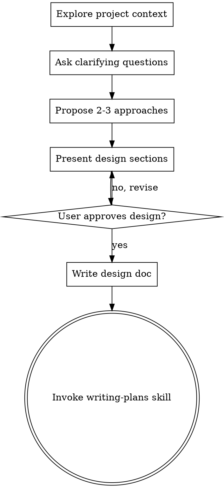

## User

Надо создать фан-сайт настольной игры "Дюна: Империя" (Dune Imperium). Референс: https://dune-imperium.ru/. Проект с нуля. стек nuxt + nuxt ui + ts + eslint. Давай создадим план.

## Assistant

<thinking>


**Announcing skill usage plan**
</thinking>

Соберу план на основе референса и вашего стека. Сначала быстро прочитаю обязательные skill-инструкции (`using-superpowers`, затем `brainstorming` и `writing-plans`), после чего изучу структуру `dune-imperium.ru` и дам поэтапный план запуска проекта.

**Tool Call: Run Get-Content -Raw 'C:/Users/andyv/.codex/superpowers/skills/brainstorming/SKILL.md'**
Status: Completed

Terminal:
```
---
name: brainstorming
description: "You MUST use this before any creative work - creating features, building components, adding functionality, or modifying behavior. Explores user intent, requirements and design before implementation."
---

# Brainstorming Ideas Into Designs

## Overview

Help turn ideas into fully formed designs and specs through natural collaborative dialogue.

Start by understanding the current project context, then ask questions one at a time to refine the idea. Once you understand what you're building, present the design and get user approval.

<HARD-GATE>
Do NOT invoke any implementation skill, write any code, scaffold any project, or take any implementation action until you have presented a design and the user has approved it. This applies to EVERY project regardless of perceived simplicity.
</HARD-GATE>

## Anti-Pattern: "This Is Too Simple To Need A Design"

Every project goes through this process. A todo list, a single-function utility, a config change — all of them. "Simple" projects are where unexamined assumptions cause the most wasted work. The design can be short (a few sentences for truly simple projects), but you MUST present it and get approval.

## Checklist

You MUST create a task for each of these items and complete them in order:

1. **Explore project context** — check files, docs, recent commits
2. **Ask clarifying questions** — one at a time, understand purpose/constraints/success criteria
3. **Propose 2-3 approaches** — with trade-offs and your recommendation
4. **Present design** — in sections scaled to their complexity, get user approval after each section
5. **Write design doc** — save to `docs/plans/YYYY-MM-DD-<topic>-design.md` and commit
6. **Transition to implementation** — invoke writing-plans skill to create implementation plan

## Process Flow



**The terminal state is invoking writing-plans.** Do NOT invoke frontend-design, mcp-builder, or any other implementation skill. The ONLY skill you invoke after brainstorming is writing-plans.

## The Process

**Understanding the idea:**
- Check out the current project state first (files, docs, recent commits)
- Ask questions one at a time to refine the idea
- Prefer multiple choice questions when possible, but open-ended is fine too
- Only one question per message - if a topic needs more exploration, break it into multiple questions
- Focus on understanding: purpose, constraints, success criteria

**Exploring approaches:**
- Propose 2-3 different approaches with trade-offs
- Present options conversationally with your recommendation and reasoning
- Lead with your recommended option and explain why

**Presenting the design:**
- Once you believe you understand what you're building, present the design
- Scale each section to its complexity: a few sentences if straightforward, up to 200-300 words if nuanced
- Ask after each section whether it looks right so far
- Cover: architecture, components, data flow, error handling, testing
- Be ready to go back and clarify if something doesn't make sense

## After the Design

**Documentation:**
- Write the validated design to `docs/plans/YYYY-MM-DD-<topic>-design.md`
- Use elements-of-style:writing-clearly-and-concisely skill if available
- Commit the design document to git

**Implementation:**
- Invoke the writing-plans skill to create a detailed implementation plan
- Do NOT invoke any other skill. writing-plans is the next step.

## Key Principles

- **One question at a time** - Don't overwhelm with multiple questions
- **Multiple choice preferred** - Easier to answer than open-ended when possible
- **YAGNI ruthlessly** - Remove unnecessary features from all designs
- **Explore alternatives** - Always propose 2-3 approaches before settling
- **Incremental validation** - Present design, get approval before moving on
- **Be flexible** - Go back and clarify when something doesn't make sense


```


**Tool Call: Run Get-Content -Raw 'C:/Users/andyv/.codex/superpowers/skills/writing-plans/SKILL.md'**
Status: Completed

Terminal:
```
---
name: writing-plans
description: Use when you have a spec or requirements for a multi-step task, before touching code
---

# Writing Plans

## Overview

Write comprehensive implementation plans assuming the engineer has zero context for our codebase and questionable taste. Document everything they need to know: which files to touch for each task, code, testing, docs they might need to check, how to test it. Give them the whole plan as bite-sized tasks. DRY. YAGNI. TDD. Frequent commits.

Assume they are a skilled developer, but know almost nothing about our toolset or problem domain. Assume they don't know good test design very well.

**Announce at start:** "I'm using the writing-plans skill to create the implementation plan."

**Context:** This should be run in a dedicated worktree (created by brainstorming skill).

**Save plans to:** `docs/plans/YYYY-MM-DD-<feature-name>.md`

## Bite-Sized Task Granularity

**Each step is one action (2-5 minutes):**
- "Write the failing test" - step
- "Run it to make sure it fails" - step
- "Implement the minimal code to make the test pass" - step
- "Run the tests and make sure they pass" - step
- "Commit" - step

## Plan Document Header

**Every plan MUST start with this header:**

```markdown
# [Feature Name] Implementation Plan

> **For Claude:** REQUIRED SUB-SKILL: Use superpowers:executing-plans to implement this plan task-by-task.

**Goal:** [One sentence describing what this builds]

**Architecture:** [2-3 sentences about approach]

**Tech Stack:** [Key technologies/libraries]

---
```

## Task Structure

````markdown
### Task N: [Component Name]

**Files:**
- Create: `exact/path/to/file.py`
- Modify: `exact/path/to/existing.py:123-145`
- Test: `tests/exact/path/to/test.py`

**Step 1: Write the failing test**

```python
def test_specific_behavior():
    result = function(input)
    assert result == expected
```

**Step 2: Run test to verify it fails**

Run: `pytest tests/path/test.py::test_name -v`
Expected: FAIL with "function not defined"

**Step 3: Write minimal implementation**

```python
def function(input):
    return expected
```

**Step 4: Run test to verify it passes**

Run: `pytest tests/path/test.py::test_name -v`
Expected: PASS

**Step 5: Commit**

```bash
git add tests/path/test.py src/path/file.py
git commit -m "feat: add specific feature"
```
````

## Remember
- Exact file paths always
- Complete code in plan (not "add validation")
- Exact commands with expected output
- Reference relevant skills with @ syntax
- DRY, YAGNI, TDD, frequent commits

## Execution Handoff

After saving the plan, offer execution choice:

**"Plan complete and saved to `docs/plans/<filename>.md`. Two execution options:**

**1. Subagent-Driven (this session)** - I dispatch fresh subagent per task, review between tasks, fast iteration

**2. Parallel Session (separate)** - Open new session with executing-plans, batch execution with checkpoints

**Which approach?"**

**If Subagent-Driven chosen:**
- **REQUIRED SUB-SKILL:** Use superpowers:subagent-driven-development
- Stay in this session
- Fresh subagent per task + code review

**If Parallel Session chosen:**
- Guide them to open new session in worktree
- **REQUIRED SUB-SKILL:** New session uses superpowers:executing-plans


```


**Tool Call: Run Get-Content -Raw 'C:/Users/andyv/.codex/superpowers/skills/using-superpowers/SKILL.md'**
Status: Completed

Terminal:
```
---
name: using-superpowers
description: Use when starting any conversation - establishes how to find and use skills, requiring Skill tool invocation before ANY response including clarifying questions
---

<EXTREMELY-IMPORTANT>
If you think there is even a 1% chance a skill might apply to what you are doing, you ABSOLUTELY MUST invoke the skill.

IF A SKILL APPLIES TO YOUR TASK, YOU DO NOT HAVE A CHOICE. YOU MUST USE IT.

This is not negotiable. This is not optional. You cannot rationalize your way out of this.
</EXTREMELY-IMPORTANT>

## How to Access Skills

**In Claude Code:** Use the `Skill` tool. When you invoke a skill, its content is loaded and presented to you—follow it directly. Never use the Read tool on skill files.

**In other environments:** Check your platform's documentation for how skills are loaded.

# Using Skills

## The Rule

**Invoke relevant or requested skills BEFORE any response or action.** Even a 1% chance a skill might apply means that you should invoke the skill to check. If an invoked skill turns out to be wrong for the situation, you don't need to use it.


## Red Flags

These thoughts mean STOP—you're rationalizing:

| Thought | Reality |
|---------|---------|
| "This is just a simple question" | Questions are tasks. Check for skills. |
| "I need more context first" | Skill check comes BEFORE clarifying questions. |
| "Let me explore the codebase first" | Skills tell you HOW to explore. Check first. |
| "I can check git/files quickly" | Files lack conversation context. Check for skills. |
| "Let me gather information first" | Skills tell you HOW to gather information. |
| "This doesn't need a formal skill" | If a skill exists, use it. |
| "I remember this skill" | Skills evolve. Read current version. |
| "This doesn't count as a task" | Action = task. Check for skills. |
| "The skill is overkill" | Simple things become complex. Use it. |
| "I'll just do this one thing first" | Check BEFORE doing anything. |
| "This feels productive" | Undisciplined action wastes time. Skills prevent this. |
| "I know what that means" | Knowing the concept в‰  using the skill. Invoke it. |

## Skill Priority

When multiple skills could apply, use this order:

1. **Process skills first** (brainstorming, debugging) - these determine HOW to approach the task
2. **Implementation skills second** (frontend-design, mcp-builder) - these guide execution

"Let's build X" в†’ brainstorming first, then implementation skills.
"Fix this bug" в†’ debugging first, then domain-specific skills.

## Skill Types

**Rigid** (TDD, debugging): Follow exactly. Don't adapt away discipline.

**Flexible** (patterns): Adapt principles to context.

The skill itself tells you which.

## User Instructions

Instructions say WHAT, not HOW. "Add X" or "Fix Y" doesn't mean skip workflows.


```


## Assistant

<thinking>


**Gathering project context**
</thinking>

Использую `using-superpowers -> brainstorming -> writing-plans`: сначала соберу контекст проекта, затем уточню требования и только после этого зафиксирую план. Сейчас проверю текущее состояние репозитория и структуру файлов.

**Tool Call: Run Get-ChildItem -Force**
Status: Completed

Terminal:
```


    Каталог: D:\projects\nuxt-projects\chat-gpt-5.3\dune-nuxt


Mode                 LastWriteTime         Length Name           
----                 -------------         ------ ----           
-a----        25.02.2026     21:19            247 NUL            


```


**Tool Call: Run git status --short**
Status: Failed

Terminal:
```
fatal: not a git repository (or any of the parent directories): .git


```


**Tool Call: Run git log --oneline -n 5**
Status: Failed

Terminal:
```
fatal: not a git repository (or any of the parent directories): .git


```


## Assistant

<thinking>


**Identifying empty project and researching site**
</thinking>

**Tool Call: Searching for: site:dune-imperium.ru Dune Imperium фан-сайт**
Status: Completed

## Assistant

<thinking>


**Exploring homepage details**
</thinking>

**Tool Call: Opening: https://dune-imperium.ru/**
Status: Completed

## Assistant

<thinking>


**Exploring site navigation structure**
</thinking>

**Tool Call: Opening: https://dune-imperium.ru/cards/**
Status: Completed

## Assistant

<thinking>


**Considering direct category fetch**
</thinking>

**Tool Call: Open page**
Status: Completed

## Assistant

<thinking>


**Asking first clarifying question**
</thinking>

Использую навыки `brainstorming -> writing-plans`, чтобы сначала согласовать дизайн/объём, затем сделать детальный план реализации.

По референсу вижу базовую структуру: главная + разделы `Новости`, `Статьи`, `Карты` (с фильтрами), `Лидеры`, `Рейтинги`, `Сеты`, `Дома`, `FAQ`  
(источники: https://dune-imperium.ru/, https://dune-imperium.ru/cards/, https://dune-imperium.ru/faq/, https://dune-imperium.ru/category/houses/).

1-й уточняющий вопрос (для плана MVP):  
Какой объём первой версии делаем?

1. Почти как референс: все разделы + фильтры карт + рейтинги.  
2. Урезанный MVP: главная, новости, карточки лидеров/домов, FAQ (без сложных фильтров и рейтингов).  
3. Контентный MVP: только главная + статьи/новости + FAQ, остальное во 2-й итерации.

## User

1 вариант

## Assistant

<thinking>


**Asking next question**
</thinking>

Принял: идем по варианту 1 (полный функционал, близко к референсу).

Следующий вопрос: откуда берем контент в первой версии?

1. `Nuxt Content` + Markdown/JSON в репозитории (рекомендую для старта).  
2. Сразу `headless CMS` (например, Strapi/Sanity).  
3. Временные мок-данные в `~/server/api` и позже миграция на CMS.

## User

1 вариант

## Assistant

<thinking>


**Asking next clarifying question**
</thinking>

Принял: контент храним в `Nuxt Content` (`.md/.json` в репозитории).

Следующий вопрос по архитектуре рейтингов: как обновляем `Рейтинги` в v1?

1. Ручное обновление через файлы контента (`content/ratings/*.json`) и деплой (рекомендую для старта).  
2. Встроенная админка в проекте (форма + сохранение на сервере/БД).  
3. Пользовательские формы отправки результатов с модерацией.

## User

1 вариант

## Assistant

<thinking>


**Asking key clarification**
</thinking>

Принял: рейтинги в v1 ведем вручную через контент-файлы.

Следующий уточняющий вопрос: данные для `Карты / Лидеры / Дома / Сеты` в стартовой версии как заполняем?

1. Ручной первичный импорт в `content/*.json` (рекомендую: быстро и предсказуемо).  
2. Парсинг референса `dune-imperium.ru` скриптом и генерация JSON.  
3. Сначала минимальный набор (по 10-20 сущностей), затем постепенное наполнение.

## User

1 вариант

## Assistant

<thinking>


**Continuing clarifying questions**
</thinking>

Принял: делаем полный первичный импорт данных вручную в `content`.

Следующий вопрос: насколько строго копируем визуал референса?

1. Максимально близко к `dune-imperium.ru` (структура, сетки, стилистика).  
2. Близко по структуре, но с собственным стилем в духе Dune (рекомендую).  
3. Полностью свой дизайн, референс только по разделам и функционалу.

## User

2 вариант

## Assistant

<thinking>


**Asking deployment mode**
</thinking>

Отлично, фиксирую: структура как у референса, но визуал свой в духе Dune.

Последний уточняющий вопрос перед формированием дизайна и плана: какой режим рендера для v1 выбираем?

1. `SSG` (предгенерация, быстрее и дешевле хостинг) — рекомендую для контентного сайта.  
2. `SSR` (динамический рендер на сервере).  
3. `Hybrid` (основное SSG, отдельные SSR-страницы при необходимости).

## User

Какой вариант подойдет, если данные в дальнейшем будут приходить через backend, через какой нибудь supabase или prisma

## Assistant

<thinking>


**Recommending hybrid rendering approach**
</thinking>

Для будущего перехода на backend (`Supabase`/`Prisma`) лучше сразу **вариант 3: Hybrid**.

Почему:
- `Prisma` требует серверную часть (`server/api` в Nuxt/Nitro), с чистым `SSG` потом будет лишняя миграция.
- `Supabase` можно читать с клиента, но для защищенных/агрегированных данных и логики тоже лучше серверные маршруты.
- При `Hybrid` оставляете контентные страницы (`Новости`, `Статьи`, `FAQ`, каталоги) как `SSG`, а динамику (`Рейтинги`, профиль, админка) делаете `SSR/API`.

Фиксируем в плане **Hybrid**?

## User

да лучше Hybrid тогда

## Assistant

<thinking>


**Proposing multiple architecture approaches**
</thinking>

Переходим к этапу проектирования: я быстро сниму структуру референса по ключевым разделам, затем дам 2–3 архитектурных подхода с рекомендацией и зафиксирую дизайн для вашего подтверждения.

**Tool Call: Tool: mcp-server-firecrawl/firecrawl_scrape**
Status: Completed

{
  "markdown": "\n\n# Сайт настольной игры Dune Imperium (Uprising)\n\n[Telegram\\\\\nTelegram](https://t.me/dunedev)\n\n\n\n### Завершился декабрьский московский турнир «Дюна: Восстание 2025»\n\n\n\n### Закончили работу над 6 и 7 сетами!\n\n\n\n### Дюна: Восстание Дункан Айдахо — стратегия и тактика игры\n\n[Больше новостей](https://dune-imperium.ru/category/news)\n\nЕсли вам нравится сайт, то вы можете помочь, поддержав на Boosty.\n\n[Boosty](https://boosty.to/mrgadget)\n\nSend150₽\n\nКарты из игры\n\n\n\n\n\n\n\n\n\n\n\n\n",
  "metadata": {
    "ogLocale": "ru_RU",
    "viewport": [
      "width=device-width, initial-scale=1.0",
      "width=device-width,maximum-scale=1,initial-scale=1,user-scalable=0"
    ],
    "title": "Dune Imperium (Дюна империя) - настольная игра, фанатские дополнения и многое другое",
    "ogSiteName": "Dune Imperium - Dune Imperium - настольная игра",
    "og:type": "website",
    "ogTitle": "Dune Imperium (Дюна империя) - настольная игра, фанатские дополнения и многое другое",
    "og:description": "Сайт настольной игры Dune Imperium - Дюна Империя, фанатские дополнения и многое другое",
    "emotion-insertion-point": "",
    "og:url": "https://dune-imperium.ru/",
    "apple-mobile-web-app-capable": "yes",
    "language": "en",
    "og:image": "https://dune-imperium.ru/wp-content/uploads/2024/07/capsule_616x353.jpg",
    "robots": "max-image-preview:large",
    "ogUrl": "https://dune-imperium.ru/",
    "mobile-web-app-capable": "yes",
    "og:title": "Dune Imperium (Дюна империя) - настольная игра, фанатские дополнения и многое другое",
    "ogDescription": "Сайт настольной игры Dune Imperium - Дюна Империя, фанатские дополнения и многое другое",
    "format-detection": "telephone=no",
    "msapplication-TileColor": "#8b3ffd",
    "og:locale": "ru_RU",
    "theme-color": "#ffffff",
    "og:site_name": "Dune Imperium - Dune Imperium - настольная игра",
    "og:image:secure_url": "https://dune-imperium.ru/wp-content/uploads/2024/07/capsule_616x353.jpg",
    "generator": "All in One SEO (AIOSEO) 4.8.4.1",
    "ogImage": "https://dune-imperium.ru/wp-content/uploads/2024/07/capsule_616x353.jpg",
    "msapplication-config": "https://static.yoomoney.ru/files-front/resources/head/wallet/browserconfig.xml",
    "description": "Сайт настольной игры Dune Imperium - Дюна Империя, фанатские дополнения и многое другое",
    "favicon": "https://dune-imperium.ru/favicons/favicon-32x32.png",
    "scrapeId": "019c95a6-b429-7588-9e4a-0594c8d4991b",
    "sourceURL": "https://dune-imperium.ru/",
    "url": "https://dune-imperium.ru/",
    "statusCode": 200,
    "contentType": "text/html; charset=UTF-8",
    "proxyUsed": "basic",
    "cacheState": "hit",
    "cachedAt": "2026-02-25T14:51:03.321Z",
    "creditsUsed": 1,
    "concurrencyLimited": false
  }
}

**Tool Call: Tool: mcp-server-firecrawl/firecrawl_scrape**
Status: Completed

{
  "markdown": "# Карты\n\nФильтры\n\n\nПоказать фильтры\n\n\n[Сбросить фильтр](https://dune-imperium.ru/cards/#) **Сет**\n\n- [Дюна Империя](https://dune-imperium.ru/cards/#)\n- [Расцвет иксианцев](https://dune-imperium.ru/cards/#)\n- [Бессмертие](https://dune-imperium.ru/cards/#)\n- [Восстание](https://dune-imperium.ru/cards/#)\n- [Кровные узы](https://dune-imperium.ru/cards/#)\n\n**Фанатские**\n\n- [Все](https://dune-imperium.ru/cards/#)\n- [Ландсраад](https://dune-imperium.ru/cards/#)\n- [Ордосы](https://dune-imperium.ru/cards/#)\n- [Тлейлаксу](https://dune-imperium.ru/cards/#)\n- [Тени Карфага](https://dune-imperium.ru/cards/#)\n- [Шехили](https://dune-imperium.ru/cards/#)\n- [Планы](https://dune-imperium.ru/cards/#)\n- [Нити судьбы](https://dune-imperium.ru/cards/#)\n\n**Фракция**\n\n- [Император](https://dune-imperium.ru/cards/#)\n- [Гильдия Космогации](https://dune-imperium.ru/cards/#)\n- [Бене Гессерит](https://dune-imperium.ru/cards/#)\n- [Фримены](https://dune-imperium.ru/cards/#)\n\n**Ячейка**\n\n- [Император](https://dune-imperium.ru/cards/#)\n- [Гильдия Космогации](https://dune-imperium.ru/cards/#)\n- [Бене Гессерит](https://dune-imperium.ru/cards/#)\n- [Фримены](https://dune-imperium.ru/cards/#)\n- [Ландсраад](https://dune-imperium.ru/cards/#)\n- [Населенный пункт](https://dune-imperium.ru/cards/#)\n- [Пустыня](https://dune-imperium.ru/cards/#)\n- [Шпион](https://dune-imperium.ru/cards/#)\n- [Другое](https://dune-imperium.ru/cards/#)\n\n**Другие фильтры**\n\n- [Бонус при покупке](https://dune-imperium.ru/cards/#)\n- [Баласт](https://dune-imperium.ru/cards/#)\n- [Сращивание](https://dune-imperium.ru/cards/#)\n- [Тлейлаксу](https://dune-imperium.ru/cards/#)\n- [Приказ](https://dune-imperium.ru/cards/#)\n- [Командная](https://dune-imperium.ru/cards/#)\n- [КООАМ](https://dune-imperium.ru/cards/#)\n\n**Сортировка по:**\n\n- [Названию](https://dune-imperium.ru/cards/#)\n- [Стоимости](https://dune-imperium.ru/cards/#)\n\nЕсли вам нравится сайт, то вы можете помочь, поддержав на Boosty.\n\n[Boosty](https://boosty.to/mrgadget)\n\n[](https://dune-imperium.ru/wp-content/uploads/2025/12/%D0%91%D0%B5%D0%B7-%D0%B8%D0%BC%D0%B5%D0%BD%D0%B8-1.jpg)[](https://dune-imperium.ru/wp-content/uploads/2025/11/%D0%9E%D1%87%D0%B8%D1%81%D1%82%D0%B8%D1%82%D1%8C-%D0%BF%D1%83%D1%82%D1%8C.jpg)[](https://dune-imperium.ru/wp-content/uploads/2025/11/%D0%A3%D1%80%D0%BE%D1%88%D0%BD%D0%BE%D1%80.jpg)[](https://dune-imperium.ru/wp-content/uploads/2025/11/%D0%A2%D0%B0%D0%B9%D0%BD%D0%B0%D1%8F-%D0%B2%D0%BB%D0%B0%D1%81%D1%82%D1%8C.jpg)[](https://dune-imperium.ru/wp-content/uploads/2025/11/%D0%A1%D0%B5%D1%80%D1%8B%D0%B5-%D1%81%D1%85%D0%B5%D0%BC%D1%8B.jpg)[](https://dune-imperium.ru/wp-content/uploads/2025/11/%D0%9C%D1%8B-%D0%BD%D0%B5-%D0%BD%D0%B0%D0%B4%D0%B5%D0%B5%D0%BC%D1%81%D1%8F-%D0%BC%D1%8B-%D0%BF%D0%BB%D0%B0%D0%BD%D0%B8%D1%80%D1%83%D0%B5%D0%BC.jpg)[](https://dune-imperium.ru/wp-content/uploads/2025/11/%D0%9C%D0%B5%D1%80%D0%B7%D0%BE%D1%81%D1%82%D1%8C.jpg)[](https://dune-imperium.ru/wp-content/uploads/2025/11/%D0%98%D0%B3%D1%80%D0%B0-%D0%BC%D1%8B%D1%88%D1%86%D0%B0%D0%BC%D0%B8.jpg)[](https://dune-imperium.ru/wp-content/uploads/2025/11/%D0%97%D0%BE%D0%B2-%D1%81-%D0%B4%D1%80%D1%83%D0%B3%D0%BE%D0%B9-%D0%BF%D0%BB%D0%B0%D0%BD%D0%B5%D1%82%D1%8B.jpg)[](https://dune-imperium.ru/wp-content/uploads/2025/11/%D0%94%D0%BE%D0%B1%D1%80%D0%BE%D0%B6%D0%B5%D0%BB%D0%B0%D1%82%D0%B5%D0%BB%D1%8C%D0%BD%D1%8B%D0%B9-%D0%BA%D0%BE%D0%BD%D1%82%D1%80%D0%B0%D0%B1%D0%B0%D0%BD%D0%B4%D0%B8%D1%81%D1%82.jpg)[](https://dune-imperium.ru/wp-content/uploads/2025/11/%D0%A4%D1%80%D0%B8%D0%BC%D0%B5%D0%BD%D1%81%D0%BA%D0%B0%D1%8F-%D0%BB%D0%BE%D0%B3%D0%B8%D1%81%D1%82%D0%B8%D0%BA%D0%B0.jpg)[](https://dune-imperium.ru/wp-content/uploads/2025/11/%D0%98%D1%81%D0%BF%D1%8B%D1%82%D0%B0%D0%BD%D0%B8%D0%B5-%D0%93%D0%BE%D0%BC-%D0%B4%D0%B6%D0%B0%D0%B1%D0%B1%D0%B0%D1%80%D0%BE%D0%BC.jpg)[](https://dune-imperium.ru/wp-content/uploads/2025/11/%D0%A0%D0%B0%D1%81%D1%81%D1%82%D0%B0%D0%B2%D0%B8%D1%82%D1%8C-%D0%BF%D1%80%D0%B8%D0%BE%D1%80%D0%B8%D1%82%D0%B5%D1%82%D1%8B.jpg)[](https://dune-imperium.ru/wp-content/uploads/2025/11/%D0%91%D0%BB%D0%B0%D0%B3%D0%BE%D1%80%D0%BE%D0%B4%D0%BD%D0%BE%D0%B5-%D1%80%D0%B5%D1%88%D0%B5%D0%BD%D0%B8%D0%B5.jpg)[](https://dune-imperium.ru/wp-content/uploads/2025/11/%D0%91%D0%B8%D1%80%D0%B6%D0%B5%D0%B2%D1%8B%D0%B5-%D0%BC%D0%B0%D0%BD%D0%B8%D0%BF%D1%83%D0%BB%D1%8F%D1%86%D0%B8%D0%B8.jpg)[](https://dune-imperium.ru/wp-content/uploads/2025/11/%D0%90%D0%BB%D0%B8%D1%8F-%D0%BF%D1%80%D0%B5%D0%B4%D1%80%D0%BE%D0%B6%D0%B4%D1%91%D0%BD%D0%BD%D0%B0%D1%8F.jpg)[](https://dune-imperium.ru/wp-content/uploads/2025/11/%D0%90%D1%80%D1%82%D0%B5%D1%80%D0%B8%D0%B8-%D0%98%D0%B7%D0%B2%D0%B5%D1%81%D1%82%D0%BD%D0%BE%D0%B9-%D0%92%D1%81%D0%B5%D0%BB%D0%B5%D0%BD%D0%BD%D0%BE%D0%B9.jpg)[](https://dune-imperium.ru/wp-content/uploads/2025/11/%D0%91%D0%B5%D0%B7-%D0%BF%D1%80%D0%B5%D0%B3%D1%80%D0%B0%D0%B4.jpg)[](https://dune-imperium.ru/wp-content/uploads/2025/11/%D0%92%D0%BE%D0%BB%D1%8F-%D0%98%D0%BC%D0%BF%D0%B5%D1%80%D0%B0%D1%82%D0%BE%D1%80%D0%B0.jpg)[](https://dune-imperium.ru/wp-content/uploads/2025/11/%D0%97%D0%B0%D0%BA%D1%80%D0%B5%D0%BF%D0%BB%D0%B5%D0%BD%D0%B8%D0%B5-%D0%B4%D0%BE%D0%BC%D0%B8%D0%BD%D0%B0%D0%BD%D1%82%D1%8B.jpg)[](https://dune-imperium.ru/wp-content/uploads/2025/11/%D0%9D%D0%B5%D0%BF%D1%80%D0%B5%D0%B4%D1%81%D0%BA%D0%B0%D0%B7%D1%83%D0%B5%D0%BC%D0%BE%D1%81%D1%82%D1%8C-%D0%BF%D1%83%D1%81%D1%82%D1%8B%D0%BD%D0%B8.jpg)[](https://dune-imperium.ru/wp-content/uploads/2025/11/%D0%9E%D0%B1%D1%8A%D0%B5%D0%B4%D0%B8%D0%BD%D0%B8%D1%82%D1%8C-%D0%BC%D0%B0%D0%BB%D1%8B%D0%B5-%D0%B4%D0%BE%D0%BC%D0%B0_.jpg)[](https://dune-imperium.ru/wp-content/uploads/2025/11/%D0%9F%D0%BE%D0%B4%D0%B4%D0%B5%D1%80%D0%B6%D0%BA%D0%B0-%D0%B8%D0%BA%D1%81%D0%B8%D0%B0%D0%BD%D1%86%D0%B5%D0%B2.jpg)[](https://dune-imperium.ru/wp-content/uploads/2025/11/%D0%9F%D0%BE%D1%80%D0%BE%D1%87%D0%BD%D0%B0%D1%8F-%D1%81%D0%B2%D1%8F%D0%B7%D1%8C.jpg)[](https://dune-imperium.ru/wp-content/uploads/2025/11/%D0%9F%D1%80%D0%BE%D0%B2%D0%B5%D1%80%D0%B5%D0%BD%D0%BD%D1%8B%D0%B5-%D0%BC%D0%B5%D1%82%D0%BE%D0%B4%D1%8B.jpg)[](https://dune-imperium.ru/wp-content/uploads/2025/11/%D0%9F%D1%80%D0%BE%D0%BC%D1%8B%D1%88%D0%BB%D0%B5%D0%BD%D0%BD%D0%BE%D1%81%D1%82%D1%8C-%D0%9A%D0%9E%D0%9E%D0%90%D0%9C.jpg)[](https://dune-imperium.ru/wp-content/uploads/2025/11/%D0%9F%D0%BE%D0%BB%D0%B8%D1%82%D0%B8%D1%87%D0%B5%D1%81%D0%BA%D0%BE%D0%B5-%D0%B4%D0%BE%D0%BC%D0%B8%D0%BD%D0%B8%D1%80%D0%BE%D0%B2%D0%B0%D0%BD%D0%B8%D0%B5.jpg)[](https://dune-imperium.ru/wp-content/uploads/2025/11/%D0%A1%D0%B5%D0%BA%D1%80%D0%B5%D1%82%D1%8B-%D0%B2%D0%BD%D1%83%D1%82%D1%80%D0%B8-%D1%81%D0%B5%D0%BA%D1%80%D0%B5%D1%82%D0%BE%D0%B2.jpg)[](https://dune-imperium.ru/wp-content/uploads/2025/11/%D0%A3%D0%BD%D0%B8%D1%87%D1%82%D0%BE%D0%B6%D0%B8%D1%82%D1%8C-%D0%BA%D1%80%D1%8B%D1%81.jpg)[](https://dune-imperium.ru/wp-content/uploads/2025/11/%D0%A4%D1%80%D0%B8%D0%BC%D0%B5%D0%BD%D1%81%D0%BA%D0%BE%D0%B5-%D1%81%D0%BE%D1%82%D1%80%D1%83%D0%B4%D0%BD%D0%B8%D1%87%D0%B5%D1%81%D1%82%D0%B2%D0%BE.jpg)[](https://dune-imperium.ru/wp-content/uploads/2025/11/%D0%A5%D0%BE%D0%B7%D1%8F%D0%B5%D0%B2%D0%B0-%D0%94%D1%8E%D0%BD%D1%8B.jpg)[](https://dune-imperium.ru/wp-content/uploads/2025/07/%D0%92%D0%B5%D1%89%D0%B0%D1%82%D0%B5%D0%BB%D1%8C.jpg)[](https://dune-imperium.ru/wp-content/uploads/2025/05/%D0%9C%D0%B8%D0%BB%D0%BE%D1%81%D0%B5%D1%80%D0%B4%D0%B8%D0%B5.jpg)[](https://dune-imperium.ru/wp-content/uploads/2025/05/%D0%9A%D0%BE%D0%BB%D0%BB%D0%B0%D0%B1%D0%BE%D1%80%D0%B0%D1%86%D0%B8%D1%8F.jpg)[](https://dune-imperium.ru/wp-content/uploads/2025/05/%D0%94%D0%B8%D0%B2%D0%B8%D0%B4%D0%B5%D0%BD%D0%B4%D1%8B.jpg)[](https://dune-imperium.ru/wp-content/uploads/2025/05/%D0%93%D0%A3%D0%BC%D0%B0%D0%BD%D0%B8%D1%82%D0%B0%D1%80%D0%BD%D0%B0%D1%8F-%D0%BF%D0%BE%D0%BC%D0%BE%D1%89%D1%8C.jpg)[](https://dune-imperium.ru/wp-content/uploads/2025/05/%D0%91%D0%B5%D0%B7%D0%B3%D1%80%D0%B0%D0%BD%D0%B8%D1%87%D0%BD%D0%B0%D1%8F-%D0%BB%D0%BE%D0%B3%D0%B8%D1%81%D1%82%D0%B8%D0%BA%D0%B0.jpg)[](https://dune-imperium.ru/wp-content/uploads/2025/05/%D0%A0%D0%B0%D1%81%D1%82%D0%BE%D1%87%D0%B8%D1%82%D0%B5%D0%BB%D1%8C%D0%BD%D0%BE%D1%81%D1%82%D1%8C.jpg)[](https://dune-imperium.ru/wp-content/uploads/2025/05/%D0%A0%D0%B0%D0%B9%D1%81%D0%BA%D0%B8%D0%B9-%D1%81%D0%B0%D0%B4.jpg)[](https://dune-imperium.ru/wp-content/uploads/2025/05/%D0%98%D0%B7-%D0%B3%D1%80%D1%8F%D0%B7%D0%B8-%D0%B2-%D0%BA%D0%BD%D1%8F%D0%B7%D0%B8.jpg)[](https://dune-imperium.ru/wp-content/uploads/2025/05/%D0%92%D0%B7%D1%80%D0%B0%D1%81%D1%82%D0%B8%D1%82%D1%8C-%D0%BD%D0%B0%D0%B4%D0%B5%D0%B6%D0%B4%D1%83.jpg)[](https://dune-imperium.ru/wp-content/uploads/2025/05/%D0%9B%D0%B8%D1%81%D0%B0%D0%BD-%D0%90%D0%BB%D1%8C-%D0%B3%D0%B0%D0%B8%D0%B1.jpg)[](https://dune-imperium.ru/wp-content/uploads/2025/05/%D0%9D%D0%B5%D1%81%D0%B3%D0%B8%D0%B1%D0%B0%D0%B5%D0%BC%D0%B0%D1%8F-%D0%B2%D0%BE%D0%BB%D1%8F.jpg)[](https://dune-imperium.ru/wp-content/uploads/2025/05/%D0%9E%D0%B1%D1%83%D1%87%D0%B5%D0%BD%D0%B8%D0%B5-%D1%81%D0%B5%D1%81%D1%82%D1%91%D1%80.jpg)[](https://dune-imperium.ru/wp-content/uploads/2025/05/%D0%A0%D0%B8%D1%81%D1%81%D0%B0-%D1%81%D0%B5%D1%81%D1%82%D1%80%D0%B0-%D0%BE%D1%80%D0%B4%D0%B5%D0%BD%D0%B0_.jpg)[](https://dune-imperium.ru/wp-content/uploads/2025/05/%D0%97%D0%B0%D1%80%D0%B0%D0%B7%D0%BD%D1%8B%D0%B5-%D0%BF%D1%80%D0%B5%D0%B4%D1%80%D0%B0%D1%81%D1%81%D1%83%D0%B4%D0%BA%D0%B8.jpg)[](https://dune-imperium.ru/wp-content/uploads/2025/05/%D0%90%D1%80%D1%85%D0%B8%D0%B2-%D0%BA%D1%80%D0%BE%D0%B2%D0%BD%D1%8B%D1%85-%D1%83%D0%B7.jpg)[](https://dune-imperium.ru/wp-content/uploads/2025/04/%D0%90%D0%B3%D1%80%D0%B5%D1%81%D0%B8%D0%B2%D0%BD%D0%B0%D1%8F-%D0%B2%D0%B5%D1%80%D0%B1%D0%BE%D0%B2%D0%BA%D0%B0.jpg)[](https://dune-imperium.ru/wp-content/uploads/2025/04/%D0%9E%D0%B1%D0%BB%D0%B8%D1%87%D0%B5%D0%BD%D0%B8%D0%B5.jpg)[](https://dune-imperium.ru/wp-content/uploads/2025/04/%D0%A0%D0%B0%D0%B7%D0%B2%D0%B5%D0%B4%D1%88%D1%82%D0%B0%D0%B1-%D0%93%D0%B8%D0%BB%D1%8C%D0%B4%D0%B8%D0%B8_.jpg)[](https://dune-imperium.ru/wp-content/uploads/2025/04/%D0%9A%D0%BE%D0%BD%D1%83%D1%81-%D1%82%D0%B8%D1%88%D0%B8%D0%BD%D1%8B_.jpg)[](https://dune-imperium.ru/wp-content/uploads/2025/04/%D0%9D%D0%B5%D0%BD%D0%B0%D0%B4%D1%91%D0%B6%D0%BD%D1%8B%D0%B9-%D0%B8%D0%BD%D1%84%D0%BE%D1%80%D0%BC%D0%B0%D1%82%D0%BE%D1%80.jpg)[](https://dune-imperium.ru/wp-content/uploads/2025/04/%D0%A1%D0%B0%D0%B1%D0%BE%D1%82%D0%B0%D0%B6.jpg)[](https://dune-imperium.ru/wp-content/uploads/2025/04/%D0%AD%D1%84%D1%84%D0%B5%D0%BA%D1%82-%D0%BD%D0%B5%D0%BE%D0%B6%D0%B8%D0%B4%D0%B0%D0%BD%D0%BD%D0%BE%D1%81%D1%82%D0%B8%D0%B8.jpg)[](https://dune-imperium.ru/wp-content/uploads/2025/04/%D0%9F%D0%BE%D0%BA%D1%80%D0%BE%D0%B2%D0%B8%D1%82%D0%B5%D0%BB%D1%8C%D1%81%D1%82%D0%B2%D0%BE.jpg)[](https://dune-imperium.ru/wp-content/uploads/2025/04/%D0%A1%D0%B2%D0%B5%D1%82%D1%81%D0%BA%D0%B0%D1%8F-%D0%B1%D0%B5%D1%81%D0%B5%D0%B4%D0%B0_.jpg)[](https://dune-imperium.ru/wp-content/uploads/2025/04/%D0%A1%D0%BE%D0%B1%D0%BB%D0%B0%D0%B7%D0%BD%D0%B5%D0%BD%D0%B8%D0%B5.jpg)[](https://dune-imperium.ru/wp-content/uploads/2025/04/%D0%94%D0%BE%D0%BD%D0%BE%D1%81%D1%87%D0%B8%D0%BA.jpg)[](https://dune-imperium.ru/wp-content/uploads/2025/04/%D0%9B%D0%BE%D0%B6%D0%BD%D1%8B%D0%B9-%D1%81%D0%BB%D0%B5%D0%B4.jpg)[](https://dune-imperium.ru/wp-content/uploads/2025/04/%D0%97%D0%B0%D1%85%D0%B2%D0%B0%D1%82-%D0%B2-%D0%BF%D0%BB%D0%B5%D0%BD.jpg)[](https://dune-imperium.ru/wp-content/uploads/2025/04/%D0%A0%D0%B0%D0%B7%D0%B2%D0%B5%D0%B4%D0%BA%D0%B0-%D0%B1%D0%BE%D0%B5%D0%BC.jpg)[](https://dune-imperium.ru/wp-content/uploads/2025/04/%D0%9F%D0%BE-%D0%BF%D1%8F%D1%82%D0%B0%D0%BC.jpg)[](https://dune-imperium.ru/wp-content/uploads/2025/04/%D0%A1%D0%B1%D0%BE%D1%80-%D0%B4%D0%B0%D0%BD%D0%BD%D1%8B%D1%85.jpg)[](https://dune-imperium.ru/wp-content/uploads/2025/03/IMG_20250321_091559_495.jpg)[](https://dune-imperium.ru/wp-content/uploads/2025/03/%D0%98%D0%BA%D1%81%D0%B8%D0%B0%D0%BD%D1%81%D0%BA%D0%B8%D0%B9-%D0%BF%D0%BE%D1%81%D0%BE%D0%BB.jpg)[](https://dune-imperium.ru/wp-content/uploads/2025/03/%D0%9F%D0%BE%D1%81%D1%82%D0%B0%D0%B2%D0%BA%D0%B8-%D0%9A%D0%9E%D0%9E%D0%90%D0%9C.jpg)[](https://dune-imperium.ru/wp-content/uploads/2025/03/%D0%9F%D1%80%D0%BE%D0%B4%D0%B0%D0%B6%D0%BD%D1%8B%D0%B9-%D1%87%D0%B8%D0%BD%D0%BE%D0%B2%D0%BD%D0%B8%D0%BA.jpg)[](https://dune-imperium.ru/wp-content/uploads/2025/03/%D0%9B%D0%BE%D0%B3%D0%B8%D1%81%D1%82%D0%B8%D0%BA%D0%B0-%D0%BF%D0%BE%D1%81%D1%82%D0%B0%D0%B2%D0%BE%D0%BA.jpg)[](https://dune-imperium.ru/wp-content/uploads/2025/03/%D0%92%D0%BE%D0%B7%D0%BC%D0%BE%D0%B6%D0%BD%D0%BE%D0%B5-%D0%B1%D1%83%D0%B4%D1%83%D1%89%D0%B5%D0%B5.jpg)[](https://dune-imperium.ru/wp-content/uploads/2025/03/%D0%A2%D1%80%D0%BE%D0%BD%D0%BD%D0%BD%D1%8B%D0%B9-%D0%BA%D0%BE%D1%80%D0%B0%D0%B1%D0%BB%D1%8C.jpg)[](https://dune-imperium.ru/wp-content/uploads/2025/03/%D0%A3%D0%BA%D0%B0%D0%B7%D0%B0%D0%BD%D0%B8%D0%B5-%D0%BF%D1%83%D1%82%D0%B8.jpg)[](https://dune-imperium.ru/wp-content/uploads/2025/03/%D0%A2%D0%BE%D1%80%D0%B3%D0%BE%D0%B2%D1%8B%D0%B5-%D1%81%D0%B2%D1%8F%D0%B7%D0%B8.jpg)[](https://dune-imperium.ru/wp-content/uploads/2025/03/%D0%9F%D0%BE%D0%B4%D0%B0%D0%B2%D0%BB%D0%B5%D0%BD%D0%B8%D0%B5-%D0%BC%D1%8F%D1%82%D0%B5%D0%B6%D0%B0.jpg)[](https://dune-imperium.ru/wp-content/uploads/2025/03/%D0%A1%D0%B2%D1%8F%D1%89%D0%B5%D0%BD%D0%BD%D0%B0%D1%8F-%D0%B2%D0%BE%D0%B9%D0%BD%D0%B0.jpg)[](https://dune-imperium.ru/wp-content/uploads/2025/03/%D0%AE%D0%B6%D0%BD%D1%8B%D0%B5-%D0%B2%D0%B5%D1%80%D0%BE%D0%B2%D0%B0%D0%BD%D0%B8%D1%8F.jpg)[](https://dune-imperium.ru/wp-content/uploads/2025/03/%D0%91%D0%BE%D0%B5%D0%B2%D0%BE%D0%B5-%D0%B8%D0%BC%D1%8F-%D1%84%D1%80%D0%B8%D0%BC%D0%B5%D0%BD%D0%BE%D0%B2.jpg)[](https://dune-imperium.ru/wp-content/uploads/2025/03/%D0%97%D0%BD%D0%B0%D0%BC%D1%8F-%D1%81%D0%B0%D1%80%D0%B4%D0%B0%D1%83%D0%BA%D0%B0%D1%80%D0%BE%D0%B2.jpg)[](https://dune-imperium.ru/wp-content/uploads/2025/03/%D0%A2%D0%B0%D0%B9%D0%BD%D1%8B%D0%B9-%D1%81%D0%BE%D0%B2%D0%B5%D1%82.jpg)[](https://dune-imperium.ru/wp-content/uploads/2025/03/%D0%AD%D0%BB%D0%B8%D1%82%D0%BD%D1%8B%D0%B5-%D0%B2%D0%BE%D0%B9%D1%81%D0%BA%D0%B0.jpg)[](https://dune-imperium.ru/wp-content/uploads/2025/03/%D0%A2%D1%80%D0%B5%D0%BD%D0%B8%D1%80%D0%BE%D0%B2%D0%BA%D0%B0-%D1%80%D0%B0%D0%B7%D0%B2%D0%B5%D0%B4%D1%87%D0%B8%D0%BA%D0%BE%D0%B2.jpg)[](https://dune-imperium.ru/wp-content/uploads/2025/03/%D0%9B%D0%B8%D1%82%D0%B0%D0%BD%D0%B8%D1%8F-%D0%BF%D1%80%D0%BE%D1%82%D0%B8%D0%B2-%D1%81%D1%82%D1%80%D0%B0%D1%85%D0%B0.jpg)[](https://dune-imperium.ru/wp-content/uploads/2025/03/%D0%A1%D0%B2%D0%BE%D0%B9-%D1%87%D0%B5%D0%BB%D0%BE%D0%B2%D0%B5%D0%BA.jpg)[](https://dune-imperium.ru/wp-content/uploads/2025/03/%D0%9F%D0%B5%D1%81%D1%87%D0%B0%D0%BD%D0%B0%D1%8F-%D0%BF%D0%BE%D1%85%D0%BE%D0%B4%D0%BA%D0%B0.jpg)[](https://dune-imperium.ru/wp-content/uploads/2025/03/%D0%9F%D0%BE%D0%B4%D1%80%D1%8B%D0%B2%D0%BD%D0%B0%D1%8F-%D1%82%D0%B0%D0%BA%D1%82%D0%B8%D0%BA%D0%B0.jpg)[](https://dune-imperium.ru/wp-content/uploads/2025/03/%D0%98%D1%81%D0%BA%D1%83%D1%81%D1%81%D1%82%D0%B2%D0%B5%D0%BD%D0%BD%D0%BE%D0%B5-%D1%87%D1%83%D0%B4%D0%BE.jpg)[](https://dune-imperium.ru/wp-content/uploads/2025/03/%D0%A6%D0%B5%D0%BD%D1%82%D1%80-%D1%83%D0%BF%D1%80%D0%B0%D0%B2%D0%BB%D0%B5%D0%BD%D0%B8%D1%8F.jpg)[](https://dune-imperium.ru/wp-content/uploads/2025/03/%D0%A1%D1%80%D0%BE%D1%87%D0%BD%D0%BE%D0%B5-%D0%B4%D0%BE%D0%BD%D0%B5%D1%81%D0%B5%D0%BD%D0%B8%D0%B5.jpg)[](https://dune-imperium.ru/wp-content/uploads/2025/03/%D0%AF-%D0%B2%D0%B5%D1%80%D1%8E.jpg)[](https://dune-imperium.ru/wp-content/uploads/2025/03/%D0%98%D1%81%D1%82%D1%80%D0%B5%D0%B1%D0%BB%D0%B5%D0%BD%D0%B8%D0%B5-%D1%81%D0%BE%D1%8E%D0%B7%D0%BD%D0%B8%D0%BA%D0%BE%D0%B2.jpg)[](https://dune-imperium.ru/wp-content/uploads/2025/03/%D0%9D%D0%B0%D0%BF%D1%8B%D1%89%D0%B5%D0%BD%D0%BD%D0%BE%D1%81%D1%82%D1%8C.jpg)[](https://dune-imperium.ru/wp-content/uploads/2025/03/%D0%A2%D1%80%D0%BE%D1%84%D0%B5%D0%B8-%D0%B7%D0%B2%D0%B5%D1%80%D1%8F-1.jpg)[](https://dune-imperium.ru/wp-content/uploads/2025/02/%D0%90%D1%80%D0%BC%D0%B8%D1%8F-%D0%93%D1%85%D0%BE%D0%BB.jpg)[](https://dune-imperium.ru/wp-content/uploads/2025/02/%D0%94%D0%B5%D0%B2%D0%B8%D0%B0%D1%82%D0%BE%D1%80.jpg)[](https://dune-imperium.ru/wp-content/uploads/2025/02/%D0%98%D0%BD%D0%B6%D0%B5%D0%BD%D0%B5%D1%80-%D0%9E%D1%80%D0%B4%D0%BE%D1%81%D0%BE%D0%B2.jpg)[](https://dune-imperium.ru/wp-content/uploads/2025/02/%D0%9B%D0%B0%D0%B7%D0%B5%D1%80%D0%BD%D1%8B%D0%B9-%D1%82%D0%B0%D0%BD%D0%BA.jpg)[](https://dune-imperium.ru/wp-content/uploads/2025/02/%D0%9D%D0%B0%D1%91%D0%BC%D0%BD%D0%B8%D0%BA-%D0%9E%D1%80%D0%B4%D0%BE%D1%81%D0%BE%D0%B2.jpg)[](https://dune-imperium.ru/wp-content/uploads/2025/02/%D0%9D%D0%B5%D0%BE%D0%B6%D0%B8%D0%B4%D0%B0%D0%BD%D0%BD%D1%8B%D0%B9-%D1%81%D0%BE%D1%8E%D0%B7.jpg)[](https://dune-imperium.ru/wp-content/uploads/2025/02/%D0%9E%D1%80%D0%BD%D0%B8%D1%82%D0%BE%D0%BF%D1%82%D0%B5%D1%80-%D0%9E%D1%80%D0%B4%D0%BE%D1%81%D0%BE%D0%B2.jpg)[](https://dune-imperium.ru/wp-content/uploads/2025/02/%D0%A1%D0%B0%D0%B1%D0%BE%D1%82%D1%91%D1%80.jpg)[](https://dune-imperium.ru/wp-content/uploads/2025/02/%D0%A1%D0%B1%D0%BE%D1%80%D1%89%D0%B8%D0%BA-%D0%9E%D1%80%D0%B4%D0%BE%D1%81%D0%BE%D0%B2.jpg)[](https://dune-imperium.ru/wp-content/uploads/2025/02/%D0%A1%D0%B5%D1%81%D1%82%D1%80%D0%B0-%D0%B7%D0%BC%D0%B5%D0%B9.jpg)[](https://dune-imperium.ru/wp-content/uploads/2025/02/%D0%A1%D0%BF%D1%8F%D1%89%D0%B8%D0%B9-%D0%B0%D0%B3%D0%B5%D0%BD%D1%82.jpg)[](https://dune-imperium.ru/wp-content/uploads/2025/02/%D0%A2%D0%B0%D0%B9%D0%BD%D0%B0%D1%8F-%D0%BE%D0%BF%D0%B5%D1%80%D0%B0%D1%86%D0%B8%D1%8F-1.jpg)[](https://dune-imperium.ru/wp-content/uploads/2025/02/%D0%A2%D1%80%D0%B0%D0%B9%D0%BA.jpg)[](https://dune-imperium.ru/wp-content/uploads/2025/02/%D0%A5%D0%B8%D0%BC%D0%B8%D1%87%D0%B5%D1%81%D0%BA%D0%B0%D1%8F-%D0%B0%D1%82%D0%B0%D0%BA%D0%B0.jpg)[](https://dune-imperium.ru/wp-content/uploads/2025/02/%D0%98%D0%BC%D0%BF%D0%B5%D1%80%D1%81%D0%BA%D0%B8%D0%B9-%D0%BE%D1%80%D0%BD%D0%B8%D1%82%D0%BE%D0%BF%D1%82%D0%B5%D1%80.jpg)[](https://dune-imperium.ru/wp-content/uploads/2025/02/%D0%92%D0%B0%D0%B6%D0%BD%D1%8B%D0%B5-%D0%BF%D0%BE%D1%81%D1%82%D0%B0%D0%B2%D0%BA%D0%B8.jpg)[](https://dune-imperium.ru/wp-content/uploads/2025/02/%D0%9C%D0%BE%D1%89%D1%8C-%D0%9A%D0%BE%D1%80%D1%80%D0%B8%D0%BD%D0%BE.jpg)[](https://dune-imperium.ru/wp-content/uploads/2025/02/%D0%A2%D1%80%D0%B5%D0%B1%D0%BE%D0%B2%D0%B0%D0%BD%D0%B8%D0%B5-%D1%80%D0%B5%D0%B7%D1%83%D0%BB%D1%8C%D1%82%D0%B0%D1%82%D0%B0.jpg)[](https://dune-imperium.ru/wp-content/uploads/2025/02/%D0%98%D0%BC%D0%BF%D0%B5%D1%80%D1%81%D0%BA%D0%B8%D0%B9-%D1%88%D0%B0%D1%82%D1%91%D1%80.jpg)[](https://dune-imperium.ru/wp-content/uploads/2025/02/%D0%A0%D0%B0%D0%B7%D1%80%D1%83%D1%88%D0%B8%D1%82%D0%B5%D0%BB%D1%8C%D0%BD%D1%8B%D0%B9-%D0%BD%D0%B0%D0%BB%D1%91%D1%82.jpg)[](https://dune-imperium.ru/wp-content/uploads/2025/02/%D0%A2%D1%80%D0%B5%D0%B1%D0%BE%D0%B2%D0%B0%D0%BD%D0%B8%D0%B5-%D0%B2%D0%BD%D0%B8%D0%BC%D0%B0%D0%BD%D0%B8%D1%8F.jpg)[](https://dune-imperium.ru/wp-content/uploads/2025/02/%D0%9E%D0%B3%D1%80%D0%B0%D0%BD%D0%B8%D1%87%D0%B5%D0%BD%D0%BD%D1%8B%D0%B9-%D0%B4%D0%BE%D1%81%D1%82%D1%83%D0%BF-%D0%B2-%D0%9B%D0%B0%D0%BD%D0%B4%D1%81%D1%80%D0%B0%D0%B0%D0%B4-2.jpg)[](https://dune-imperium.ru/wp-content/uploads/2025/02/%D0%A3%D1%81%D1%83%D0%BB.jpg)[](https://dune-imperium.ru/wp-content/uploads/2025/02/%D0%9E%D0%B3%D1%80%D0%B0%D0%BD%D0%B8%D1%87%D0%B5%D0%BD%D0%BD%D1%8B%D0%B9-%D0%B4%D0%BE%D1%81%D1%82%D1%83%D0%BF-%D0%B2-%D0%9B%D0%B0%D0%BD%D0%B4%D1%81%D1%80%D0%B0%D0%B0%D0%B4.jpg)[](https://dune-imperium.ru/wp-content/uploads/2025/02/%D0%A2%D1%80%D0%B5%D0%B1%D0%BE%D0%B2%D0%B0%D0%BD%D0%B8%D0%B5-%D1%83%D0%B2%D0%B0%D0%B6%D0%B5%D0%BD%D0%B8%D1%8F.jpg)[](https://dune-imperium.ru/wp-content/uploads/2025/02/%D0%A3%D0%B3%D1%80%D0%BE%D0%B7%D0%B0-%D0%B4%D0%BE%D0%B1%D1%8B%D1%87%D0%B8-%D0%BF%D1%80%D1%8F%D0%BD%D0%BE%D1%81%D1%82%D0%B8.jpg)[](https://dune-imperium.ru/wp-content/uploads/2025/02/%D0%93%D0%B8%D0%BF%D0%BD%D0%BE%D0%B7-%D0%B8%D1%81%D1%82%D0%B8%D0%BD%D1%8B.jpg)[](https://dune-imperium.ru/wp-content/uploads/2025/02/%D0%AE%D0%B6%D0%BD%D1%8B%D0%B5-%D1%81%D1%82%D0%B0%D1%80%D0%B5%D0%B9%D1%88%D0%B8%D0%BD%D1%8B.jpg)[](https://dune-imperium.ru/wp-content/uploads/2025/02/%D0%9C%D0%B5%D0%B6%D0%B7%D0%B2%D1%91%D0%B7%D0%B4%D0%BD%D0%B0%D1%8F-%D1%82%D0%BE%D1%80%D0%B3%D0%BE%D0%B2%D0%BB%D1%8F.jpg)[](https://dune-imperium.ru/wp-content/uploads/2025/02/%D0%A8%D0%B0%D0%B3%D0%B8-%D0%B2%D0%BE-%D1%82%D1%8C%D0%BC%D0%B5.jpg)[](https://dune-imperium.ru/wp-content/uploads/2025/02/%D0%9A%D0%BE%D0%BE%D1%80%D0%B4%D0%B8%D0%BD%D0%B0%D1%86%D0%B8%D1%8F-%D1%81%D0%B0%D1%80%D0%B4%D0%B0%D1%83%D0%BA%D0%B0%D1%80%D0%BE%D0%B2.jpg)[](https://dune-imperium.ru/wp-content/uploads/2025/02/%D0%A1%D0%BE%D0%BB%D0%B4%D0%B0%D1%82-%D1%81%D0%B0%D1%80%D0%B4%D0%B0%D1%83%D0%BA%D0%B0%D1%80%D0%BE%D0%B2.jpg)[](https://dune-imperium.ru/wp-content/uploads/2025/02/%D0%A8%D0%BF%D0%B8%D0%BE%D0%BD-%D0%93%D0%B8%D0%BB%D1%8C%D0%B4%D0%B8%D0%B8.jpg)[](https://dune-imperium.ru/wp-content/uploads/2025/02/%D0%9F%D0%B8%D1%81%D1%82%D0%BE%D0%BB%D0%B5%D1%82-%D0%9C%D0%B0%D1%83%D0%BB%D0%B0.jpg)[](https://dune-imperium.ru/wp-content/uploads/2025/02/%D0%A1%D0%BE%D0%B3%D0%BB%D0%B0%D1%88%D0%B5%D0%BD%D0%B8%D0%B5-%D0%BE-%D0%BF%D0%BE%D1%81%D1%82%D0%B0%D0%B2%D0%BA%D0%B5.jpg)[](https://dune-imperium.ru/wp-content/uploads/2025/02/%D0%91%D1%83%D0%BD%D1%82%D0%B0%D1%80%D1%81%D0%BA%D0%B8%D0%B9-%D0%BF%D0%BE%D1%81%D1%82%D0%B0%D0%B2%D1%89%D0%B8%D0%BA.jpg)[](https://dune-imperium.ru/wp-content/uploads/2025/02/%D0%9F%D0%B0%D1%80%D0%B0%D0%BA%D0%BE%D0%BC%D0%BF%D0%B0%D1%81.jpg)[](https://dune-imperium.ru/wp-content/uploads/2025/02/%D0%A1%D0%B5%D0%B2%D0%B5%D1%80%D0%BD%D1%8B%D0%B9-%D0%B2%D0%BE%D0%B4%D0%BD%D1%8B%D0%B9-%D0%BC%D0%B0%D1%81%D1%82%D0%B5%D1%80.jpg)[](https://dune-imperium.ru/wp-content/uploads/2025/02/%D0%A0%D0%B0%D1%81%D1%87%D1%91%D1%82-%D0%B2%D0%BB%D0%B0%D1%81%D1%82%D0%B8.jpg)[](https://dune-imperium.ru/wp-content/uploads/2025/02/%D0%94%D0%B2%D0%BE%D0%B9%D0%BD%D0%BE%D0%B9-%D0%B0%D0%B3%D0%B5%D0%BD%D1%82-1.jpg)[](https://dune-imperium.ru/wp-content/uploads/2025/02/%D0%A8%D0%BF%D0%B8%D0%BE%D0%BD%D1%81%D0%BA%D0%B0%D1%8F-%D1%81%D0%B5%D1%82%D1%8C.jpg)[](https://dune-imperium.ru/wp-content/uploads/2025/02/%D0%9E%D0%BF%D0%B5%D1%80%D0%B0%D1%82%D0%B8%D0%B2%D0%BD%D0%B8%D1%86%D0%B0-%D0%91%D0%B5%D0%BD%D0%B5-%D0%93%D0%B5%D1%81%D1%81%D0%B5%D1%80%D0%B8%D1%82.jpg)[](https://dune-imperium.ru/wp-content/uploads/2025/02/%D0%A5%D1%80%D0%B0%D0%BD%D0%B8%D1%82%D0%B5%D0%BB%D1%8C-%D0%BF%D0%BE%D0%B4%D0%B0%D1%82%D0%B5%D0%BB%D1%8F.jpg)[](https://dune-imperium.ru/wp-content/uploads/2025/02/%D0%97%D0%B0%D0%B3%D0%B0%D0%B4%D0%BE%D1%87%D0%BD%D0%B0%D1%8F-%D0%B6%D0%B5%D0%BD%D1%89%D0%B8%D0%BD%D0%B0.jpg)[](https://dune-imperium.ru/wp-content/uploads/2025/02/%D0%A2%D0%B0%D0%B9%D0%BD%D0%BE%D0%B5-%D0%BF%D0%BE%D1%81%D0%BB%D0%B0%D0%BD%D0%B8%D0%B5.jpg)[](https://dune-imperium.ru/wp-content/uploads/2025/02/%D0%92%D1%8B%D0%B6%D0%B8%D0%B2%D0%B0%D0%BD%D0%B8%D0%B5-%D0%B2-%D0%BF%D1%83%D1%81%D1%82%D1%8B%D0%BD%D0%B5.jpg)[](https://dune-imperium.ru/wp-content/uploads/2025/02/%D0%A4%D0%B5%D0%B4%D0%B0%D0%B9%D0%BA%D0%B8%D0%BD-%D1%81%D1%82%D0%B8%D0%BB%D1%82%D0%B5%D0%BD%D1%82.jpg)[](https://dune-imperium.ru/wp-content/uploads/2025/02/%D0%A1%D0%B2%D0%B5%D1%80%D0%B6%D0%B5%D0%BD%D0%B8%D0%B5.jpg)[](https://dune-imperium.ru/wp-content/uploads/2025/02/%D0%9D%D0%B5%D0%B8%D0%B7%D0%BC%D0%B5%D0%BD%D0%BD%D0%B0%D1%8F-%D0%BF%D1%80%D0%B5%D0%B4%D0%B0%D0%BD%D0%BD%D0%BE%D1%81%D1%82%D1%8C.jpg)[](https://dune-imperium.ru/wp-content/uploads/2025/02/%D0%A1%D0%B2%D0%B5%D1%80%D0%BD%D1%83%D0%B2%D1%88%D0%B5%D0%B5%D1%81%D1%8F-%D0%BF%D1%80%D0%BE%D1%81%D1%82%D1%80%D0%B0%D0%BD%D1%81%D1%82%D0%B2%D0%BE.jpg)[](https://dune-imperium.ru/wp-content/uploads/2025/02/%D0%A1%D1%82%D0%B8%D0%BB%D0%B3%D0%B0%D1%80-%D0%BF%D1%80%D0%B5%D0%B4%D0%B0%D0%BD%D0%BD%D1%8B%D0%B9.jpg)[](https://dune-imperium.ru/wp-content/uploads/2025/02/%D0%A8%D1%82%D1%83%D1%80%D0%BC%D0%B0%D0%BD.jpg)[](https://dune-imperium.ru/wp-content/uploads/2025/02/%D0%93%D0%BE%D1%80%D0%BE%D0%B4-%D0%9A%D0%BE%D1%80%D0%B8%D0%BD%D1%82.jpg)[](https://dune-imperium.ru/wp-content/uploads/2025/02/%D0%A6%D0%B5%D0%BD%D1%82%D1%80%D0%B0%D0%BB%D1%8C%D0%BD%D1%8B%D0%B9-%D0%BE%D1%84%D0%B8%D1%81.jpg)[](https://dune-imperium.ru/wp-content/uploads/2025/02/%D0%A7%D0%B0%D0%BD%D0%B8-%D0%B8%D1%81%D0%BA%D1%83%D1%81%D0%BD%D1%8B%D0%B9-%D1%82%D0%B0%D0%BA%D1%82%D0%B8%D0%BA.jpg)[](https://dune-imperium.ru/wp-content/uploads/2025/02/%D0%9F%D0%BE%D0%BA%D1%80%D0%BE%D0%B2%D0%B8%D1%82%D0%B5%D0%BB%D1%8C%D1%81%D1%82%D0%B2%D0%BE-%D0%93%D0%B8%D0%BB%D1%8C%D0%B4%D0%B8%D0%B8.jpg)[](https://dune-imperium.ru/wp-content/uploads/2025/02/%D0%9F%D0%BE%D0%B4%D1%80%D1%8B%D0%B2%D0%BD%D0%BE%D0%B9-%D1%81%D0%BE%D0%B2%D0%B5%D1%82%D0%BD%D0%B8%D0%BA.jpg)[](https://dune-imperium.ru/wp-content/uploads/2025/02/%D0%92-%D0%92%D1%8B%D1%81%D1%88%D0%B5%D0%BC-%D1%81%D0%BE%D0%B2%D0%B5%D1%82%D0%B5.jpg)[](https://dune-imperium.ru/wp-content/uploads/2025/02/%D0%97%D0%B0%D1%85%D0%B2%D0%B0%D1%87%D0%B5%D0%BD%D0%BD%D1%8B%D0%B9-%D0%BC%D0%B5%D0%BD%D1%82%D0%B0%D1%82.jpg)[](https://dune-imperium.ru/wp-content/uploads/2025/02/%D0%9F%D1%80%D0%B5%D0%B4%D0%B0%D1%82%D0%B5%D0%BB%D1%8C%D1%81%D0%BA%D0%B8%D0%B9-%D0%BC%D0%B0%D0%BD%D1%91%D0%B2%D1%80.jpg)[](https://dune-imperium.ru/wp-content/uploads/2025/02/%D0%A3%D0%B4%D0%B0%D1%80%D0%BD%D1%8B%D0%B9-%D1%84%D0%BB%D0%BE%D1%82.jpg)[](https://dune-imperium.ru/wp-content/uploads/2025/02/%D0%9A%D0%BE%D0%BB%D1%91%D1%81%D0%B0-%D0%B2%D0%BD%D1%83%D1%82%D1%80%D0%B8-%D0%BA%D0%BE%D0%BB%D1%91%D1%81.jpg)[](https://dune-imperium.ru/wp-content/uploads/2025/02/%D0%A6%D0%B5%D0%BD%D0%B0-%D0%BD%D0%B5-%D0%B8%D0%BC%D0%B5%D0%B5%D1%82-%D0%B7%D0%BD%D0%B0%D1%87%D0%B5%D0%BD%D0%B8%D1%8F.jpg)[](https://dune-imperium.ru/wp-content/uploads/2025/02/%D0%93%D0%B0%D0%B2%D0%B0%D0%BD%D1%8C-%D0%BA%D0%BE%D0%BD%D1%82%D1%80%D0%B0%D0%B1%D0%B0%D0%BD%D0%B4%D0%B8%D1%81%D1%82%D0%BE%D0%B2.jpg)[](https://dune-imperium.ru/wp-content/uploads/2025/02/%D0%A1%D0%B8%D0%BB%D0%B0-%D0%BF%D1%83%D1%81%D1%82%D1%8B%D0%BD%D0%B8.jpg)[](https://dune-imperium.ru/wp-content/uploads/2025/02/%D0%94%D0%B0-%D0%B7%D0%B4%D1%80%D0%B0%D0%B2%D1%81%D1%82%D0%B2%D1%83%D1%8E%D1%82-%D0%B1%D0%BE%D1%80%D1%86%D1%8B.jpg)[](https://dune-imperium.ru/wp-content/uploads/2025/02/%D0%9F%D1%83%D0%BD%D0%BA%D1%82-%D1%8D%D0%BA%D0%BE%D0%BB%D0%BE%D0%B3%D0%B8%D1%87%D0%B5%D1%81%D0%BA%D0%B8%D1%85-%D0%B8%D1%81%D0%BF%D1%8B%D1%82%D0%B0%D0%BD%D0%B8%D0%B9.jpg)[](https://dune-imperium.ru/wp-content/uploads/2025/02/%D0%A2%D0%B0%D0%B9%D0%BD%D1%8B%D0%B9-%D0%B0%D0%B3%D0%B5%D0%BD%D1%82.jpg)[](https://dune-imperium.ru/wp-content/uploads/2025/02/%D0%9F%D0%BE%D1%81%D0%BB%D0%B0%D0%BD%D0%BD%D0%B8%D0%BA-%D0%93%D0%B8%D0%BB%D1%8C%D0%B4%D0%B8%D0%B8.jpg)[](https://dune-imperium.ru/wp-content/uploads/2025/02/%D0%9B%D0%B8%D0%B4%D0%B5%D1%80%D1%81%D1%82%D0%B2%D0%BE.jpg)[](https://dune-imperium.ru/wp-content/uploads/2025/02/%D0%A8%D0%B8%D1%88%D0%BB%D0%B0%D0%BA%D0%B8.jpg)[](https://dune-imperium.ru/wp-content/uploads/2025/02/%D0%92%D0%BE%D1%81%D1%81%D1%82%D0%B0%D0%BD%D0%B8%D0%B5-%D0%BD%D0%B0-%D0%90%D1%80%D1%80%D0%B0%D0%BA%D0%B8%D1%81%D0%B5.jpg)[](https://dune-imperium.ru/wp-content/uploads/2025/02/%D0%9C%D0%B0%D0%BD%D0%BE%D0%BA.jpg)[](https://dune-imperium.ru/wp-content/uploads/2025/02/%D0%9A%D0%BE%D0%BD%D1%82%D1%80%D0%B0%D0%B1%D0%B0%D0%BD%D0%B4%D0%B8%D1%81%D1%82%D1%81%D0%BA%D0%B8%D0%B9-%D0%BA%D0%BE%D0%BC%D0%B1%D0%B0%D0%B9%D0%BD.jpg)[](https://dune-imperium.ru/wp-content/uploads/2025/02/%D0%98%D0%BC%D0%BF%D0%B5%D1%80%D1%81%D0%BA%D0%B8%D0%B9-%D1%80%D0%B0%D0%B7%D0%B2%D0%B5%D0%B4%D0%B8%D0%BA.jpg)[](https://dune-imperium.ru/wp-content/uploads/2025/02/%D0%9E%D0%BF%D0%B0%D1%81%D0%BD%D0%B0%D1%8F-%D1%80%D0%B8%D1%82%D0%BE%D1%80%D0%B8%D0%BA%D0%B0.jpg)[](https://dune-imperium.ru/wp-content/uploads/2025/02/%D0%A2%D0%B0%D0%B9%D0%BD%D0%B0%D1%8F-%D0%BE%D0%BF%D0%B5%D1%80%D0%B0%D1%86%D0%B8%D1%8F.jpg)[](https://dune-imperium.ru/wp-content/uploads/2025/02/%D0%9F%D1%83%D0%B1%D0%BB%D0%B8%D1%87%D0%BD%D0%BE%D0%B5-%D0%B7%D1%80%D0%B5%D0%BB%D0%B8%D1%89%D0%B5.jpg)[](https://dune-imperium.ru/wp-content/uploads/2025/02/%D0%9D%D0%B0%D0%B4%D1%91%D0%B6%D0%BD%D1%8B%D0%B9-%D0%B8%D0%BD%D1%84%D0%BE%D1%80%D0%BC%D0%B0%D1%82%D0%BE%D1%80.jpg)[](https://dune-imperium.ru/wp-content/uploads/2025/02/%D0%93%D1%80%D1%83%D0%B7%D0%BE%D0%B2%D0%BE%D0%B9-%D0%BA%D1%83%D1%80%D1%8C%D0%B5%D1%80.jpg)[](https://dune-imperium.ru/wp-content/uploads/2025/02/%D0%9F%D1%80%D0%B8%D0%BE%D1%80%D0%B8%D1%82%D0%B5%D1%82%D0%BD%D1%8B%D0%B5-%D0%BA%D0%BE%D0%BD%D1%82%D1%80%D0%B0%D0%BA%D1%82%D1%8B.jpg)[](https://dune-imperium.ru/wp-content/uploads/2025/02/%D0%A0%D0%B0%D0%B7%D0%B2%D0%B5%D1%82%D0%B2%D0%BB%D1%91%D0%BD%D0%BD%D1%8B%D0%B9-%D0%BF%D1%83%D1%82%D1%8C.jpg)[](https://dune-imperium.ru/wp-content/uploads/2025/02/%D0%A1%D0%BC%D0%BE%D1%82%D1%80%D0%B8%D1%82%D0%B5%D0%BB%D1%8C.jpg)[](https://dune-imperium.ru/wp-content/uploads/2025/02/%D0%90%D0%B3%D0%B5%D0%BD%D1%82-%D0%B2%D0%BB%D0%B8%D1%8F%D0%BD%D0%B8%D1%8F.jpg)[](https://dune-imperium.ru/wp-content/uploads/2025/02/%D0%9C%D0%B0%D1%80%D0%B8%D0%BE%D0%BD%D0%B5%D1%82%D0%BA%D0%B0.jpg)[](https://dune-imperium.ru/wp-content/uploads/2025/02/%D0%98%D0%BD%D0%BA%D0%B2%D0%B8%D0%B7%D0%B8%D1%82%D0%BE%D1%80-%D0%A2%D0%BB%D0%B5%D0%B9%D0%BB%D0%B0%D0%BA%D1%81%D1%83.jpg)[](https://dune-imperium.ru/wp-content/uploads/2025/02/%D0%A5%D0%B5%D0%B9%D0%B4_.jpg)[](https://dune-imperium.ru/wp-content/uploads/2025/02/%D0%91%D0%BB%D0%B8%D0%B7%D0%BD%D0%B5%D1%86.jpg)[](https://dune-imperium.ru/wp-content/uploads/2025/02/%D0%9C%D0%B0%D1%88%D0%B5%D0%B9%D1%85_.jpg)[](https://dune-imperium.ru/wp-content/uploads/2025/02/%D0%93%D1%85%D0%BE%D0%BB%D0%B0-%D1%81%D0%B0%D1%80%D0%B4%D0%B0%D1%83%D0%BA%D0%B0%D1%80.jpg)[](https://dune-imperium.ru/wp-content/uploads/2025/02/%D0%9C%D0%B0%D0%B3%D0%B8%D1%81%D1%82%D1%80-%D0%BB%D0%B8%D1%86%D0%B5%D0%B4%D0%B5%D0%BB_.jpg)[](https://dune-imperium.ru/wp-content/uploads/2025/02/%D0%90%D0%BA%D1%81%D0%BE%D0%BB%D0%BE%D1%82%D0%BB%D1%8C-%D1%87%D0%B0%D0%BD%D1%8B.jpg)[](https://dune-imperium.ru/wp-content/uploads/2025/02/%D0%9F%D0%BE%D0%B4%D0%BC%D0%B5%D0%BD%D0%B0.jpg)[](https://dune-imperium.ru/wp-content/uploads/2025/02/%D0%A1%D0%BA%D0%B0%D0%B9%D1%82%D0%B5%D0%B9%D0%BB.jpg)[](https://dune-imperium.ru/wp-content/uploads/2025/02/%D0%9C%D0%B0%D0%BD%D0%B8%D0%BC%D1%83%D0%BB%D1%8F%D1%82%D0%BE%D1%80-%D0%B3%D0%B5%D0%BD%D0%B0%D0%BC%D0%B8.webp)[](https://dune-imperium.ru/wp-content/uploads/2025/02/%D0%A4%D0%B0%D0%BC%D0%B8%D0%BB%D1%8C%D1%8F%D1%80.jpg)[](https://dune-imperium.ru/wp-content/uploads/2025/02/%D0%98%D0%BD%D0%B6%D0%B5%D0%BD%D0%B5%D1%80-%D0%A2%D0%BB%D0%B5%D0%B9%D0%BB%D0%B0%D0%BA%D1%81%D1%83.jpg)[](https://dune-imperium.ru/wp-content/uploads/2025/02/%D0%9C%D0%B0%D1%81%D1%82%D0%B5%D1%80-%D0%BB%D0%B8%D1%86%D0%B5%D0%B4%D0%B5%D0%BB.jpg)[](https://dune-imperium.ru/wp-content/uploads/2025/02/%D0%91%D0%BB%D0%B8%D0%B7%D0%BD%D0%B5%D1%86-2.jpg)[](https://dune-imperium.ru/wp-content/uploads/2025/02/%D0%9B%D0%B0%D0%B1%D0%BE%D1%80%D0%B0%D1%82%D0%BE%D1%80%D0%B8%D1%8F.jpg)[](https://dune-imperium.ru/wp-content/uploads/2025/02/%D0%9F%D0%B8%D1%8F%D0%B2%D0%BA%D0%B0.jpg)[](https://dune-imperium.ru/wp-content/uploads/2025/02/%D0%9F%D0%BE%D0%B6%D0%B8%D0%BD%D0%B0%D1%82%D0%B5%D0%BB%D1%8C-%D0%A2%D0%BB%D0%B5%D0%B9%D0%BB%D0%B0%D0%BA%D1%81%D1%83.jpg)[](https://dune-imperium.ru/wp-content/uploads/2025/02/%D0%9C%D0%BE%D0%BD%D0%BE%D0%BF%D0%BE%D0%BB%D0%B8%D1%8F-%D0%93%D0%B8%D0%BB%D1%8C%D0%B4%D0%B8%D0%B8.jpg)[](https://dune-imperium.ru/wp-content/uploads/2025/02/%D0%9D%D0%B0-%D1%88%D0%B0%D0%B3-%D0%B2%D0%BF%D0%B5%D1%80%D0%B5%D0%B4%D0%B8.jpg)[](https://dune-imperium.ru/wp-content/uploads/2025/02/%D0%9D%D0%B0%D1%81%D1%82%D0%B0%D0%B2%D0%BD%D0%B8%D0%BA_.jpg)[](https://dune-imperium.ru/wp-content/uploads/2025/02/%D0%9F%D0%BB%D0%B0%D0%BD-%D0%BC%D0%B5%D0%BD%D1%82%D0%B0%D1%82%D0%B0_.jpg)[](https://dune-imperium.ru/wp-content/uploads/2025/02/%D0%9F%D0%BE%D0%BB%D0%B8%D1%82%D0%B8%D1%87%D0%B5%D1%81%D0%BA%D0%B8%D0%B5-%D0%B8%D0%B3%D1%80%D1%8B.jpg)[](https://dune-imperium.ru/wp-content/uploads/2025/02/%D0%9F%D0%BE%D0%BB%D0%B8%D1%82%D0%B8%D1%87%D0%B5%D1%81%D0%BA%D0%B8%D0%B5-%D1%81%D0%B2%D1%8F%D0%B7%D0%B8.jpg)[](https://dune-imperium.ru/wp-content/uploads/2025/02/%D0%9F%D0%BE%D0%BB%D0%B8%D1%82%D0%B8%D1%87%D0%B5%D1%81%D0%BA%D0%B8%D0%B9-%D0%B7%D0%B0%D0%B3%D0%BE%D0%B2%D0%BE%D1%80.jpg)[](https://dune-imperium.ru/wp-content/uploads/2025/02/%D0%9F%D1%80%D0%B0%D0%B2%D0%BB%D0%B5%D0%BD%D0%B8%D0%B5-%D1%81%D1%82%D1%80%D0%B0%D1%85%D0%BE%D0%BC.jpg)[](https://dune-imperium.ru/wp-content/uploads/2025/02/%D0%9F%D1%80%D0%B8%D1%91%D0%BC-%D0%B4%D0%B5%D0%BB%D0%B5%D0%B3%D0%B0%D1%86%D0%B8%D0%B8.jpg)[](https://dune-imperium.ru/wp-content/uploads/2025/02/%D0%A1%D0%B3%D0%BE%D0%B2%D0%BE%D1%80.jpg)[](https://dune-imperium.ru/wp-content/uploads/2025/02/%D0%A1%D0%BE%D0%B2%D0%B5%D1%82-%D1%81%D0%B5%D1%81%D1%82%D1%91%D1%80.jpg)[](https://dune-imperium.ru/wp-content/uploads/2025/02/%D0%A1%D0%BE%D1%82%D1%80%D1%83%D0%B4%D0%BD%D0%B8%D1%87%D0%B5%D1%81%D1%82%D0%B2%D0%BE.jpg)[](https://dune-imperium.ru/wp-content/uploads/2025/02/%D0%92%D0%BE%D0%B5%D0%BD%D0%BD%D1%8B%D0%B9-%D1%81%D0%BE%D1%8E%D0%B7.jpg)[](https://dune-imperium.ru/wp-content/uploads/2025/02/%D0%92%D0%B5%D1%80%D0%BE%D0%BB%D0%BE%D0%BC%D0%BD%D0%BE%D0%B5-%D0%BE%D1%81%D0%BA%D0%BE%D1%80%D0%B1%D0%BB%D0%B5%D0%BD%D0%B8%D0%B5.jpg)[](https://dune-imperium.ru/wp-content/uploads/2025/02/%D0%92%D0%B5%D0%BB%D0%B8%D0%BA%D0%B8%D0%B9-%D0%B4%D0%BE%D0%BC.jpg)[](https://dune-imperium.ru/wp-content/uploads/2025/02/%D0%9F%D0%BE%D0%B4%D0%B3%D0%BE%D1%82%D0%BE%D0%B2%D0%BA%D0%B0-%D0%BF%D1%83%D1%82%D0%B8.jpg)[](https://dune-imperium.ru/wp-content/uploads/2025/02/%D0%A3%D0%B7%D1%83%D1%80%D0%BF%D0%B0%D1%86%D0%B8%D1%8F.jpg)[](https://dune-imperium.ru/wp-content/uploads/2025/02/%D0%98%D1%81%D0%BA%D0%B0%D0%B6%D1%91%D0%BD%D0%BD%D1%8B%D0%B9-%D0%BC%D0%B5%D0%BD%D1%82%D0%B0%D1%82.jpg)[](https://dune-imperium.ru/wp-content/uploads/2025/02/%D0%A1%D1%88%D0%B8%D1%82%D1%8B%D0%B9-%D1%83%D0%B6%D0%B0%D1%81.jpg)[](https://dune-imperium.ru/wp-content/uploads/2025/02/%D0%A1%D0%BE%D0%B1%D0%BB%D0%B0%D0%B7%D0%BD%D0%B8%D1%82%D0%B5%D0%BB%D1%8C%D0%BD%D1%8B%D0%B5-%D1%84%D0%B5%D1%80%D0%BE%D0%BC%D0%BE%D0%BD%D1%8B.jpg)[](https://dune-imperium.ru/wp-content/uploads/2025/02/%D0%9F%D0%B8%D1%82%D0%B5%D1%80-%D0%B3%D0%B5%D0%BD%D0%B8%D0%B0%D0%BB%D1%8C%D0%BD%D1%8B%D0%B9-%D1%81%D0%BE%D0%B2%D0%B5%D1%82%D0%BD%D0%B8%D0%BA.jpg)[](https://dune-imperium.ru/wp-content/uploads/2025/02/%D0%9D%D0%B5%D0%B5%D1%81%D1%82%D0%B5%D1%81%D1%82%D0%B2%D0%B5%D0%BD%D0%BD%D1%8B%D0%B5-%D1%80%D0%B5%D1%84%D0%BB%D0%B5%D0%BA%D1%81%D1%8B.jpg)[](https://dune-imperium.ru/wp-content/uploads/2025/02/%D0%9D%D0%B0%D1%83%D1%87%D0%BD%D1%8B%D0%B9-%D0%BF%D1%80%D0%BE%D1%80%D1%8B%D0%B2.jpg)[](https://dune-imperium.ru/wp-content/uploads/2025/02/%D0%9D%D0%B0%D0%B4%D0%B7%D0%B8%D1%80%D0%B0%D1%82%D0%B5%D0%BB%D0%B8.jpg)[](https://dune-imperium.ru/wp-content/uploads/2025/02/%D0%93%D1%85%D0%BE%D0%BB%D0%B0.jpg)[](https://dune-imperium.ru/wp-content/uploads/2025/02/%D0%A1%D1%83%D0%B1%D1%8A%D0%B5%D0%BA%D1%82-X-137.jpg)[](https://dune-imperium.ru/wp-content/uploads/2025/02/%D0%A0%D0%B0%D0%B7%D0%B2%D0%B5%D0%B4%D0%B5%D0%BD%D0%B8%D0%B5-%D1%81%D0%BB%D0%B8%D0%B3%D0%BE%D0%B2.jpg)[](https://dune-imperium.ru/wp-content/uploads/2025/02/%D0%9B%D0%B8%D1%86%D0%B5%D0%B4%D0%B5%D0%BB.jpg)[](https://dune-imperium.ru/wp-content/uploads/2025/02/%D0%9B%D0%B0%D0%B7%D1%83%D1%82%D1%87%D0%B8%D0%BA-%D0%A2%D0%BB%D0%B5%D0%B9%D0%BB%D0%B0%D0%BA%D1%81%D1%83.jpg)[](https://dune-imperium.ru/wp-content/uploads/2025/02/%D0%9A%D1%80%D0%B5%D1%81%D0%BB%D0%BE-%D1%81%D0%BE%D0%B1%D0%B0%D0%BA%D0%B0.jpg)[](https://dune-imperium.ru/wp-content/uploads/2025/02/%D0%98%D0%BC%D0%BF%D0%B5%D1%80%D1%81%D0%BE%D0%BD%D0%B0%D1%82%D0%BE%D1%80-%D0%93%D0%B8%D0%BB%D1%8C%D0%B4%D0%B8%D0%B8.jpg)[](https://dune-imperium.ru/wp-content/uploads/2025/02/%D0%98%D0%B7-%D1%87%D0%B0%D0%BD%D0%B0.jpg)[](https://dune-imperium.ru/wp-content/uploads/2025/02/%D0%9F%D1%80%D0%BE%D0%BC%D1%8B%D1%88%D0%BB%D0%B5%D0%BD%D0%BD%D1%8B%D0%B9-%D1%88%D0%BF%D0%B8%D0%BE%D0%BD%D0%B0%D0%B6.jpg)[](https://dune-imperium.ru/wp-content/uploads/2025/02/%D0%9F%D0%BE%D1%81%D0%B2%D1%8F%D1%89%D0%B5%D0%BD%D0%B8%D0%B5-%D0%B2-%D0%BB%D0%B8%D1%86%D0%B5%D0%B4%D0%B5%D0%BB%D1%8B.jpg)[](https://dune-imperium.ru/wp-content/uploads/2025/02/%D0%9A%D0%BE%D0%BD%D1%82%D0%B0%D0%BC%D0%B8%D0%BD%D0%B0%D1%82%D0%BE%D1%80.jpg)[](https://dune-imperium.ru/wp-content/uploads/2025/02/%D0%93%D0%B5%D0%BD%D1%8B-%D0%9A%D0%BE%D1%80%D1%80%D0%B8%D0%BD%D0%BE.jpg)[](https://dune-imperium.ru/wp-content/uploads/2025/02/%D0%94%D0%B0%D0%BB%D1%91%D0%BA%D0%B8%D0%B9-%D0%B2%D0%B8%D0%B7%D0%B8%D1%82.jpg)[](https://dune-imperium.ru/wp-content/uploads/2025/02/%D0%9F%D1%80%D0%BE%D0%B8%D0%B7%D0%B2%D0%BE%D0%B4%D1%81%D1%82%D0%B2%D0%BE-%D0%B4%D0%B8%D1%81%D1%82%D0%B8%D0%BA%D0%BE%D0%BC%D0%B1%D0%BE%D0%B2.jpg)[](https://dune-imperium.ru/wp-content/uploads/2025/02/%D0%A8%D0%B5%D0%B4%D0%B0%D1%83%D1%82-%D0%9C%D0%B5%D0%B9%D0%BF%D1%81.jpg)[](https://dune-imperium.ru/wp-content/uploads/2025/02/%D0%9B%D0%B8%D1%81%D0%B0%D0%BD-%D0%90%D0%BB%D1%8C-%D0%93%D0%B0%D0%B8%D0%B1.jpg)[](https://dune-imperium.ru/wp-content/uploads/2025/02/%D0%9A%D0%BB%D1%8E%D1%87%D0%B8-%D0%BA-%D0%BC%D0%BE%D0%B3%D1%83%D1%89%D0%B5%D1%81%D1%82%D0%B2%D1%83.jpg)[](https://dune-imperium.ru/wp-content/uploads/2025/02/%D0%92%D0%BE-%D0%B8%D0%BC%D1%8F-%D1%87%D0%B5%D0%BB%D0%BE%D0%B2%D0%B5%D1%87%D0%B5%D1%81%D1%82%D0%B2%D0%B0.jpg)[](https://dune-imperium.ru/wp-content/uploads/2025/02/%D0%A2%D0%B0%D0%B9%D0%BD%D0%B0%D1%8F-%D0%B2%D1%81%D1%82%D1%80%D0%B5%D1%87%D0%B0.jpg)[](https://dune-imperium.ru/wp-content/uploads/2025/02/%D0%97%D0%B0%D0%BF%D0%BB%D0%B0%D0%BD%D0%B8%D1%80%D0%BE%D0%B2%D0%B0%D0%BD%D0%BD%D0%BE%D0%B5-%D1%81%D0%BE%D0%B8%D1%82%D0%B8%D0%B5.jpg)[](https://dune-imperium.ru/wp-content/uploads/2025/02/%D0%9C%D0%B0%D1%81%D1%82%D0%B5%D1%80-%D0%A2%D0%BB%D0%B5%D0%B9%D0%BB%D0%B0%D0%BA%D1%81%D1%83.jpg)[](https://dune-imperium.ru/wp-content/uploads/2025/02/%D0%9F%D0%BE%D0%BB%D0%B8%D1%82%D0%B8%D0%BA%D0%B8-%D1%82%D1%80%D0%BE%D0%BD%D0%BD%D0%BE%D0%B3%D0%BE-%D0%B7%D0%B0%D0%BB%D0%B0.jpg)[](https://dune-imperium.ru/wp-content/uploads/2025/02/%D0%A3%D0%BC%D1%81%D1%82%D0%B2%D0%B5%D0%BD%D0%BD%D1%8B%D0%B9-%D0%B7%D0%B0%D0%BF%D0%B0%D0%BB.jpg)[](https://dune-imperium.ru/wp-content/uploads/2025/02/%D0%94%D0%B5%D0%BC%D0%BE%D0%BD%D1%81%D1%82%D1%80%D0%B0%D1%86%D0%B8%D1%8F-%D1%81%D0%B8%D0%BB%D1%8B.jpg)[](https://dune-imperium.ru/wp-content/uploads/2025/02/%D0%9A%D0%B2%D0%B0%D1%80%D1%82%D0%B5%D1%80%D0%BC%D0%B5%D0%B9%D1%81%D1%82%D0%B5%D1%80-%D1%81%D0%B0%D1%80%D0%B4%D0%B0%D1%83%D0%BA%D0%B0%D1%80%D0%BE%D0%B2.jpg)[](https://dune-imperium.ru/wp-content/uploads/2025/02/%D0%9F%D0%B5%D1%80%D0%B5%D1%81%D0%B0%D0%B6%D0%B5%D0%BD%D0%BD%D1%8B%D0%B5-%D0%B3%D0%BB%D0%B0%D0%B7%D0%B0.jpg)[](https://dune-imperium.ru/wp-content/uploads/2025/02/%D0%A2%D0%BE%D1%80%D0%B3%D0%BE%D0%B2%D1%86%D1%8B-%D0%BE%D1%80%D0%B3%D0%B0%D0%BD%D0%B0%D0%BC%D0%B8.jpg)[](https://dune-imperium.ru/wp-content/uploads/2025/02/%D0%9E%D0%BA%D0%BA%D1%83%D0%BF%D0%B0%D1%86%D0%B8%D1%8F.jpg)[](https://dune-imperium.ru/wp-content/uploads/2025/02/%D0%9C%D0%B5%D0%B6%D0%B7%D0%B2%D1%91%D0%B7%D0%B4%D0%BD%D1%8B%D0%B9-%D0%B7%D0%B0%D0%B3%D0%BE%D0%B2%D0%BE%D1%80.jpg)[](https://dune-imperium.ru/wp-content/uploads/2025/02/%D0%98%D0%BC%D0%BF%D0%B5%D1%80%D1%81%D0%BA%D0%B0%D1%8F-%D1%86%D0%B5%D1%80%D0%B5%D0%BC%D0%BE%D0%BD%D0%B8%D1%8F.jpg)[](https://dune-imperium.ru/wp-content/uploads/2025/02/%D0%A1%D1%80%D0%BE%D1%87%D0%BD%D0%B0%D1%8F-%D0%BE%D1%82%D0%BF%D1%80%D0%B0%D0%B2%D0%BA%D0%B0.jpg)[](https://dune-imperium.ru/wp-content/uploads/2025/02/%D0%A1%D0%B5%D0%BA%D1%86%D0%B8%D0%BE%D0%BD%D0%BD%D1%8B%D0%B9-%D0%BD%D0%B0%D0%B1%D0%BE%D1%80.jpg)[](https://dune-imperium.ru/wp-content/uploads/2025/02/%D0%9F%D1%80%D0%BE%D0%B4%D0%B0%D0%B6%D0%BD%D1%8B%D0%B9-%D0%BA%D0%BE%D0%BD%D1%82%D1%80%D0%B0%D0%B1%D0%B0%D0%BD%D0%B4%D0%B8%D1%81%D1%82.jpg)[](https://dune-imperium.ru/wp-content/uploads/2025/02/%D0%A7%D0%B8%D1%81%D1%82%D1%8B%D0%B9-%D0%BB%D0%B8%D1%81%D1%82.jpg)[](https://dune-imperium.ru/wp-content/uploads/2025/02/%D0%98%D1%81%D1%81%D0%BB%D0%B5%D0%B4%D0%BE%D0%B2%D0%B0%D1%82%D0%B5%D0%BB%D1%8C-%D0%91%D0%B5%D0%BD%D0%B5-%D0%A2%D0%BB%D0%B5%D0%B9%D0%BB%D0%B0%D0%BA%D1%81%D1%83.jpg)[](https://dune-imperium.ru/wp-content/uploads/2025/02/%D0%9B%D0%B0%D0%B1%D0%BE%D1%80%D0%B0%D1%82%D0%BE%D1%80%D0%B8%D1%8F-%D0%91%D0%B5%D0%BD%D0%B5-%D0%A2%D0%BB%D0%B5%D0%B9%D0%BB%D0%B0%D0%BA%D1%81%D1%83.jpg)[](https://dune-imperium.ru/wp-content/uploads/2025/02/%D0%A5%D0%B8%D1%80%D1%83%D1%80%D0%B3%D0%B8%D1%8F-%D0%A2%D0%BB%D0%B5%D0%B9%D0%BB%D0%B0%D0%BA%D1%81%D1%83.jpg)[](https://dune-imperium.ru/wp-content/uploads/2025/02/%D0%AD%D0%BA%D1%81%D0%BF%D0%B5%D1%80%D0%B8%D0%BC%D0%B5%D0%BD%D1%82%D1%8B.jpg)[](https://dune-imperium.ru/wp-content/uploads/2025/02/%D0%A8%D0%B0%D0%B8-%D0%A5%D1%83%D0%BB%D1%83%D0%B4.jpg)[](https://dune-imperium.ru/wp-content/uploads/2025/02/%D0%94%D0%B6%D0%B0%D0%BC%D0%B8%D1%81.jpg)[](https://dune-imperium.ru/wp-content/uploads/2025/02/%D0%9A%D0%BE%D0%BB%D0%B4%D0%BE%D0%B2%D1%81%D0%BA%D0%BE%D0%B9-%D0%B1%D0%BE%D0%B9.jpg)[](https://dune-imperium.ru/wp-content/uploads/2025/02/%D0%A1%D0%B0%D0%B9%D1%8F%D0%B4%D0%B8%D0%BD%D0%B0.jpg)[](https://dune-imperium.ru/wp-content/uploads/2025/02/%D0%A2%D0%BE%D1%80%D0%B3%D0%BE%D0%B2%D0%B5%D1%86-%D0%BA%D1%80%D0%B0%D0%B4%D0%B5%D0%BD%D1%8B%D0%BC.jpg)[](https://dune-imperium.ru/wp-content/uploads/2025/02/%D0%98%D0%BA%D1%81%D0%B8%D0%B0%D0%BD%D1%81%D0%BA%D0%B8%D0%B9-%D0%B8%D0%BD%D0%B6%D0%B5%D0%BD%D0%B5%D1%80.jpg)[](https://dune-imperium.ru/wp-content/uploads/2025/02/%D0%94%D0%B2%D0%BE%D1%80%D1%86%D0%BE%D0%B2%D1%8B%D0%B5-%D0%B8%D0%BD%D1%82%D1%80%D0%B8%D0%B3%D0%B8.jpg)[](https://dune-imperium.ru/wp-content/uploads/2025/02/%D0%98%D0%BC%D0%BF%D0%B5%D1%80%D1%81%D0%BA%D0%B8%D0%B9-%D0%91%D0%B0%D1%88%D0%B0%D1%80.jpg)[](https://dune-imperium.ru/wp-content/uploads/2025/02/%D0%9F%D0%B0%D0%BA%D1%82-%D0%93%D0%B8%D0%BB%D1%8C%D0%B4%D0%B8%D0%B8-%D0%B8-%D0%98%D0%BA%D1%81%D0%B0.jpg)[](https://dune-imperium.ru/wp-content/uploads/2025/02/%D0%97%D0%B0%D1%81%D0%B0%D0%B4%D0%B0-%D0%B2-%D0%BF%D1%83%D1%81%D1%82%D1%8B%D0%BD%D0%B5.jpg)[](https://dune-imperium.ru/wp-content/uploads/2025/02/%D0%A0%D0%B0%D0%B7%D1%80%D0%B5%D1%88%D0%B5%D0%BD%D0%B8%D0%B5-%D0%BD%D0%B0-%D0%BF%D0%BE%D1%81%D0%B0%D0%B4%D0%BA%D1%83.jpg)[](https://dune-imperium.ru/wp-content/uploads/2025/02/%D0%A2%D0%BE%D1%80%D0%B3%D0%BE%D0%B2%D0%B5%D1%86-%D0%9F%D1%80%D1%8F%D0%BD%D0%BE%D1%81%D1%82%D1%8C%D1%8E.jpg)[](https://dune-imperium.ru/wp-content/uploads/2025/02/%D0%98%D0%BC%D0%BF%D0%B5%D1%80%D1%81%D0%BA%D0%B8%D0%B9-%D1%88%D1%82%D1%83%D1%80%D0%BC%D0%BE%D0%B2%D0%B8%D0%BA.jpg)[](https://dune-imperium.ru/wp-content/uploads/2025/02/%D0%9F%D1%80%D0%BE%D0%B2%D0%B8%D0%B4%D0%B8%D1%86%D0%B0.jpg)[](https://dune-imperium.ru/wp-content/uploads/2025/02/%D0%9F%D1%80%D0%B8%D0%BA%D0%B0%D0%B7-%D0%BE-%D0%B2%D1%82%D0%BE%D1%80%D0%B6%D0%B5%D0%BD%D0%B8%D0%B8.jpg)[](https://dune-imperium.ru/wp-content/uploads/2025/02/%D0%A1%D1%80%D0%B5%D0%B4%D0%B8-%D1%82%D0%B5%D0%BD%D0%B5%D0%B9.jpg)[](https://dune-imperium.ru/wp-content/uploads/2025/02/%D0%94%D0%BE%D0%B3%D0%BE%D0%B2%D0%BE%D1%80-%D0%BE%D0%B1-%D0%BE%D1%82%D1%81%D1%82%D1%83%D0%BF%D0%BB%D0%B5%D0%BD%D0%B8%D0%B8.jpg)[](https://dune-imperium.ru/wp-content/uploads/2025/02/%D0%9F%D1%80%D0%B8%D1%81%D0%B2%D0%BE%D0%B5%D0%BD%D0%B8%D0%B5.jpg)[](https://dune-imperium.ru/wp-content/uploads/2025/02/%D0%94%D0%B2%D0%BE%D0%B9%D0%BD%D0%BE%D0%B9-%D0%B0%D0%B3%D0%B5%D0%BD%D1%82.jpg)[](https://dune-imperium.ru/wp-content/uploads/2025/02/%D0%97%D0%B0%D0%BF%D1%80%D0%B5%D1%82-%D1%81%D0%BF%D1%83%D1%82%D0%BD%D0%B8%D0%BA%D0%BE%D0%B2.jpg)[](https://dune-imperium.ru/wp-content/uploads/2025/02/%D0%93%D1%80%D1%83%D0%B7%D0%BE%D0%B2%D0%BE%D0%B9-%D1%84%D0%BB%D0%BE%D1%82.jpg)[](https://dune-imperium.ru/wp-content/uploads/2025/02/%D0%A1%D0%BE%D0%B3%D0%BB%D0%B0%D1%88%D0%B5%D0%BD%D0%B8%D0%B5-%D1%81-%D0%93%D0%B8%D0%BB%D1%8C%D0%B4%D0%B8%D0%B5%D0%B9.jpg)[](https://dune-imperium.ru/wp-content/uploads/2025/02/%D0%91%D0%B5%D0%B7%D0%B3%D1%80%D0%B0%D0%BD%D0%B8%D1%87%D0%BD%D1%8B%D0%B5-%D0%B0%D0%BC%D0%B1%D0%B8%D1%86%D0%B8%D0%B8.jpg)[](https://dune-imperium.ru/wp-content/uploads/2025/02/%D0%9A%D0%BE%D0%BD%D1%82%D1%80%D0%BE%D0%BB%D1%8C-%D0%BD%D0%B0%D0%B4-%D0%9F%D1%80%D1%8F%D0%BD%D0%BE%D1%81%D1%82%D1%8C%D1%8E.jpg)[](https://dune-imperium.ru/wp-content/uploads/2025/02/%D0%A1%D0%B5%D1%82%D1%8C-%D0%B2%D0%BB%D0%B8%D1%8F%D0%BD%D0%B8%D1%8F.jpg)[](https://dune-imperium.ru/wp-content/uploads/2025/02/%D0%94%D0%B5%D0%BB%D0%B5%D0%B3%D0%B0%D1%82-%D0%9A%D0%9E%D0%9E%D0%90%D0%9C.jpg)[](https://dune-imperium.ru/wp-content/uploads/2025/02/%D0%A2%D0%BE%D1%80%D0%B3%D0%BE%D0%B2%D0%BA%D0%B0-%D0%B2%D0%BE%D0%B4%D0%BE%D0%B9.jpg)[](https://dune-imperium.ru/wp-content/uploads/2025/02/%D0%9E%D1%85%D0%BE%D1%82%D0%BD%D0%B8%D0%BA-%D0%B7%D0%B0-%D0%B3%D0%BE%D0%BB%D0%BE%D0%B2%D0%B0%D0%BC%D0%B8.jpg)[](https://dune-imperium.ru/wp-content/uploads/2025/02/%D0%90%D0%B4%D0%BC%D0%B8%D0%BD%D0%B8%D1%81%D1%82%D1%80%D0%B0%D1%82%D0%BE%D1%80-%D0%93%D0%B8%D0%BB%D1%8C%D0%B4%D0%B8%D0%B8.jpg)[](https://dune-imperium.ru/wp-content/uploads/2025/02/%D0%AD%D1%81%D0%BC%D0%B0%D1%80-%D0%A2%D1%83%D0%B5%D0%BA.jpg)[](https://dune-imperium.ru/wp-content/uploads/2025/02/%D0%9F%D1%80%D1%8F%D0%BD%D0%BE%D1%81%D1%82%D1%8C-%D0%B4%D0%BE%D0%BB%D0%B6%D0%BD%D0%B0-%D0%BF%D0%BE%D1%81%D1%82%D1%83%D0%BF%D0%B0%D1%82%D1%8C.jpg)[](https://dune-imperium.ru/wp-content/uploads/2025/02/%D0%94%D1%83%D0%BD%D0%BA%D0%B0%D0%BD-%D0%B2%D0%B5%D1%80%D0%BD%D1%8B%D0%B9-%D0%BA%D0%BB%D0%B8%D0%BD%D0%BE%D0%BA.jpg)[](https://dune-imperium.ru/wp-content/uploads/2025/02/%D0%94%D0%B6%D0%B5%D1%81%D1%81%D0%B8%D0%BA%D0%B0-%D1%81-%D0%90%D1%80%D0%B0%D0%BA%D0%B8%D1%81%D0%B0.jpg)[](https://dune-imperium.ru/wp-content/uploads/2025/02/%D0%A4%D0%B5%D0%B4%D0%B0%D0%BA%D0%B9%D0%BA%D0%B8%D0%BD%D1%8B-%D0%B4%D0%B8%D0%B2%D0%B5%D1%80%D1%81%D0%B0%D0%BD%D1%82%D1%8B.jpg)[](https://dune-imperium.ru/wp-content/uploads/2025/02/%D0%98%D1%81%D0%BA%D0%B0%D1%82%D0%B5%D0%BB%D1%8C-%D0%9F%D1%80%D1%8F%D0%BD%D0%BE%D1%81%D1%82%D0%B8.jpg)[](https://dune-imperium.ru/wp-content/uploads/2025/02/%D0%91%D0%BE%D1%80%D1%8C%D0%B1%D0%B0-%D0%B7%D0%B0-%D0%B2%D0%BB%D0%B0%D1%81%D1%82%D1%8C.jpg)[](https://dune-imperium.ru/wp-content/uploads/2025/02/%D0%A7%D0%B0%D0%BD%D0%B8.jpg)[](https://dune-imperium.ru/wp-content/uploads/2025/02/%D0%A2%D0%BE%D0%BF%D1%82%D0%B5%D1%80-%D0%BA%D0%BE%D0%BD%D1%82%D1%80%D0%B0%D0%B1%D0%B0%D0%BD%D0%B4%D0%B8%D1%81%D1%82%D0%BE%D0%B2.jpg)[](https://dune-imperium.ru/wp-content/uploads/2025/02/%D0%A1%D1%82%D0%B8%D0%BB%D0%B3%D0%B0%D1%80.jpg)[](https://dune-imperium.ru/wp-content/uploads/2025/02/%D0%A1%D0%B5%D1%81%D1%82%D1%80%D0%B0-%D0%91%D0%B5%D0%BD%D0%B5-%D0%93%D0%B5%D1%81%D1%81%D0%B5%D1%80%D0%B8%D1%82.jpg)[](https://dune-imperium.ru/wp-content/uploads/2025/02/%D0%9A%D0%BE%D0%BD%D1%82%D1%80%D0%B0%D0%B1%D0%B0%D0%BD%D0%B4%D0%B0-%D0%9F%D1%80%D1%8F%D0%BD%D0%BE%D1%81%D1%82%D0%B8.jpg)[](https://dune-imperium.ru/wp-content/uploads/2025/02/%D0%98%D0%BC%D0%BF%D0%B5%D1%80%D1%81%D0%BA%D0%B8%D0%B9-%D0%BB%D0%BE%D1%81%D0%BA.jpg)[](https://dune-imperium.ru/wp-content/uploads/2025/02/%D0%94%D0%BE%D0%BA%D1%82%D0%BE%D1%80-%D0%AE%D0%B9%D1%8D.jpg)[](https://dune-imperium.ru/wp-content/uploads/2025/02/%D0%A7%D0%B5%D0%BB%D0%BE%D0%B2%D0%B5%D0%BA-%D0%BB%D0%B8-%D1%82%D1%8B.jpg)[](https://dune-imperium.ru/wp-content/uploads/2025/02/%D0%A1%D1%83%D1%84%D0%B8%D1%80-%D0%A5%D0%B0%D0%B2%D0%B0%D1%82.jpg)[](https://dune-imperium.ru/wp-content/uploads/2025/02/%D0%A1%D0%BC%D0%B5%D0%BD%D0%B0-%D0%BB%D0%BE%D1%8F%D0%BB%D1%8C%D0%BD%D0%BE%D1%81%D1%82%D0%B8.jpg)[](https://dune-imperium.ru/wp-content/uploads/2025/02/%D0%9F%D1%80%D0%B5%D0%BF%D0%BE%D0%B4%D0%BE%D0%B1%D0%BD%D0%B0%D1%8F-%D0%BC%D0%B0%D1%82%D1%8C-%D1%81%D0%B8%D0%B5%D1%82%D1%87%D0%B0.jpg)[](https://dune-imperium.ru/wp-content/uploads/2025/02/%D0%98%D0%BC%D0%BF%D0%B5%D1%80%D1%81%D0%BA%D0%B8%D0%B9-%D1%88%D0%BF%D0%B8%D0%BE%D0%BD.jpg)[](https://dune-imperium.ru/wp-content/uploads/2025/02/%D0%97%D0%B0%D0%BA%D0%B0%D0%B7%D0%BD%D0%BE%D0%B5-%D1%83%D0%B1%D0%B8%D0%B9%D1%81%D1%82%D0%B2%D0%BE.jpg)[](https://dune-imperium.ru/wp-content/uploads/2025/02/%D0%93%D1%80%D1%83%D0%B7%D0%BE%D0%BB%D1%91%D1%82.jpg)[](https://dune-imperium.ru/wp-content/uploads/2025/02/%D0%91%D0%B0%D0%BD%D0%BA%D0%B8%D1%80%D1%8B-%D0%93%D0%B8%D0%BB%D1%8C%D0%B4%D0%B8%D0%B8.jpg)[](https://dune-imperium.ru/wp-content/uploads/2025/02/%D0%A3%D0%BF%D1%80%D0%B0%D0%B2%D0%BB%D1%8F%D1%8E%D1%89%D0%B8%D0%B9-%D0%93%D0%B8%D0%BB%D1%8C%D0%B4%D0%B8%D0%B8.jpg)[](https://dune-imperium.ru/wp-content/uploads/2025/02/%D0%94%D0%B8%D1%80%D0%B5%D0%BA%D1%82%D0%BE%D1%80%D0%B0%D1%82-%D0%9A%D0%9E%D0%9E%D0%90%D0%9C.jpg)[](https://dune-imperium.ru/wp-content/uploads/2025/02/%D0%9A%D0%B2%D0%B8%D1%81%D0%B0%D1%82%D1%86-%D0%A5%D0%B0%D0%B4%D0%B5%D1%80%D0%B0%D1%85.jpg)[](https://dune-imperium.ru/wp-content/uploads/2025/02/%D0%A7%D1%83%D0%B6%D0%B0%D1%8F-%D0%BF%D0%B0%D0%BC%D1%8F%D1%82%D1%8C.jpg)[](https://dune-imperium.ru/wp-content/uploads/2025/02/%D0%9B%D0%B5%D0%B4%D0%B8-%D0%94%D0%B6%D0%B5%D1%81%D1%81%D0%B8%D0%BA%D0%B0.jpg)[](https://dune-imperium.ru/wp-content/uploads/2025/02/%D0%9F%D0%B8%D1%82%D0%B5%D1%80-%D0%B4%D0%B5-%D0%92%D1%80%D0%B8%D0%B7.jpg)[](https://dune-imperium.ru/wp-content/uploads/2025/02/%D0%A0%D0%B0%D0%B7%D0%B2%D0%B5%D0%B4%D1%87%D0%B8%D0%BA.jpg)[](https://dune-imperium.ru/wp-content/uploads/2025/02/%D0%96%D0%B5%D0%BB%D0%B5%D0%B7%D0%BD%D0%B0%D1%8F-%D1%85%D0%B2%D0%B0%D1%82%D0%BA%D0%B0.jpg)[](https://dune-imperium.ru/wp-content/uploads/2025/02/%D0%94%D1%83%D0%BD%D0%BA%D0%B0%D0%BD-%D0%90%D0%B9%D0%B4%D0%B0%D1%85%D0%BE.jpg)[](https://dune-imperium.ru/wp-content/uploads/2025/02/%D0%93%D1%83%D1%80%D0%BD%D0%B8-%D0%A5%D0%B0%D0%BB%D0%BB%D0%B5%D0%BA.jpg)[](https://dune-imperium.ru/wp-content/uploads/2025/02/%D0%9D%D0%B0%D0%B5%D0%B7%D0%B4%D0%BD%D0%B8%D0%BA%D0%B8-%D1%87%D0%B5%D1%80%D0%B2%D0%B5%D0%B9.jpg)[](https://dune-imperium.ru/wp-content/uploads/2025/02/%D0%9C%D0%B8%D1%81%D1%81%D0%B8%D0%BE%D0%BD%D0%B0%D1%80%D0%B8%D1%8F-%D0%BF%D1%80%D0%BE%D1%82%D0%B5%D0%BA%D1%82%D0%B8%D0%B2%D0%B0.jpg)[](https://dune-imperium.ru/wp-content/uploads/2025/02/%D0%9B%D0%B5%D0%B3%D0%B8%D0%BE%D0%BD-%D1%81%D0%B0%D1%80%D0%B4%D0%B0%D1%83%D0%BA%D0%B0%D1%80%D0%BE%D0%B2.jpg)[](https://dune-imperium.ru/wp-content/uploads/2025/02/%D0%9A%D1%80%D0%B8%D1%81.jpg)[](https://dune-imperium.ru/wp-content/uploads/2025/02/%D0%93%D0%BE%D0%BB%D0%BE%D1%81.jpg)[](https://dune-imperium.ru/wp-content/uploads/2025/02/%D0%92%D0%B5%D1%80%D0%B1%D0%BE%D0%B2%D1%89%D0%B8%D0%BA-%D0%90%D1%80%D1%80%D0%B0%D0%BA%D0%B8%D1%81%D0%B0.jpg)[](https://dune-imperium.ru/wp-content/uploads/2025/02/%D0%93%D0%B0%D0%B9%D1%8F-%D0%95%D0%BB%D0%B5%D0%BD%D0%B0-%D0%9C%D0%BE%D1%85%D0%B8%D0%B9%D0%B0%D0%BC.jpg)[](https://dune-imperium.ru/wp-content/uploads/2025/02/%D0%9B%D0%B8%D0%B5%D1%82-%D0%9A%D0%B8%D0%BD%D0%B5%D1%81.jpg)[](https://dune-imperium.ru/wp-content/uploads/2025/02/%D0%A3%D0%BF%D1%80%D0%B0%D0%B2%D0%BB%D0%B5%D0%BD%D0%B8%D0%B5-%D0%B3%D0%B5%D0%BD%D0%B0%D0%BC%D0%B8.jpg)[](https://dune-imperium.ru/wp-content/uploads/2025/02/%D0%9F%D0%BE%D1%81%D0%B2%D1%8F%D1%89%D1%91%D0%BD%D0%BD%D0%B0%D1%8F-%D0%91%D0%B5%D0%BD%D0%B5-%D0%93%D0%B5%D1%81%D1%81%D0%B5%D1%80%D0%B8%D1%82.jpg)[](https://dune-imperium.ru/wp-content/uploads/2025/02/%D0%9F%D0%B5%D1%85%D0%BE%D1%82%D0%B0-%D1%81%D0%B0%D1%80%D0%B4%D0%B0%D1%83%D0%BA%D0%B0%D1%80%D0%BE%D0%B2.jpg)[](https://dune-imperium.ru/wp-content/uploads/2025/02/44.jpg)[](https://dune-imperium.ru/wp-content/uploads/2025/02/10.jpg)[](https://dune-imperium.ru/wp-content/uploads/2025/02/8.jpg)[](https://dune-imperium.ru/wp-content/uploads/2025/02/7.jpg)[](https://dune-imperium.ru/wp-content/uploads/2025/02/4.jpg)[](https://dune-imperium.ru/wp-content/uploads/2025/02/55.jpg)[](https://dune-imperium.ru/wp-content/uploads/2025/02/33.jpg)[](https://dune-imperium.ru/wp-content/uploads/2025/02/22.jpg)[](https://dune-imperium.ru/wp-content/uploads/2025/02/11.jpg)[](https://dune-imperium.ru/wp-content/uploads/2025/02/5.jpg)[](https://dune-imperium.ru/wp-content/uploads/2025/02/3.jpg)[](https://dune-imperium.ru/wp-content/uploads/2025/02/2.jpg)[](https://dune-imperium.ru/wp-content/uploads/2025/02/1.jpg)",
  "metadata": {
    "og:image": "https://dune-imperium.ru/wp-content/uploads/2024/07/capsule_616x353.jpg",
    "ogLocale": "ru_RU",
    "og:title": "Карта - Dune Imperium",
    "og:image:width": "616",
    "og:image:secure_url": "https://dune-imperium.ru/wp-content/uploads/2024/07/capsule_616x353.jpg",
    "robots": "max-image-preview:large",
    "og:site_name": "Dune Imperium - Dune Imperium - настольная игра",
    "viewport": "width=device-width, initial-scale=1.0",
    "title": "Карта - Dune Imperium",
    "generator": "All in One SEO (AIOSEO) 4.8.4.1",
    "ogUrl": "https://dune-imperium.ru/cards/",
    "ogSiteName": "Dune Imperium - Dune Imperium - настольная игра",
    "ogImage": "https://dune-imperium.ru/wp-content/uploads/2024/07/capsule_616x353.jpg",
    "og:image:height": "353",
    "og:url": "https://dune-imperium.ru/cards/",
    "ogTitle": "Карта - Dune Imperium",
    "og:locale": "ru_RU",
    "og:type": "website",
    "favicon": "https://dune-imperium.ru/favicons/favicon-32x32.png",
    "scrapeId": "019c95a6-b69d-70db-bbb4-7dddd87b8035",
    "sourceURL": "https://dune-imperium.ru/cards/",
    "url": "https://dune-imperium.ru/cards/",
    "statusCode": 200,
    "contentType": "text/html; charset=UTF-8",
    "timezone": "America/New_York",
    "proxyUsed": "basic",
    "cacheState": "miss",
    "indexId": "5bdd86f4-be4c-4e78-bb2e-899707416a45",
    "creditsUsed": 1,
    "concurrencyLimited": false
  }
}

**Tool Call: Tool: mcp-server-firecrawl/firecrawl_scrape**
Status: Completed

{
  "markdown": "# FAQ\n\n### Банкиры гильдии\n\nСкидка распространяется на все копии карты «Пряность должна поступать», которые вы покупаете в тот ход, когда разыгрываете эту карту.\n\n### Барон Владимир Харконнен\n\nВы выбираете фракции для способности «Уловка» после окончания подготовки к игре, но до начала 1-го раунда. Этой способностью можно воспользоваться только 1 раз за партию.\n\n### Барьерная Стена\n\nУничтожение Барьерной Стены с помощью соответствующего символа опционально. Барьерная Стена уничтожается до конца партии.\n\n### Боевой топтер\n\nЕсли у соперника нет отрядов в гарнизоне, на него не распространяется эффект агента с этой карты.\n\n### Вербовка\n\nЭффект этой карты распространяется только на ваш ход раскрытия (вы не можете с её помощью класть на верх колоды карты, полученные в ход отправки агента). Если вы получаете несколько карт в этом ходу, то решение о том, класть их на верх колоды или в сброс, принимайте отдельно для каждой карты. См. также « **Карты интриг**».\n\n### Внедрение\n\nРазыгрывая карту с символом внедрения для отправки агента, вы можете отправить агента в ячейку, уже занятую агентом соперника. Но вы можете и отправить агента в пустую ячейку с соответствующим символом.\n\n### Внезапный перевес\n\nВ конце игры вы получаете за счёт этой карты Пряность, которая используется для разрешения ничейных ситуаций (см. с. 13 правил).\n\n### Гайя-Елена Мохийам\n\nВаши соперники сами выбирают, какие карты сбросить, и делают это по часовой стрелке, начиная с игрока слева от вас. См. также « **Сбросить**».\n\n### Граф Ильбан Ричез\n\nСпособность «Жёсткие переговоры» срабатывает только при оплате соляриями напечатанной на игровом поле стоимости ячейки (не срабатывает при оплате соляриями способности карты).\n\n### Графиня Ариана Торвальд — как применяется способность «Зависимость от Пряности?\n\nСпособность «Зависимость от Пряности» применяется не выборочно, а действует всегда и влияет влияет только на Пряность, получаемую за отправку агента в ячейку «Великой Равнины», «Котловины Хагга» и «Имперской котловины». На прочие эффекты, дающие Пряность, она не распространяется.\n\n### Грузолёт\n\nБазовое количество Пряности для «Имперской котловины» — 1, для «Котловины Хагга» — 2, для «Великой равнины» — 3 (Если вы играете в «Восстание», количество Пряности для «Эрга Хаббанья» — 2, для «Глубокой пустыни» — 4.) См. также « **Гхола**».\n\n### Гхола\n\nЕсли вы сращиваете « **Гхолу**» с « **Грузолётом**», вы получите учетверённое базовое количество Пряности из ячейки, куда отправите агента.\n\n### Двойная игра\n\nЧтобы вы могли сыграть эту карту интриги, хотя бы у 1 соперника должен быть отряд в зоне конфликта (но вам необязательно иметь хотя бы 1 отряд в своём запасе для этого).\n\n### Дредноуты\n\nПравила базовой игры требуют, чтобы у вас был размещён хотя бы 1 отряд в зоне конфликта, чтобы вы могли играть карты сражения и получать боевую силу с символов мечей. Если в зоне конфликта у вас есть хотя бы 1 дредноут, считается, что эти условия соблюдены, даже если отрядов у вас там нет. Однако если ваши дредноуты находятся не в зоне конфликта, а в гарнизоне и/или в ячейке, эти условия не выполняются.\n\n### Елена Ричез\n\nСоперники не могут купить карту, убранную с помощью способности « **Манипуляция**». Вы можете купить эту убранную карту и другими способами (например, « **В обход протокола**» или « **Безграничные амбиции**»), но тогда скидка Елены Ричез не применяется. Если вы не купите эту карту во время своего ближайшего раскрытия карт, уберите её из игры. Карта интриги «Манипуляции» из «Восстания» работает аналогично.\n\n### Если вы победили в сражении\n\nКарта, в тексте которой есть фраза «если вы победили в сражении», не может быть разыграна, если вы разделили победу с соперником.\n\nЕсли за победу в сражении вы получаете карту интриги и в тексте этой карты есть фраза «если вы победили в сражении», вы можете разыграть её немедленно.\n\n### Жетоны технологий\n\nЕсли на жетоне технологии не указано, в какой момент применяется его эффект, он применяется в ваш ход. Например, у «Спутников-шпионов» есть 2 эффекта: на втором указано, что он применяется в конце игры. На первом же указания о моменте применения нет, поэтому вы можете заплатить 3 Пряности и удалить этот жетон технологии, чтобы получить 1 ПО, в свой ход.\n\n### Заказное убийство\n\nЭффект этой карты не позволяет удалить её. Чтобы получить 4 солярия за её удаление, вам необходимо воспользоваться каким-либо другим эффектом.\n\n### Имперский шпион\n\nЧтобы взять карту интриги, вы должны использовать эффект агента и удалить эту карту (если вы удаляете её иным способом, то не берёте карту интриги).\n\n### Карты интриг\n\nЧтобы сыграть карту интриги, вы должны выполнить её условия и заплатить её стоимость. Например, вы должны занимать место в Высшем Совете, чтобы сыграть «Привилегии советника», или вы должны заплатить 2 солярия, чтобы сыграть «Подкуп» , или вы должны достичь хотя бы первого генетического маркера, чтобы сыграть «Ложного чиновника».\n\n### Вы можете сыграть любую карту заговора в любой момент своего хода (неважно, отправляете вы агента или раскрываете карты).\n\nЕсли эффект карты срабатывает только при раскрытии карт (например, «Харизма», «Вербовка»), держите её перед собой лицевой стороной вверх до тех пор, а затем сбросьте.\n\nЕсли колода карт интриг опустела (случается нечасто), перемешайте сброшенные карты интриг и сформируйте новую колоду.\n\nСм. также « **Если вы победили в сражении**», « **Раскрытие карт**».\n\n### Конец игры\n\nВ крайне редком случае, когда предложенных в правилах параметров для разрешения ничейных ситуаций оказывается недостаточно, побеждает претендент, который сделал ход раскрытия позже.\n\n### Контракты\n\nЕсли условие контракта выполнено, вы обязаны выполнить этот контракт. Если у вас есть несколько контрактов, требующих отправки агента в одну и ту же ячейку, они все выполняются в тот ход, когда вы отправляете агента в эту ячейку.\n\nЕсли условием контракта является отправка агента в ячейку, эффект контракта является ещё одним эффектом, применяемым в ваш ход отправки агента, в дополнение к эффекту ячейки и эффекту агента. Эти эффекты можно применять в любом порядке.\n\n### Кресло-собака\n\nВернув вторую сращённую карту в начале хода раскрытия, немедленно разыграйте её в рамках хода раскрытия. Вы не можете использовать возвращённую карту для отправки агента в этом раунде.\n\n### Крюк подателя\n\nВы не «тратите» крюк подателя, когда призываете песчаного червя.\n\n### Лиет Кинес\n\nУчитываются как карты, разыгранные для отправки агентов, так и раскрытые в этом раунде. За каждую подходящую карту Лиет Кинес даёт 2 убеждения.\n\n### Необходимая жертва\n\nРазыграв эту карту интриги, не забудьте передвинуть жетон боевой силы назад.\n\n### Необязательные эффекты\n\nБольшинство эффектов ячеек и карт обязательны. Исключения\n\n- В тексте карты говорится, что вы «можете» что-либо сделать.\n- В описании эффекта есть стрелка (если вы не хотите применять эффект, указанный после стрелки, можете не платить стоимость, указанную перед ней. Исключение — карты интриги, требующие заплатить что-либо).\n- Вы удаляете карту, используя символ удаления карты (обратите внимание, что удаление карты является обязательным, если текст карты предписывает удалить её саму, без стрелки).\n\n### Новый вектор\n\nЕсли у вас в сбросе нет карт, когда вы разыгрываете эту карту, перемешайте только свою колоду, прежде чем взять карту.\n\nСм. также « **Раскрытие карт**»\n\n### Одиночная игра\n\nОппоненты в одиночной игре получают ПО за треки влияния фракций (как за достижение 2-го деления, так и за жетон союза). Однако они НЕ получают бонус за достижение 4-го деления на треке влияния.\n\nПри использовании дополнительного правила размещения отрядов для повышенных уровней сложности подсчитывайте теперь боевую силу, а не просто количество отрядов: оппонент не будет размещать отряд, если у него есть преимущество в 4 и более очков боевой силы.\n\nСм. также « **Сражение**», « **Оппоненты**».\n\n### Оплата стоимости\n\nКогда стрелка показывает стоимость, которую вы можете заплатить для применения эффекта, вы можете сделать это только 1 раз. Например, когда вы разыгрываете карту «Дункан Айдахо», можете заплатить 1 воду, чтобы нанять 1 отряд и взять 1 карту. Вы не можете заплатить 2 воды, чтобы нанять 2 отряда и взять 2 карты.\n\n### Оппоненты\n\nКогда при игре с дополнением «Расцвет иксианцев» оппонент должен выбрать, в какой фракции получить влияние при применении эффекта 2-й ячейки трека поставки, участник с жетоном первого игрока (или следующий по очереди после оппонента с этим жетоном) делает выбор, если фракций, в которых влияние оппонента наименьшее, несколько.\n\nКогда при игре в «Восстание» оппонент первым получает оружейника, стоимость этой ячейки снижается для игроков\\- людей до 6 соляриев.\n\nЕсли на карте Дома Хагаль есть 2 разные ячейки для отправки агента, выбирайте всегда ту, которая соответствует игровой ситуации (влияние оппонента, уровень карты конфликта). Если эта ячейка занята, не отправляйте агента во вторую изображённую ячейку, а сбросьте эту карту и возьмите новую.\n\nСм. также « **Одиночная игра**».\n\n### Отряды\n\nКогда вы нанимаете отряды, они приходят к вам из запаса. Таким образом, нельзя нанять переговорщика с планшета планеты Икс. К тому же, отправив агента в ячейку конфликта, вы не можете нанять отряды из собственного гарнизона, чтобы обойти лимит в 2 отряда из гарнизона. Кроме того, отправив агента в ячейку конфликта, вы можете разместить любое количество свеженанятых отрядов, откуда бы они ни появились (с карты интриги, с трека поставок, с жетона технологии и т. д.).\n\nЕсли условием контракта является отправка агента в ячейку, эффект контракта является ещё одним эффектом, применяемым в ваш ход отправки агента, в дополнение к эффекту ячейки и эффекту агента. Эти эффекты можно применять в любом порядке.\n\n### Отступление\n\nЕсли карта позволяет отступить «любым количеством» отрядов, вы можете выбрать 0 отрядов.\n\n### Планы внутри планов\n\nНа каждом треке фракции 6 делений. У вас есть не менее 3 очков влияния во фракции, если вы достигли деления, следующего за тем, достижение которого приносит 1 победное очко.\n\n### Победные очки\n\nВы можете заработать больше 12 ПО, хотя на треке победных очков всего 12 делений (этого достаточно для большинства партий)\n\n### Посол доброй воли\n\nЭта карта интриги не лишает карту никаких символов агентов. Она также не добавляет на карту символ агента, который на ней и так уже есть. Например, вы сращиваете «Разводчика слигов» и «Искателя Пряности», а также играете «Посла доброй воли». У «Искателя Пряности» уже есть символ агента Фрименов, поэтому «Посол доброй воли» добавит ему только 3 других символа агентов. Таким образом, за «Разводчика слигов» выполучите 5 соляриев.\n\n### Преодоление хаоса\n\nВыиграв в этом сражении, возьмите фишку ментата в начале следующего раунда.\n\n### Преподобная Мать Джессика\n\nВы можете применить её способность «Преподобная мать» в тот же ход, когда перевернули её планшет.\n\n### «Принцесса» Юна Моритани\n\nЕсли вы в свой ход получаете солярии несколько раз, то и её способность «Прибыль с контрабанды» сработает столько же раз (например, вы отправили агента в ячейку «Контрабанда» и вернули транспортник в нижнюю ячейку трека поставки, получив 5 соляриев; в таком случае вы получите дополнительно 2 солярия).\n\nЕсли вы получаете солярии за розыгрыш карты «Разводчик слигов», то за способность «Прибыль с контрабанды» получите только 1 солярий.\n\n### Пряность должна поступать\n\nУ вас остаётся победное очко за приобретение этой карты, даже если впоследствии вы удалите её.\n\n### Раскрытие карт\n\nЕсли вы берёте карту во время своего раскрытия карт (например, за розыгрыш карты «Ядоискатель» или «Новый вектор»), то обязаны сразу раскрыть её и использовать в этом ходу. Если вы берёте карты после своего хода раскрытия, они остаются вам на следующий раунд. Таким образом, у вас будет больше карт, после того как вы возьмёте 5 карт в начале раунда. Например, вы побеждаете в конфликте «Торговая монополия», возвращаете свой транспортник в нижнюю ячейку с самого верха и получаете технологию «Космопорт», которая позволяет взять вам 2 карты из своей колоды. Это произошло уже после хода раскрытия, поэтому эти 2 карты вы оставите у себя в руке и добавите к ним обычные 5 в начале следующего раунда.\n\n### Сбросить\n\nЕсли какой-то эффект заставляет игрока сбросить карту (например, карты «Человек ли ты?» или «Гайя-Елена Мохийам»), речь идёт о карте Империи на руке игрока, если не сказано иначе.\n\n### Свёрнутое пространство\n\nВы не можете купить эту карту за очки убеждения. Её можно получить только с помощью соответствующего символа (например, в одноимённой ячейке или по способности Илесы Эказ).\n\n### Смена лояльности\n\nВы можете потерять и получить влияние в одной и той же фракции (в конечном итоге получив 1 влияние.\n\nКак и с любой другой оплатой стоимости вы обязаны на самом деле заплатить её (потеряв 1 влияние), чтобы получить 2 влияния. Вы не можете «потерять» влияние в фракции, в которой ваше влияние 0.\n\n### Союз\n\nЕсли у вас есть жетон союза фракции и вы теряете влияние в ней, вы также теряете этот жетон в одном из 2 случаев:\n\n- Перед этим у вас была ничья по влиянию в этой фракции с соперником. Тогда вы отдаёте жетон союза ему (если ничья была между несколькими соперниками, вы сами выбираете, кому из них отдать жетон союза).\n- В аше влияние в фракции опустилось ниже 4-го деления трека (если ни у кого из соперников нет кубика на 4-м делении этого трека или выше, верните жетон союза на трек).\n\n### Сражение\n\nПравила распределения наград за сражения одинаковы при игре с 1, 2 или 3 игроками. Они отличаются только при игре вчетвером. См. « **Отряды**», « **Если вы победили в сражении**».\n\n### Торговое доминирование\n\nПодсчитайте общее число карт «Пряность должна поступать» в вашей колоде и сбросе. Подсчитайте то же самое для каждого из соперников по отдельности. Если хотя бы у одного из них столько же этих карт (или больше), вы не выполняете условие нижнего эффекта этой карты.\n\n### Трек тлейлаксу\n\nТлейлаксу не считаются фракцией, поэтому любые эффекты, позволяющие получить влияние в любой фракции, не позволяют продвинуться по треку тлейлаксу.\n\n### Чарующие феромоны\n\nЕсли вы удаляете вторую сращённую карту, вы не можете также применить её эффект, требующий удалить эту карту в качестве стоимости. Например, если вы сращиваете «Чарующие феромоны» и «Имперского шпиона», вы не можете выбрать удалить «Имперского шпиона» по эффекту «Чарующих феромонов» и при этом взять карту интриги по эффекту самого «Имперского шпиона», поскольку удаление «Имперского шпиона» является стоимостью для этого получения карты интриги.\n\nВы можете применять эффект «Чарующих феромонов» с картой, которая в любом случае должна удаляться (например, « **Свёрнутое пространство**» или « **Поиск союзников**»).\n\n### Чаумурки\n\nЭтот жетон технологии меняет правил разрешения ничейной ситуации в конце игры. Если у одног из претендентов на победу в конце партии есть этот жето технологии, этот игрок побеждает, а количество Пряности соляриев, воды и отрядов в гарнизоне не имеет значения.\n\n### Численный перевес.  Карта даёт два меча или Цель: 10 Пряности. Цели срабатывают в конце партии. И что даёт эта цель?\n\nДаёт разово 2 меча в течении партии. Или даёт 10 Пряности в конце партии (может помочь победить при ничьей). Тут просто загвоздка, что оригинальная карта дословно переводится как Разбиватель ничьи, а сам тип карт не Цели, а Конец игры, то есть синие карты просто разыгрываются в конце игры, а не являются какими то целями.\n\n### Шаддам Коррино IV\n\nСпособность «Командующий сардаукарами» позволяет вам взять один из контрактов «Сардаукары», которые вы отложили во время подготовки к игре, вместо раскрытых контрактов по общим правилам. Вы не начинаете игру с этими контрактами в личном запасе. Способность «Император Известной Вселенной» работает только на ход, в котором была разыграна, а не до конца раунда. В партии с 6 участниками эта способность будет действовать на активированного союзника.\n\n### Шпионы\n\nШпионы. Чтобы вернуть шпиона для внедрения или разведки, вы всё ещё обязаны сыграть карту в свой ход для отправки агента.\n\n### Эрцгерцог Арманд Эказ\n\nДля применения способности «Координация» у вас должно быть не менее 2 агентов в ячейках с любыми из 3 указанных символов агентов. Необязательно, чтобы символ агента на них был одинаковым.\n\n### Ячейка с символом Подателя\n\nВот полный список таких ячеек: «Имперская котловина», «Котловина Хагга», «Великая равнина» («Дюна. Империя»), «Эрг Хаббанья» («Восстание»), «Глубокая пустыня» («Восстание»).\n\n## Эррата\n\n### Базовая игра\n\n\\*На с. 16 правил игры секцию «Кольцо с печаткой» следует читать «Когда вы разыгрываете карту «Кольцо с печаткой», вы применяете правую способность на планшете лидера (она отмечена таким же символом).»\n\nНа с. 16 правил игры в секции «Связь фрименов» первое предложение следует читать «Вы можете применить этот эффект, если у вас есть ещё одна или несколько активных карт Фрименов.».\n\n### Расцвет иксианцев\n\nНа с. 4 правил дополнения предложение следует читать «Способность с таким символом применяется только один раз в раунд в любой из ваших ходов». Таким образом, подобные эффекты можно также применять в ход раскрытия, а не только в ход отправки агента.\n\nНа планшете эрцгерцога Арманда Эказа и на жетоне технологии «Очистные сооружения» должно быть «активных» вместо «разыгранных».\n\n### Восстание\n\n\\*На с. 20 правил игры секцию «Кольцо с печаткой» следует читать «Когда вы разыгрываете карту «Кольцо с печаткой», вы применяете правую способность на планшете лидера (она отмечена таким же символом).»\n\n\\*На планшете принцессы Ирулан должно быть «Можете сделать что-то одно» вместо «Выберите одно».",
  "metadata": {
    "og:title": "FAQ - Dune Imperium",
    "ogUrl": "https://dune-imperium.ru/faq/",
    "modifiedTime": "2025-03-03T15:25:48+00:00",
    "description": "Банкиры гильдии Скидка распространяется на все копии карты «Пряность должна поступать», которые вы покупаете в тот ход, когда разыгрываете эту карту. Барон Владимир Харконнен Вы выбираете фракции для способности «Уловка» после окончания подготовки к игре, но до начала 1-го раунда. Этой способностью можно воспользоваться только 1 раз за партию. Барьерная Стена Уничтожение Барьерной Стены с",
    "robots": "max-image-preview:large",
    "og:locale": "ru_RU",
    "og:url": "https://dune-imperium.ru/faq/",
    "generator": "All in One SEO (AIOSEO) 4.8.4.1",
    "ogLocale": "ru_RU",
    "og:image": "https://dune-imperium.ru/wp-content/uploads/2024/07/capsule_616x353.jpg",
    "og:image:width": "616",
    "ogTitle": "FAQ - Dune Imperium",
    "og:site_name": "Dune Imperium - Dune Imperium - настольная игра",
    "article:published_time": "2025-02-23T19:09:26+00:00",
    "article:modified_time": "2025-03-03T15:25:48+00:00",
    "viewport": "width=device-width, initial-scale=1.0",
    "title": "FAQ - Dune Imperium",
    "ogDescription": "Банкиры гильдии Скидка распространяется на все копии карты «Пряность должна поступать», которые вы покупаете в тот ход, когда разыгрываете эту карту. Барон Владимир Харконнен Вы выбираете фракции для способности «Уловка» после окончания подготовки к игре, но до начала 1-го раунда. Этой способностью можно воспользоваться только 1 раз за партию. Барьерная Стена Уничтожение Барьерной Стены с",
    "ogSiteName": "Dune Imperium - Dune Imperium - настольная игра",
    "ogImage": "https://dune-imperium.ru/wp-content/uploads/2024/07/capsule_616x353.jpg",
    "publishedTime": "2025-02-23T19:09:26+00:00",
    "og:type": "article",
    "og:description": "Банкиры гильдии Скидка распространяется на все копии карты «Пряность должна поступать», которые вы покупаете в тот ход, когда разыгрываете эту карту. Барон Владимир Харконнен Вы выбираете фракции для способности «Уловка» после окончания подготовки к игре, но до начала 1-го раунда. Этой способностью можно воспользоваться только 1 раз за партию. Барьерная Стена Уничтожение Барьерной Стены с",
    "og:image:secure_url": "https://dune-imperium.ru/wp-content/uploads/2024/07/capsule_616x353.jpg",
    "og:image:height": "353",
    "favicon": "https://dune-imperium.ru/favicons/favicon-32x32.png",
    "scrapeId": "019c95a6-dfdb-725b-be6b-cbf4d8c436ac",
    "sourceURL": "https://dune-imperium.ru/faq/",
    "url": "https://dune-imperium.ru/faq/",
    "statusCode": 200,
    "contentType": "text/html; charset=UTF-8",
    "timezone": "America/New_York",
    "proxyUsed": "basic",
    "cacheState": "miss",
    "indexId": "cb5875a9-3c20-45e7-8e66-dfdb709843a7",
    "creditsUsed": 1,
    "concurrencyLimited": false
  }
}

**Tool Call: Tool: mcp-server-firecrawl/firecrawl_scrape**
Status: Completed

{
  "markdown": "# 404\n\nСтраница не найдена!",
  "metadata": {
    "title": "Страница не найдена — Dune Imperium",
    "robots": "noindex",
    "viewport": "width=device-width, initial-scale=1.0",
    "generator": "All in One SEO (AIOSEO) 4.8.4.1",
    "favicon": "https://dune-imperium.ru/favicons/favicon-32x32.png",
    "scrapeId": "019c95a7-05ad-726e-b612-33e7278bf834",
    "sourceURL": "https://dune-imperium.ru/rating-leaders/",
    "url": "https://dune-imperium.ru/rating-leaders/",
    "statusCode": 404,
    "error": "Not Found",
    "contentType": "text/html; charset=UTF-8",
    "timezone": "America/New_York",
    "proxyUsed": "basic",
    "cacheState": "miss",
    "indexId": "6dc06abe-79da-45fa-92f8-1ef710737b25",
    "creditsUsed": 1,
    "concurrencyLimited": false
  }
}

## Assistant

<thinking>


**Planning URL mapping**
</thinking>

Собрал структуру главной/карточек/FAQ; ссылка на рейтинг лидеров из головы оказалась неверной (404). Сейчас найду точные URL разделов рейтингов и лидеров, чтобы план опирался на реальные маршруты.

**Tool Call: Tool: mcp-server-firecrawl/firecrawl_map**
Status: Completed

{
  "links": [
    {
      "url": "https://dune-imperium.ru/ratings-stats",
      "title": "Рейтинги и статистика - Dune Imperium (Дюна империя)",
      "description": "Никнейм, Кол-во игр, I, II, III, IV, Винрейт, Коэфициент эффективности. 1, dari, 50, 22, 16, 9, 3, 44,00%, 0,71. 2, Kaboom, 586, 249, 183, 95, 59, 42,49% ..."
    },
    {
      "url": "https://dune-imperium.ru/cards/poisk-soyuznikov",
      "title": "Поиск союзников - Dune Imperium",
      "description": "Главная · Новости · Статьи · Карты · Лидеры · Рейтинги · Сеты · Дома · FAQ · Карты. Поиск союзников. bg. Другие карты. Приоритетные контракты."
    },
    {
      "url": "https://dune-imperium.ru/chani",
      "title": "Чани - Dune Imperium (Дюна империя)",
      "description": "Чани — боевой лидер с мощной генерацией ресурсов и ярко выраженной сноуболл‑динамикой. Её игра строится вокруг постоянного участия в ..."
    },
    {
      "url": "https://dune-imperium.ru/cards",
      "title": "Карта - Dune Imperium (Дюна империя)",
      "description": "Карты · Сет. Дюна Империя; Расцвет иксианцев; Бессмертие; Восстание; Кровные узы · Фанатские. Все; Ландсраад; Ордосы; Тлейлаксу; Тени Карфага · Фракция. Император ..."
    },
    {
      "url": "https://dune-imperium.ru/cards/merzost",
      "title": "Мерзость - Dune Imperium",
      "description": "Главная · Новости · Статьи · Карты · Лидеры · Рейтинги · Сеты · Дома · FAQ. Мерзость. Карты. Мерзость. bg. Другие карты. Лицедел. Покровительство Гильдии."
    },
    {
      "url": "https://dune-imperium.ru/cards/porochnaya-svyaz",
      "title": "Порочная связь - Dune Imperium",
      "description": "Главная · Новости · Статьи · Карты · Лидеры · Рейтинги · Сеты · Дома · FAQ. Порочная связь. Карты. Порочная связь. bg. Другие карты. Политический заговор."
    },
    {
      "url": "https://dune-imperium.ru/category/news",
      "title": "Новости - Dune Imperium (Дюна империя)",
      "description": "Dune Imperium. bg menu. Главная · Новости · Статьи · Карты · Лидеры · Рейтинги · Сеты · Дома · FAQ ..."
    },
    {
      "url": "https://dune-imperium.ru/piter-de-vriz"
    },
    {
      "url": "https://dune-imperium.ru/dunkan-ajdaho"
    },
    {
      "url": "https://dune-imperium.ru/ercgercog-armand-ekaz"
    },
    {
      "url": "https://dune-imperium.ru/vikont-hundro-moritani"
    },
    {
      "url": "https://dune-imperium.ru/dom-novebrans"
    },
    {
      "url": "https://dune-imperium.ru/dom-harkonnen"
    },
    {
      "url": "https://dune-imperium.ru/pravila-dyuna-imperiya-krovnye-uzy-za-4-minuty"
    },
    {
      "url": "https://dune-imperium.ru/dune-imperium-rise-of-ix-uzhe-dostupna-v-steam"
    },
    {
      "url": "https://dune-imperium.ru/hello"
    },
    {
      "url": "https://dune-imperium.ru/cards/ispytanie-gom-dzhabbarom"
    },
    {
      "url": "https://dune-imperium.ru/cards/volya-imperatora"
    },
    {
      "url": "https://dune-imperium.ru/cards/nepredskazuemost-pustyni"
    },
    {
      "url": "https://dune-imperium.ru/cards/unichtozhit-krys"
    },
    {
      "url": "https://dune-imperium.ru/cards/mashejh"
    },
    {
      "url": "https://dune-imperium.ru/cards/magistr-licedel"
    },
    {
      "url": "https://dune-imperium.ru/cards/svetskaya-beseda"
    },
    {
      "url": "https://dune-imperium.ru/cards/bezgranichnaya-logistika"
    },
    {
      "url": "https://dune-imperium.ru/cards/rastochitelnost"
    },
    {
      "url": "https://dune-imperium.ru/cards/lisan-al-gaib-2"
    },
    {
      "url": "https://dune-imperium.ru/cards/arhiv-krovnyh-uz"
    },
    {
      "url": "https://dune-imperium.ru/cards/priyom-delegacii"
    },
    {
      "url": "https://dune-imperium.ru/cards/sotrudnichestvo"
    },
    {
      "url": "https://dune-imperium.ru/cards/na-shag-vperedi"
    },
    {
      "url": "https://dune-imperium.ru/cards/mezhzvyozdnaya-torgovlya"
    },
    {
      "url": "https://dune-imperium.ru/cards/torgovye-svyazi"
    },
    {
      "url": "https://dune-imperium.ru/cards/iksianskij-posol"
    },
    {
      "url": "https://dune-imperium.ru/cards/tronnnyj-korabl"
    },
    {
      "url": "https://dune-imperium.ru/cards/agent-vliyaniya"
    },
    {
      "url": "https://dune-imperium.ru/cards/bliznec"
    },
    {
      "url": "https://dune-imperium.ru/cards/ghola-sardaukar"
    },
    {
      "url": "https://dune-imperium.ru/cards/piyavka"
    },
    {
      "url": "https://dune-imperium.ru/cards/podmena"
    },
    {
      "url": "https://dune-imperium.ru/cards/kvartermejster-sardaukar"
    },
    {
      "url": "https://dune-imperium.ru/cards/soldat-sardaukar"
    },
    {
      "url": "https://dune-imperium.ru/cards/inzhener-ordosov"
    },
    {
      "url": "https://dune-imperium.ru/cards/nayomnik-ordosov"
    },
    {
      "url": "https://dune-imperium.ru/cards/sborshik-ordosov"
    },
    {
      "url": "https://dune-imperium.ru/cards/vazhnye-postavki"
    },
    {
      "url": "https://dune-imperium.ru/cards/ugroza-dobychi-pryanosti"
    },
    {
      "url": "https://dune-imperium.ru/cards/raschyot-vlasti"
    },
    {
      "url": "https://dune-imperium.ru/cards/dvojnoj-agent-2"
    },
    {
      "url": "https://dune-imperium.ru/cards/shpionskaya-set"
    },
    {
      "url": "https://dune-imperium.ru/cards/tajnoe-poslanie"
    },
    {
      "url": "https://dune-imperium.ru/cards/centralnyj-ofis"
    },
    {
      "url": "https://dune-imperium.ru/cards/v-vysshem-sovete"
    },
    {
      "url": "https://dune-imperium.ru/cards/cena-ne-imeet-znacheniya"
    },
    {
      "url": "https://dune-imperium.ru/cards/poslannik-gildii"
    },
    {
      "url": "https://dune-imperium.ru/cards/tainaya-operacia"
    },
    {
      "url": "https://dune-imperium.ru/cards/kinzhal"
    },
    {
      "url": "https://dune-imperium.ru/cards/podgotovka-puti"
    },
    {
      "url": "https://dune-imperium.ru/cards/piter-genialnyj-sovetnik"
    },
    {
      "url": "https://dune-imperium.ru/cards/nauchnyj-proryv"
    },
    {
      "url": "https://dune-imperium.ru/cards/licedel"
    },
    {
      "url": "https://dune-imperium.ru/cards/proizvodstvo-distikombov"
    },
    {
      "url": "https://dune-imperium.ru/cards/tajnaya-vstrecha"
    },
    {
      "url": "https://dune-imperium.ru/cards/master-tlejlaksu"
    },
    {
      "url": "https://dune-imperium.ru/cards/umstvennyj-zapal"
    },
    {
      "url": "https://dune-imperium.ru/cards/sekcionnyj-nabor"
    },
    {
      "url": "https://dune-imperium.ru/cards/prodazhnyj-kontrabandist"
    },
    {
      "url": "https://dune-imperium.ru/cards/imperskij-bashar"
    },
    {
      "url": "https://dune-imperium.ru/cards/dzhamis"
    },
    {
      "url": "https://dune-imperium.ru/cards/zasada-v-pustyne"
    },
    {
      "url": "https://dune-imperium.ru/cards/zapret-sputnikov"
    },
    {
      "url": "https://dune-imperium.ru/cards/stilgar"
    },
    {
      "url": "https://dune-imperium.ru/cards/smena-loyalnosti"
    },
    {
      "url": "https://dune-imperium.ru/cards/prepodobnaya-mat-sietcha"
    },
    {
      "url": "https://dune-imperium.ru/cards/imperskij-shpion"
    },
    {
      "url": "https://dune-imperium.ru/cards/kvisatc-haderah"
    },
    {
      "url": "https://dune-imperium.ru/cards/direktorat-kooam"
    },
    {
      "url": "https://dune-imperium.ru/cards/chuzhaya-pamyat"
    },
    {
      "url": "https://dune-imperium.ru/tag/rascvet-iksiancev"
    },
    {
      "url": "https://dune-imperium.ru/tag/vosstanie"
    },
    {
      "url": "https://dune-imperium.ru",
      "title": "Dune Imperium (Дюна империя) - настольная игра, фанатские ...",
      "description": "Главная · Новости · Статьи · Карты · Лидеры · Рейтинги · Сеты · Дома · FAQ. Dune Imperium Logo. Сайт настольной игры Dune Imperium (Uprising)."
    },
    {
      "url": "https://dune-imperium.ru/cards/igra-myshcami",
      "title": "Игра мышцами - Dune Imperium",
      "description": "Главная · Новости · Статьи · Карты · Лидеры · Рейтинги · Сеты · Дома · FAQ. Игра мышцами. Карты. Игра мышцами. bg. Другие карты. Лиет Кинес."
    },
    {
      "url": "https://dune-imperium.ru/category/leaders",
      "title": "Лидеры - Dune Imperium",
      "description": "Лидеры ; Чани ; Навигатор Й`иркун ; Гайа-Елена Мохийам ; Граф Хасимир Фенринг ; Лиет Кинес."
    },
    {
      "url": "https://dune-imperium.ru/cards/miloserdie",
      "title": "Милосердие - Dune Imperium",
      "description": "Главная · Новости · Статьи · Карты · Лидеры · Рейтинги · Сеты · Дома · FAQ. Милосердие. Карты. Милосердие. bg. Другие карты. Орнитоптер Ордосов."
    },
    {
      "url": "https://dune-imperium.ru/cards/missionariya-protektiva",
      "title": "Миссионария протектива - Dune Imperium",
      "description": "Главная · Новости · Статьи · Карты · Лидеры · Рейтинги · Сеты · Дома · FAQ. Миссионария протектива. Карты. Миссионария протектива. bg. Другие карты."
    },
    {
      "url": "https://dune-imperium.ru/cards/zakreplenie-dominanty",
      "title": "Закрепление доминанты - Dune Imperium",
      "description": "Главная · Новости · Статьи · Карты · Лидеры · Рейтинги · Сеты · Дома · FAQ. Закрепление доминанты. Карты. Закрепление доминанты. bg. Другие карты."
    },
    {
      "url": "https://dune-imperium.ru/cards/oblichenie",
      "title": "Обличение - Dune Imperium",
      "description": "Главная · Новости · Статьи · Карты · Лидеры · Рейтинги · Сеты · Дома · FAQ. Обличение. Карты. Обличение. bg. Другие карты. Истребление союзников."
    },
    {
      "url": "https://dune-imperium.ru/cards/golos",
      "title": "Голос - Dune Imperium",
      "description": "Главная · Новости · Статьи · Карты · Лидеры · Рейтинги · Сеты · Дома · FAQ. Голос. Карты. Голос. bg. Другие карты. Соблазнение. Расчёт власти. Лаборатория."
    },
    {
      "url": "https://dune-imperium.ru/cards/donoschik",
      "title": "Доносчик - Dune Imperium",
      "description": "Главная · Новости · Статьи · Карты · Лидеры · Рейтинги · Сеты · Дома · FAQ. Доносчик. Карты. Доносчик. bg. Другие карты. Подготовка пути. Директорат КООАМ."
    },
    {
      "url": "https://dune-imperium.ru/cards/dividendy",
      "title": "Дивиденды - Dune Imperium",
      "description": "Главная · Новости · Статьи · Карты · Лидеры · Рейтинги · Сеты · Дома · FAQ. Дивиденды. Карты. Дивиденды. bg. Другие карты. Пиявка. Великий дом. Машейх."
    },
    {
      "url": "https://dune-imperium.ru/cards/ochistit-put",
      "title": "Очистить путь - Dune Imperium",
      "description": "Главная · Новости · Статьи · Карты · Лидеры · Рейтинги · Сеты · Дома · FAQ. Очистить путь. Карты. Очистить путь. bg. Другие карты. Охотник за головами."
    },
    {
      "url": "https://dune-imperium.ru/cards/obuchenie-sestyor",
      "title": "Обучение сестёр - Dune Imperium",
      "description": "Главная · Новости · Статьи · Карты · Лидеры · Рейтинги · Сеты · Дома · FAQ. Обучение сестёр. Карты. Обучение сестёр. bg. Другие карты. Срочная отправка."
    },
    {
      "url": "https://dune-imperium.ru/cards/trofei-zverya",
      "title": "Трофеи «Зверя» - Dune Imperium",
      "description": "Главная · Новости · Статьи · Карты · Лидеры · Рейтинги · Сеты · Дома · FAQ. Трофеи «Зверя». Карты. Трофеи «Зверя». bg. Другие карты. Шаи-Хулуд."
    },
    {
      "url": "https://dune-imperium.ru/staban-tuek",
      "title": "Стабан Туек - Dune Imperium (Дюна империя)",
      "description": "Пассивка Стабана даёт стабильный доход спайса за счёт шпионов, размещённых на клетках Подателя. Наиболее эффективно ставить шпионов картами, а ..."
    },
    {
      "url": "https://dune-imperium.ru/cards/po-pyatam",
      "title": "По пятам - Dune Imperium",
      "description": "Главная · Новости · Статьи · Карты · Лидеры · Рейтинги · Сеты · Дома · FAQ. По пятам. Карты. По пятам. bg. Другие карты. Сеть влияния. Требование внимания."
    },
    {
      "url": "https://dune-imperium.ru/cards/pistolet-maula",
      "title": "Пистолет Маула - Dune Imperium",
      "description": "Главная · Новости · Статьи · Карты · Лидеры · Рейтинги · Сеты · Дома · FAQ. Пистолет Маула. Карты. Пистолет Маула. bg. Другие карты. Священная война."
    },
    {
      "url": "https://dune-imperium.ru/dom-richez",
      "title": "Дом Ричез - Dune Imperium",
      "description": "Герб: Лампа. Черты Дома: Инновационный, Изобретательный. Основные сферы влияния. Промышленность (Производство): Промышленная миниатюризация. Главным достижением ..."
    },
    {
      "url": "https://dune-imperium.ru/cards/obedinit-malye-doma",
      "title": "Объединить малые дома - Dune Imperium",
      "description": "Главная · Новости · Статьи · Карты · Лидеры · Рейтинги · Сеты · Дома · FAQ. Объединить малые дома. Карты. Объединить малые дома. bg. Другие карты."
    },
    {
      "url": "https://dune-imperium.ru/dom-hagal",
      "title": "Дом Хагаль - Dune Imperium",
      "description": "Девиз: «Ярчайший драгоценный камень». Знамена и Герб Цвета: Небесно-голубой. Герб: Веер. Обзор Черты Дома: Амбициозный, Богатый. Основные сферы влияния"
    },
    {
      "url": "https://dune-imperium.ru/cards/torgovec-pryanostyu",
      "title": "Торговец Пряностью - Dune Imperium",
      "description": "Главная · Новости · Статьи · Карты · Лидеры · Рейтинги · Сеты · Дома · FAQ. Торговец Пряностью. Карты. Торговец Пряностью. bg. Другие карты. В Высшем совете."
    },
    {
      "url": "https://dune-imperium.ru/duncan-idaho-tactic",
      "title": "Дюна: Восстание Дункан Айдахо — стратегия и тактика игры",
      "description": "В этом видео подчёркнуты слабые и сильные стороны Дункана Айдахо, нового лидера из дополнения «Кровные Узы» к игре Дюна Восстание."
    },
    {
      "url": "https://dune-imperium.ru/shaddam-korino-iv",
      "title": "Шаддам Корино IV - Dune Imperium",
      "description": "В этом видео подчёркнуты слабые и сильные стороны Дункана Айдахо, нового лидера из дополнения «Кровные […] Тени Карфага и Шехили ..."
    },
    {
      "url": "https://dune-imperium.ru/category/houses",
      "title": "Дома - Dune Imperium",
      "description": "Великие Дома. alexin атрейдес Дом Верниус видрас Дом Кенола Дом Коррино lindaren Дом Марос Дом Микаррол дом моритани Дом Муттелли Дом Новебрунс ordos Дом ..."
    },
    {
      "url": "https://dune-imperium.ru/fan-set-landsraad",
      "title": "Фанатское дополнение «LANDSRAAD» - Dune Imperium",
      "description": "Это свершилось! ?✨??Наш первый сет «Ландсраад» готов! PDF подготовлен для печати с двух сторон на А4 бумаге, метки реза сделаны отдельными ..."
    },
    {
      "url": "https://dune-imperium.ru/dom-mikarrol",
      "title": "Дом Микаррол - Dune Imperium",
      "description": "Dune Imperium. bg menu. Главная · Новости · Статьи · Карты · Лидеры · Рейтинги · Сеты · Дома · FAQ ..."
    },
    {
      "url": "https://dune-imperium.ru/dom-spinneti",
      "title": "Дом Спиннети - Dune Imperium",
      "description": "Dune Imperium. bg menu. Главная · Новости · Статьи · Карты · Лидеры · Рейтинги · Сеты · Дома · FAQ ..."
    },
    {
      "url": "https://dune-imperium.ru/tessiya-vernius",
      "title": "Тессия Верниус - Dune Imperium (Дюна империя)",
      "description": "Dune Imperium. bg menu. Главная · Новости · Статьи · Карты · Лидеры · Рейтинги · Сеты · Дома · FAQ."
    },
    {
      "url": "https://dune-imperium.ru/dune-imperium-bloodlines",
      "title": "Bloodlines - Dune Imperium (Дюна империя)",
      "description": "Dune Imperium. bg menu. Главная · Новости · Статьи · Карты · Лидеры · Рейтинги · Сеты · Дома · FAQ."
    },
    {
      "url": "https://dune-imperium.ru/dom-ordos",
      "title": "Дом Ордос - Dune Imperium (Дюна империя)",
      "description": "Dune Imperium. bg menu. Главная · Новости · Статьи · Карты · Лидеры · Рейтинги · Сеты · Дома · FAQ ..."
    },
    {
      "url": "https://dune-imperium.ru/bloodlines-dnevnik-razrabotchikov-2-komandiry-sardaukarov",
      "title": "Bloodlines Дневник разработчиков 2: Командиры Сардаукаров",
      "description": "Dune Imperium. bg menu. Главная · Новости · Статьи · Карты · Лидеры · Рейтинги · Сеты · Дома · FAQ."
    },
    {
      "url": "https://dune-imperium.ru/anons-bloodlines",
      "title": "Анонс дополнения Bloodlines - Dune Imperium",
      "description": "Dune Imperium. bg menu. Главная · Новости · Статьи · Карты · Лидеры · Рейтинги · Сеты · Дома · FAQ."
    },
    {
      "url": "https://dune-imperium.ru/dune-shadow-emissary",
      "title": "Shadow Emissary - Dune Imperium (Дюна империя)",
      "description": "Dune Imperium. bg menu. Главная · Новости · Статьи · Карты · Лидеры · Рейтинги · Сеты · Дома · FAQ."
    },
    {
      "url": "https://dune-imperium.ru/princ-rombur-vernius",
      "title": "Принц Ромбур Верниус - Dune Imperium (Дюна империя)",
      "description": "Dune Imperium. bg menu. Главная · Новости · Статьи · Карты · Лидеры · Рейтинги · Сеты · Дома · FAQ."
    },
    {
      "url": "https://dune-imperium.ru/sitemap.xml"
    },
    {
      "url": "https://dune-imperium.ru/post_tag-sitemap.xml"
    },
    {
      "url": "https://dune-imperium.ru/post-sitemap.xml"
    },
    {
      "url": "https://dune-imperium.ru/post-archive-sitemap.xml"
    },
    {
      "url": "https://dune-imperium.ru/page-sitemap.xml"
    },
    {
      "url": "https://dune-imperium.ru/category-sitemap.xml"
    },
    {
      "url": "https://dune-imperium.ru/cards-sitemap.xml"
    },
    {
      "url": "https://dune-imperium.ru/dom-atrejdes",
      "title": "Дом Атрейдес - Dune Imperium",
      "description": "Девиз: «Нет зова, на который мы не ответим» Знамена и ГербЦвета: Зеленый и ЧерныйГерб: Ястреб ОбзорЧерты Дома: Честный, Популярный Основные сферы влиянияСель..."
    },
    {
      "url": "https://dune-imperium.ru/cards/dobrozhelatelnyj-kontrabandist",
      "title": "Доброжелательный контрабандист - Dune Imperium"
    },
    {
      "url": "https://dune-imperium.ru/addl-sitemap.xml"
    },
    {
      "url": "https://dune-imperium.ru/faq",
      "title": "FAQ - Dune Imperium",
      "description": "Банкиры гильдии Скидка распространяется на все копии карты «Пряность должна поступать», которые вы покупаете в тот ход, когда разыгрываете эту карту. Барон В..."
    },
    {
      "url": "https://dune-imperium.ru/sets"
    },
    {
      "url": "https://dune-imperium.ru/esmar-tuek"
    },
    {
      "url": "https://dune-imperium.ru/ledi-amber-metulli"
    },
    {
      "url": "https://dune-imperium.ru/kota-odaks-iz-iksa"
    },
    {
      "url": "https://dune-imperium.ru/liet-kines"
    },
    {
      "url": "https://dune-imperium.ru/gaja-elena-mohijam"
    },
    {
      "url": "https://dune-imperium.ru/navigator-jirkun"
    },
    {
      "url": "https://dune-imperium.ru/graf-hasimir-fenring"
    },
    {
      "url": "https://dune-imperium.ru/princessa-irulan"
    },
    {
      "url": "https://dune-imperium.ru/prepodobnaya-mat-dzhessika"
    },
    {
      "url": "https://dune-imperium.ru/ledi-dzhessika"
    },
    {
      "url": "https://dune-imperium.ru/muaddib"
    },
    {
      "url": "https://dune-imperium.ru/ilesa-ekaz"
    },
    {
      "url": "https://dune-imperium.ru/fejd-rauta-harkonnen"
    },
    {
      "url": "https://dune-imperium.ru/ledi-margo-fenring"
    },
    {
      "url": "https://dune-imperium.ru/gurni-hallek"
    },
    {
      "url": "https://dune-imperium.ru/princessa-yuna-moritani"
    },
    {
      "url": "https://dune-imperium.ru/grafinya-ariana-torvald"
    },
    {
      "url": "https://dune-imperium.ru/graf-memnon-torvald"
    },
    {
      "url": "https://dune-imperium.ru/elena-richez"
    },
    {
      "url": "https://dune-imperium.ru/baron-vladimir-harkonnen"
    },
    {
      "url": "https://dune-imperium.ru/graf-ilban-richez"
    },
    {
      "url": "https://dune-imperium.ru/glossu-zver-rabban"
    },
    {
      "url": "https://dune-imperium.ru/pol-atrejdes"
    },
    {
      "url": "https://dune-imperium.ru/gercog-leto-atrejdes"
    },
    {
      "url": "https://dune-imperium.ru/zavershilsya-dekabrskij-moskovskij-turnir-dyuna-vosstanie-2025"
    },
    {
      "url": "https://dune-imperium.ru/zakonchili-rabotu-nad-6-i-7-setami"
    },
    {
      "url": "https://dune-imperium.ru/dva-novyh-seta"
    },
    {
      "url": "https://dune-imperium.ru/dune-imperium-immortality-uzhe-dostupna-v-steam"
    },
    {
      "url": "https://dune-imperium.ru/dom-korrino"
    },
    {
      "url": "https://dune-imperium.ru/predzakaz-na-dopolnenie-krovnye-uzy"
    },
    {
      "url": "https://dune-imperium.ru/dom-kenola"
    },
    {
      "url": "https://dune-imperium.ru/dom-vidras"
    },
    {
      "url": "https://dune-imperium.ru/dom-vernius"
    },
    {
      "url": "https://dune-imperium.ru/dom-torvald"
    },
    {
      "url": "https://dune-imperium.ru/dom-taligari"
    },
    {
      "url": "https://dune-imperium.ru/dom-muttelli"
    },
    {
      "url": "https://dune-imperium.ru/dom-ekaz"
    },
    {
      "url": "https://dune-imperium.ru/dom-maros"
    },
    {
      "url": "https://dune-imperium.ru/dom-lindaren"
    },
    {
      "url": "https://dune-imperium.ru/dom-aleksin"
    },
    {
      "url": "https://dune-imperium.ru/dom-moritani"
    },
    {
      "url": "https://dune-imperium.ru/tretii-set-tlejlaksu"
    },
    {
      "url": "https://dune-imperium.ru/vtoroj-set-ordos"
    },
    {
      "url": "https://dune-imperium.ru/strategy-guide-4"
    },
    {
      "url": "https://dune-imperium.ru/novyj-razdel-karty"
    },
    {
      "url": "https://dune-imperium.ru/prilozhenie-kompanon-dune-imperium-bloodlines-teper-dostupno-v-prilozhenii-dire-wolf-game-room"
    },
    {
      "url": "https://dune-imperium.ru/dnevnik-razrabotchikov-bloodlines-4"
    },
    {
      "url": "https://dune-imperium.ru/dnevnik-razrabotchikov-bloodlines-3-iksianskie-tehnologii"
    },
    {
      "url": "https://dune-imperium.ru/bloodlines-dnevnik-razrabotchikov-1-znakomstvo-s-bloodlines"
    },
    {
      "url": "https://dune-imperium.ru/dune-imperium-bloodlines-raspakovka"
    },
    {
      "url": "https://dune-imperium.ru/dune-imperium-digital-rejtingovaya-igra"
    },
    {
      "url": "https://dune-imperium.ru/strategy-guide-3"
    },
    {
      "url": "https://dune-imperium.ru/strategy-guide-2"
    },
    {
      "url": "https://dune-imperium.ru/strategy-guide-1"
    },
    {
      "url": "https://dune-imperium.ru/category/articles"
    },
    {
      "url": "https://dune-imperium.ru/category/cards"
    },
    {
      "url": "https://dune-imperium.ru/cards/boevoe-imya-frimenov"
    },
    {
      "url": "https://dune-imperium.ru/cards/pryanost-dolzhna-postupat-2"
    },
    {
      "url": "https://dune-imperium.ru/cards/pryanost-dolzhna-postupat"
    },
    {
      "url": "https://dune-imperium.ru/cards/uroshnor"
    },
    {
      "url": "https://dune-imperium.ru/cards/tajnaya-vlast"
    },
    {
      "url": "https://dune-imperium.ru/cards/serye-shemy"
    },
    {
      "url": "https://dune-imperium.ru/cards/my-ne-nadeemsya-my-planiruem"
    },
    {
      "url": "https://dune-imperium.ru/cards/zov-s-drugoj-planety"
    },
    {
      "url": "https://dune-imperium.ru/cards/frimenskaya-logistika"
    },
    {
      "url": "https://dune-imperium.ru/cards/aliya-predrozhdyonnaya"
    },
    {
      "url": "https://dune-imperium.ru/cards/blagorodnoe-reshenie"
    },
    {
      "url": "https://dune-imperium.ru/cards/birzhevye-manipulyacii"
    },
    {
      "url": "https://dune-imperium.ru/cards/rasstavit-prioritety"
    },
    {
      "url": "https://dune-imperium.ru/cards/arterii-izvestnoj-vselennoj"
    },
    {
      "url": "https://dune-imperium.ru/cards/bez-pregrad"
    },
    {
      "url": "https://dune-imperium.ru/cards/podderzhka-iksiancev"
    },
    {
      "url": "https://dune-imperium.ru/cards/proverennye-metody"
    },
    {
      "url": "https://dune-imperium.ru/cards/promyshlennost-kooam"
    },
    {
      "url": "https://dune-imperium.ru/cards/politicheskoe-dominirovanie"
    },
    {
      "url": "https://dune-imperium.ru/cards/sekrety-vnutri-sekretov"
    },
    {
      "url": "https://dune-imperium.ru/cards/frimenskoe-sotrudnichestvo"
    },
    {
      "url": "https://dune-imperium.ru/cards/hozyaeva-dyuny"
    },
    {
      "url": "https://dune-imperium.ru/cards/hejd"
    },
    {
      "url": "https://dune-imperium.ru/cards/razvedshtab-gildii"
    },
    {
      "url": "https://dune-imperium.ru/cards/konus-tishiny"
    },
    {
      "url": "https://dune-imperium.ru/cards/rissa-sestra-ordena"
    },
    {
      "url": "https://dune-imperium.ru/cards/plan-mentata"
    },
    {
      "url": "https://dune-imperium.ru/cards/nastavnik"
    },
    {
      "url": "https://dune-imperium.ru/cards/veshatel"
    },
    {
      "url": "https://dune-imperium.ru/cards/rajskij-sad"
    },
    {
      "url": "https://dune-imperium.ru/cards/sbor-dannyh"
    },
    {
      "url": "https://dune-imperium.ru/cards/kollaboraciya"
    },
    {
      "url": "https://dune-imperium.ru/cards/gumanitarnaya-pomosh"
    },
    {
      "url": "https://dune-imperium.ru/cards/iz-gryazi-v-knyazi"
    },
    {
      "url": "https://dune-imperium.ru/cards/vzrastit-nadezhdu"
    },
    {
      "url": "https://dune-imperium.ru/cards/nesgibaemaya-volya"
    },
    {
      "url": "https://dune-imperium.ru/cards/zaraznye-predrassudki"
    },
    {
      "url": "https://dune-imperium.ru/cards/agressivnaya-verbovka"
    },
    {
      "url": "https://dune-imperium.ru/cards/zahvat-v-plen"
    },
    {
      "url": "https://dune-imperium.ru/cards/nenadyozhnyj-informator"
    },
    {
      "url": "https://dune-imperium.ru/cards/sabotazh"
    },
    {
      "url": "https://dune-imperium.ru/cards/effekt-neozhidannostii"
    },
    {
      "url": "https://dune-imperium.ru/cards/pokrovitelstvo"
    },
    {
      "url": "https://dune-imperium.ru/cards/soblaznenie"
    },
    {
      "url": "https://dune-imperium.ru/cards/lozhnyj-sled"
    },
    {
      "url": "https://dune-imperium.ru/cards/razvedka-boem"
    },
    {
      "url": "https://dune-imperium.ru/cards/politicheskie-igry"
    },
    {
      "url": "https://dune-imperium.ru/cards/monopoliya-gildii"
    },
    {
      "url": "https://dune-imperium.ru/cards/neozhidannyj-manyovr"
    },
    {
      "url": "https://dune-imperium.ru/cards/prioritetnye-kontrakty"
    },
    {
      "url": "https://dune-imperium.ru/cards/gruzovoj-kurer"
    },
    {
      "url": "https://dune-imperium.ru/cards/soglashenie-o-postavke"
    },
    {
      "url": "https://dune-imperium.ru/cards/logistika-postavok"
    },
    {
      "url": "https://dune-imperium.ru/cards/prodazhnyj-chinovnik"
    },
    {
      "url": "https://dune-imperium.ru/cards/postavki-kooam"
    },
    {
      "url": "https://dune-imperium.ru/cards/ukazanie-puti"
    },
    {
      "url": "https://dune-imperium.ru/cards/vozmozhnoe-budushee"
    },
    {
      "url": "https://dune-imperium.ru/cards/podavlenie-myatezha"
    },
    {
      "url": "https://dune-imperium.ru/cards/svyashennaya-vojna"
    },
    {
      "url": "https://dune-imperium.ru/cards/yuzhnye-verovaniya"
    },
    {
      "url": "https://dune-imperium.ru/cards/znamya-sardaukarov"
    },
    {
      "url": "https://dune-imperium.ru/cards/tajnyj-sovet"
    },
    {
      "url": "https://dune-imperium.ru/cards/elitnye-vojska"
    },
    {
      "url": "https://dune-imperium.ru/cards/trenirovka-razvedchikov"
    },
    {
      "url": "https://dune-imperium.ru/cards/litaniya-protiv-straha"
    },
    {
      "url": "https://dune-imperium.ru/cards/svoj-chelovek"
    },
    {
      "url": "https://dune-imperium.ru/cards/peschanaya-pohodka"
    },
    {
      "url": "https://dune-imperium.ru/cards/podryvnaya-taktika"
    },
    {
      "url": "https://dune-imperium.ru/cards/iskusstvennoe-chudo"
    },
    {
      "url": "https://dune-imperium.ru/cards/centr-upravleniya"
    },
    {
      "url": "https://dune-imperium.ru/cards/srochnoe-donesenie"
    },
    {
      "url": "https://dune-imperium.ru/cards/ya-veryu"
    },
    {
      "url": "https://dune-imperium.ru/cards/istreblenie-soyuznikov"
    },
    {
      "url": "https://dune-imperium.ru/cards/napyshennost"
    },
    {
      "url": "https://dune-imperium.ru/cards/aksolotl-chany"
    },
    {
      "url": "https://dune-imperium.ru/cards/bliznec-2"
    },
    {
      "url": "https://dune-imperium.ru/cards/inzhener-tlejlaksu"
    },
    {
      "url": "https://dune-imperium.ru/cards/inkvizitor-tlejlaksu"
    },
    {
      "url": "https://dune-imperium.ru/cards/smotritel"
    },
    {
      "url": "https://dune-imperium.ru/cards/familyar"
    },
    {
      "url": "https://dune-imperium.ru/cards/laboratoriya"
    },
    {
      "url": "https://dune-imperium.ru/cards/manipulyator-genami"
    },
    {
      "url": "https://dune-imperium.ru/cards/marionetka"
    },
    {
      "url": "https://dune-imperium.ru/cards/master-licedel"
    },
    {
      "url": "https://dune-imperium.ru/cards/skajtejl"
    },
    {
      "url": "https://dune-imperium.ru/cards/pozhinatel-tlejlaksu"
    },
    {
      "url": "https://dune-imperium.ru/cards/koordinaciya-sardaukar"
    },
    {
      "url": "https://dune-imperium.ru/cards/sabotyor"
    },
    {
      "url": "https://dune-imperium.ru/cards/armiya-ghol"
    },
    {
      "url": "https://dune-imperium.ru/cards/deviator"
    },
    {
      "url": "https://dune-imperium.ru/cards/lazernyj-tank"
    },
    {
      "url": "https://dune-imperium.ru/cards/neozhidannyj-soyuz"
    },
    {
      "url": "https://dune-imperium.ru/cards/ornitopter-ordosov"
    },
    {
      "url": "https://dune-imperium.ru/cards/sestra-zmej"
    },
    {
      "url": "https://dune-imperium.ru/cards/spyashij-agent"
    },
    {
      "url": "https://dune-imperium.ru/cards/tajnaya-operaciya"
    },
    {
      "url": "https://dune-imperium.ru/cards/trajk"
    },
    {
      "url": "https://dune-imperium.ru/cards/himicheskaya-ataka"
    },
    {
      "url": "https://dune-imperium.ru/cards/imperskij-ornitopter"
    },
    {
      "url": "https://dune-imperium.ru/cards/mosh-korrino"
    },
    {
      "url": "https://dune-imperium.ru/cards/trebovanie-rezultata"
    },
    {
      "url": "https://dune-imperium.ru/cards/imperskij-shatyor"
    },
    {
      "url": "https://dune-imperium.ru/cards/razrushitelnyj-nalyot"
    },
    {
      "url": "https://dune-imperium.ru/cards/trebovanie-vnimaniya"
    },
    {
      "url": "https://dune-imperium.ru/cards/ogranichennyj-dostup-v-landsraad-2"
    },
    {
      "url": "https://dune-imperium.ru/cards/usul"
    },
    {
      "url": "https://dune-imperium.ru/cards/trebovanie-uvazheniya"
    },
    {
      "url": "https://dune-imperium.ru/cards/ogranichennyj-dostup-v-landsraad"
    },
    {
      "url": "https://dune-imperium.ru/cards/gipnoz-istiny"
    },
    {
      "url": "https://dune-imperium.ru/cards/yuzhnye-starejshiny"
    },
    {
      "url": "https://dune-imperium.ru/cards/shagi-vo-tme"
    },
    {
      "url": "https://dune-imperium.ru/cards/kontrabandistskij-kombajn"
    },
    {
      "url": "https://dune-imperium.ru/cards/shpion-gildii"
    },
    {
      "url": "https://dune-imperium.ru/cards/buntarskij-postavshik"
    },
    {
      "url": "https://dune-imperium.ru/cards/parakompas"
    },
    {
      "url": "https://dune-imperium.ru/cards/severnyj-vodnyj-master"
    },
    {
      "url": "https://dune-imperium.ru/cards/operativnica-bene-gesserit"
    },
    {
      "url": "https://dune-imperium.ru/cards/hranitel-podatelya"
    },
    {
      "url": "https://dune-imperium.ru/cards/zagadochnaya-zhenshina"
    },
    {
      "url": "https://dune-imperium.ru/cards/vyzhivanie-v-pustyne"
    },
    {
      "url": "https://dune-imperium.ru/cards/fedajkin-stiltent"
    },
    {
      "url": "https://dune-imperium.ru/cards/sverzhenie"
    },
    {
      "url": "https://dune-imperium.ru/cards/neizmennaya-predannost"
    },
    {
      "url": "https://dune-imperium.ru/cards/svernuvsheesya-prostranstvo"
    },
    {
      "url": "https://dune-imperium.ru/cards/stilgar-predannyj"
    },
    {
      "url": "https://dune-imperium.ru/cards/shturman"
    },
    {
      "url": "https://dune-imperium.ru/cards/gorod-korint"
    },
    {
      "url": "https://dune-imperium.ru/cards/chani-iskusnyj-taktik"
    },
    {
      "url": "https://dune-imperium.ru/cards/pokrovitelstvo-gildii"
    },
    {
      "url": "https://dune-imperium.ru/cards/podryvnoj-sovetnik"
    },
    {
      "url": "https://dune-imperium.ru/cards/zahvachennyj-mentat"
    },
    {
      "url": "https://dune-imperium.ru/cards/predatelskij-manyovr"
    },
    {
      "url": "https://dune-imperium.ru/cards/udarnyj-flot"
    },
    {
      "url": "https://dune-imperium.ru/cards/kolyosa-vnutri-kolyos"
    },
    {
      "url": "https://dune-imperium.ru/cards/gavan-kontrabandistov"
    },
    {
      "url": "https://dune-imperium.ru/cards/sila-pustyni"
    },
    {
      "url": "https://dune-imperium.ru/cards/da-zdravstvuyut-borcy"
    },
    {
      "url": "https://dune-imperium.ru/cards/punkt-ekologicheskih-ispytanij"
    },
    {
      "url": "https://dune-imperium.ru/cards/tajnyj-agent"
    },
    {
      "url": "https://dune-imperium.ru/cards/liderstvo"
    },
    {
      "url": "https://dune-imperium.ru/cards/shishlaki"
    },
    {
      "url": "https://dune-imperium.ru/cards/vosstanie-na-arrakise"
    },
    {
      "url": "https://dune-imperium.ru/cards/manok"
    },
    {
      "url": "https://dune-imperium.ru/cards/imperskij-razvedik"
    },
    {
      "url": "https://dune-imperium.ru/cards/opasnaya-ritorika"
    },
    {
      "url": "https://dune-imperium.ru/cards/publichnoe-zrelishe"
    },
    {
      "url": "https://dune-imperium.ru/cards/nadyozhnyj-informator"
    },
    {
      "url": "https://dune-imperium.ru/cards/razvetvlyonnyj-put"
    },
    {
      "url": "https://dune-imperium.ru/cards/politicheskie-svyazi"
    },
    {
      "url": "https://dune-imperium.ru/cards/politicheskij-zagovor"
    },
    {
      "url": "https://dune-imperium.ru/cards/pravlenie-strahom"
    },
    {
      "url": "https://dune-imperium.ru/cards/sgovor"
    },
    {
      "url": "https://dune-imperium.ru/cards/sovet-sestyor"
    },
    {
      "url": "https://dune-imperium.ru/cards/voennyj-soyuz"
    },
    {
      "url": "https://dune-imperium.ru/cards/verolomnoe-oskorblenie"
    },
    {
      "url": "https://dune-imperium.ru/cards/velikij-dom"
    },
    {
      "url": "https://dune-imperium.ru/cards/ubeditelnyj-dovod"
    },
    {
      "url": "https://dune-imperium.ru/cards/diplomatiya"
    },
    {
      "url": "https://dune-imperium.ru/cards/dyuna-planeta-pustyni"
    },
    {
      "url": "https://dune-imperium.ru/cards/razvedka"
    },
    {
      "url": "https://dune-imperium.ru/cards/kolco-s-pechatkoj"
    },
    {
      "url": "https://dune-imperium.ru/cards/uzurpaciya"
    },
    {
      "url": "https://dune-imperium.ru/cards/iskazhyonnyj-mentat"
    },
    {
      "url": "https://dune-imperium.ru/cards/sshityj-uzhas"
    },
    {
      "url": "https://dune-imperium.ru/cards/soblaznitelnye-feromony"
    },
    {
      "url": "https://dune-imperium.ru/cards/neestestvennye-refleksy"
    },
    {
      "url": "https://dune-imperium.ru/cards/nadzirateli"
    },
    {
      "url": "https://dune-imperium.ru/cards/ghola"
    },
    {
      "url": "https://dune-imperium.ru/cards/subekt-x-137"
    },
    {
      "url": "https://dune-imperium.ru/cards/razvedenie-sligov"
    },
    {
      "url": "https://dune-imperium.ru/cards/lazutchik-tlejlaksu"
    },
    {
      "url": "https://dune-imperium.ru/cards/kreslo-sobaka"
    },
    {
      "url": "https://dune-imperium.ru/cards/impersonator-gildii"
    },
    {
      "url": "https://dune-imperium.ru/cards/iz-chana"
    },
    {
      "url": "https://dune-imperium.ru/cards/promyshlennyj-shpionazh"
    },
    {
      "url": "https://dune-imperium.ru/cards/posvyashenie-v-licedely"
    },
    {
      "url": "https://dune-imperium.ru/cards/kontaminator"
    },
    {
      "url": "https://dune-imperium.ru/cards/geny-korrino"
    },
    {
      "url": "https://dune-imperium.ru/cards/dalyokij-vizit"
    },
    {
      "url": "https://dune-imperium.ru/cards/shedaut-mejps"
    },
    {
      "url": "https://dune-imperium.ru/cards/lisan-al-gaib"
    },
    {
      "url": "https://dune-imperium.ru/cards/klyuchi-k-mogushestvu"
    },
    {
      "url": "https://dune-imperium.ru/cards/vo-imya-chelovechestva"
    },
    {
      "url": "https://dune-imperium.ru/cards/zaplanirovannoe-soitie"
    },
    {
      "url": "https://dune-imperium.ru/cards/politiki-tronnogo-zala"
    },
    {
      "url": "https://dune-imperium.ru/cards/demonstraciya-sily"
    },
    {
      "url": "https://dune-imperium.ru/cards/peresazhennye-glaza"
    },
    {
      "url": "https://dune-imperium.ru/cards/torgovcy-organami"
    },
    {
      "url": "https://dune-imperium.ru/cards/okkupaciya"
    },
    {
      "url": "https://dune-imperium.ru/cards/mezhzvyozdnyj-zagovor"
    },
    {
      "url": "https://dune-imperium.ru/cards/imperskaya-ceremoniya"
    },
    {
      "url": "https://dune-imperium.ru/cards/srochnaya-otpravka"
    },
    {
      "url": "https://dune-imperium.ru/cards/chistyj-list"
    },
    {
      "url": "https://dune-imperium.ru/cards/issledovatel-bene-tlejlaksu"
    },
    {
      "url": "https://dune-imperium.ru/cards/laboratoriya-bene-tlejlaksu"
    },
    {
      "url": "https://dune-imperium.ru/cards/hirurgiya-tlejlaksu"
    },
    {
      "url": "https://dune-imperium.ru/cards/eksperimenty"
    },
    {
      "url": "https://dune-imperium.ru/cards/shai-hulud"
    },
    {
      "url": "https://dune-imperium.ru/cards/koldovskoj-boj"
    },
    {
      "url": "https://dune-imperium.ru/cards/sajyadina"
    },
    {
      "url": "https://dune-imperium.ru/cards/torgovec-kradenym"
    },
    {
      "url": "https://dune-imperium.ru/cards/iksianskij-inzhener"
    },
    {
      "url": "https://dune-imperium.ru/cards/dvorcovye-intrigi"
    },
    {
      "url": "https://dune-imperium.ru/cards/pakt-gildii-i-iksa"
    },
    {
      "url": "https://dune-imperium.ru/cards/razreshenie-na-posadku"
    },
    {
      "url": "https://dune-imperium.ru/cards/imperskij-shturmovik"
    },
    {
      "url": "https://dune-imperium.ru/cards/providica"
    },
    {
      "url": "https://dune-imperium.ru/cards/prikaz-o-vtorzhenii"
    },
    {
      "url": "https://dune-imperium.ru/cards/sredi-tenej"
    },
    {
      "url": "https://dune-imperium.ru/cards/dogovor-ob-otstuplenii"
    },
    {
      "url": "https://dune-imperium.ru/cards/prisvoenie"
    },
    {
      "url": "https://dune-imperium.ru/cards/dvojnoj-agent"
    },
    {
      "url": "https://dune-imperium.ru/cards/delegat-kooam"
    },
    {
      "url": "https://dune-imperium.ru/cards/gruzovoj-flot"
    },
    {
      "url": "https://dune-imperium.ru/cards/soglashenie-s-gildiej"
    },
    {
      "url": "https://dune-imperium.ru/cards/bezgranichnye-ambicii"
    },
    {
      "url": "https://dune-imperium.ru/cards/kontrol-nad-pryanostyu"
    },
    {
      "url": "https://dune-imperium.ru/cards/set-vliyaniya"
    },
    {
      "url": "https://dune-imperium.ru/cards/torgovka-vodoj"
    },
    {
      "url": "https://dune-imperium.ru/cards/ohotnik-za-golovami"
    },
    {
      "url": "https://dune-imperium.ru/cards/administrator-gildii"
    },
    {
      "url": "https://dune-imperium.ru/cards/esmar-tuek"
    },
    {
      "url": "https://dune-imperium.ru/cards/sestra-bene-gesserit"
    },
    {
      "url": "https://dune-imperium.ru/cards/dunkan-vernyj-klinok"
    },
    {
      "url": "https://dune-imperium.ru/cards/dzhessika-s-arakisa"
    },
    {
      "url": "https://dune-imperium.ru/cards/fedakjkiny-diversanty"
    },
    {
      "url": "https://dune-imperium.ru/cards/iskatel-pryanosti"
    },
    {
      "url": "https://dune-imperium.ru/cards/borba-za-vlast"
    },
    {
      "url": "https://dune-imperium.ru/cards/chani"
    },
    {
      "url": "https://dune-imperium.ru/cards/topter-kontrabandistov"
    },
    {
      "url": "https://dune-imperium.ru/cards/kontrabanda-pryanosti"
    },
    {
      "url": "https://dune-imperium.ru/cards/imperskij-losk"
    },
    {
      "url": "https://dune-imperium.ru/cards/doktor-yuje"
    },
    {
      "url": "https://dune-imperium.ru/cards/chelovek-li-ty"
    },
    {
      "url": "https://dune-imperium.ru/cards/sufir-havat"
    },
    {
      "url": "https://dune-imperium.ru/cards/zakaznoe-ubijstvo"
    },
    {
      "url": "https://dune-imperium.ru/cards/gruzolyot"
    },
    {
      "url": "https://dune-imperium.ru/cards/bankiry-gildii"
    },
    {
      "url": "https://dune-imperium.ru/cards/upravlyayushij-gildii"
    },
    {
      "url": "https://dune-imperium.ru/cards/ledi-dzhessika"
    },
    {
      "url": "https://dune-imperium.ru/cards/piter-de-vriz"
    },
    {
      "url": "https://dune-imperium.ru/cards/razvedchik"
    },
    {
      "url": "https://dune-imperium.ru/cards/zheleznaya-hvatka"
    },
    {
      "url": "https://dune-imperium.ru/cards/dunkan-ajdaho"
    },
    {
      "url": "https://dune-imperium.ru/cards/gurni-hallek"
    },
    {
      "url": "https://dune-imperium.ru/cards/naezdniki-chervej"
    },
    {
      "url": "https://dune-imperium.ru/cards/legion-sardaukarov"
    },
    {
      "url": "https://dune-imperium.ru/cards/kris"
    },
    {
      "url": "https://dune-imperium.ru/cards/verbovshik-arrakisa"
    },
    {
      "url": "https://dune-imperium.ru/cards/gajya-elena-mohijam"
    },
    {
      "url": "https://dune-imperium.ru/cards/liet-kines"
    },
    {
      "url": "https://dune-imperium.ru/cards/upravlenie-genami"
    },
    {
      "url": "https://dune-imperium.ru/cards/posvyashyonnaya-bene-gesserit"
    },
    {
      "url": "https://dune-imperium.ru/cards/pehota-sardaukarov"
    },
    {
      "url": "https://dune-imperium.ru/cards/svyornutoe-prostranstvo"
    },
    {
      "url": "https://dune-imperium.ru/cards/kosmicheskij-perelyot"
    },
    {
      "url": "https://dune-imperium.ru/cards/svyaznye-arrakisa"
    },
    {
      "url": "https://dune-imperium.ru/cards/boevoj-topter"
    },
    {
      "url": "https://dune-imperium.ru/cards/lager-frimenov"
    },
    {
      "url": "https://dune-imperium.ru/cards/posol-gildii"
    },
    {
      "url": "https://dune-imperium.ru/tag/legkij"
    },
    {
      "url": "https://dune-imperium.ru/tag/srednij"
    },
    {
      "url": "https://dune-imperium.ru/tag/slozhnyj"
    },
    {
      "url": "https://dune-imperium.ru/tag/ochen-slozhnyj"
    },
    {
      "url": "https://dune-imperium.ru/tag/dyuna-imperiya"
    },
    {
      "url": "https://dune-imperium.ru/tag/krovnye-uzy"
    }
  ]
}

**Tool Call: Tool: mcp-server-firecrawl/firecrawl_map**
Status: Completed

{
  "links": [
    {
      "url": "https://dune-imperium.ru/dune-imperium-immortality-uzhe-dostupna-v-steam"
    },
    {
      "url": "https://dune-imperium.ru/category/leaders",
      "title": "Лидеры - Dune Imperium",
      "description": "Лидеры. Сложность лидера. Все лидеры; Легкий; Средний; Сложный; Очень сложный. Сеты. Все сеты; Дюна Империя; Расцвет иксианцев; Восстание; Кровные узы. Если вам ..."
    },
    {
      "url": "https://dune-imperium.ru/chani",
      "title": "Чани - Dune Imperium (Дюна империя)",
      "description": "Чани — боевой лидер с мощной генерацией ресурсов и ярко выраженной сноуболл‑динамикой. Её игра строится вокруг постоянного участия в ..."
    },
    {
      "url": "https://dune-imperium.ru/ratings-stats",
      "title": "Рейтинги и статистика - Dune Imperium (Дюна империя)",
      "description": "Никнейм, Кол-во игр, I, II, III, IV, Винрейт, Коэфициент эффективности. 1, dari, 50, 22, 16, 9, 3, 44,00%, 0,71. 2, Kaboom, 586, 249, 183, 95, 59, 42,49% ..."
    },
    {
      "url": "https://dune-imperium.ru/cards",
      "title": "Карта - Dune Imperium (Дюна империя)",
      "description": "Карты · Сет. Дюна Империя; Расцвет иксианцев; Бессмертие; Восстание; Кровные узы · Фанатские. Все; Ландсраад; Ордосы; Тлейлаксу; Тени Карфага · Фракция. Император ..."
    },
    {
      "url": "https://dune-imperium.ru/tessiya-vernius",
      "title": "Тессия Верниус - Dune Imperium (Дюна империя)",
      "description": "Лидеры. Тессия Верниус. Кольцо ... В этом видео подчёркнуты слабые и сильные стороны Дункана Айдахо, нового лидера из дополнения «Кровные […]."
    },
    {
      "url": "https://dune-imperium.ru/cards/punkt-ekologicheskih-ispytanij",
      "title": "Пункт экологических испытаний - Dune Imperium",
      "description": "Главная · Новости · Статьи · Карты · Лидеры · Рейтинги · Сеты · Дома · FAQ. Пункт экологических испытаний. Карты. Пункт экологических испытаний."
    },
    {
      "url": "https://dune-imperium.ru",
      "title": "Dune Imperium (Дюна империя) - настольная игра, фанатские ...",
      "description": "Главная · Новости · Статьи · Карты · Лидеры · Рейтинги · Сеты · Дома · FAQ. Dune Imperium Logo. Сайт настольной игры Dune Imperium (Uprising)."
    },
    {
      "url": "https://dune-imperium.ru/cards/oblichenie",
      "title": "Обличение - Dune Imperium",
      "description": "Главная · Новости · Статьи · Карты · Лидеры · Рейтинги · Сеты · Дома · FAQ. Обличение. Карты. Обличение. bg. Другие карты. Истребление союзников."
    },
    {
      "url": "https://dune-imperium.ru/cards/donoschik",
      "title": "Доносчик - Dune Imperium",
      "description": "Главная · Новости · Статьи · Карты · Лидеры · Рейтинги · Сеты · Дома · FAQ. Доносчик. Карты. Доносчик. bg. Другие карты. Подготовка пути. Директорат КООАМ."
    },
    {
      "url": "https://dune-imperium.ru/esmar-tuek",
      "title": "Эсмар Туэк - Dune Imperium",
      "description": "В этом видео подчёркнуты слабые и сильные стороны Дункана Айдахо, нового лидера из дополнения «Кровные […] Тени Карфага и Шехили ..."
    },
    {
      "url": "https://dune-imperium.ru/fan-set-landsraad",
      "title": "Фанатское дополнение «LANDSRAAD» - Dune Imperium",
      "description": "В этом видео подчёркнуты слабые и сильные стороны Дункана Айдахо, нового лидера из дополнения «Кровные […] Тени Карфага и Шехили. Два новых ..."
    },
    {
      "url": "https://dune-imperium.ru/cards/poisk-soyuznikov",
      "title": "Поиск союзников - Dune Imperium",
      "description": "Главная · Новости · Статьи · Карты · Лидеры · Рейтинги · Сеты · Дома · FAQ · Карты. Поиск союзников. bg. Другие карты. Приоритетные контракты."
    },
    {
      "url": "https://dune-imperium.ru/cards/zakreplenie-dominanty",
      "title": "Закрепление доминанты - Dune Imperium",
      "description": "Главная · Новости · Статьи · Карты · Лидеры · Рейтинги · Сеты · Дома · FAQ. Закрепление доминанты. Карты. Закрепление доминанты. bg. Другие карты."
    },
    {
      "url": "https://dune-imperium.ru/zakonchili-rabotu-nad-6-i-7-setami",
      "title": "Закончили работу над 6 и 7 сетами! - Dune Imperium",
      "description": "В этом видео подчёркнуты слабые и сильные стороны Дункана Айдахо, нового лидера из дополнения «Кровные […] Тени Карфага и Шехили. Два новых ..."
    },
    {
      "url": "https://dune-imperium.ru/cards/golos",
      "title": "Голос - Dune Imperium",
      "description": "Главная · Новости · Статьи · Карты · Лидеры · Рейтинги · Сеты · Дома · FAQ. Голос. Карты. Голос. bg. Другие карты. Соблазнение. Расчёт власти. Лаборатория."
    },
    {
      "url": "https://dune-imperium.ru/navigator-jirkun",
      "title": "Навигатор Й`иркун - Dune Imperium (Дюна империя)",
      "description": "Лидеры. Навигатор Й`иркун. bg ... В этом видео подчёркнуты слабые и сильные стороны Дункана Айдахо, нового лидера из дополнения «Кровные […]."
    },
    {
      "url": "https://dune-imperium.ru/cards/igra-myshcami",
      "title": "Игра мышцами - Dune Imperium",
      "description": "Главная · Новости · Статьи · Карты · Лидеры · Рейтинги · Сеты · Дома · FAQ. Игра мышцами. Карты. Игра мышцами. bg. Другие карты. Лиет Кинес."
    },
    {
      "url": "https://dune-imperium.ru/cards/porochnaya-svyaz",
      "title": "Порочная связь - Dune Imperium",
      "description": "Главная · Новости · Статьи · Карты · Лидеры · Рейтинги · Сеты · Дома · FAQ. Порочная связь. Карты. Порочная связь. bg. Другие карты. Политический заговор."
    },
    {
      "url": "https://dune-imperium.ru/category/news",
      "title": "Новости - Dune Imperium (Дюна империя)",
      "description": "Дюна: Восстание Дункан Айдахо — стратегия и тактика игры. В этом видео подчёркнуты слабые и сильные стороны Дункана Айдахо, нового лидера из дополнения «Кровные ..."
    },
    {
      "url": "https://dune-imperium.ru/cards/trofei-zverya",
      "title": "Трофеи «Зверя» - Dune Imperium",
      "description": "Главная · Новости · Статьи · Карты · Лидеры · Рейтинги · Сеты · Дома · FAQ. Трофеи «Зверя». Карты. Трофеи «Зверя». bg. Другие карты. Шаи-Хулуд."
    },
    {
      "url": "https://dune-imperium.ru/dunkan-ajdaho",
      "title": "Дункан Айдахо - Dune Imperium (Дюна империя)",
      "description": "Дункан Айдахо — это боевой, напористый лидер, который стремится захватить преимущество как можно раньше и завершить партию до того, ..."
    },
    {
      "url": "https://dune-imperium.ru/cards/kvisatc-haderah",
      "title": "Квисатц Хадерах - Dune Imperium",
      "description": "Главная · Новости · Статьи · Карты · Лидеры · Рейтинги · Сеты · Дома · FAQ. Квисатц Хадерах. Карты. Квисатц Хадерах. bg. Другие карты. Сбор данных."
    },
    {
      "url": "https://dune-imperium.ru/cards/effekt-neozhidannostii",
      "title": "Эффект неожиданностии - Dune Imperium",
      "description": "Главная · Новости · Статьи · Карты · Лидеры · Рейтинги · Сеты · Дома · FAQ. Эффект неожиданностии. Карты. Эффект неожиданностии. bg. Другие карты."
    },
    {
      "url": "https://dune-imperium.ru/dune-imperium-bloodlines",
      "title": "Bloodlines - Dune Imperium (Дюна империя)",
      "description": "Новые лидеры, контракты и карты открывают больше стратегических возможностей, чем когда-либо прежде. Война проносится по вселенной, и ..."
    },
    {
      "url": "https://dune-imperium.ru/cards/administrator-gildii",
      "title": "Администратор Гильдии - Dune Imperium",
      "description": "Главная · Новости · Статьи · Карты · Лидеры · Рейтинги · Сеты · Дома · FAQ · Карты. Администратор Гильдии. bg. Другие карты. Приоритетные контракты."
    },
    {
      "url": "https://dune-imperium.ru/duncan-idaho-tactic",
      "title": "Дюна: Восстание Дункан Айдахо — стратегия и тактика игры",
      "description": "В этом видео подчёркнуты слабые и сильные стороны Дункана Айдахо, нового лидера из дополнения «Кровные Узы» к игре Дюна Восстание."
    },
    {
      "url": "https://dune-imperium.ru/cards/chani-iskusnyj-taktik",
      "title": "Чани — искусный тактик - Dune Imperium",
      "description": "Главная · Новости · Статьи · Карты · Лидеры · Рейтинги · Сеты · Дома · FAQ. Чани - искусный тактик. Карты. Чани — искусный тактик. bg. Другие карты. Саботёр."
    },
    {
      "url": "https://dune-imperium.ru/cards/po-pyatam",
      "title": "По пятам - Dune Imperium",
      "description": "Главная · Новости · Статьи · Карты · Лидеры · Рейтинги · Сеты · Дома · FAQ. По пятам. Карты. По пятам. bg. Другие карты. Сеть влияния. Требование внимания."
    },
    {
      "url": "https://dune-imperium.ru/dom-richez",
      "title": "Дом Ричез - Dune Imperium",
      "description": "Цвета: Светло-голубой; Герб: Лампа. Черты Дома: Инновационный, Изобретательный. Основные сферы влияния. Промышленность (Производство): Промышленная ..."
    },
    {
      "url": "https://dune-imperium.ru/cards/podavlenie-myatezha",
      "title": "Подавление мятежа - Dune Imperium",
      "description": "Главная · Новости · Статьи · Карты · Лидеры · Рейтинги · Сеты · Дома · FAQ. Подавление мятежа. Карты. Подавление мятежа. bg. Другие карты. Подмена. Чани."
    },
    {
      "url": "https://dune-imperium.ru/cards/obedinit-malye-doma",
      "title": "Объединить малые дома - Dune Imperium",
      "description": "Главная · Новости · Статьи · Карты · Лидеры · Рейтинги · Сеты · Дома · FAQ. Объединить малые дома. Карты. Объединить малые дома. bg. Другие карты."
    },
    {
      "url": "https://dune-imperium.ru/cards/nesgibaemaya-volya",
      "title": "Несгибаемая воля - Dune Imperium",
      "description": "Главная · Новости · Статьи · Карты · Лидеры · Рейтинги · Сеты · Дома · FAQ. Несгибаемая воля. Карты. Несгибаемая воля. bg. Другие карты."
    },
    {
      "url": "https://dune-imperium.ru/cards/pistolet-maula",
      "title": "Пистолет Маула - Dune Imperium",
      "description": "Главная · Новости · Статьи · Карты · Лидеры · Рейтинги · Сеты · Дома · FAQ. Пистолет Маула. Карты. Пистолет Маула. bg. Другие карты. Священная война."
    },
    {
      "url": "https://dune-imperium.ru/cards/obuchenie-sestyor",
      "title": "Обучение сестёр - Dune Imperium",
      "description": "Главная · Новости · Статьи · Карты · Лидеры · Рейтинги · Сеты · Дома · FAQ. Обучение сестёр. Карты. Обучение сестёр. bg. Другие карты. Срочная отправка."
    },
    {
      "url": "https://dune-imperium.ru/category/articles",
      "title": "Статьи - Dune Imperium",
      "description": "Dune Imperium. bg menu. Главная · Новости · Статьи · Карты · Лидеры · Рейтинги · Сеты · Дома ..."
    },
    {
      "url": "https://dune-imperium.ru/cards/merzost",
      "title": "Мерзость - Dune Imperium",
      "description": "Главная · Новости · Статьи · Карты · Лидеры · Рейтинги · Сеты · Дома · FAQ. Мерзость. Карты. Мерзость. bg. Другие карты. Лицедел. Покровительство Гильдии."
    },
    {
      "url": "https://dune-imperium.ru/category/houses",
      "title": "Дома - Dune Imperium",
      "description": "Dune Imperium. bg menu. Главная · Новости · Статьи · Карты · Лидеры · Рейтинги · Сеты · Дома ..."
    },
    {
      "url": "https://dune-imperium.ru/bloodlines-dnevnik-razrabotchikov-2-komandiry-sardaukarov",
      "title": "Bloodlines Дневник разработчиков 2: Командиры Сардаукаров",
      "description": "В этом видео подчёркнуты слабые и сильные стороны Дункана Айдахо, нового лидера из дополнения «Кровные […] 2026 © Dune Imperium."
    },
    {
      "url": "https://dune-imperium.ru/anons-bloodlines",
      "title": "Анонс дополнения Bloodlines - Dune Imperium",
      "description": "... и тактика игры. В этом видео подчёркнуты слабые и сильные стороны Дункана Айдахо, нового лидера из дополнения «Кровные […] 2026 © Dune Imperium."
    },
    {
      "url": "https://dune-imperium.ru/dom-hagal",
      "title": "Дом Хагаль - Dune Imperium",
      "description": "Dune Imperium. bg menu. Главная · Новости · Статьи · Карты · Лидеры · Рейтинги · Сеты · Дома ..."
    },
    {
      "url": "https://dune-imperium.ru/dom-ordos",
      "title": "Дом Ордос - Dune Imperium (Дюна империя)",
      "description": "Dune Imperium. bg menu. Главная · Новости · Статьи · Карты · Лидеры · Рейтинги · Сеты · Дома ..."
    },
    {
      "url": "https://dune-imperium.ru/sitemap.xml"
    },
    {
      "url": "https://dune-imperium.ru/post_tag-sitemap.xml"
    },
    {
      "url": "https://dune-imperium.ru/post-sitemap.xml"
    },
    {
      "url": "https://dune-imperium.ru/post-archive-sitemap.xml"
    },
    {
      "url": "https://dune-imperium.ru/page-sitemap.xml"
    },
    {
      "url": "https://dune-imperium.ru/category-sitemap.xml"
    },
    {
      "url": "https://dune-imperium.ru/cards-sitemap.xml"
    },
    {
      "url": "https://dune-imperium.ru/dom-atrejdes",
      "title": "Дом Атрейдес - Dune Imperium",
      "description": "Девиз: «Нет зова, на который мы не ответим» Знамена и ГербЦвета: Зеленый и ЧерныйГерб: Ястреб ОбзорЧерты Дома: Честный, Популярный Основные сферы влиянияСель..."
    },
    {
      "url": "https://dune-imperium.ru/cards/dobrozhelatelnyj-kontrabandist",
      "title": "Доброжелательный контрабандист - Dune Imperium"
    },
    {
      "url": "https://dune-imperium.ru/addl-sitemap.xml"
    },
    {
      "url": "https://dune-imperium.ru/faq",
      "title": "FAQ - Dune Imperium",
      "description": "Банкиры гильдии Скидка распространяется на все копии карты «Пряность должна поступать», которые вы покупаете в тот ход, когда разыгрываете эту карту. Барон В..."
    },
    {
      "url": "https://dune-imperium.ru/tag/legkij"
    },
    {
      "url": "https://dune-imperium.ru/tag/srednij"
    },
    {
      "url": "https://dune-imperium.ru/tag/slozhnyj"
    },
    {
      "url": "https://dune-imperium.ru/tag/ochen-slozhnyj"
    },
    {
      "url": "https://dune-imperium.ru/tag/dyuna-imperiya"
    },
    {
      "url": "https://dune-imperium.ru/tag/rascvet-iksiancev"
    },
    {
      "url": "https://dune-imperium.ru/tag/vosstanie"
    },
    {
      "url": "https://dune-imperium.ru/tag/krovnye-uzy"
    },
    {
      "url": "https://dune-imperium.ru/ledi-amber-metulli"
    },
    {
      "url": "https://dune-imperium.ru/kota-odaks-iz-iksa"
    },
    {
      "url": "https://dune-imperium.ru/liet-kines"
    },
    {
      "url": "https://dune-imperium.ru/gaja-elena-mohijam"
    },
    {
      "url": "https://dune-imperium.ru/piter-de-vriz"
    },
    {
      "url": "https://dune-imperium.ru/staban-tuek"
    },
    {
      "url": "https://dune-imperium.ru/shaddam-korino-iv"
    },
    {
      "url": "https://dune-imperium.ru/graf-hasimir-fenring"
    },
    {
      "url": "https://dune-imperium.ru/princessa-irulan"
    },
    {
      "url": "https://dune-imperium.ru/prepodobnaya-mat-dzhessika"
    },
    {
      "url": "https://dune-imperium.ru/muaddib"
    },
    {
      "url": "https://dune-imperium.ru/ilesa-ekaz"
    },
    {
      "url": "https://dune-imperium.ru/fejd-rauta-harkonnen"
    },
    {
      "url": "https://dune-imperium.ru/ledi-margo-fenring"
    },
    {
      "url": "https://dune-imperium.ru/gurni-hallek"
    },
    {
      "url": "https://dune-imperium.ru/ercgercog-armand-ekaz"
    },
    {
      "url": "https://dune-imperium.ru/princ-rombur-vernius"
    },
    {
      "url": "https://dune-imperium.ru/princessa-yuna-moritani"
    },
    {
      "url": "https://dune-imperium.ru/vikont-hundro-moritani"
    },
    {
      "url": "https://dune-imperium.ru/grafinya-ariana-torvald"
    },
    {
      "url": "https://dune-imperium.ru/graf-memnon-torvald"
    },
    {
      "url": "https://dune-imperium.ru/elena-richez"
    },
    {
      "url": "https://dune-imperium.ru/baron-vladimir-harkonnen"
    },
    {
      "url": "https://dune-imperium.ru/graf-ilban-richez"
    },
    {
      "url": "https://dune-imperium.ru/glossu-zver-rabban"
    },
    {
      "url": "https://dune-imperium.ru/pol-atrejdes"
    },
    {
      "url": "https://dune-imperium.ru/gercog-leto-atrejdes"
    },
    {
      "url": "https://dune-imperium.ru/zavershilsya-dekabrskij-moskovskij-turnir-dyuna-vosstanie-2025"
    },
    {
      "url": "https://dune-imperium.ru/dom-korrino"
    },
    {
      "url": "https://dune-imperium.ru/predzakaz-na-dopolnenie-krovnye-uzy"
    },
    {
      "url": "https://dune-imperium.ru/dom-kenola"
    },
    {
      "url": "https://dune-imperium.ru/dom-vidras"
    },
    {
      "url": "https://dune-imperium.ru/dom-vernius"
    },
    {
      "url": "https://dune-imperium.ru/dom-torvald"
    },
    {
      "url": "https://dune-imperium.ru/dom-taligari"
    },
    {
      "url": "https://dune-imperium.ru/dom-spinneti"
    },
    {
      "url": "https://dune-imperium.ru/dom-novebrans"
    },
    {
      "url": "https://dune-imperium.ru/dom-muttelli"
    },
    {
      "url": "https://dune-imperium.ru/dom-mikarrol"
    },
    {
      "url": "https://dune-imperium.ru/dom-ekaz"
    },
    {
      "url": "https://dune-imperium.ru/dom-maros"
    },
    {
      "url": "https://dune-imperium.ru/dom-lindaren"
    },
    {
      "url": "https://dune-imperium.ru/dom-aleksin"
    },
    {
      "url": "https://dune-imperium.ru/dom-harkonnen"
    },
    {
      "url": "https://dune-imperium.ru/dom-moritani"
    },
    {
      "url": "https://dune-imperium.ru/tretii-set-tlejlaksu"
    },
    {
      "url": "https://dune-imperium.ru/vtoroj-set-ordos"
    },
    {
      "url": "https://dune-imperium.ru/strategy-guide-4"
    },
    {
      "url": "https://dune-imperium.ru/novyj-razdel-karty"
    },
    {
      "url": "https://dune-imperium.ru/pravila-dyuna-imperiya-krovnye-uzy-za-4-minuty"
    },
    {
      "url": "https://dune-imperium.ru/prilozhenie-kompanon-dune-imperium-bloodlines-teper-dostupno-v-prilozhenii-dire-wolf-game-room"
    },
    {
      "url": "https://dune-imperium.ru/dnevnik-razrabotchikov-bloodlines-4"
    },
    {
      "url": "https://dune-imperium.ru/dnevnik-razrabotchikov-bloodlines-3-iksianskie-tehnologii"
    },
    {
      "url": "https://dune-imperium.ru/bloodlines-dnevnik-razrabotchikov-1-znakomstvo-s-bloodlines"
    },
    {
      "url": "https://dune-imperium.ru/dune-imperium-bloodlines-raspakovka"
    },
    {
      "url": "https://dune-imperium.ru/dune-shadow-emissary"
    },
    {
      "url": "https://dune-imperium.ru/strategy-guide-3"
    },
    {
      "url": "https://dune-imperium.ru/strategy-guide-2"
    },
    {
      "url": "https://dune-imperium.ru/strategy-guide-1"
    },
    {
      "url": "https://dune-imperium.ru/dune-imperium-rise-of-ix-uzhe-dostupna-v-steam"
    },
    {
      "url": "https://dune-imperium.ru/hello"
    },
    {
      "url": "https://dune-imperium.ru/cards/boevoe-imya-frimenov"
    },
    {
      "url": "https://dune-imperium.ru/cards/pryanost-dolzhna-postupat"
    },
    {
      "url": "https://dune-imperium.ru/cards/ochistit-put"
    },
    {
      "url": "https://dune-imperium.ru/cards/tajnaya-vlast"
    },
    {
      "url": "https://dune-imperium.ru/cards/serye-shemy"
    },
    {
      "url": "https://dune-imperium.ru/cards/my-ne-nadeemsya-my-planiruem"
    },
    {
      "url": "https://dune-imperium.ru/cards/zov-s-drugoj-planety"
    },
    {
      "url": "https://dune-imperium.ru/cards/frimenskaya-logistika"
    },
    {
      "url": "https://dune-imperium.ru/cards/ispytanie-gom-dzhabbarom"
    },
    {
      "url": "https://dune-imperium.ru/cards/aliya-predrozhdyonnaya"
    },
    {
      "url": "https://dune-imperium.ru/cards/blagorodnoe-reshenie"
    },
    {
      "url": "https://dune-imperium.ru/cards/birzhevye-manipulyacii"
    },
    {
      "url": "https://dune-imperium.ru/cards/rasstavit-prioritety"
    },
    {
      "url": "https://dune-imperium.ru/cards/bez-pregrad"
    },
    {
      "url": "https://dune-imperium.ru/cards/volya-imperatora"
    },
    {
      "url": "https://dune-imperium.ru/cards/nepredskazuemost-pustyni"
    },
    {
      "url": "https://dune-imperium.ru/cards/podderzhka-iksiancev"
    },
    {
      "url": "https://dune-imperium.ru/cards/proverennye-metody"
    },
    {
      "url": "https://dune-imperium.ru/cards/promyshlennost-kooam"
    },
    {
      "url": "https://dune-imperium.ru/cards/sekrety-vnutri-sekretov"
    },
    {
      "url": "https://dune-imperium.ru/cards/unichtozhit-krys"
    },
    {
      "url": "https://dune-imperium.ru/cards/frimenskoe-sotrudnichestvo"
    },
    {
      "url": "https://dune-imperium.ru/cards/hozyaeva-dyuny"
    },
    {
      "url": "https://dune-imperium.ru/cards/hejd"
    },
    {
      "url": "https://dune-imperium.ru/cards/mashejh"
    },
    {
      "url": "https://dune-imperium.ru/cards/razvedshtab-gildii"
    },
    {
      "url": "https://dune-imperium.ru/cards/konus-tishiny"
    },
    {
      "url": "https://dune-imperium.ru/cards/magistr-licedel"
    },
    {
      "url": "https://dune-imperium.ru/cards/svetskaya-beseda"
    },
    {
      "url": "https://dune-imperium.ru/cards/rissa-sestra-ordena"
    },
    {
      "url": "https://dune-imperium.ru/cards/plan-mentata"
    },
    {
      "url": "https://dune-imperium.ru/cards/nastavnik"
    },
    {
      "url": "https://dune-imperium.ru/cards/rajskij-sad"
    },
    {
      "url": "https://dune-imperium.ru/cards/sbor-dannyh"
    },
    {
      "url": "https://dune-imperium.ru/cards/miloserdie"
    },
    {
      "url": "https://dune-imperium.ru/cards/kollaboraciya"
    },
    {
      "url": "https://dune-imperium.ru/cards/dividendy"
    },
    {
      "url": "https://dune-imperium.ru/cards/gumanitarnaya-pomosh"
    },
    {
      "url": "https://dune-imperium.ru/cards/bezgranichnaya-logistika"
    },
    {
      "url": "https://dune-imperium.ru/cards/rastochitelnost"
    },
    {
      "url": "https://dune-imperium.ru/cards/iz-gryazi-v-knyazi"
    },
    {
      "url": "https://dune-imperium.ru/cards/vzrastit-nadezhdu"
    },
    {
      "url": "https://dune-imperium.ru/cards/lisan-al-gaib-2"
    },
    {
      "url": "https://dune-imperium.ru/cards/zaraznye-predrassudki"
    },
    {
      "url": "https://dune-imperium.ru/cards/arhiv-krovnyh-uz"
    },
    {
      "url": "https://dune-imperium.ru/cards/agressivnaya-verbovka"
    },
    {
      "url": "https://dune-imperium.ru/cards/zahvat-v-plen"
    },
    {
      "url": "https://dune-imperium.ru/cards/nenadyozhnyj-informator"
    },
    {
      "url": "https://dune-imperium.ru/cards/pokrovitelstvo"
    },
    {
      "url": "https://dune-imperium.ru/cards/soblaznenie"
    },
    {
      "url": "https://dune-imperium.ru/cards/lozhnyj-sled"
    },
    {
      "url": "https://dune-imperium.ru/cards/razvedka-boem"
    },
    {
      "url": "https://dune-imperium.ru/cards/priyom-delegacii"
    },
    {
      "url": "https://dune-imperium.ru/cards/politicheskie-igry"
    },
    {
      "url": "https://dune-imperium.ru/cards/sotrudnichestvo"
    },
    {
      "url": "https://dune-imperium.ru/cards/na-shag-vperedi"
    },
    {
      "url": "https://dune-imperium.ru/cards/monopoliya-gildii"
    },
    {
      "url": "https://dune-imperium.ru/cards/neozhidannyj-manyovr"
    },
    {
      "url": "https://dune-imperium.ru/cards/prioritetnye-kontrakty"
    },
    {
      "url": "https://dune-imperium.ru/cards/gruzovoj-kurer"
    },
    {
      "url": "https://dune-imperium.ru/cards/soglashenie-o-postavke"
    },
    {
      "url": "https://dune-imperium.ru/cards/mezhzvyozdnaya-torgovlya"
    },
    {
      "url": "https://dune-imperium.ru/cards/torgovye-svyazi"
    },
    {
      "url": "https://dune-imperium.ru/cards/logistika-postavok"
    },
    {
      "url": "https://dune-imperium.ru/cards/prodazhnyj-chinovnik"
    },
    {
      "url": "https://dune-imperium.ru/cards/postavki-kooam"
    },
    {
      "url": "https://dune-imperium.ru/cards/ukazanie-puti"
    },
    {
      "url": "https://dune-imperium.ru/cards/iksianskij-posol"
    },
    {
      "url": "https://dune-imperium.ru/cards/vozmozhnoe-budushee"
    },
    {
      "url": "https://dune-imperium.ru/cards/tronnnyj-korabl"
    },
    {
      "url": "https://dune-imperium.ru/cards/svyashennaya-vojna"
    },
    {
      "url": "https://dune-imperium.ru/cards/yuzhnye-verovaniya"
    },
    {
      "url": "https://dune-imperium.ru/cards/znamya-sardaukarov"
    },
    {
      "url": "https://dune-imperium.ru/cards/tajnyj-sovet"
    },
    {
      "url": "https://dune-imperium.ru/cards/elitnye-vojska"
    },
    {
      "url": "https://dune-imperium.ru/cards/trenirovka-razvedchikov"
    },
    {
      "url": "https://dune-imperium.ru/cards/litaniya-protiv-straha"
    },
    {
      "url": "https://dune-imperium.ru/cards/svoj-chelovek"
    },
    {
      "url": "https://dune-imperium.ru/cards/peschanaya-pohodka"
    },
    {
      "url": "https://dune-imperium.ru/cards/podryvnaya-taktika"
    },
    {
      "url": "https://dune-imperium.ru/cards/iskusstvennoe-chudo"
    },
    {
      "url": "https://dune-imperium.ru/cards/centr-upravleniya"
    },
    {
      "url": "https://dune-imperium.ru/cards/srochnoe-donesenie"
    },
    {
      "url": "https://dune-imperium.ru/cards/istreblenie-soyuznikov"
    },
    {
      "url": "https://dune-imperium.ru/cards/napyshennost"
    },
    {
      "url": "https://dune-imperium.ru/cards/agent-vliyaniya"
    },
    {
      "url": "https://dune-imperium.ru/cards/aksolotl-chany"
    },
    {
      "url": "https://dune-imperium.ru/cards/bliznec"
    },
    {
      "url": "https://dune-imperium.ru/cards/bliznec-2"
    },
    {
      "url": "https://dune-imperium.ru/cards/ghola-sardaukar"
    },
    {
      "url": "https://dune-imperium.ru/cards/inzhener-tlejlaksu"
    },
    {
      "url": "https://dune-imperium.ru/cards/inkvizitor-tlejlaksu"
    },
    {
      "url": "https://dune-imperium.ru/cards/smotritel"
    },
    {
      "url": "https://dune-imperium.ru/cards/laboratoriya"
    },
    {
      "url": "https://dune-imperium.ru/cards/manipulyator-genami"
    },
    {
      "url": "https://dune-imperium.ru/cards/marionetka"
    },
    {
      "url": "https://dune-imperium.ru/cards/master-licedel"
    },
    {
      "url": "https://dune-imperium.ru/cards/piyavka"
    },
    {
      "url": "https://dune-imperium.ru/cards/podmena"
    },
    {
      "url": "https://dune-imperium.ru/cards/pozhinatel-tlejlaksu"
    },
    {
      "url": "https://dune-imperium.ru/cards/kvartermejster-sardaukar"
    },
    {
      "url": "https://dune-imperium.ru/cards/soldat-sardaukar"
    },
    {
      "url": "https://dune-imperium.ru/cards/koordinaciya-sardaukar"
    },
    {
      "url": "https://dune-imperium.ru/cards/armiya-ghol"
    },
    {
      "url": "https://dune-imperium.ru/cards/inzhener-ordosov"
    },
    {
      "url": "https://dune-imperium.ru/cards/lazernyj-tank"
    },
    {
      "url": "https://dune-imperium.ru/cards/nayomnik-ordosov"
    },
    {
      "url": "https://dune-imperium.ru/cards/neozhidannyj-soyuz"
    },
    {
      "url": "https://dune-imperium.ru/cards/ornitopter-ordosov"
    },
    {
      "url": "https://dune-imperium.ru/cards/sborshik-ordosov"
    },
    {
      "url": "https://dune-imperium.ru/cards/sestra-zmej"
    },
    {
      "url": "https://dune-imperium.ru/cards/spyashij-agent"
    },
    {
      "url": "https://dune-imperium.ru/cards/tajnaya-operaciya"
    },
    {
      "url": "https://dune-imperium.ru/cards/trajk"
    },
    {
      "url": "https://dune-imperium.ru/cards/himicheskaya-ataka"
    },
    {
      "url": "https://dune-imperium.ru/cards/imperskij-ornitopter"
    },
    {
      "url": "https://dune-imperium.ru/cards/vazhnye-postavki"
    },
    {
      "url": "https://dune-imperium.ru/cards/mosh-korrino"
    },
    {
      "url": "https://dune-imperium.ru/cards/trebovanie-rezultata"
    },
    {
      "url": "https://dune-imperium.ru/cards/imperskij-shatyor"
    },
    {
      "url": "https://dune-imperium.ru/cards/razrushitelnyj-nalyot"
    },
    {
      "url": "https://dune-imperium.ru/cards/trebovanie-vnimaniya"
    },
    {
      "url": "https://dune-imperium.ru/cards/usul"
    },
    {
      "url": "https://dune-imperium.ru/cards/ugroza-dobychi-pryanosti"
    },
    {
      "url": "https://dune-imperium.ru/cards/trebovanie-uvazheniya"
    },
    {
      "url": "https://dune-imperium.ru/cards/ogranichennyj-dostup-v-landsraad"
    },
    {
      "url": "https://dune-imperium.ru/cards/gipnoz-istiny"
    },
    {
      "url": "https://dune-imperium.ru/cards/yuzhnye-starejshiny"
    },
    {
      "url": "https://dune-imperium.ru/cards/shagi-vo-tme"
    },
    {
      "url": "https://dune-imperium.ru/cards/kontrabandistskij-kombajn"
    },
    {
      "url": "https://dune-imperium.ru/cards/shpion-gildii"
    },
    {
      "url": "https://dune-imperium.ru/cards/buntarskij-postavshik"
    },
    {
      "url": "https://dune-imperium.ru/cards/parakompas"
    },
    {
      "url": "https://dune-imperium.ru/cards/severnyj-vodnyj-master"
    },
    {
      "url": "https://dune-imperium.ru/cards/raschyot-vlasti"
    },
    {
      "url": "https://dune-imperium.ru/cards/dvojnoj-agent-2"
    },
    {
      "url": "https://dune-imperium.ru/cards/shpionskaya-set"
    },
    {
      "url": "https://dune-imperium.ru/cards/operativnica-bene-gesserit"
    },
    {
      "url": "https://dune-imperium.ru/cards/hranitel-podatelya"
    },
    {
      "url": "https://dune-imperium.ru/cards/zagadochnaya-zhenshina"
    },
    {
      "url": "https://dune-imperium.ru/cards/tajnoe-poslanie"
    },
    {
      "url": "https://dune-imperium.ru/cards/vyzhivanie-v-pustyne"
    },
    {
      "url": "https://dune-imperium.ru/cards/fedajkin-stiltent"
    },
    {
      "url": "https://dune-imperium.ru/cards/sverzhenie"
    },
    {
      "url": "https://dune-imperium.ru/cards/neizmennaya-predannost"
    },
    {
      "url": "https://dune-imperium.ru/cards/stilgar-predannyj"
    },
    {
      "url": "https://dune-imperium.ru/cards/gorod-korint"
    },
    {
      "url": "https://dune-imperium.ru/cards/centralnyj-ofis"
    },
    {
      "url": "https://dune-imperium.ru/cards/pokrovitelstvo-gildii"
    },
    {
      "url": "https://dune-imperium.ru/cards/podryvnoj-sovetnik"
    },
    {
      "url": "https://dune-imperium.ru/cards/v-vysshem-sovete"
    },
    {
      "url": "https://dune-imperium.ru/cards/zahvachennyj-mentat"
    },
    {
      "url": "https://dune-imperium.ru/cards/predatelskij-manyovr"
    },
    {
      "url": "https://dune-imperium.ru/cards/udarnyj-flot"
    },
    {
      "url": "https://dune-imperium.ru/cards/kolyosa-vnutri-kolyos"
    },
    {
      "url": "https://dune-imperium.ru/cards/cena-ne-imeet-znacheniya"
    },
    {
      "url": "https://dune-imperium.ru/cards/gavan-kontrabandistov"
    },
    {
      "url": "https://dune-imperium.ru/cards/sila-pustyni"
    },
    {
      "url": "https://dune-imperium.ru/cards/da-zdravstvuyut-borcy"
    },
    {
      "url": "https://dune-imperium.ru/cards/tajnyj-agent"
    },
    {
      "url": "https://dune-imperium.ru/cards/poslannik-gildii"
    },
    {
      "url": "https://dune-imperium.ru/cards/liderstvo"
    },
    {
      "url": "https://dune-imperium.ru/cards/shishlaki"
    },
    {
      "url": "https://dune-imperium.ru/cards/vosstanie-na-arrakise"
    },
    {
      "url": "https://dune-imperium.ru/cards/manok"
    },
    {
      "url": "https://dune-imperium.ru/cards/imperskij-razvedik"
    },
    {
      "url": "https://dune-imperium.ru/cards/opasnaya-ritorika"
    },
    {
      "url": "https://dune-imperium.ru/cards/tainaya-operacia"
    },
    {
      "url": "https://dune-imperium.ru/cards/publichnoe-zrelishe"
    },
    {
      "url": "https://dune-imperium.ru/cards/nadyozhnyj-informator"
    },
    {
      "url": "https://dune-imperium.ru/cards/razvetvlyonnyj-put"
    },
    {
      "url": "https://dune-imperium.ru/cards/politicheskie-svyazi"
    },
    {
      "url": "https://dune-imperium.ru/cards/politicheskij-zagovor"
    },
    {
      "url": "https://dune-imperium.ru/cards/pravlenie-strahom"
    },
    {
      "url": "https://dune-imperium.ru/cards/sgovor"
    },
    {
      "url": "https://dune-imperium.ru/cards/sovet-sestyor"
    },
    {
      "url": "https://dune-imperium.ru/cards/voennyj-soyuz"
    },
    {
      "url": "https://dune-imperium.ru/cards/verolomnoe-oskorblenie"
    },
    {
      "url": "https://dune-imperium.ru/cards/velikij-dom"
    },
    {
      "url": "https://dune-imperium.ru/cards/ubeditelnyj-dovod"
    },
    {
      "url": "https://dune-imperium.ru/cards/diplomatiya"
    },
    {
      "url": "https://dune-imperium.ru/cards/dyuna-planeta-pustyni"
    },
    {
      "url": "https://dune-imperium.ru/cards/kinzhal"
    },
    {
      "url": "https://dune-imperium.ru/cards/kolco-s-pechatkoj"
    },
    {
      "url": "https://dune-imperium.ru/cards/podgotovka-puti"
    },
    {
      "url": "https://dune-imperium.ru/cards/uzurpaciya"
    },
    {
      "url": "https://dune-imperium.ru/cards/iskazhyonnyj-mentat"
    },
    {
      "url": "https://dune-imperium.ru/cards/sshityj-uzhas"
    },
    {
      "url": "https://dune-imperium.ru/cards/soblaznitelnye-feromony"
    },
    {
      "url": "https://dune-imperium.ru/cards/piter-genialnyj-sovetnik"
    },
    {
      "url": "https://dune-imperium.ru/cards/neestestvennye-refleksy"
    },
    {
      "url": "https://dune-imperium.ru/cards/nauchnyj-proryv"
    },
    {
      "url": "https://dune-imperium.ru/cards/nadzirateli"
    },
    {
      "url": "https://dune-imperium.ru/cards/ghola"
    },
    {
      "url": "https://dune-imperium.ru/cards/subekt-x-137"
    },
    {
      "url": "https://dune-imperium.ru/cards/razvedenie-sligov"
    },
    {
      "url": "https://dune-imperium.ru/cards/licedel"
    },
    {
      "url": "https://dune-imperium.ru/cards/lazutchik-tlejlaksu"
    },
    {
      "url": "https://dune-imperium.ru/cards/kreslo-sobaka"
    },
    {
      "url": "https://dune-imperium.ru/cards/impersonator-gildii"
    },
    {
      "url": "https://dune-imperium.ru/cards/promyshlennyj-shpionazh"
    },
    {
      "url": "https://dune-imperium.ru/cards/posvyashenie-v-licedely"
    },
    {
      "url": "https://dune-imperium.ru/cards/kontaminator"
    },
    {
      "url": "https://dune-imperium.ru/cards/geny-korrino"
    },
    {
      "url": "https://dune-imperium.ru/cards/dalyokij-vizit"
    },
    {
      "url": "https://dune-imperium.ru/cards/proizvodstvo-distikombov"
    },
    {
      "url": "https://dune-imperium.ru/cards/shedaut-mejps"
    },
    {
      "url": "https://dune-imperium.ru/cards/lisan-al-gaib"
    },
    {
      "url": "https://dune-imperium.ru/cards/klyuchi-k-mogushestvu"
    },
    {
      "url": "https://dune-imperium.ru/cards/vo-imya-chelovechestva"
    },
    {
      "url": "https://dune-imperium.ru/cards/tajnaya-vstrecha"
    },
    {
      "url": "https://dune-imperium.ru/cards/zaplanirovannoe-soitie"
    },
    {
      "url": "https://dune-imperium.ru/cards/master-tlejlaksu"
    },
    {
      "url": "https://dune-imperium.ru/cards/politiki-tronnogo-zala"
    },
    {
      "url": "https://dune-imperium.ru/cards/umstvennyj-zapal"
    },
    {
      "url": "https://dune-imperium.ru/cards/demonstraciya-sily"
    },
    {
      "url": "https://dune-imperium.ru/cards/peresazhennye-glaza"
    },
    {
      "url": "https://dune-imperium.ru/cards/torgovcy-organami"
    },
    {
      "url": "https://dune-imperium.ru/cards/okkupaciya"
    },
    {
      "url": "https://dune-imperium.ru/cards/mezhzvyozdnyj-zagovor"
    },
    {
      "url": "https://dune-imperium.ru/cards/imperskaya-ceremoniya"
    },
    {
      "url": "https://dune-imperium.ru/cards/srochnaya-otpravka"
    },
    {
      "url": "https://dune-imperium.ru/cards/sekcionnyj-nabor"
    },
    {
      "url": "https://dune-imperium.ru/cards/prodazhnyj-kontrabandist"
    },
    {
      "url": "https://dune-imperium.ru/cards/chistyj-list"
    },
    {
      "url": "https://dune-imperium.ru/cards/hirurgiya-tlejlaksu"
    },
    {
      "url": "https://dune-imperium.ru/cards/eksperimenty"
    },
    {
      "url": "https://dune-imperium.ru/cards/imperskij-bashar"
    },
    {
      "url": "https://dune-imperium.ru/cards/shai-hulud"
    },
    {
      "url": "https://dune-imperium.ru/cards/dzhamis"
    },
    {
      "url": "https://dune-imperium.ru/cards/koldovskoj-boj"
    },
    {
      "url": "https://dune-imperium.ru/cards/sajyadina"
    },
    {
      "url": "https://dune-imperium.ru/cards/torgovec-kradenym"
    },
    {
      "url": "https://dune-imperium.ru/cards/iksianskij-inzhener"
    },
    {
      "url": "https://dune-imperium.ru/cards/dvorcovye-intrigi"
    },
    {
      "url": "https://dune-imperium.ru/cards/pakt-gildii-i-iksa"
    },
    {
      "url": "https://dune-imperium.ru/cards/zasada-v-pustyne"
    },
    {
      "url": "https://dune-imperium.ru/cards/razreshenie-na-posadku"
    },
    {
      "url": "https://dune-imperium.ru/cards/torgovec-pryanostyu"
    },
    {
      "url": "https://dune-imperium.ru/cards/imperskij-shturmovik"
    },
    {
      "url": "https://dune-imperium.ru/cards/providica"
    },
    {
      "url": "https://dune-imperium.ru/cards/prikaz-o-vtorzhenii"
    },
    {
      "url": "https://dune-imperium.ru/cards/sredi-tenej"
    },
    {
      "url": "https://dune-imperium.ru/cards/dogovor-ob-otstuplenii"
    },
    {
      "url": "https://dune-imperium.ru/cards/prisvoenie"
    },
    {
      "url": "https://dune-imperium.ru/cards/dvojnoj-agent"
    },
    {
      "url": "https://dune-imperium.ru/cards/zapret-sputnikov"
    },
    {
      "url": "https://dune-imperium.ru/cards/delegat-kooam"
    },
    {
      "url": "https://dune-imperium.ru/cards/gruzovoj-flot"
    },
    {
      "url": "https://dune-imperium.ru/cards/soglashenie-s-gildiej"
    },
    {
      "url": "https://dune-imperium.ru/cards/bezgranichnye-ambicii"
    },
    {
      "url": "https://dune-imperium.ru/cards/kontrol-nad-pryanostyu"
    },
    {
      "url": "https://dune-imperium.ru/cards/set-vliyaniya"
    },
    {
      "url": "https://dune-imperium.ru/cards/torgovka-vodoj"
    },
    {
      "url": "https://dune-imperium.ru/cards/ohotnik-za-golovami"
    },
    {
      "url": "https://dune-imperium.ru/cards/esmar-tuek"
    },
    {
      "url": "https://dune-imperium.ru/cards/sestra-bene-gesserit"
    },
    {
      "url": "https://dune-imperium.ru/cards/dunkan-vernyj-klinok"
    },
    {
      "url": "https://dune-imperium.ru/cards/dzhessika-s-arakisa"
    },
    {
      "url": "https://dune-imperium.ru/cards/fedakjkiny-diversanty"
    },
    {
      "url": "https://dune-imperium.ru/cards/iskatel-pryanosti"
    },
    {
      "url": "https://dune-imperium.ru/cards/borba-za-vlast"
    },
    {
      "url": "https://dune-imperium.ru/cards/chani"
    },
    {
      "url": "https://dune-imperium.ru/cards/topter-kontrabandistov"
    },
    {
      "url": "https://dune-imperium.ru/cards/stilgar"
    },
    {
      "url": "https://dune-imperium.ru/cards/kontrabanda-pryanosti"
    },
    {
      "url": "https://dune-imperium.ru/cards/imperskij-losk"
    },
    {
      "url": "https://dune-imperium.ru/cards/doktor-yuje"
    },
    {
      "url": "https://dune-imperium.ru/cards/chelovek-li-ty"
    },
    {
      "url": "https://dune-imperium.ru/cards/sufir-havat"
    },
    {
      "url": "https://dune-imperium.ru/cards/smena-loyalnosti"
    },
    {
      "url": "https://dune-imperium.ru/cards/prepodobnaya-mat-sietcha"
    },
    {
      "url": "https://dune-imperium.ru/cards/imperskij-shpion"
    },
    {
      "url": "https://dune-imperium.ru/cards/zakaznoe-ubijstvo"
    },
    {
      "url": "https://dune-imperium.ru/cards/gruzolyot"
    },
    {
      "url": "https://dune-imperium.ru/cards/bankiry-gildii"
    },
    {
      "url": "https://dune-imperium.ru/cards/upravlyayushij-gildii"
    },
    {
      "url": "https://dune-imperium.ru/cards/direktorat-kooam"
    },
    {
      "url": "https://dune-imperium.ru/cards/chuzhaya-pamyat"
    },
    {
      "url": "https://dune-imperium.ru/cards/ledi-dzhessika"
    },
    {
      "url": "https://dune-imperium.ru/cards/piter-de-vriz"
    },
    {
      "url": "https://dune-imperium.ru/cards/razvedchik"
    },
    {
      "url": "https://dune-imperium.ru/cards/zheleznaya-hvatka"
    },
    {
      "url": "https://dune-imperium.ru/cards/dunkan-ajdaho"
    },
    {
      "url": "https://dune-imperium.ru/cards/gurni-hallek"
    },
    {
      "url": "https://dune-imperium.ru/cards/naezdniki-chervej"
    },
    {
      "url": "https://dune-imperium.ru/cards/missionariya-protektiva"
    },
    {
      "url": "https://dune-imperium.ru/cards/legion-sardaukarov"
    },
    {
      "url": "https://dune-imperium.ru/cards/kris"
    },
    {
      "url": "https://dune-imperium.ru/cards/verbovshik-arrakisa"
    },
    {
      "url": "https://dune-imperium.ru/cards/gajya-elena-mohijam"
    },
    {
      "url": "https://dune-imperium.ru/cards/liet-kines"
    },
    {
      "url": "https://dune-imperium.ru/cards/upravlenie-genami"
    },
    {
      "url": "https://dune-imperium.ru/cards/posvyashyonnaya-bene-gesserit"
    },
    {
      "url": "https://dune-imperium.ru/cards/pehota-sardaukarov"
    },
    {
      "url": "https://dune-imperium.ru/cards/svyornutoe-prostranstvo"
    },
    {
      "url": "https://dune-imperium.ru/cards/kosmicheskij-perelyot"
    },
    {
      "url": "https://dune-imperium.ru/cards/svyaznye-arrakisa"
    },
    {
      "url": "https://dune-imperium.ru/cards/boevoj-topter"
    },
    {
      "url": "https://dune-imperium.ru/cards/lager-frimenov"
    },
    {
      "url": "https://dune-imperium.ru/cards/posol-gildii"
    },
    {
      "url": "https://dune-imperium.ru/sets",
      "title": "Наши сеты карт - Dune Imperium (Дюна империя)",
      "description": "Dune Imperium. bg menu. Главная · Новости · Статьи · Карты · Лидеры · Рейтинги · Сеты · Дома ..."
    },
    {
      "url": "https://dune-imperium.ru/ledi-dzhessika"
    },
    {
      "url": "https://dune-imperium.ru/dva-novyh-seta"
    },
    {
      "url": "https://dune-imperium.ru/dune-imperium-digital-rejtingovaya-igra"
    },
    {
      "url": "https://dune-imperium.ru/category/cards"
    },
    {
      "url": "https://dune-imperium.ru/cards/pryanost-dolzhna-postupat-2"
    },
    {
      "url": "https://dune-imperium.ru/cards/uroshnor"
    },
    {
      "url": "https://dune-imperium.ru/cards/arterii-izvestnoj-vselennoj"
    },
    {
      "url": "https://dune-imperium.ru/cards/politicheskoe-dominirovanie"
    },
    {
      "url": "https://dune-imperium.ru/cards/veshatel"
    },
    {
      "url": "https://dune-imperium.ru/cards/sabotazh"
    },
    {
      "url": "https://dune-imperium.ru/cards/ya-veryu"
    },
    {
      "url": "https://dune-imperium.ru/cards/familyar"
    },
    {
      "url": "https://dune-imperium.ru/cards/skajtejl"
    },
    {
      "url": "https://dune-imperium.ru/cards/sabotyor"
    },
    {
      "url": "https://dune-imperium.ru/cards/deviator"
    },
    {
      "url": "https://dune-imperium.ru/cards/ogranichennyj-dostup-v-landsraad-2"
    },
    {
      "url": "https://dune-imperium.ru/cards/svernuvsheesya-prostranstvo"
    },
    {
      "url": "https://dune-imperium.ru/cards/shturman"
    },
    {
      "url": "https://dune-imperium.ru/cards/razvedka"
    },
    {
      "url": "https://dune-imperium.ru/cards/iz-chana"
    },
    {
      "url": "https://dune-imperium.ru/cards/issledovatel-bene-tlejlaksu"
    },
    {
      "url": "https://dune-imperium.ru/cards/laboratoriya-bene-tlejlaksu"
    }
  ]
}

**Tool Call: Tool: mcp-server-firecrawl/firecrawl_map**
Status: Completed

{
  "links": [
    {
      "url": "https://dune-imperium.ru/sets",
      "title": "Наши сеты карт - Dune Imperium (Дюна империя)",
      "description": "Заказать сеты Заказать сеты Заказать сеты Подробности · Монополия Гильдии На шаг впереди Наставник План ментата Политические игры Политические связи ..."
    },
    {
      "url": "https://dune-imperium.ru/cards/set-vliyaniya",
      "title": "Сеть влияния - Dune Imperium",
      "description": "Главная · Новости · Статьи · Карты · Лидеры · Рейтинги · Сеты · Дома · FAQ. Сеть влияния. Карты. Сеть влияния. bg. Другие карты. Штурман. Крис."
    },
    {
      "url": "https://dune-imperium.ru/fan-set-landsraad",
      "title": "Фанатское дополнение «LANDSRAAD» - Dune Imperium",
      "description": "Это свершилось! ?✨??Наш первый сет «Ландсраад» готов! PDF подготовлен для печати с двух сторон на А4 бумаге, метки реза сделаны отдельными ..."
    },
    {
      "url": "https://dune-imperium.ru/cards/shpionskaya-set",
      "title": "Шпионская сеть - Dune Imperium",
      "description": "Главная · Новости · Статьи · Карты · Лидеры · Сеты · Дома · FAQ. Шпионская сеть. Карты. Шпионская сеть. bg. Другие карты. Тайная операция."
    },
    {
      "url": "https://dune-imperium.ru/zakonchili-rabotu-nad-6-i-7-setami"
    },
    {
      "url": "https://dune-imperium.ru/dva-novyh-seta"
    },
    {
      "url": "https://dune-imperium.ru/tretii-set-tlejlaksu"
    },
    {
      "url": "https://dune-imperium.ru/vtoroj-set-ordos"
    },
    {
      "url": "https://dune-imperium.ru/sitemap.xml"
    },
    {
      "url": "https://dune-imperium.ru/post_tag-sitemap.xml"
    },
    {
      "url": "https://dune-imperium.ru/post-sitemap.xml"
    },
    {
      "url": "https://dune-imperium.ru/post-archive-sitemap.xml"
    },
    {
      "url": "https://dune-imperium.ru/page-sitemap.xml"
    },
    {
      "url": "https://dune-imperium.ru/category-sitemap.xml"
    },
    {
      "url": "https://dune-imperium.ru/cards",
      "title": "Карта - Dune Imperium"
    },
    {
      "url": "https://dune-imperium.ru/cards-sitemap.xml"
    },
    {
      "url": "https://dune-imperium.ru/dom-atrejdes",
      "title": "Дом Атрейдес - Dune Imperium",
      "description": "Девиз: «Нет зова, на который мы не ответим» Знамена и ГербЦвета: Зеленый и ЧерныйГерб: Ястреб ОбзорЧерты Дома: Честный, Популярный Основные сферы влиянияСель..."
    },
    {
      "url": "https://dune-imperium.ru/cards/dobrozhelatelnyj-kontrabandist",
      "title": "Доброжелательный контрабандист - Dune Imperium"
    },
    {
      "url": "https://dune-imperium.ru/addl-sitemap.xml"
    },
    {
      "url": "https://dune-imperium.ru",
      "title": "Dune Imperium (Дюна империя) - настольная игра, фанатские...",
      "description": "Сайт настольной игры Dune Imperium - Дюна Империя, фанатские дополнения и многое другое"
    },
    {
      "url": "https://dune-imperium.ru/faq",
      "title": "FAQ - Dune Imperium",
      "description": "Банкиры гильдии Скидка распространяется на все копии карты «Пряность должна поступать», которые вы покупаете в тот ход, когда разыгрываете эту карту. Барон В..."
    },
    {
      "url": "https://dune-imperium.ru/ratings-stats"
    },
    {
      "url": "https://dune-imperium.ru/esmar-tuek"
    },
    {
      "url": "https://dune-imperium.ru/ledi-amber-metulli"
    },
    {
      "url": "https://dune-imperium.ru/kota-odaks-iz-iksa"
    },
    {
      "url": "https://dune-imperium.ru/liet-kines"
    },
    {
      "url": "https://dune-imperium.ru/gaja-elena-mohijam"
    },
    {
      "url": "https://dune-imperium.ru/navigator-jirkun"
    },
    {
      "url": "https://dune-imperium.ru/piter-de-vriz"
    },
    {
      "url": "https://dune-imperium.ru/chani"
    },
    {
      "url": "https://dune-imperium.ru/dunkan-ajdaho"
    },
    {
      "url": "https://dune-imperium.ru/staban-tuek"
    },
    {
      "url": "https://dune-imperium.ru/shaddam-korino-iv"
    },
    {
      "url": "https://dune-imperium.ru/graf-hasimir-fenring"
    },
    {
      "url": "https://dune-imperium.ru/princessa-irulan"
    },
    {
      "url": "https://dune-imperium.ru/prepodobnaya-mat-dzhessika"
    },
    {
      "url": "https://dune-imperium.ru/ledi-dzhessika"
    },
    {
      "url": "https://dune-imperium.ru/muaddib"
    },
    {
      "url": "https://dune-imperium.ru/ilesa-ekaz"
    },
    {
      "url": "https://dune-imperium.ru/fejd-rauta-harkonnen"
    },
    {
      "url": "https://dune-imperium.ru/ledi-margo-fenring"
    },
    {
      "url": "https://dune-imperium.ru/gurni-hallek"
    },
    {
      "url": "https://dune-imperium.ru/ercgercog-armand-ekaz"
    },
    {
      "url": "https://dune-imperium.ru/princ-rombur-vernius"
    },
    {
      "url": "https://dune-imperium.ru/princessa-yuna-moritani"
    },
    {
      "url": "https://dune-imperium.ru/vikont-hundro-moritani"
    },
    {
      "url": "https://dune-imperium.ru/grafinya-ariana-torvald"
    },
    {
      "url": "https://dune-imperium.ru/graf-memnon-torvald"
    },
    {
      "url": "https://dune-imperium.ru/elena-richez"
    },
    {
      "url": "https://dune-imperium.ru/baron-vladimir-harkonnen"
    },
    {
      "url": "https://dune-imperium.ru/graf-ilban-richez"
    },
    {
      "url": "https://dune-imperium.ru/glossu-zver-rabban"
    },
    {
      "url": "https://dune-imperium.ru/tessiya-vernius"
    },
    {
      "url": "https://dune-imperium.ru/pol-atrejdes"
    },
    {
      "url": "https://dune-imperium.ru/gercog-leto-atrejdes"
    },
    {
      "url": "https://dune-imperium.ru/zavershilsya-dekabrskij-moskovskij-turnir-dyuna-vosstanie-2025"
    },
    {
      "url": "https://dune-imperium.ru/duncan-idaho-tactic"
    },
    {
      "url": "https://dune-imperium.ru/dune-imperium-immortality-uzhe-dostupna-v-steam"
    },
    {
      "url": "https://dune-imperium.ru/dom-korrino"
    },
    {
      "url": "https://dune-imperium.ru/dom-ordos"
    },
    {
      "url": "https://dune-imperium.ru/predzakaz-na-dopolnenie-krovnye-uzy"
    },
    {
      "url": "https://dune-imperium.ru/dom-kenola"
    },
    {
      "url": "https://dune-imperium.ru/dom-vidras"
    },
    {
      "url": "https://dune-imperium.ru/dom-vernius"
    },
    {
      "url": "https://dune-imperium.ru/dom-torvald"
    },
    {
      "url": "https://dune-imperium.ru/dom-taligari"
    },
    {
      "url": "https://dune-imperium.ru/dom-spinneti"
    },
    {
      "url": "https://dune-imperium.ru/dom-richez"
    },
    {
      "url": "https://dune-imperium.ru/dom-novebrans"
    },
    {
      "url": "https://dune-imperium.ru/dom-muttelli"
    },
    {
      "url": "https://dune-imperium.ru/dom-mikarrol"
    },
    {
      "url": "https://dune-imperium.ru/dom-ekaz"
    },
    {
      "url": "https://dune-imperium.ru/dom-maros"
    },
    {
      "url": "https://dune-imperium.ru/dom-lindaren"
    },
    {
      "url": "https://dune-imperium.ru/dom-aleksin"
    },
    {
      "url": "https://dune-imperium.ru/dom-harkonnen"
    },
    {
      "url": "https://dune-imperium.ru/dom-hagal"
    },
    {
      "url": "https://dune-imperium.ru/dom-moritani"
    },
    {
      "url": "https://dune-imperium.ru/strategy-guide-4"
    },
    {
      "url": "https://dune-imperium.ru/novyj-razdel-karty"
    },
    {
      "url": "https://dune-imperium.ru/pravila-dyuna-imperiya-krovnye-uzy-za-4-minuty"
    },
    {
      "url": "https://dune-imperium.ru/prilozhenie-kompanon-dune-imperium-bloodlines-teper-dostupno-v-prilozhenii-dire-wolf-game-room"
    },
    {
      "url": "https://dune-imperium.ru/dnevnik-razrabotchikov-bloodlines-4"
    },
    {
      "url": "https://dune-imperium.ru/dnevnik-razrabotchikov-bloodlines-3-iksianskie-tehnologii"
    },
    {
      "url": "https://dune-imperium.ru/bloodlines-dnevnik-razrabotchikov-2-komandiry-sardaukarov"
    },
    {
      "url": "https://dune-imperium.ru/bloodlines-dnevnik-razrabotchikov-1-znakomstvo-s-bloodlines"
    },
    {
      "url": "https://dune-imperium.ru/dune-imperium-bloodlines-raspakovka"
    },
    {
      "url": "https://dune-imperium.ru/dune-imperium-digital-rejtingovaya-igra"
    },
    {
      "url": "https://dune-imperium.ru/dune-shadow-emissary"
    },
    {
      "url": "https://dune-imperium.ru/strategy-guide-3"
    },
    {
      "url": "https://dune-imperium.ru/dune-imperium-bloodlines"
    },
    {
      "url": "https://dune-imperium.ru/anons-bloodlines"
    },
    {
      "url": "https://dune-imperium.ru/strategy-guide-2"
    },
    {
      "url": "https://dune-imperium.ru/strategy-guide-1"
    },
    {
      "url": "https://dune-imperium.ru/dune-imperium-rise-of-ix-uzhe-dostupna-v-steam"
    },
    {
      "url": "https://dune-imperium.ru/hello"
    },
    {
      "url": "https://dune-imperium.ru/cards/boevoe-imya-frimenov"
    },
    {
      "url": "https://dune-imperium.ru/cards/pryanost-dolzhna-postupat-2"
    },
    {
      "url": "https://dune-imperium.ru/cards/pryanost-dolzhna-postupat"
    },
    {
      "url": "https://dune-imperium.ru/cards/ochistit-put"
    },
    {
      "url": "https://dune-imperium.ru/cards/uroshnor"
    },
    {
      "url": "https://dune-imperium.ru/cards/tajnaya-vlast"
    },
    {
      "url": "https://dune-imperium.ru/cards/serye-shemy"
    },
    {
      "url": "https://dune-imperium.ru/cards/my-ne-nadeemsya-my-planiruem"
    },
    {
      "url": "https://dune-imperium.ru/cards/merzost"
    },
    {
      "url": "https://dune-imperium.ru/cards/igra-myshcami"
    },
    {
      "url": "https://dune-imperium.ru/cards/zov-s-drugoj-planety"
    },
    {
      "url": "https://dune-imperium.ru/cards/frimenskaya-logistika"
    },
    {
      "url": "https://dune-imperium.ru/cards/ispytanie-gom-dzhabbarom"
    },
    {
      "url": "https://dune-imperium.ru/cards/aliya-predrozhdyonnaya"
    },
    {
      "url": "https://dune-imperium.ru/cards/blagorodnoe-reshenie"
    },
    {
      "url": "https://dune-imperium.ru/cards/birzhevye-manipulyacii"
    },
    {
      "url": "https://dune-imperium.ru/cards/rasstavit-prioritety"
    },
    {
      "url": "https://dune-imperium.ru/cards/obedinit-malye-doma"
    },
    {
      "url": "https://dune-imperium.ru/cards/arterii-izvestnoj-vselennoj"
    },
    {
      "url": "https://dune-imperium.ru/cards/bez-pregrad"
    },
    {
      "url": "https://dune-imperium.ru/cards/volya-imperatora"
    },
    {
      "url": "https://dune-imperium.ru/cards/zakreplenie-dominanty"
    },
    {
      "url": "https://dune-imperium.ru/cards/nepredskazuemost-pustyni"
    },
    {
      "url": "https://dune-imperium.ru/cards/podderzhka-iksiancev"
    },
    {
      "url": "https://dune-imperium.ru/cards/porochnaya-svyaz"
    },
    {
      "url": "https://dune-imperium.ru/cards/proverennye-metody"
    },
    {
      "url": "https://dune-imperium.ru/cards/promyshlennost-kooam"
    },
    {
      "url": "https://dune-imperium.ru/cards/politicheskoe-dominirovanie"
    },
    {
      "url": "https://dune-imperium.ru/cards/sekrety-vnutri-sekretov"
    },
    {
      "url": "https://dune-imperium.ru/cards/unichtozhit-krys"
    },
    {
      "url": "https://dune-imperium.ru/cards/frimenskoe-sotrudnichestvo"
    },
    {
      "url": "https://dune-imperium.ru/cards/hozyaeva-dyuny"
    },
    {
      "url": "https://dune-imperium.ru/cards/hejd"
    },
    {
      "url": "https://dune-imperium.ru/cards/mashejh"
    },
    {
      "url": "https://dune-imperium.ru/cards/razvedshtab-gildii"
    },
    {
      "url": "https://dune-imperium.ru/cards/konus-tishiny"
    },
    {
      "url": "https://dune-imperium.ru/cards/magistr-licedel"
    },
    {
      "url": "https://dune-imperium.ru/cards/svetskaya-beseda"
    },
    {
      "url": "https://dune-imperium.ru/cards/rissa-sestra-ordena"
    },
    {
      "url": "https://dune-imperium.ru/cards/plan-mentata"
    },
    {
      "url": "https://dune-imperium.ru/cards/nastavnik"
    },
    {
      "url": "https://dune-imperium.ru/cards/veshatel"
    },
    {
      "url": "https://dune-imperium.ru/cards/rajskij-sad"
    },
    {
      "url": "https://dune-imperium.ru/cards/sbor-dannyh"
    },
    {
      "url": "https://dune-imperium.ru/cards/miloserdie"
    },
    {
      "url": "https://dune-imperium.ru/cards/kollaboraciya"
    },
    {
      "url": "https://dune-imperium.ru/cards/dividendy"
    },
    {
      "url": "https://dune-imperium.ru/cards/gumanitarnaya-pomosh"
    },
    {
      "url": "https://dune-imperium.ru/cards/bezgranichnaya-logistika"
    },
    {
      "url": "https://dune-imperium.ru/cards/rastochitelnost"
    },
    {
      "url": "https://dune-imperium.ru/cards/iz-gryazi-v-knyazi"
    },
    {
      "url": "https://dune-imperium.ru/cards/vzrastit-nadezhdu"
    },
    {
      "url": "https://dune-imperium.ru/cards/lisan-al-gaib-2"
    },
    {
      "url": "https://dune-imperium.ru/cards/nesgibaemaya-volya"
    },
    {
      "url": "https://dune-imperium.ru/cards/obuchenie-sestyor"
    },
    {
      "url": "https://dune-imperium.ru/cards/zaraznye-predrassudki"
    },
    {
      "url": "https://dune-imperium.ru/cards/arhiv-krovnyh-uz"
    },
    {
      "url": "https://dune-imperium.ru/cards/donoschik"
    },
    {
      "url": "https://dune-imperium.ru/cards/agressivnaya-verbovka"
    },
    {
      "url": "https://dune-imperium.ru/cards/oblichenie"
    },
    {
      "url": "https://dune-imperium.ru/cards/zahvat-v-plen"
    },
    {
      "url": "https://dune-imperium.ru/cards/nenadyozhnyj-informator"
    },
    {
      "url": "https://dune-imperium.ru/cards/sabotazh"
    },
    {
      "url": "https://dune-imperium.ru/cards/effekt-neozhidannostii"
    },
    {
      "url": "https://dune-imperium.ru/cards/pokrovitelstvo"
    },
    {
      "url": "https://dune-imperium.ru/cards/soblaznenie"
    },
    {
      "url": "https://dune-imperium.ru/cards/lozhnyj-sled"
    },
    {
      "url": "https://dune-imperium.ru/cards/razvedka-boem"
    },
    {
      "url": "https://dune-imperium.ru/cards/po-pyatam"
    },
    {
      "url": "https://dune-imperium.ru/cards/priyom-delegacii"
    },
    {
      "url": "https://dune-imperium.ru/cards/politicheskie-igry"
    },
    {
      "url": "https://dune-imperium.ru/cards/sotrudnichestvo"
    },
    {
      "url": "https://dune-imperium.ru/cards/na-shag-vperedi"
    },
    {
      "url": "https://dune-imperium.ru/cards/monopoliya-gildii"
    },
    {
      "url": "https://dune-imperium.ru/cards/neozhidannyj-manyovr"
    },
    {
      "url": "https://dune-imperium.ru/cards/prioritetnye-kontrakty"
    },
    {
      "url": "https://dune-imperium.ru/cards/gruzovoj-kurer"
    },
    {
      "url": "https://dune-imperium.ru/cards/soglashenie-o-postavke"
    },
    {
      "url": "https://dune-imperium.ru/cards/mezhzvyozdnaya-torgovlya"
    },
    {
      "url": "https://dune-imperium.ru/cards/torgovye-svyazi"
    },
    {
      "url": "https://dune-imperium.ru/cards/logistika-postavok"
    },
    {
      "url": "https://dune-imperium.ru/cards/prodazhnyj-chinovnik"
    },
    {
      "url": "https://dune-imperium.ru/cards/postavki-kooam"
    },
    {
      "url": "https://dune-imperium.ru/cards/ukazanie-puti"
    },
    {
      "url": "https://dune-imperium.ru/cards/iksianskij-posol"
    },
    {
      "url": "https://dune-imperium.ru/cards/vozmozhnoe-budushee"
    },
    {
      "url": "https://dune-imperium.ru/cards/tronnnyj-korabl"
    },
    {
      "url": "https://dune-imperium.ru/cards/podavlenie-myatezha"
    },
    {
      "url": "https://dune-imperium.ru/cards/svyashennaya-vojna"
    },
    {
      "url": "https://dune-imperium.ru/cards/yuzhnye-verovaniya"
    },
    {
      "url": "https://dune-imperium.ru/cards/znamya-sardaukarov"
    },
    {
      "url": "https://dune-imperium.ru/cards/tajnyj-sovet"
    },
    {
      "url": "https://dune-imperium.ru/cards/elitnye-vojska"
    },
    {
      "url": "https://dune-imperium.ru/cards/trenirovka-razvedchikov"
    },
    {
      "url": "https://dune-imperium.ru/cards/litaniya-protiv-straha"
    },
    {
      "url": "https://dune-imperium.ru/cards/svoj-chelovek"
    },
    {
      "url": "https://dune-imperium.ru/cards/peschanaya-pohodka"
    },
    {
      "url": "https://dune-imperium.ru/cards/podryvnaya-taktika"
    },
    {
      "url": "https://dune-imperium.ru/cards/iskusstvennoe-chudo"
    },
    {
      "url": "https://dune-imperium.ru/cards/centr-upravleniya"
    },
    {
      "url": "https://dune-imperium.ru/cards/srochnoe-donesenie"
    },
    {
      "url": "https://dune-imperium.ru/cards/ya-veryu"
    },
    {
      "url": "https://dune-imperium.ru/cards/istreblenie-soyuznikov"
    },
    {
      "url": "https://dune-imperium.ru/cards/napyshennost"
    },
    {
      "url": "https://dune-imperium.ru/cards/trofei-zverya"
    },
    {
      "url": "https://dune-imperium.ru/cards/agent-vliyaniya"
    },
    {
      "url": "https://dune-imperium.ru/cards/aksolotl-chany"
    },
    {
      "url": "https://dune-imperium.ru/cards/bliznec"
    },
    {
      "url": "https://dune-imperium.ru/cards/bliznec-2"
    },
    {
      "url": "https://dune-imperium.ru/cards/ghola-sardaukar"
    },
    {
      "url": "https://dune-imperium.ru/cards/inzhener-tlejlaksu"
    },
    {
      "url": "https://dune-imperium.ru/cards/inkvizitor-tlejlaksu"
    },
    {
      "url": "https://dune-imperium.ru/cards/smotritel"
    },
    {
      "url": "https://dune-imperium.ru/cards/familyar"
    },
    {
      "url": "https://dune-imperium.ru/cards/laboratoriya"
    },
    {
      "url": "https://dune-imperium.ru/cards/manipulyator-genami"
    },
    {
      "url": "https://dune-imperium.ru/cards/marionetka"
    },
    {
      "url": "https://dune-imperium.ru/cards/master-licedel"
    },
    {
      "url": "https://dune-imperium.ru/cards/skajtejl"
    },
    {
      "url": "https://dune-imperium.ru/cards/piyavka"
    },
    {
      "url": "https://dune-imperium.ru/cards/podmena"
    },
    {
      "url": "https://dune-imperium.ru/cards/pozhinatel-tlejlaksu"
    },
    {
      "url": "https://dune-imperium.ru/cards/kvartermejster-sardaukar"
    },
    {
      "url": "https://dune-imperium.ru/cards/soldat-sardaukar"
    },
    {
      "url": "https://dune-imperium.ru/cards/koordinaciya-sardaukar"
    },
    {
      "url": "https://dune-imperium.ru/cards/sabotyor"
    },
    {
      "url": "https://dune-imperium.ru/cards/armiya-ghol"
    },
    {
      "url": "https://dune-imperium.ru/cards/deviator"
    },
    {
      "url": "https://dune-imperium.ru/cards/inzhener-ordosov"
    },
    {
      "url": "https://dune-imperium.ru/cards/lazernyj-tank"
    },
    {
      "url": "https://dune-imperium.ru/cards/nayomnik-ordosov"
    },
    {
      "url": "https://dune-imperium.ru/cards/neozhidannyj-soyuz"
    },
    {
      "url": "https://dune-imperium.ru/cards/ornitopter-ordosov"
    },
    {
      "url": "https://dune-imperium.ru/cards/sborshik-ordosov"
    },
    {
      "url": "https://dune-imperium.ru/cards/sestra-zmej"
    },
    {
      "url": "https://dune-imperium.ru/cards/spyashij-agent"
    },
    {
      "url": "https://dune-imperium.ru/cards/tajnaya-operaciya"
    },
    {
      "url": "https://dune-imperium.ru/cards/trajk"
    },
    {
      "url": "https://dune-imperium.ru/cards/himicheskaya-ataka"
    },
    {
      "url": "https://dune-imperium.ru/cards/imperskij-ornitopter"
    },
    {
      "url": "https://dune-imperium.ru/cards/vazhnye-postavki"
    },
    {
      "url": "https://dune-imperium.ru/cards/mosh-korrino"
    },
    {
      "url": "https://dune-imperium.ru/cards/trebovanie-rezultata"
    },
    {
      "url": "https://dune-imperium.ru/cards/imperskij-shatyor"
    },
    {
      "url": "https://dune-imperium.ru/cards/razrushitelnyj-nalyot"
    },
    {
      "url": "https://dune-imperium.ru/cards/trebovanie-vnimaniya"
    },
    {
      "url": "https://dune-imperium.ru/cards/ogranichennyj-dostup-v-landsraad-2"
    },
    {
      "url": "https://dune-imperium.ru/cards/usul"
    },
    {
      "url": "https://dune-imperium.ru/cards/ugroza-dobychi-pryanosti"
    },
    {
      "url": "https://dune-imperium.ru/cards/trebovanie-uvazheniya"
    },
    {
      "url": "https://dune-imperium.ru/cards/ogranichennyj-dostup-v-landsraad"
    },
    {
      "url": "https://dune-imperium.ru/cards/gipnoz-istiny"
    },
    {
      "url": "https://dune-imperium.ru/cards/yuzhnye-starejshiny"
    },
    {
      "url": "https://dune-imperium.ru/cards/shagi-vo-tme"
    },
    {
      "url": "https://dune-imperium.ru/cards/kontrabandistskij-kombajn"
    },
    {
      "url": "https://dune-imperium.ru/cards/shpion-gildii"
    },
    {
      "url": "https://dune-imperium.ru/cards/pistolet-maula"
    },
    {
      "url": "https://dune-imperium.ru/cards/buntarskij-postavshik"
    },
    {
      "url": "https://dune-imperium.ru/cards/parakompas"
    },
    {
      "url": "https://dune-imperium.ru/cards/severnyj-vodnyj-master"
    },
    {
      "url": "https://dune-imperium.ru/cards/raschyot-vlasti"
    },
    {
      "url": "https://dune-imperium.ru/cards/dvojnoj-agent-2"
    },
    {
      "url": "https://dune-imperium.ru/cards/operativnica-bene-gesserit"
    },
    {
      "url": "https://dune-imperium.ru/cards/hranitel-podatelya"
    },
    {
      "url": "https://dune-imperium.ru/cards/zagadochnaya-zhenshina"
    },
    {
      "url": "https://dune-imperium.ru/cards/tajnoe-poslanie"
    },
    {
      "url": "https://dune-imperium.ru/cards/vyzhivanie-v-pustyne"
    },
    {
      "url": "https://dune-imperium.ru/cards/fedajkin-stiltent"
    },
    {
      "url": "https://dune-imperium.ru/cards/sverzhenie"
    },
    {
      "url": "https://dune-imperium.ru/cards/neizmennaya-predannost"
    },
    {
      "url": "https://dune-imperium.ru/cards/svernuvsheesya-prostranstvo"
    },
    {
      "url": "https://dune-imperium.ru/cards/stilgar-predannyj"
    },
    {
      "url": "https://dune-imperium.ru/cards/shturman"
    },
    {
      "url": "https://dune-imperium.ru/cards/gorod-korint"
    },
    {
      "url": "https://dune-imperium.ru/cards/centralnyj-ofis"
    },
    {
      "url": "https://dune-imperium.ru/cards/chani-iskusnyj-taktik"
    },
    {
      "url": "https://dune-imperium.ru/cards/pokrovitelstvo-gildii"
    },
    {
      "url": "https://dune-imperium.ru/cards/podryvnoj-sovetnik"
    },
    {
      "url": "https://dune-imperium.ru/cards/v-vysshem-sovete"
    },
    {
      "url": "https://dune-imperium.ru/cards/zahvachennyj-mentat"
    },
    {
      "url": "https://dune-imperium.ru/cards/predatelskij-manyovr"
    },
    {
      "url": "https://dune-imperium.ru/cards/udarnyj-flot"
    },
    {
      "url": "https://dune-imperium.ru/cards/kolyosa-vnutri-kolyos"
    },
    {
      "url": "https://dune-imperium.ru/cards/cena-ne-imeet-znacheniya"
    },
    {
      "url": "https://dune-imperium.ru/cards/gavan-kontrabandistov"
    },
    {
      "url": "https://dune-imperium.ru/cards/sila-pustyni"
    },
    {
      "url": "https://dune-imperium.ru/cards/da-zdravstvuyut-borcy"
    },
    {
      "url": "https://dune-imperium.ru/cards/punkt-ekologicheskih-ispytanij"
    },
    {
      "url": "https://dune-imperium.ru/cards/tajnyj-agent"
    },
    {
      "url": "https://dune-imperium.ru/cards/poslannik-gildii"
    },
    {
      "url": "https://dune-imperium.ru/cards/liderstvo"
    },
    {
      "url": "https://dune-imperium.ru/cards/shishlaki"
    },
    {
      "url": "https://dune-imperium.ru/cards/vosstanie-na-arrakise"
    },
    {
      "url": "https://dune-imperium.ru/cards/manok"
    },
    {
      "url": "https://dune-imperium.ru/cards/imperskij-razvedik"
    },
    {
      "url": "https://dune-imperium.ru/cards/opasnaya-ritorika"
    },
    {
      "url": "https://dune-imperium.ru/cards/tainaya-operacia"
    },
    {
      "url": "https://dune-imperium.ru/cards/publichnoe-zrelishe"
    },
    {
      "url": "https://dune-imperium.ru/cards/nadyozhnyj-informator"
    },
    {
      "url": "https://dune-imperium.ru/cards/razvetvlyonnyj-put"
    },
    {
      "url": "https://dune-imperium.ru/cards/politicheskie-svyazi"
    },
    {
      "url": "https://dune-imperium.ru/cards/politicheskij-zagovor"
    },
    {
      "url": "https://dune-imperium.ru/cards/pravlenie-strahom"
    },
    {
      "url": "https://dune-imperium.ru/cards/sgovor"
    },
    {
      "url": "https://dune-imperium.ru/cards/sovet-sestyor"
    },
    {
      "url": "https://dune-imperium.ru/cards/voennyj-soyuz"
    },
    {
      "url": "https://dune-imperium.ru/cards/verolomnoe-oskorblenie"
    },
    {
      "url": "https://dune-imperium.ru/cards/velikij-dom"
    },
    {
      "url": "https://dune-imperium.ru/cards/ubeditelnyj-dovod"
    },
    {
      "url": "https://dune-imperium.ru/cards/diplomatiya"
    },
    {
      "url": "https://dune-imperium.ru/cards/dyuna-planeta-pustyni"
    },
    {
      "url": "https://dune-imperium.ru/cards/razvedka"
    },
    {
      "url": "https://dune-imperium.ru/cards/kinzhal"
    },
    {
      "url": "https://dune-imperium.ru/cards/kolco-s-pechatkoj"
    },
    {
      "url": "https://dune-imperium.ru/cards/poisk-soyuznikov"
    },
    {
      "url": "https://dune-imperium.ru/cards/podgotovka-puti"
    },
    {
      "url": "https://dune-imperium.ru/cards/uzurpaciya"
    },
    {
      "url": "https://dune-imperium.ru/cards/iskazhyonnyj-mentat"
    },
    {
      "url": "https://dune-imperium.ru/cards/sshityj-uzhas"
    },
    {
      "url": "https://dune-imperium.ru/cards/soblaznitelnye-feromony"
    },
    {
      "url": "https://dune-imperium.ru/cards/piter-genialnyj-sovetnik"
    },
    {
      "url": "https://dune-imperium.ru/cards/neestestvennye-refleksy"
    },
    {
      "url": "https://dune-imperium.ru/cards/nauchnyj-proryv"
    },
    {
      "url": "https://dune-imperium.ru/cards/nadzirateli"
    },
    {
      "url": "https://dune-imperium.ru/cards/ghola"
    },
    {
      "url": "https://dune-imperium.ru/cards/subekt-x-137"
    },
    {
      "url": "https://dune-imperium.ru/cards/razvedenie-sligov"
    },
    {
      "url": "https://dune-imperium.ru/cards/licedel"
    },
    {
      "url": "https://dune-imperium.ru/cards/lazutchik-tlejlaksu"
    },
    {
      "url": "https://dune-imperium.ru/cards/kreslo-sobaka"
    },
    {
      "url": "https://dune-imperium.ru/cards/impersonator-gildii"
    },
    {
      "url": "https://dune-imperium.ru/cards/iz-chana"
    },
    {
      "url": "https://dune-imperium.ru/cards/promyshlennyj-shpionazh"
    },
    {
      "url": "https://dune-imperium.ru/cards/posvyashenie-v-licedely"
    },
    {
      "url": "https://dune-imperium.ru/cards/kontaminator"
    },
    {
      "url": "https://dune-imperium.ru/cards/geny-korrino"
    },
    {
      "url": "https://dune-imperium.ru/cards/dalyokij-vizit"
    },
    {
      "url": "https://dune-imperium.ru/cards/proizvodstvo-distikombov"
    },
    {
      "url": "https://dune-imperium.ru/cards/shedaut-mejps"
    },
    {
      "url": "https://dune-imperium.ru/cards/lisan-al-gaib"
    },
    {
      "url": "https://dune-imperium.ru/cards/klyuchi-k-mogushestvu"
    },
    {
      "url": "https://dune-imperium.ru/cards/vo-imya-chelovechestva"
    },
    {
      "url": "https://dune-imperium.ru/cards/tajnaya-vstrecha"
    },
    {
      "url": "https://dune-imperium.ru/cards/zaplanirovannoe-soitie"
    },
    {
      "url": "https://dune-imperium.ru/cards/master-tlejlaksu"
    },
    {
      "url": "https://dune-imperium.ru/cards/politiki-tronnogo-zala"
    },
    {
      "url": "https://dune-imperium.ru/cards/umstvennyj-zapal"
    },
    {
      "url": "https://dune-imperium.ru/cards/demonstraciya-sily"
    },
    {
      "url": "https://dune-imperium.ru/cards/peresazhennye-glaza"
    },
    {
      "url": "https://dune-imperium.ru/cards/torgovcy-organami"
    },
    {
      "url": "https://dune-imperium.ru/cards/okkupaciya"
    },
    {
      "url": "https://dune-imperium.ru/cards/mezhzvyozdnyj-zagovor"
    },
    {
      "url": "https://dune-imperium.ru/cards/imperskaya-ceremoniya"
    },
    {
      "url": "https://dune-imperium.ru/cards/srochnaya-otpravka"
    },
    {
      "url": "https://dune-imperium.ru/cards/sekcionnyj-nabor"
    },
    {
      "url": "https://dune-imperium.ru/cards/prodazhnyj-kontrabandist"
    },
    {
      "url": "https://dune-imperium.ru/cards/chistyj-list"
    },
    {
      "url": "https://dune-imperium.ru/cards/issledovatel-bene-tlejlaksu"
    },
    {
      "url": "https://dune-imperium.ru/cards/laboratoriya-bene-tlejlaksu"
    },
    {
      "url": "https://dune-imperium.ru/cards/hirurgiya-tlejlaksu"
    },
    {
      "url": "https://dune-imperium.ru/cards/eksperimenty"
    },
    {
      "url": "https://dune-imperium.ru/cards/imperskij-bashar"
    },
    {
      "url": "https://dune-imperium.ru/cards/shai-hulud"
    },
    {
      "url": "https://dune-imperium.ru/cards/dzhamis"
    },
    {
      "url": "https://dune-imperium.ru/cards/koldovskoj-boj"
    },
    {
      "url": "https://dune-imperium.ru/cards/sajyadina"
    },
    {
      "url": "https://dune-imperium.ru/cards/torgovec-kradenym"
    },
    {
      "url": "https://dune-imperium.ru/cards/iksianskij-inzhener"
    },
    {
      "url": "https://dune-imperium.ru/cards/dvorcovye-intrigi"
    },
    {
      "url": "https://dune-imperium.ru/cards/pakt-gildii-i-iksa"
    },
    {
      "url": "https://dune-imperium.ru/cards/zasada-v-pustyne"
    },
    {
      "url": "https://dune-imperium.ru/cards/razreshenie-na-posadku"
    },
    {
      "url": "https://dune-imperium.ru/cards/torgovec-pryanostyu"
    },
    {
      "url": "https://dune-imperium.ru/cards/imperskij-shturmovik"
    },
    {
      "url": "https://dune-imperium.ru/cards/providica"
    },
    {
      "url": "https://dune-imperium.ru/cards/prikaz-o-vtorzhenii"
    },
    {
      "url": "https://dune-imperium.ru/cards/sredi-tenej"
    },
    {
      "url": "https://dune-imperium.ru/cards/dogovor-ob-otstuplenii"
    },
    {
      "url": "https://dune-imperium.ru/cards/prisvoenie"
    },
    {
      "url": "https://dune-imperium.ru/cards/dvojnoj-agent"
    },
    {
      "url": "https://dune-imperium.ru/cards/zapret-sputnikov"
    },
    {
      "url": "https://dune-imperium.ru/cards/delegat-kooam"
    },
    {
      "url": "https://dune-imperium.ru/cards/gruzovoj-flot"
    },
    {
      "url": "https://dune-imperium.ru/cards/soglashenie-s-gildiej"
    },
    {
      "url": "https://dune-imperium.ru/cards/bezgranichnye-ambicii"
    },
    {
      "url": "https://dune-imperium.ru/cards/kontrol-nad-pryanostyu"
    },
    {
      "url": "https://dune-imperium.ru/cards/torgovka-vodoj"
    },
    {
      "url": "https://dune-imperium.ru/cards/ohotnik-za-golovami"
    },
    {
      "url": "https://dune-imperium.ru/cards/administrator-gildii"
    },
    {
      "url": "https://dune-imperium.ru/cards/esmar-tuek"
    },
    {
      "url": "https://dune-imperium.ru/cards/sestra-bene-gesserit"
    },
    {
      "url": "https://dune-imperium.ru/cards/dunkan-vernyj-klinok"
    },
    {
      "url": "https://dune-imperium.ru/cards/dzhessika-s-arakisa"
    },
    {
      "url": "https://dune-imperium.ru/cards/fedakjkiny-diversanty"
    },
    {
      "url": "https://dune-imperium.ru/cards/iskatel-pryanosti"
    },
    {
      "url": "https://dune-imperium.ru/cards/borba-za-vlast"
    },
    {
      "url": "https://dune-imperium.ru/cards/chani"
    },
    {
      "url": "https://dune-imperium.ru/cards/topter-kontrabandistov"
    },
    {
      "url": "https://dune-imperium.ru/cards/stilgar"
    },
    {
      "url": "https://dune-imperium.ru/cards/kontrabanda-pryanosti"
    },
    {
      "url": "https://dune-imperium.ru/cards/imperskij-losk"
    },
    {
      "url": "https://dune-imperium.ru/cards/doktor-yuje"
    },
    {
      "url": "https://dune-imperium.ru/cards/chelovek-li-ty"
    },
    {
      "url": "https://dune-imperium.ru/cards/sufir-havat"
    },
    {
      "url": "https://dune-imperium.ru/cards/smena-loyalnosti"
    },
    {
      "url": "https://dune-imperium.ru/cards/prepodobnaya-mat-sietcha"
    },
    {
      "url": "https://dune-imperium.ru/cards/imperskij-shpion"
    },
    {
      "url": "https://dune-imperium.ru/cards/zakaznoe-ubijstvo"
    },
    {
      "url": "https://dune-imperium.ru/cards/gruzolyot"
    },
    {
      "url": "https://dune-imperium.ru/cards/bankiry-gildii"
    },
    {
      "url": "https://dune-imperium.ru/cards/upravlyayushij-gildii"
    },
    {
      "url": "https://dune-imperium.ru/cards/kvisatc-haderah"
    },
    {
      "url": "https://dune-imperium.ru/cards/direktorat-kooam"
    },
    {
      "url": "https://dune-imperium.ru/cards/chuzhaya-pamyat"
    },
    {
      "url": "https://dune-imperium.ru/cards/ledi-dzhessika"
    },
    {
      "url": "https://dune-imperium.ru/cards/piter-de-vriz"
    },
    {
      "url": "https://dune-imperium.ru/cards/razvedchik"
    },
    {
      "url": "https://dune-imperium.ru/cards/zheleznaya-hvatka"
    },
    {
      "url": "https://dune-imperium.ru/cards/dunkan-ajdaho"
    },
    {
      "url": "https://dune-imperium.ru/cards/gurni-hallek"
    },
    {
      "url": "https://dune-imperium.ru/cards/naezdniki-chervej"
    },
    {
      "url": "https://dune-imperium.ru/cards/missionariya-protektiva"
    },
    {
      "url": "https://dune-imperium.ru/cards/legion-sardaukarov"
    },
    {
      "url": "https://dune-imperium.ru/cards/kris"
    },
    {
      "url": "https://dune-imperium.ru/cards/golos"
    },
    {
      "url": "https://dune-imperium.ru/cards/verbovshik-arrakisa"
    },
    {
      "url": "https://dune-imperium.ru/cards/gajya-elena-mohijam"
    },
    {
      "url": "https://dune-imperium.ru/cards/liet-kines"
    },
    {
      "url": "https://dune-imperium.ru/cards/upravlenie-genami"
    },
    {
      "url": "https://dune-imperium.ru/cards/posvyashyonnaya-bene-gesserit"
    },
    {
      "url": "https://dune-imperium.ru/cards/pehota-sardaukarov"
    },
    {
      "url": "https://dune-imperium.ru/cards/svyornutoe-prostranstvo"
    },
    {
      "url": "https://dune-imperium.ru/cards/kosmicheskij-perelyot"
    },
    {
      "url": "https://dune-imperium.ru/cards/svyaznye-arrakisa"
    },
    {
      "url": "https://dune-imperium.ru/cards/boevoj-topter"
    },
    {
      "url": "https://dune-imperium.ru/cards/lager-frimenov"
    },
    {
      "url": "https://dune-imperium.ru/cards/posol-gildii"
    },
    {
      "url": "https://dune-imperium.ru/category/news"
    },
    {
      "url": "https://dune-imperium.ru/category/articles"
    },
    {
      "url": "https://dune-imperium.ru/category/cards"
    },
    {
      "url": "https://dune-imperium.ru/category/leaders"
    },
    {
      "url": "https://dune-imperium.ru/category/houses"
    },
    {
      "url": "https://dune-imperium.ru/tag/legkij"
    },
    {
      "url": "https://dune-imperium.ru/tag/srednij"
    },
    {
      "url": "https://dune-imperium.ru/tag/slozhnyj"
    },
    {
      "url": "https://dune-imperium.ru/tag/ochen-slozhnyj"
    },
    {
      "url": "https://dune-imperium.ru/tag/dyuna-imperiya"
    },
    {
      "url": "https://dune-imperium.ru/tag/rascvet-iksiancev"
    },
    {
      "url": "https://dune-imperium.ru/tag/vosstanie"
    },
    {
      "url": "https://dune-imperium.ru/tag/krovnye-uzy"
    }
  ]
}

**Tool Call: Tool: mcp-server-firecrawl/firecrawl_map**
Status: Completed

{
  "links": [
    {
      "url": "https://dune-imperium.ru/category/houses",
      "title": "Дома - Dune Imperium",
      "description": "Великие Дома. alexin атрейдес Дом Верниус видрас Дом Кенола Дом Коррино lindaren Дом Марос Дом Микаррол дом моритани Дом Муттелли Дом Новебрунс ordos Дом ..."
    },
    {
      "url": "https://dune-imperium.ru/sitemap.xml"
    },
    {
      "url": "https://dune-imperium.ru/post_tag-sitemap.xml"
    },
    {
      "url": "https://dune-imperium.ru/post-sitemap.xml"
    },
    {
      "url": "https://dune-imperium.ru/post-archive-sitemap.xml"
    },
    {
      "url": "https://dune-imperium.ru/page-sitemap.xml"
    },
    {
      "url": "https://dune-imperium.ru/category-sitemap.xml"
    },
    {
      "url": "https://dune-imperium.ru/cards",
      "title": "Карта - Dune Imperium"
    },
    {
      "url": "https://dune-imperium.ru/cards-sitemap.xml"
    },
    {
      "url": "https://dune-imperium.ru/dom-atrejdes",
      "title": "Дом Атрейдес - Dune Imperium",
      "description": "Девиз: «Нет зова, на который мы не ответим» Знамена и ГербЦвета: Зеленый и ЧерныйГерб: Ястреб ОбзорЧерты Дома: Честный, Популярный Основные сферы влиянияСель..."
    },
    {
      "url": "https://dune-imperium.ru/cards/dobrozhelatelnyj-kontrabandist",
      "title": "Доброжелательный контрабандист - Dune Imperium"
    },
    {
      "url": "https://dune-imperium.ru/addl-sitemap.xml"
    },
    {
      "url": "https://dune-imperium.ru",
      "title": "Dune Imperium (Дюна империя) - настольная игра, фанатские...",
      "description": "Сайт настольной игры Dune Imperium - Дюна Империя, фанатские дополнения и многое другое"
    },
    {
      "url": "https://dune-imperium.ru/faq",
      "title": "FAQ - Dune Imperium",
      "description": "Банкиры гильдии Скидка распространяется на все копии карты «Пряность должна поступать», которые вы покупаете в тот ход, когда разыгрываете эту карту. Барон В..."
    },
    {
      "url": "https://dune-imperium.ru/ratings-stats"
    },
    {
      "url": "https://dune-imperium.ru/sets"
    },
    {
      "url": "https://dune-imperium.ru/esmar-tuek"
    },
    {
      "url": "https://dune-imperium.ru/ledi-amber-metulli"
    },
    {
      "url": "https://dune-imperium.ru/kota-odaks-iz-iksa"
    },
    {
      "url": "https://dune-imperium.ru/liet-kines"
    },
    {
      "url": "https://dune-imperium.ru/gaja-elena-mohijam"
    },
    {
      "url": "https://dune-imperium.ru/navigator-jirkun"
    },
    {
      "url": "https://dune-imperium.ru/piter-de-vriz"
    },
    {
      "url": "https://dune-imperium.ru/chani"
    },
    {
      "url": "https://dune-imperium.ru/dunkan-ajdaho"
    },
    {
      "url": "https://dune-imperium.ru/staban-tuek"
    },
    {
      "url": "https://dune-imperium.ru/shaddam-korino-iv"
    },
    {
      "url": "https://dune-imperium.ru/graf-hasimir-fenring"
    },
    {
      "url": "https://dune-imperium.ru/princessa-irulan"
    },
    {
      "url": "https://dune-imperium.ru/prepodobnaya-mat-dzhessika"
    },
    {
      "url": "https://dune-imperium.ru/ledi-dzhessika"
    },
    {
      "url": "https://dune-imperium.ru/muaddib"
    },
    {
      "url": "https://dune-imperium.ru/ilesa-ekaz"
    },
    {
      "url": "https://dune-imperium.ru/fejd-rauta-harkonnen"
    },
    {
      "url": "https://dune-imperium.ru/ledi-margo-fenring"
    },
    {
      "url": "https://dune-imperium.ru/gurni-hallek"
    },
    {
      "url": "https://dune-imperium.ru/ercgercog-armand-ekaz"
    },
    {
      "url": "https://dune-imperium.ru/princ-rombur-vernius"
    },
    {
      "url": "https://dune-imperium.ru/princessa-yuna-moritani"
    },
    {
      "url": "https://dune-imperium.ru/vikont-hundro-moritani"
    },
    {
      "url": "https://dune-imperium.ru/grafinya-ariana-torvald"
    },
    {
      "url": "https://dune-imperium.ru/graf-memnon-torvald"
    },
    {
      "url": "https://dune-imperium.ru/elena-richez"
    },
    {
      "url": "https://dune-imperium.ru/baron-vladimir-harkonnen"
    },
    {
      "url": "https://dune-imperium.ru/graf-ilban-richez"
    },
    {
      "url": "https://dune-imperium.ru/glossu-zver-rabban"
    },
    {
      "url": "https://dune-imperium.ru/tessiya-vernius"
    },
    {
      "url": "https://dune-imperium.ru/pol-atrejdes"
    },
    {
      "url": "https://dune-imperium.ru/gercog-leto-atrejdes"
    },
    {
      "url": "https://dune-imperium.ru/zavershilsya-dekabrskij-moskovskij-turnir-dyuna-vosstanie-2025"
    },
    {
      "url": "https://dune-imperium.ru/zakonchili-rabotu-nad-6-i-7-setami"
    },
    {
      "url": "https://dune-imperium.ru/duncan-idaho-tactic"
    },
    {
      "url": "https://dune-imperium.ru/dva-novyh-seta"
    },
    {
      "url": "https://dune-imperium.ru/dune-imperium-immortality-uzhe-dostupna-v-steam"
    },
    {
      "url": "https://dune-imperium.ru/dom-korrino"
    },
    {
      "url": "https://dune-imperium.ru/dom-ordos"
    },
    {
      "url": "https://dune-imperium.ru/predzakaz-na-dopolnenie-krovnye-uzy"
    },
    {
      "url": "https://dune-imperium.ru/dom-kenola"
    },
    {
      "url": "https://dune-imperium.ru/dom-vidras"
    },
    {
      "url": "https://dune-imperium.ru/dom-vernius"
    },
    {
      "url": "https://dune-imperium.ru/dom-torvald"
    },
    {
      "url": "https://dune-imperium.ru/dom-taligari"
    },
    {
      "url": "https://dune-imperium.ru/dom-spinneti"
    },
    {
      "url": "https://dune-imperium.ru/dom-richez"
    },
    {
      "url": "https://dune-imperium.ru/dom-novebrans"
    },
    {
      "url": "https://dune-imperium.ru/dom-muttelli"
    },
    {
      "url": "https://dune-imperium.ru/dom-mikarrol"
    },
    {
      "url": "https://dune-imperium.ru/dom-ekaz"
    },
    {
      "url": "https://dune-imperium.ru/dom-maros"
    },
    {
      "url": "https://dune-imperium.ru/dom-lindaren"
    },
    {
      "url": "https://dune-imperium.ru/dom-aleksin"
    },
    {
      "url": "https://dune-imperium.ru/dom-harkonnen"
    },
    {
      "url": "https://dune-imperium.ru/dom-hagal"
    },
    {
      "url": "https://dune-imperium.ru/dom-moritani"
    },
    {
      "url": "https://dune-imperium.ru/tretii-set-tlejlaksu"
    },
    {
      "url": "https://dune-imperium.ru/vtoroj-set-ordos"
    },
    {
      "url": "https://dune-imperium.ru/strategy-guide-4"
    },
    {
      "url": "https://dune-imperium.ru/novyj-razdel-karty"
    },
    {
      "url": "https://dune-imperium.ru/pravila-dyuna-imperiya-krovnye-uzy-za-4-minuty"
    },
    {
      "url": "https://dune-imperium.ru/prilozhenie-kompanon-dune-imperium-bloodlines-teper-dostupno-v-prilozhenii-dire-wolf-game-room"
    },
    {
      "url": "https://dune-imperium.ru/dnevnik-razrabotchikov-bloodlines-4"
    },
    {
      "url": "https://dune-imperium.ru/dnevnik-razrabotchikov-bloodlines-3-iksianskie-tehnologii"
    },
    {
      "url": "https://dune-imperium.ru/bloodlines-dnevnik-razrabotchikov-2-komandiry-sardaukarov"
    },
    {
      "url": "https://dune-imperium.ru/bloodlines-dnevnik-razrabotchikov-1-znakomstvo-s-bloodlines"
    },
    {
      "url": "https://dune-imperium.ru/dune-imperium-bloodlines-raspakovka"
    },
    {
      "url": "https://dune-imperium.ru/fan-set-landsraad"
    },
    {
      "url": "https://dune-imperium.ru/dune-imperium-digital-rejtingovaya-igra"
    },
    {
      "url": "https://dune-imperium.ru/dune-shadow-emissary"
    },
    {
      "url": "https://dune-imperium.ru/strategy-guide-3"
    },
    {
      "url": "https://dune-imperium.ru/dune-imperium-bloodlines"
    },
    {
      "url": "https://dune-imperium.ru/anons-bloodlines"
    },
    {
      "url": "https://dune-imperium.ru/strategy-guide-2"
    },
    {
      "url": "https://dune-imperium.ru/strategy-guide-1"
    },
    {
      "url": "https://dune-imperium.ru/dune-imperium-rise-of-ix-uzhe-dostupna-v-steam"
    },
    {
      "url": "https://dune-imperium.ru/hello"
    },
    {
      "url": "https://dune-imperium.ru/category/news"
    },
    {
      "url": "https://dune-imperium.ru/category/articles"
    },
    {
      "url": "https://dune-imperium.ru/category/cards"
    },
    {
      "url": "https://dune-imperium.ru/category/leaders"
    },
    {
      "url": "https://dune-imperium.ru/cards/boevoe-imya-frimenov"
    },
    {
      "url": "https://dune-imperium.ru/cards/pryanost-dolzhna-postupat-2"
    },
    {
      "url": "https://dune-imperium.ru/cards/pryanost-dolzhna-postupat"
    },
    {
      "url": "https://dune-imperium.ru/cards/ochistit-put"
    },
    {
      "url": "https://dune-imperium.ru/cards/uroshnor"
    },
    {
      "url": "https://dune-imperium.ru/cards/tajnaya-vlast"
    },
    {
      "url": "https://dune-imperium.ru/cards/serye-shemy"
    },
    {
      "url": "https://dune-imperium.ru/cards/my-ne-nadeemsya-my-planiruem"
    },
    {
      "url": "https://dune-imperium.ru/cards/merzost"
    },
    {
      "url": "https://dune-imperium.ru/cards/igra-myshcami"
    },
    {
      "url": "https://dune-imperium.ru/cards/zov-s-drugoj-planety"
    },
    {
      "url": "https://dune-imperium.ru/cards/frimenskaya-logistika"
    },
    {
      "url": "https://dune-imperium.ru/cards/ispytanie-gom-dzhabbarom"
    },
    {
      "url": "https://dune-imperium.ru/cards/aliya-predrozhdyonnaya"
    },
    {
      "url": "https://dune-imperium.ru/cards/blagorodnoe-reshenie"
    },
    {
      "url": "https://dune-imperium.ru/cards/birzhevye-manipulyacii"
    },
    {
      "url": "https://dune-imperium.ru/cards/rasstavit-prioritety"
    },
    {
      "url": "https://dune-imperium.ru/cards/obedinit-malye-doma"
    },
    {
      "url": "https://dune-imperium.ru/cards/arterii-izvestnoj-vselennoj"
    },
    {
      "url": "https://dune-imperium.ru/cards/bez-pregrad"
    },
    {
      "url": "https://dune-imperium.ru/cards/volya-imperatora"
    },
    {
      "url": "https://dune-imperium.ru/cards/zakreplenie-dominanty"
    },
    {
      "url": "https://dune-imperium.ru/cards/nepredskazuemost-pustyni"
    },
    {
      "url": "https://dune-imperium.ru/cards/podderzhka-iksiancev"
    },
    {
      "url": "https://dune-imperium.ru/cards/porochnaya-svyaz"
    },
    {
      "url": "https://dune-imperium.ru/cards/proverennye-metody"
    },
    {
      "url": "https://dune-imperium.ru/cards/promyshlennost-kooam"
    },
    {
      "url": "https://dune-imperium.ru/cards/politicheskoe-dominirovanie"
    },
    {
      "url": "https://dune-imperium.ru/cards/sekrety-vnutri-sekretov"
    },
    {
      "url": "https://dune-imperium.ru/cards/unichtozhit-krys"
    },
    {
      "url": "https://dune-imperium.ru/cards/frimenskoe-sotrudnichestvo"
    },
    {
      "url": "https://dune-imperium.ru/cards/hozyaeva-dyuny"
    },
    {
      "url": "https://dune-imperium.ru/cards/hejd"
    },
    {
      "url": "https://dune-imperium.ru/cards/mashejh"
    },
    {
      "url": "https://dune-imperium.ru/cards/razvedshtab-gildii"
    },
    {
      "url": "https://dune-imperium.ru/cards/konus-tishiny"
    },
    {
      "url": "https://dune-imperium.ru/cards/magistr-licedel"
    },
    {
      "url": "https://dune-imperium.ru/cards/svetskaya-beseda"
    },
    {
      "url": "https://dune-imperium.ru/cards/rissa-sestra-ordena"
    },
    {
      "url": "https://dune-imperium.ru/cards/plan-mentata"
    },
    {
      "url": "https://dune-imperium.ru/cards/nastavnik"
    },
    {
      "url": "https://dune-imperium.ru/cards/veshatel"
    },
    {
      "url": "https://dune-imperium.ru/cards/rajskij-sad"
    },
    {
      "url": "https://dune-imperium.ru/cards/sbor-dannyh"
    },
    {
      "url": "https://dune-imperium.ru/cards/miloserdie"
    },
    {
      "url": "https://dune-imperium.ru/cards/kollaboraciya"
    },
    {
      "url": "https://dune-imperium.ru/cards/dividendy"
    },
    {
      "url": "https://dune-imperium.ru/cards/gumanitarnaya-pomosh"
    },
    {
      "url": "https://dune-imperium.ru/cards/bezgranichnaya-logistika"
    },
    {
      "url": "https://dune-imperium.ru/cards/rastochitelnost"
    },
    {
      "url": "https://dune-imperium.ru/cards/iz-gryazi-v-knyazi"
    },
    {
      "url": "https://dune-imperium.ru/cards/vzrastit-nadezhdu"
    },
    {
      "url": "https://dune-imperium.ru/cards/lisan-al-gaib-2"
    },
    {
      "url": "https://dune-imperium.ru/cards/nesgibaemaya-volya"
    },
    {
      "url": "https://dune-imperium.ru/cards/obuchenie-sestyor"
    },
    {
      "url": "https://dune-imperium.ru/cards/zaraznye-predrassudki"
    },
    {
      "url": "https://dune-imperium.ru/cards/arhiv-krovnyh-uz"
    },
    {
      "url": "https://dune-imperium.ru/cards/donoschik"
    },
    {
      "url": "https://dune-imperium.ru/cards/agressivnaya-verbovka"
    },
    {
      "url": "https://dune-imperium.ru/cards/oblichenie"
    },
    {
      "url": "https://dune-imperium.ru/cards/zahvat-v-plen"
    },
    {
      "url": "https://dune-imperium.ru/cards/nenadyozhnyj-informator"
    },
    {
      "url": "https://dune-imperium.ru/cards/sabotazh"
    },
    {
      "url": "https://dune-imperium.ru/cards/effekt-neozhidannostii"
    },
    {
      "url": "https://dune-imperium.ru/cards/pokrovitelstvo"
    },
    {
      "url": "https://dune-imperium.ru/cards/soblaznenie"
    },
    {
      "url": "https://dune-imperium.ru/cards/lozhnyj-sled"
    },
    {
      "url": "https://dune-imperium.ru/cards/razvedka-boem"
    },
    {
      "url": "https://dune-imperium.ru/cards/po-pyatam"
    },
    {
      "url": "https://dune-imperium.ru/cards/priyom-delegacii"
    },
    {
      "url": "https://dune-imperium.ru/cards/politicheskie-igry"
    },
    {
      "url": "https://dune-imperium.ru/cards/sotrudnichestvo"
    },
    {
      "url": "https://dune-imperium.ru/cards/na-shag-vperedi"
    },
    {
      "url": "https://dune-imperium.ru/cards/monopoliya-gildii"
    },
    {
      "url": "https://dune-imperium.ru/cards/neozhidannyj-manyovr"
    },
    {
      "url": "https://dune-imperium.ru/cards/prioritetnye-kontrakty"
    },
    {
      "url": "https://dune-imperium.ru/cards/gruzovoj-kurer"
    },
    {
      "url": "https://dune-imperium.ru/cards/soglashenie-o-postavke"
    },
    {
      "url": "https://dune-imperium.ru/cards/mezhzvyozdnaya-torgovlya"
    },
    {
      "url": "https://dune-imperium.ru/cards/torgovye-svyazi"
    },
    {
      "url": "https://dune-imperium.ru/cards/logistika-postavok"
    },
    {
      "url": "https://dune-imperium.ru/cards/prodazhnyj-chinovnik"
    },
    {
      "url": "https://dune-imperium.ru/cards/postavki-kooam"
    },
    {
      "url": "https://dune-imperium.ru/cards/ukazanie-puti"
    },
    {
      "url": "https://dune-imperium.ru/cards/iksianskij-posol"
    },
    {
      "url": "https://dune-imperium.ru/cards/vozmozhnoe-budushee"
    },
    {
      "url": "https://dune-imperium.ru/cards/tronnnyj-korabl"
    },
    {
      "url": "https://dune-imperium.ru/cards/podavlenie-myatezha"
    },
    {
      "url": "https://dune-imperium.ru/cards/svyashennaya-vojna"
    },
    {
      "url": "https://dune-imperium.ru/cards/yuzhnye-verovaniya"
    },
    {
      "url": "https://dune-imperium.ru/cards/znamya-sardaukarov"
    },
    {
      "url": "https://dune-imperium.ru/cards/tajnyj-sovet"
    },
    {
      "url": "https://dune-imperium.ru/cards/elitnye-vojska"
    },
    {
      "url": "https://dune-imperium.ru/cards/trenirovka-razvedchikov"
    },
    {
      "url": "https://dune-imperium.ru/cards/litaniya-protiv-straha"
    },
    {
      "url": "https://dune-imperium.ru/cards/svoj-chelovek"
    },
    {
      "url": "https://dune-imperium.ru/cards/peschanaya-pohodka"
    },
    {
      "url": "https://dune-imperium.ru/cards/podryvnaya-taktika"
    },
    {
      "url": "https://dune-imperium.ru/cards/iskusstvennoe-chudo"
    },
    {
      "url": "https://dune-imperium.ru/cards/centr-upravleniya"
    },
    {
      "url": "https://dune-imperium.ru/cards/srochnoe-donesenie"
    },
    {
      "url": "https://dune-imperium.ru/cards/ya-veryu"
    },
    {
      "url": "https://dune-imperium.ru/cards/istreblenie-soyuznikov"
    },
    {
      "url": "https://dune-imperium.ru/cards/napyshennost"
    },
    {
      "url": "https://dune-imperium.ru/cards/trofei-zverya"
    },
    {
      "url": "https://dune-imperium.ru/cards/agent-vliyaniya"
    },
    {
      "url": "https://dune-imperium.ru/cards/aksolotl-chany"
    },
    {
      "url": "https://dune-imperium.ru/cards/bliznec"
    },
    {
      "url": "https://dune-imperium.ru/cards/bliznec-2"
    },
    {
      "url": "https://dune-imperium.ru/cards/ghola-sardaukar"
    },
    {
      "url": "https://dune-imperium.ru/cards/inzhener-tlejlaksu"
    },
    {
      "url": "https://dune-imperium.ru/cards/inkvizitor-tlejlaksu"
    },
    {
      "url": "https://dune-imperium.ru/cards/smotritel"
    },
    {
      "url": "https://dune-imperium.ru/cards/familyar"
    },
    {
      "url": "https://dune-imperium.ru/cards/laboratoriya"
    },
    {
      "url": "https://dune-imperium.ru/cards/manipulyator-genami"
    },
    {
      "url": "https://dune-imperium.ru/cards/marionetka"
    },
    {
      "url": "https://dune-imperium.ru/cards/master-licedel"
    },
    {
      "url": "https://dune-imperium.ru/cards/skajtejl"
    },
    {
      "url": "https://dune-imperium.ru/cards/piyavka"
    },
    {
      "url": "https://dune-imperium.ru/cards/podmena"
    },
    {
      "url": "https://dune-imperium.ru/cards/pozhinatel-tlejlaksu"
    },
    {
      "url": "https://dune-imperium.ru/cards/kvartermejster-sardaukar"
    },
    {
      "url": "https://dune-imperium.ru/cards/soldat-sardaukar"
    },
    {
      "url": "https://dune-imperium.ru/cards/koordinaciya-sardaukar"
    },
    {
      "url": "https://dune-imperium.ru/cards/sabotyor"
    },
    {
      "url": "https://dune-imperium.ru/cards/armiya-ghol"
    },
    {
      "url": "https://dune-imperium.ru/cards/deviator"
    },
    {
      "url": "https://dune-imperium.ru/cards/inzhener-ordosov"
    },
    {
      "url": "https://dune-imperium.ru/cards/lazernyj-tank"
    },
    {
      "url": "https://dune-imperium.ru/cards/nayomnik-ordosov"
    },
    {
      "url": "https://dune-imperium.ru/cards/neozhidannyj-soyuz"
    },
    {
      "url": "https://dune-imperium.ru/cards/ornitopter-ordosov"
    },
    {
      "url": "https://dune-imperium.ru/cards/sborshik-ordosov"
    },
    {
      "url": "https://dune-imperium.ru/cards/sestra-zmej"
    },
    {
      "url": "https://dune-imperium.ru/cards/spyashij-agent"
    },
    {
      "url": "https://dune-imperium.ru/cards/tajnaya-operaciya"
    },
    {
      "url": "https://dune-imperium.ru/cards/trajk"
    },
    {
      "url": "https://dune-imperium.ru/cards/himicheskaya-ataka"
    },
    {
      "url": "https://dune-imperium.ru/cards/imperskij-ornitopter"
    },
    {
      "url": "https://dune-imperium.ru/cards/vazhnye-postavki"
    },
    {
      "url": "https://dune-imperium.ru/cards/mosh-korrino"
    },
    {
      "url": "https://dune-imperium.ru/cards/trebovanie-rezultata"
    },
    {
      "url": "https://dune-imperium.ru/cards/imperskij-shatyor"
    },
    {
      "url": "https://dune-imperium.ru/cards/razrushitelnyj-nalyot"
    },
    {
      "url": "https://dune-imperium.ru/cards/trebovanie-vnimaniya"
    },
    {
      "url": "https://dune-imperium.ru/cards/ogranichennyj-dostup-v-landsraad-2"
    },
    {
      "url": "https://dune-imperium.ru/cards/usul"
    },
    {
      "url": "https://dune-imperium.ru/cards/ugroza-dobychi-pryanosti"
    },
    {
      "url": "https://dune-imperium.ru/cards/trebovanie-uvazheniya"
    },
    {
      "url": "https://dune-imperium.ru/cards/ogranichennyj-dostup-v-landsraad"
    },
    {
      "url": "https://dune-imperium.ru/cards/gipnoz-istiny"
    },
    {
      "url": "https://dune-imperium.ru/cards/yuzhnye-starejshiny"
    },
    {
      "url": "https://dune-imperium.ru/cards/shagi-vo-tme"
    },
    {
      "url": "https://dune-imperium.ru/cards/kontrabandistskij-kombajn"
    },
    {
      "url": "https://dune-imperium.ru/cards/shpion-gildii"
    },
    {
      "url": "https://dune-imperium.ru/cards/pistolet-maula"
    },
    {
      "url": "https://dune-imperium.ru/cards/buntarskij-postavshik"
    },
    {
      "url": "https://dune-imperium.ru/cards/parakompas"
    },
    {
      "url": "https://dune-imperium.ru/cards/severnyj-vodnyj-master"
    },
    {
      "url": "https://dune-imperium.ru/cards/raschyot-vlasti"
    },
    {
      "url": "https://dune-imperium.ru/cards/dvojnoj-agent-2"
    },
    {
      "url": "https://dune-imperium.ru/cards/shpionskaya-set"
    },
    {
      "url": "https://dune-imperium.ru/cards/operativnica-bene-gesserit"
    },
    {
      "url": "https://dune-imperium.ru/cards/hranitel-podatelya"
    },
    {
      "url": "https://dune-imperium.ru/cards/zagadochnaya-zhenshina"
    },
    {
      "url": "https://dune-imperium.ru/cards/tajnoe-poslanie"
    },
    {
      "url": "https://dune-imperium.ru/cards/vyzhivanie-v-pustyne"
    },
    {
      "url": "https://dune-imperium.ru/cards/fedajkin-stiltent"
    },
    {
      "url": "https://dune-imperium.ru/cards/sverzhenie"
    },
    {
      "url": "https://dune-imperium.ru/cards/neizmennaya-predannost"
    },
    {
      "url": "https://dune-imperium.ru/cards/svernuvsheesya-prostranstvo"
    },
    {
      "url": "https://dune-imperium.ru/cards/stilgar-predannyj"
    },
    {
      "url": "https://dune-imperium.ru/cards/shturman"
    },
    {
      "url": "https://dune-imperium.ru/cards/gorod-korint"
    },
    {
      "url": "https://dune-imperium.ru/cards/centralnyj-ofis"
    },
    {
      "url": "https://dune-imperium.ru/cards/chani-iskusnyj-taktik"
    },
    {
      "url": "https://dune-imperium.ru/cards/pokrovitelstvo-gildii"
    },
    {
      "url": "https://dune-imperium.ru/cards/podryvnoj-sovetnik"
    },
    {
      "url": "https://dune-imperium.ru/cards/v-vysshem-sovete"
    },
    {
      "url": "https://dune-imperium.ru/cards/zahvachennyj-mentat"
    },
    {
      "url": "https://dune-imperium.ru/cards/predatelskij-manyovr"
    },
    {
      "url": "https://dune-imperium.ru/cards/udarnyj-flot"
    },
    {
      "url": "https://dune-imperium.ru/cards/kolyosa-vnutri-kolyos"
    },
    {
      "url": "https://dune-imperium.ru/cards/cena-ne-imeet-znacheniya"
    },
    {
      "url": "https://dune-imperium.ru/cards/gavan-kontrabandistov"
    },
    {
      "url": "https://dune-imperium.ru/cards/sila-pustyni"
    },
    {
      "url": "https://dune-imperium.ru/cards/da-zdravstvuyut-borcy"
    },
    {
      "url": "https://dune-imperium.ru/cards/punkt-ekologicheskih-ispytanij"
    },
    {
      "url": "https://dune-imperium.ru/cards/tajnyj-agent"
    },
    {
      "url": "https://dune-imperium.ru/cards/poslannik-gildii"
    },
    {
      "url": "https://dune-imperium.ru/cards/liderstvo"
    },
    {
      "url": "https://dune-imperium.ru/cards/shishlaki"
    },
    {
      "url": "https://dune-imperium.ru/cards/vosstanie-na-arrakise"
    },
    {
      "url": "https://dune-imperium.ru/cards/manok"
    },
    {
      "url": "https://dune-imperium.ru/cards/imperskij-razvedik"
    },
    {
      "url": "https://dune-imperium.ru/cards/opasnaya-ritorika"
    },
    {
      "url": "https://dune-imperium.ru/cards/tainaya-operacia"
    },
    {
      "url": "https://dune-imperium.ru/cards/publichnoe-zrelishe"
    },
    {
      "url": "https://dune-imperium.ru/cards/nadyozhnyj-informator"
    },
    {
      "url": "https://dune-imperium.ru/cards/razvetvlyonnyj-put"
    },
    {
      "url": "https://dune-imperium.ru/cards/politicheskie-svyazi"
    },
    {
      "url": "https://dune-imperium.ru/cards/politicheskij-zagovor"
    },
    {
      "url": "https://dune-imperium.ru/cards/pravlenie-strahom"
    },
    {
      "url": "https://dune-imperium.ru/cards/sgovor"
    },
    {
      "url": "https://dune-imperium.ru/cards/sovet-sestyor"
    },
    {
      "url": "https://dune-imperium.ru/cards/voennyj-soyuz"
    },
    {
      "url": "https://dune-imperium.ru/cards/verolomnoe-oskorblenie"
    },
    {
      "url": "https://dune-imperium.ru/cards/velikij-dom"
    },
    {
      "url": "https://dune-imperium.ru/cards/ubeditelnyj-dovod"
    },
    {
      "url": "https://dune-imperium.ru/cards/diplomatiya"
    },
    {
      "url": "https://dune-imperium.ru/cards/dyuna-planeta-pustyni"
    },
    {
      "url": "https://dune-imperium.ru/cards/razvedka"
    },
    {
      "url": "https://dune-imperium.ru/cards/kinzhal"
    },
    {
      "url": "https://dune-imperium.ru/cards/kolco-s-pechatkoj"
    },
    {
      "url": "https://dune-imperium.ru/cards/poisk-soyuznikov"
    },
    {
      "url": "https://dune-imperium.ru/cards/podgotovka-puti"
    },
    {
      "url": "https://dune-imperium.ru/cards/uzurpaciya"
    },
    {
      "url": "https://dune-imperium.ru/cards/iskazhyonnyj-mentat"
    },
    {
      "url": "https://dune-imperium.ru/cards/sshityj-uzhas"
    },
    {
      "url": "https://dune-imperium.ru/cards/soblaznitelnye-feromony"
    },
    {
      "url": "https://dune-imperium.ru/cards/piter-genialnyj-sovetnik"
    },
    {
      "url": "https://dune-imperium.ru/cards/neestestvennye-refleksy"
    },
    {
      "url": "https://dune-imperium.ru/cards/nauchnyj-proryv"
    },
    {
      "url": "https://dune-imperium.ru/cards/nadzirateli"
    },
    {
      "url": "https://dune-imperium.ru/cards/ghola"
    },
    {
      "url": "https://dune-imperium.ru/cards/subekt-x-137"
    },
    {
      "url": "https://dune-imperium.ru/cards/razvedenie-sligov"
    },
    {
      "url": "https://dune-imperium.ru/cards/licedel"
    },
    {
      "url": "https://dune-imperium.ru/cards/lazutchik-tlejlaksu"
    },
    {
      "url": "https://dune-imperium.ru/cards/kreslo-sobaka"
    },
    {
      "url": "https://dune-imperium.ru/cards/impersonator-gildii"
    },
    {
      "url": "https://dune-imperium.ru/cards/iz-chana"
    },
    {
      "url": "https://dune-imperium.ru/cards/promyshlennyj-shpionazh"
    },
    {
      "url": "https://dune-imperium.ru/cards/posvyashenie-v-licedely"
    },
    {
      "url": "https://dune-imperium.ru/cards/kontaminator"
    },
    {
      "url": "https://dune-imperium.ru/cards/geny-korrino"
    },
    {
      "url": "https://dune-imperium.ru/cards/dalyokij-vizit"
    },
    {
      "url": "https://dune-imperium.ru/cards/proizvodstvo-distikombov"
    },
    {
      "url": "https://dune-imperium.ru/cards/shedaut-mejps"
    },
    {
      "url": "https://dune-imperium.ru/cards/lisan-al-gaib"
    },
    {
      "url": "https://dune-imperium.ru/cards/klyuchi-k-mogushestvu"
    },
    {
      "url": "https://dune-imperium.ru/cards/vo-imya-chelovechestva"
    },
    {
      "url": "https://dune-imperium.ru/cards/tajnaya-vstrecha"
    },
    {
      "url": "https://dune-imperium.ru/cards/zaplanirovannoe-soitie"
    },
    {
      "url": "https://dune-imperium.ru/cards/master-tlejlaksu"
    },
    {
      "url": "https://dune-imperium.ru/cards/politiki-tronnogo-zala"
    },
    {
      "url": "https://dune-imperium.ru/cards/umstvennyj-zapal"
    },
    {
      "url": "https://dune-imperium.ru/cards/demonstraciya-sily"
    },
    {
      "url": "https://dune-imperium.ru/cards/peresazhennye-glaza"
    },
    {
      "url": "https://dune-imperium.ru/cards/torgovcy-organami"
    },
    {
      "url": "https://dune-imperium.ru/cards/okkupaciya"
    },
    {
      "url": "https://dune-imperium.ru/cards/mezhzvyozdnyj-zagovor"
    },
    {
      "url": "https://dune-imperium.ru/cards/imperskaya-ceremoniya"
    },
    {
      "url": "https://dune-imperium.ru/cards/srochnaya-otpravka"
    },
    {
      "url": "https://dune-imperium.ru/cards/sekcionnyj-nabor"
    },
    {
      "url": "https://dune-imperium.ru/cards/prodazhnyj-kontrabandist"
    },
    {
      "url": "https://dune-imperium.ru/cards/chistyj-list"
    },
    {
      "url": "https://dune-imperium.ru/cards/issledovatel-bene-tlejlaksu"
    },
    {
      "url": "https://dune-imperium.ru/cards/laboratoriya-bene-tlejlaksu"
    },
    {
      "url": "https://dune-imperium.ru/cards/hirurgiya-tlejlaksu"
    },
    {
      "url": "https://dune-imperium.ru/cards/eksperimenty"
    },
    {
      "url": "https://dune-imperium.ru/cards/imperskij-bashar"
    },
    {
      "url": "https://dune-imperium.ru/cards/shai-hulud"
    },
    {
      "url": "https://dune-imperium.ru/cards/dzhamis"
    },
    {
      "url": "https://dune-imperium.ru/cards/koldovskoj-boj"
    },
    {
      "url": "https://dune-imperium.ru/cards/sajyadina"
    },
    {
      "url": "https://dune-imperium.ru/cards/torgovec-kradenym"
    },
    {
      "url": "https://dune-imperium.ru/cards/iksianskij-inzhener"
    },
    {
      "url": "https://dune-imperium.ru/cards/dvorcovye-intrigi"
    },
    {
      "url": "https://dune-imperium.ru/cards/pakt-gildii-i-iksa"
    },
    {
      "url": "https://dune-imperium.ru/cards/zasada-v-pustyne"
    },
    {
      "url": "https://dune-imperium.ru/cards/razreshenie-na-posadku"
    },
    {
      "url": "https://dune-imperium.ru/cards/torgovec-pryanostyu"
    },
    {
      "url": "https://dune-imperium.ru/cards/imperskij-shturmovik"
    },
    {
      "url": "https://dune-imperium.ru/cards/providica"
    },
    {
      "url": "https://dune-imperium.ru/cards/prikaz-o-vtorzhenii"
    },
    {
      "url": "https://dune-imperium.ru/cards/sredi-tenej"
    },
    {
      "url": "https://dune-imperium.ru/cards/dogovor-ob-otstuplenii"
    },
    {
      "url": "https://dune-imperium.ru/cards/prisvoenie"
    },
    {
      "url": "https://dune-imperium.ru/cards/dvojnoj-agent"
    },
    {
      "url": "https://dune-imperium.ru/cards/zapret-sputnikov"
    },
    {
      "url": "https://dune-imperium.ru/cards/delegat-kooam"
    },
    {
      "url": "https://dune-imperium.ru/cards/gruzovoj-flot"
    },
    {
      "url": "https://dune-imperium.ru/cards/soglashenie-s-gildiej"
    },
    {
      "url": "https://dune-imperium.ru/cards/bezgranichnye-ambicii"
    },
    {
      "url": "https://dune-imperium.ru/cards/kontrol-nad-pryanostyu"
    },
    {
      "url": "https://dune-imperium.ru/cards/set-vliyaniya"
    },
    {
      "url": "https://dune-imperium.ru/cards/torgovka-vodoj"
    },
    {
      "url": "https://dune-imperium.ru/cards/ohotnik-za-golovami"
    },
    {
      "url": "https://dune-imperium.ru/cards/administrator-gildii"
    },
    {
      "url": "https://dune-imperium.ru/cards/esmar-tuek"
    },
    {
      "url": "https://dune-imperium.ru/cards/sestra-bene-gesserit"
    },
    {
      "url": "https://dune-imperium.ru/cards/dunkan-vernyj-klinok"
    },
    {
      "url": "https://dune-imperium.ru/cards/dzhessika-s-arakisa"
    },
    {
      "url": "https://dune-imperium.ru/cards/fedakjkiny-diversanty"
    },
    {
      "url": "https://dune-imperium.ru/cards/iskatel-pryanosti"
    },
    {
      "url": "https://dune-imperium.ru/cards/borba-za-vlast"
    },
    {
      "url": "https://dune-imperium.ru/cards/chani"
    },
    {
      "url": "https://dune-imperium.ru/cards/topter-kontrabandistov"
    },
    {
      "url": "https://dune-imperium.ru/cards/stilgar"
    },
    {
      "url": "https://dune-imperium.ru/cards/kontrabanda-pryanosti"
    },
    {
      "url": "https://dune-imperium.ru/cards/imperskij-losk"
    },
    {
      "url": "https://dune-imperium.ru/cards/doktor-yuje"
    },
    {
      "url": "https://dune-imperium.ru/cards/chelovek-li-ty"
    },
    {
      "url": "https://dune-imperium.ru/cards/sufir-havat"
    },
    {
      "url": "https://dune-imperium.ru/cards/smena-loyalnosti"
    },
    {
      "url": "https://dune-imperium.ru/cards/prepodobnaya-mat-sietcha"
    },
    {
      "url": "https://dune-imperium.ru/cards/imperskij-shpion"
    },
    {
      "url": "https://dune-imperium.ru/cards/zakaznoe-ubijstvo"
    },
    {
      "url": "https://dune-imperium.ru/cards/gruzolyot"
    },
    {
      "url": "https://dune-imperium.ru/cards/bankiry-gildii"
    },
    {
      "url": "https://dune-imperium.ru/cards/upravlyayushij-gildii"
    },
    {
      "url": "https://dune-imperium.ru/cards/kvisatc-haderah"
    },
    {
      "url": "https://dune-imperium.ru/cards/direktorat-kooam"
    },
    {
      "url": "https://dune-imperium.ru/cards/chuzhaya-pamyat"
    },
    {
      "url": "https://dune-imperium.ru/cards/ledi-dzhessika"
    },
    {
      "url": "https://dune-imperium.ru/cards/piter-de-vriz"
    },
    {
      "url": "https://dune-imperium.ru/cards/razvedchik"
    },
    {
      "url": "https://dune-imperium.ru/cards/zheleznaya-hvatka"
    },
    {
      "url": "https://dune-imperium.ru/cards/dunkan-ajdaho"
    },
    {
      "url": "https://dune-imperium.ru/cards/gurni-hallek"
    },
    {
      "url": "https://dune-imperium.ru/cards/naezdniki-chervej"
    },
    {
      "url": "https://dune-imperium.ru/cards/missionariya-protektiva"
    },
    {
      "url": "https://dune-imperium.ru/cards/legion-sardaukarov"
    },
    {
      "url": "https://dune-imperium.ru/cards/kris"
    },
    {
      "url": "https://dune-imperium.ru/cards/golos"
    },
    {
      "url": "https://dune-imperium.ru/cards/verbovshik-arrakisa"
    },
    {
      "url": "https://dune-imperium.ru/cards/gajya-elena-mohijam"
    },
    {
      "url": "https://dune-imperium.ru/cards/liet-kines"
    },
    {
      "url": "https://dune-imperium.ru/cards/upravlenie-genami"
    },
    {
      "url": "https://dune-imperium.ru/cards/posvyashyonnaya-bene-gesserit"
    },
    {
      "url": "https://dune-imperium.ru/cards/pehota-sardaukarov"
    },
    {
      "url": "https://dune-imperium.ru/cards/svyornutoe-prostranstvo"
    },
    {
      "url": "https://dune-imperium.ru/cards/kosmicheskij-perelyot"
    },
    {
      "url": "https://dune-imperium.ru/cards/svyaznye-arrakisa"
    },
    {
      "url": "https://dune-imperium.ru/cards/boevoj-topter"
    },
    {
      "url": "https://dune-imperium.ru/cards/lager-frimenov"
    },
    {
      "url": "https://dune-imperium.ru/cards/posol-gildii"
    },
    {
      "url": "https://dune-imperium.ru/tag/legkij"
    },
    {
      "url": "https://dune-imperium.ru/tag/srednij"
    },
    {
      "url": "https://dune-imperium.ru/tag/slozhnyj"
    },
    {
      "url": "https://dune-imperium.ru/tag/ochen-slozhnyj"
    },
    {
      "url": "https://dune-imperium.ru/tag/dyuna-imperiya"
    },
    {
      "url": "https://dune-imperium.ru/tag/rascvet-iksiancev"
    },
    {
      "url": "https://dune-imperium.ru/tag/vosstanie"
    },
    {
      "url": "https://dune-imperium.ru/tag/krovnye-uzy"
    }
  ]
}

## Assistant

<thinking>


**Planning targeted scraping**
</thinking>

Нашёл точные ключевые маршруты: `ratings-stats`, `category/leaders`, `sets`, `category/houses`. Сейчас сниму их структуру и сразу перейду к вариантам архитектуры с рекомендацией.

**Tool Call: Tool: mcp-server-firecrawl/firecrawl_scrape**
Status: Completed

{
  "markdown": "# Рейтинги и статистика\n\n[](https://dune-imperium.ru/ratings-stats/?tab=imperium)[](https://dune-imperium.ru/ratings-stats/?tab=uprising)\n\n[ТТС сообщество](https://t.me/DuneImperiumUprising)\n\nДанные обновляются каждые 5 минут\n\n\n## Рейтинг \\- Империя\n\n|     |     |     |     |     |     |     |     |     |\n| --- | --- | --- | --- | --- | --- | --- | --- | --- |\n|  | Никнейм | Кол-во игр | I | II | III | IV | Винрейт | Коэфициент эффективности |\n| 1 | dari | 50 | 22 | 16 | 9 | 3 | 44,00% | 0,71 |\n| 2 | Kaboom | 595 | 253 | 186 | 97 | 59 | 42,52% | 0,69 |\n| 3 | TeViLdo | 616 | 255 | 154 | 123 | 84 | 41,40% | 0,66 |\n| 4 | PhoeniX | 65 | 23 | 18 | 16 | 8 | 35,38% | 0,63 |\n| 5 | Elleee | 320 | 103 | 93 | 77 | 47 | 32,19% | 0,61 |\n| 6 | NastyaTs | 445 | 142 | 128 | 104 | 71 | 31,91% | 0,60 |\n| 7 | Alan Walker | 168 | 49 | 54 | 37 | 28 | 29,17% | 0,59 |\n| 8 | RayS | 99 | 34 | 21 | 24 | 20 | 34,34% | 0,59 |\n| 9 | Pink | 53 | 14 | 15 | 16 | 8 | 26,42% | 0,57 |\n| 10 | killlzazzzu | 194 | 48 | 62 | 52 | 32 | 24,74% | 0,56 |\n| 11 | easy4u | 243 | 55 | 65 | 82 | 41 | 22,63% | 0,54 |\n| 12 | FidelAstro | 254 | 63 | 64 | 69 | 58 | 24,80% | 0,53 |\n| 13 | Mottii | 293 | 67 | 70 | 81 | 75 | 22,87% | 0,51 |\n| 14 | ЗАО \"Бещёки\" | 306 | 70 | 69 | 83 | 84 | 22,88% | 0,50 |\n| 15 | Truelazy | 187 | 31 | 59 | 45 | 52 | 16,58% | 0,48 |\n| 16 | Aza | 82 | 13 | 23 | 25 | 21 | 15,85% | 0,47 |\n| 17 | alien-15 | 134 | 25 | 26 | 44 | 39 | 18,66% | 0,46 |\n| 18 | Майк Эрмантраут | 91 | 12 | 32 | 20 | 27 | 13,19% | 0,46 |\n| 19 | ISiul | 63 | 11 | 14 | 17 | 21 | 17,46% | 0,45 |\n| 20 | Isiul | 63 | 11 | 14 | 17 | 21 | 17,46% | 0,45 |\n| 21 | ser6572 | 121 | 15 | 34 | 33 | 39 | 12,40% | 0,43 |\n| 22 | Lonli\\_Lokli | 366 | 45 | 79 | 95 | 147 | 12,30% | 0,40 |\n| 23 | Ryan | 134 | 8 | 29 | 39 | 58 | 5,97% | 0,35 |\n| 24 | 4000044 | 50 | 4 | 8 | 16 | 22 | 8,00% | 0,35 |\n| 25 | Андрей | 1 | 1 | 0 | 0 | 0 | 100,00% | 1,00 |\n| 26 | BloodCraft | 7 | 5 | 2 | 0 | 0 | 71,43% | 0,89 |\n| 27 | Tkilla | 5 | 2 | 2 | 1 | 0 | 40,00% | 0,72 |\n| 28 | доброта | 2 | 1 | 0 | 1 | 0 | 50,00% | 0,70 |\n| 29 | RomanAce | 4 | 2 | 0 | 1 | 1 | 50,00% | 0,63 |\n| 30 | SHER.LOCKED | 14 | 5 | 4 | 2 | 3 | 35,71% | 0,61 |\n| 31 | Man-Jamb | 1 | 0 | 1 | 0 | 0 | 0,00% | 0,60 |\n| 32 | Nirvana | 1 | 0 | 1 | 0 | 0 | 0,00% | 0,60 |\n| 33 | Rey | 1 | 0 | 1 | 0 | 0 | 0,00% | 0,60 |\n| 34 | sergio\\_93\\_ | 1 | 0 | 1 | 0 | 0 | 0,00% | 0,60 |\n| 35 | shemrudev | 5 | 1 | 0 | 4 | 0 | 20,00% | 0,52 |\n| 36 | ⭐ F U R S ⭐ | 3 | 1 | 0 | 1 | 1 | 33,33% | 0,50 |\n| 37 | dzybart | 2 | 0 | 1 | 1 | 0 | 0,00% | 0,50 |\n| 38 | Still Sniper | 2 | 0 | 1 | 1 | 0 | 0,00% | 0,50 |\n| 39 | Ykol Rocknrolla | 2 | 0 | 1 | 1 | 0 | 0,00% | 0,50 |\n| 40 | Пупсень | 14 | 3 | 3 | 4 | 4 | 21,43% | 0,49 |\n| 41 | truestyle | 22 | 5 | 4 | 5 | 8 | 22,73% | 0,46 |\n| 42 | Sirax | 12 | 2 | 2 | 5 | 3 | 16,67% | 0,46 |\n| 43 | Cat | 16 | 1 | 7 | 4 | 4 | 6,25% | 0,45 |\n| 44 | webben | 6 | 1 | 1 | 2 | 2 | 16,67% | 0,43 |\n| 45 | Tisha | 13 | 3 | 2 | 2 | 6 | 23,08% | 0,43 |\n| 46 | Taliks | 4 | 0 | 2 | 1 | 1 | 0,00% | 0,43 |\n| 47 | eoldark | 19 | 1 | 6 | 7 | 5 | 5,26% | 0,42 |\n| 48 | обитель страха | 32 | 3 | 9 | 8 | 12 | 9,38% | 0,40 |\n| 49 | Офигевший | 2 | 0 | 0 | 2 | 0 | 0,00% | 0,40 |\n| 50 | Сквиртовой Раств | 1 | 0 | 0 | 1 | 0 | 0,00% | 0,40 |\n| 51 | EBereng | 1 | 0 | 0 | 1 | 0 | 0,00% | 0,40 |\n| 52 | egrziu | 1 | 0 | 0 | 1 | 0 | 0,00% | 0,40 |\n| 53 | embers88 | 1 | 0 | 0 | 1 | 0 | 0,00% | 0,40 |\n| 54 | EZ | 1 | 0 | 0 | 1 | 0 | 0,00% | 0,40 |\n| 55 | kazantsevstas | 1 | 0 | 0 | 1 | 0 | 0,00% | 0,40 |\n| 56 | kolishman | 4 | 1 | 0 | 1 | 2 | 25,00% | 0,40 |\n| 57 | RFSAKH | 1 | 0 | 0 | 1 | 0 | 0,00% | 0,40 |\n| 58 | Weter | 4 | 1 | 0 | 1 | 2 | 25,00% | 0,40 |\n| 59 | Andro23 | 9 | 1 | 1 | 4 | 3 | 11,11% | 0,39 |\n| 60 | Zzzzaa1 | 8 | 1 | 1 | 3 | 3 | 12,50% | 0,39 |\n| 61 | OREN | 7 | 0 | 2 | 3 | 2 | 0,00% | 0,37 |\n| 62 | $uicideboy | 3 | 0 | 1 | 1 | 1 | 0,00% | 0,37 |\n| 63 | Губами делаю | 26 | 3 | 1 | 12 | 10 | 11,54% | 0,36 |\n| 64 | punisher | 7 | 1 | 0 | 3 | 3 | 14,29% | 0,36 |\n| 65 | peroque | 43 | 3 | 9 | 12 | 19 | 6,98% | 0,35 |\n| 66 | БОРИК | 19 | 1 | 4 | 6 | 8 | 5,26% | 0,35 |\n| 67 | nep-\\_- | 26 | 2 | 3 | 10 | 11 | 7,69% | 0,34 |\n| 68 | Endrunner | 8 | 0 | 2 | 3 | 3 | 0,00% | 0,34 |\n| 69 | Райан Гослинг | 12 | 0 | 2 | 6 | 4 | 0,00% | 0,33 |\n| 70 | Just\\_BoYX | 4 | 0 | 0 | 3 | 1 | 0,00% | 0,33 |\n| 71 | IPIEGrAS | 21 | 1 | 5 | 4 | 11 | 4,76% | 0,32 |\n| 72 | IceOhlajdIce | 13 | 1 | 2 | 3 | 7 | 7,69% | 0,32 |\n| 73 | Đǻŗķ★ŀlε®Ø | 3 | 0 | 0 | 2 | 1 | 0,00% | 0,30 |\n| 74 | Snowwhitebear | 43 | 4 | 4 | 10 | 25 | 9,30% | 0,30 |\n| 75 | Tempest | 7 | 0 | 1 | 3 | 3 | 0,00% | 0,30 |\n| 76 | \\[n4k\\] Jordan23air | 13 | 1 | 2 | 2 | 8 | 7,69% | 0,29 |\n| 77 | BaccuKC | 13 | 0 | 2 | 5 | 6 | 0,00% | 0,29 |\n| 78 | черный мечник | 7 | 0 | 2 | 1 | 4 | 0,00% | 0,29 |\n| 79 | Water | 5 | 0 | 0 | 3 | 2 | 0,00% | 0,28 |\n| 80 | imbiamba jombes | 3 | 0 | 1 | 0 | 2 | 0,00% | 0,27 |\n| 81 | дружок | 29 | 0 | 4 | 9 | 16 | 0,00% | 0,26 |\n| 82 | Unsin | 15 | 1 | 0 | 5 | 9 | 6,67% | 0,26 |\n| 83 | AlexShalberg | 43 | 2 | 1 | 14 | 26 | 4,65% | 0,25 |\n| 84 | Безликий | 2 | 0 | 0 | 1 | 1 | 0,00% | 0,25 |\n| 85 | Оптимус Прайм | 2 | 0 | 0 | 1 | 1 | 0,00% | 0,25 |\n| 86 | Прицеп | 2 | 0 | 0 | 1 | 1 | 0,00% | 0,25 |\n| 87 | Nikomed | 2 | 0 | 0 | 1 | 1 | 0,00% | 0,25 |\n| 88 | Stevie | 2 | 0 | 0 | 1 | 1 | 0,00% | 0,25 |\n| 89 | Лёня | 31 | 1 | 2 | 7 | 21 | 3,23% | 0,23 |\n| 90 | Aveson | 4 | 0 | 1 | 0 | 3 | 0,00% | 0,23 |\n\n## Общая статистика \\- Империя\n\n|     |     |     |     |     |     |     |     |     |     |     |     |     |     |     |     |     |     |     |     |\n| --- | --- | --- | --- | --- | --- | --- | --- | --- | --- | --- | --- | --- | --- | --- | --- | --- | --- | --- | --- |\n| Общая статистика | Всего игр | Винрейт | КЭ | Победа на позиции |  |  |  | II место |  |  |  | III место |  |  |  | IV место |  |  |  |\n|  |  |  |  | 1 | 2 | 3 | 4 | 1 | 2 | 3 | 4 | 1 | 2 | 3 | 4 | 1 | 2 | 3 | 4 |\n| Chani | 236 | 31,78% | 0,60 | 17 | 19 | 21 | 18 | 16 | 15 | 18 | 11 | 22 | 13 | 18 | 14 | 4 | 7 | 16 | 7 |\n| Steersman Y'rkoon | 473 | 30,02% | 0,59 | 40 | 18 | 20 | 64 | 30 | 30 | 25 | 63 | 21 | 15 | 27 | 39 | 14 | 15 | 17 | 35 |\n| Baron Harkonnen | 370 | 26,22% | 0,58 | 32 | 28 | 22 | 15 | 26 | 48 | 27 | 28 | 22 | 27 | 15 | 20 | 17 | 14 | 14 | 15 |\n| Ilesa Ecaz | 56 | 33,93% | 0,58 | 4 | 7 | 5 | 3 | 4 | 2 | 3 | 1 | 4 | 4 | 5 | 2 | 6 | 3 | 0 | 3 |\n| Esmar Tuek | 424 | 30,66% | 0,57 | 26 | 25 | 34 | 45 | 26 | 20 | 33 | 29 | 28 | 19 | 22 | 29 | 17 | 25 | 19 | 27 |\n| Count Ilban | 447 | 29,53% | 0,56 | 27 | 19 | 43 | 43 | 21 | 18 | 33 | 32 | 27 | 18 | 30 | 48 | 21 | 17 | 18 | 32 |\n| Piter De Vries | 406 | 29,06% | 0,56 | 36 | 17 | 39 | 26 | 22 | 25 | 30 | 28 | 21 | 22 | 33 | 23 | 17 | 21 | 20 | 26 |\n| Rabban 'The Beast' | 420 | 30,24% | 0,56 | 18 | 34 | 38 | 37 | 20 | 24 | 32 | 29 | 10 | 19 | 39 | 23 | 20 | 21 | 26 | 30 |\n| Tessia Vernius | 219 | 26,03% | 0,54 | 18 | 14 | 9 | 16 | 14 | 18 | 11 | 13 | 12 | 21 | 12 | 13 | 10 | 20 | 8 | 10 |\n| Countess Ariana | 72 | 26,39% | 0,52 | 8 | 6 | 4 | 1 | 5 | 4 | 3 | 5 | 2 | 5 | 5 | 4 | 4 | 5 | 9 | 2 |\n| Duncan Idaho | 459 | 25,93% | 0,51 | 24 | 45 | 35 | 15 | 23 | 29 | 34 | 24 | 21 | 27 | 29 | 17 | 24 | 29 | 42 | 41 |\n| Viscount Hundro | 377 | 22,28% | 0,51 | 37 | 42 | 5 | 0 | 33 | 54 | 5 | 1 | 41 | 53 | 6 | 4 | 38 | 48 | 7 | 3 |\n| Archduke Armand | 372 | 22,04% | 0,49 | 22 | 18 | 22 | 20 | 26 | 18 | 23 | 24 | 22 | 22 | 19 | 29 | 29 | 19 | 32 | 27 |\n| Kota Odax of Ix | 518 | 19,50% | 0,48 | 16 | 17 | 28 | 40 | 32 | 25 | 35 | 35 | 25 | 23 | 45 | 42 | 26 | 37 | 49 | 43 |\n| Paul Atreides | 109 | 14,68% | 0,44 | 4 | 4 | 3 | 5 | 11 | 5 | 4 | 5 | 14 | 3 | 13 | 3 | 9 | 8 | 12 | 6 |\n| Earl Memnon | 44 | 18,18% | 0,44 | 4 | 1 | 2 | 1 | 5 | 0 | 1 | 2 | 6 | 1 | 4 | 1 | 7 | 7 | 2 | 0 |\n| Prince Rhombur | 245 | 17,14% | 0,42 | 10 | 17 | 12 | 3 | 12 | 10 | 10 | 7 | 18 | 16 | 16 | 19 | 28 | 28 | 22 | 17 |\n| Helena Richese | 250 | 12,40% | 0,40 | 14 | 6 | 4 | 7 | 17 | 7 | 11 | 10 | 27 | 17 | 24 | 18 | 23 | 24 | 20 | 21 |\n| Duke Leto | 106 | 12,26% | 0,40 | 5 | 6 | 1 | 1 | 12 | 7 | 2 | 5 | 9 | 5 | 6 | 4 | 14 | 8 | 12 | 9 |\n| Princess Yuna | 94 | 13,83% | 0,39 | 2 | 7 | 4 | 0 | 4 | 4 | 6 | 3 | 9 | 9 | 3 | 1 | 13 | 16 | 11 | 2 |",
  "metadata": {
    "modifiedTime": "2025-10-26T21:07:56+00:00",
    "og:image:width": "616",
    "title": "Рейтинги и статистика - Dune Imperium",
    "viewport": "width=device-width, initial-scale=1.0",
    "og:locale": "ru_RU",
    "og:url": "https://dune-imperium.ru/ratings-stats/",
    "publishedTime": "2025-10-26T21:07:56+00:00",
    "generator": "All in One SEO (AIOSEO) 4.8.4.1",
    "og:image": "https://dune-imperium.ru/wp-content/uploads/2024/07/capsule_616x353.jpg",
    "og:image:secure_url": "https://dune-imperium.ru/wp-content/uploads/2024/07/capsule_616x353.jpg",
    "article:published_time": "2025-10-26T21:07:56+00:00",
    "ogSiteName": "Dune Imperium - Dune Imperium - настольная игра",
    "ogLocale": "ru_RU",
    "ogTitle": "Рейтинги и статистика - Dune Imperium",
    "robots": "max-image-preview:large",
    "ogUrl": "https://dune-imperium.ru/ratings-stats/",
    "og:site_name": "Dune Imperium - Dune Imperium - настольная игра",
    "og:type": "article",
    "og:title": "Рейтинги и статистика - Dune Imperium",
    "ogImage": "https://dune-imperium.ru/wp-content/uploads/2024/07/capsule_616x353.jpg",
    "article:modified_time": "2025-10-26T21:07:56+00:00",
    "og:image:height": "353",
    "favicon": "https://dune-imperium.ru/favicons/favicon-32x32.png",
    "scrapeId": "019c95a7-a4aa-742b-bd38-dd93babae9fa",
    "sourceURL": "https://dune-imperium.ru/ratings-stats",
    "url": "https://dune-imperium.ru/ratings-stats/",
    "statusCode": 200,
    "contentType": "text/html; charset=UTF-8",
    "timezone": "America/New_York",
    "proxyUsed": "basic",
    "cacheState": "miss",
    "indexId": "85ca6078-af59-44cd-a346-a2eb6f2f8e69",
    "creditsUsed": 1,
    "concurrencyLimited": false
  }
}

**Tool Call: Tool: mcp-server-firecrawl/firecrawl_scrape**
Status: Completed

{
  "markdown": "# Лидеры\n\nСложность лидера\n\n\n- Все лидеры\n- Легкий\n- Средний\n- Сложный\n- Очень сложный\n\nСеты\n\n\n- Все сеты\n- Дюна Империя\n- Расцвет иксианцев\n- Восстание\n- Кровные узы\n\n\n\nЧани\n\n\n\nНавигатор Й\\`иркун\n\n\n\nГайа-Елена Мохийам\n\n\n\nГраф Хасимир Фенринг\n\n\n\nЛиет Кинес\n\n\n\nПитер Де Вриз\n\n\n\nЭсмар Туэк\n\n\n\nКота Одакс из Икса\n\n\n\nДункан Айдахо\n\n\n\nФейд-Раута Харконнен\n\n\n\nШаддам Корино IV\n\n\n\nПреподобная мать Джессика\n\n\n\nЛеди Марго Фенринг\n\n\n\nЛеди Джессика\n\n\n\nГурни Халлек\n\n\n\nПринцесса Ирулан\n\n\n\nЛеди Амбер Метулли\n\n\n\nМуад’Диб\n\n\n\nСтабан Туек\n\n\n\n«Принцесса» Юна Моритани\n\n\n\nВиконт Хундро Моритани\n\n\n\nТессия Верниус\n\n\n\nПринц Ромбур Верниус\n\n\n\nЭрцгерцог Арманд Эказ\n\n\n\nИлеса Эказ\n\n\n\nГрафиня Ариана Торвальд\n\n\n\nГраф Мемнон Торвальд\n\n\n\nЕлена Ричез\n\n\n\nГраф Ильбан Ричез\n\n\n\nГлоссу «‎Зверь» Раббан\n\n\n\nБарон Владимир Харконнен\n\n\n\nПол Атрейдес\n\n\n\nГерцог Лето Атрейдес",
  "metadata": {
    "viewport": "width=device-width, initial-scale=1.0",
    "robots": "max-image-preview:large",
    "title": "Лидеры - Dune Imperium",
    "generator": "All in One SEO (AIOSEO) 4.8.4.1",
    "favicon": "https://dune-imperium.ru/favicons/favicon-32x32.png",
    "scrapeId": "019c95a7-ecd6-730e-aa49-954e296fd4bc",
    "sourceURL": "https://dune-imperium.ru/category/leaders",
    "url": "https://dune-imperium.ru/category/leaders/",
    "statusCode": 200,
    "contentType": "text/html; charset=UTF-8",
    "timezone": "America/New_York",
    "proxyUsed": "basic",
    "cacheState": "miss",
    "indexId": "2dd64d69-b095-41e3-b14e-8faf08d50ee3",
    "creditsUsed": 1,
    "concurrencyLimited": false
  }
}

**Tool Call: Tool: mcp-server-firecrawl/firecrawl_scrape**
Status: Completed

{
  "markdown": "# Наши сеты\n\n[Заказать сеты\\\\\nЗаказать сеты](https://t.me/dunedev/487) [Заказать сеты\\\\\nПодробности](https://t.me/dunedev/316)\n\n[](https://dune-imperium.ru/wp-content/uploads/2025/02/%D0%9C%D0%BE%D0%BD%D0%BE%D0%BF%D0%BE%D0%BB%D0%B8%D1%8F-%D0%93%D0%B8%D0%BB%D1%8C%D0%B4%D0%B8%D0%B8.jpg)[](https://dune-imperium.ru/wp-content/uploads/2025/02/%D0%9D%D0%B0-%D1%88%D0%B0%D0%B3-%D0%B2%D0%BF%D0%B5%D1%80%D0%B5%D0%B4%D0%B8.jpg)[](https://dune-imperium.ru/wp-content/uploads/2025/02/%D0%9D%D0%B0%D1%81%D1%82%D0%B0%D0%B2%D0%BD%D0%B8%D0%BA_.jpg)[](https://dune-imperium.ru/wp-content/uploads/2025/02/%D0%9F%D0%BB%D0%B0%D0%BD-%D0%BC%D0%B5%D0%BD%D1%82%D0%B0%D1%82%D0%B0_.jpg)[](https://dune-imperium.ru/wp-content/uploads/2025/02/%D0%9F%D0%BE%D0%BB%D0%B8%D1%82%D0%B8%D1%87%D0%B5%D1%81%D0%BA%D0%B8%D0%B5-%D0%B8%D0%B3%D1%80%D1%8B.jpg)[](https://dune-imperium.ru/wp-content/uploads/2025/02/%D0%9F%D0%BE%D0%BB%D0%B8%D1%82%D0%B8%D1%87%D0%B5%D1%81%D0%BA%D0%B8%D0%B5-%D1%81%D0%B2%D1%8F%D0%B7%D0%B8.jpg)[](https://dune-imperium.ru/wp-content/uploads/2025/02/%D0%9F%D0%BE%D0%BB%D0%B8%D1%82%D0%B8%D1%87%D0%B5%D1%81%D0%BA%D0%B8%D0%B9-%D0%B7%D0%B0%D0%B3%D0%BE%D0%B2%D0%BE%D1%80.jpg)[](https://dune-imperium.ru/wp-content/uploads/2025/02/%D0%9F%D1%80%D0%B0%D0%B2%D0%BB%D0%B5%D0%BD%D0%B8%D0%B5-%D1%81%D1%82%D1%80%D0%B0%D1%85%D0%BE%D0%BC.jpg)[](https://dune-imperium.ru/wp-content/uploads/2025/02/%D0%9F%D1%80%D0%B8%D1%91%D0%BC-%D0%B4%D0%B5%D0%BB%D0%B5%D0%B3%D0%B0%D1%86%D0%B8%D0%B8.jpg)[](https://dune-imperium.ru/wp-content/uploads/2025/02/%D0%A1%D0%B3%D0%BE%D0%B2%D0%BE%D1%80.jpg)[](https://dune-imperium.ru/wp-content/uploads/2025/02/%D0%A1%D0%BE%D0%B2%D0%B5%D1%82-%D1%81%D0%B5%D1%81%D1%82%D1%91%D1%80.jpg)[](https://dune-imperium.ru/wp-content/uploads/2025/02/%D0%A1%D0%BE%D1%82%D1%80%D1%83%D0%B4%D0%BD%D0%B8%D1%87%D0%B5%D1%81%D1%82%D0%B2%D0%BE.jpg)[](https://dune-imperium.ru/wp-content/uploads/2025/02/%D0%92%D0%BE%D0%B5%D0%BD%D0%BD%D1%8B%D0%B9-%D1%81%D0%BE%D1%8E%D0%B7.jpg)[](https://dune-imperium.ru/wp-content/uploads/2025/02/%D0%92%D0%B5%D1%80%D0%BE%D0%BB%D0%BE%D0%BC%D0%BD%D0%BE%D0%B5-%D0%BE%D1%81%D0%BA%D0%BE%D1%80%D0%B1%D0%BB%D0%B5%D0%BD%D0%B8%D0%B5.jpg)[](https://dune-imperium.ru/wp-content/uploads/2025/02/%D0%92%D0%B5%D0%BB%D0%B8%D0%BA%D0%B8%D0%B9-%D0%B4%D0%BE%D0%BC.jpg)[](https://dune-imperium.ru/wp-content/uploads/2025/07/%D0%92%D0%B5%D1%89%D0%B0%D1%82%D0%B5%D0%BB%D1%8C.jpg)[](https://dune-imperium.ru/wp-content/uploads/2025/02/%D0%90%D1%80%D0%BC%D0%B8%D1%8F-%D0%93%D1%85%D0%BE%D0%BB.jpg)[](https://dune-imperium.ru/wp-content/uploads/2025/02/%D0%94%D0%B5%D0%B2%D0%B8%D0%B0%D1%82%D0%BE%D1%80.jpg)[](https://dune-imperium.ru/wp-content/uploads/2025/02/%D0%98%D0%BD%D0%B6%D0%B5%D0%BD%D0%B5%D1%80-%D0%9E%D1%80%D0%B4%D0%BE%D1%81%D0%BE%D0%B2.jpg)[](https://dune-imperium.ru/wp-content/uploads/2025/02/%D0%9B%D0%B0%D0%B7%D0%B5%D1%80%D0%BD%D1%8B%D0%B9-%D1%82%D0%B0%D0%BD%D0%BA.jpg)[](https://dune-imperium.ru/wp-content/uploads/2025/02/%D0%9D%D0%B0%D1%91%D0%BC%D0%BD%D0%B8%D0%BA-%D0%9E%D1%80%D0%B4%D0%BE%D1%81%D0%BE%D0%B2.jpg)[](https://dune-imperium.ru/wp-content/uploads/2025/02/%D0%9D%D0%B5%D0%BE%D0%B6%D0%B8%D0%B4%D0%B0%D0%BD%D0%BD%D1%8B%D0%B9-%D1%81%D0%BE%D1%8E%D0%B7.jpg)[](https://dune-imperium.ru/wp-content/uploads/2025/02/%D0%9E%D1%80%D0%BD%D0%B8%D1%82%D0%BE%D0%BF%D1%82%D0%B5%D1%80-%D0%9E%D1%80%D0%B4%D0%BE%D1%81%D0%BE%D0%B2.jpg)[](https://dune-imperium.ru/wp-content/uploads/2025/02/%D0%A1%D0%B0%D0%B1%D0%BE%D1%82%D1%91%D1%80.jpg)[](https://dune-imperium.ru/wp-content/uploads/2025/02/%D0%A1%D0%B1%D0%BE%D1%80%D1%89%D0%B8%D0%BA-%D0%9E%D1%80%D0%B4%D0%BE%D1%81%D0%BE%D0%B2.jpg)[](https://dune-imperium.ru/wp-content/uploads/2025/02/%D0%A1%D0%B5%D1%81%D1%82%D1%80%D0%B0-%D0%B7%D0%BC%D0%B5%D0%B9.jpg)[](https://dune-imperium.ru/wp-content/uploads/2025/02/%D0%A1%D0%BF%D1%8F%D1%89%D0%B8%D0%B9-%D0%B0%D0%B3%D0%B5%D0%BD%D1%82.jpg)[](https://dune-imperium.ru/wp-content/uploads/2025/02/%D0%A2%D0%B0%D0%B9%D0%BD%D0%B0%D1%8F-%D0%BE%D0%BF%D0%B5%D1%80%D0%B0%D1%86%D0%B8%D1%8F-1.jpg)[](https://dune-imperium.ru/wp-content/uploads/2025/02/%D0%A2%D1%80%D0%B0%D0%B9%D0%BA.jpg)[](https://dune-imperium.ru/wp-content/uploads/2025/02/%D0%A5%D0%B8%D0%BC%D0%B8%D1%87%D0%B5%D1%81%D0%BA%D0%B0%D1%8F-%D0%B0%D1%82%D0%B0%D0%BA%D0%B0.jpg)[](https://dune-imperium.ru/wp-content/uploads/2025/02/%D0%A1%D0%BC%D0%BE%D1%82%D1%80%D0%B8%D1%82%D0%B5%D0%BB%D1%8C.jpg)[](https://dune-imperium.ru/wp-content/uploads/2025/02/%D0%90%D0%B3%D0%B5%D0%BD%D1%82-%D0%B2%D0%BB%D0%B8%D1%8F%D0%BD%D0%B8%D1%8F.jpg)[](https://dune-imperium.ru/wp-content/uploads/2025/02/%D0%9C%D0%B0%D1%80%D0%B8%D0%BE%D0%BD%D0%B5%D1%82%D0%BA%D0%B0.jpg)[](https://dune-imperium.ru/wp-content/uploads/2025/02/%D0%98%D0%BD%D0%BA%D0%B2%D0%B8%D0%B7%D0%B8%D1%82%D0%BE%D1%80-%D0%A2%D0%BB%D0%B5%D0%B9%D0%BB%D0%B0%D0%BA%D1%81%D1%83.jpg)[](https://dune-imperium.ru/wp-content/uploads/2025/02/%D0%A5%D0%B5%D0%B9%D0%B4_.jpg)[](https://dune-imperium.ru/wp-content/uploads/2025/02/%D0%91%D0%BB%D0%B8%D0%B7%D0%BD%D0%B5%D1%86.jpg)[](https://dune-imperium.ru/wp-content/uploads/2025/02/%D0%9C%D0%B0%D1%88%D0%B5%D0%B9%D1%85_.jpg)[](https://dune-imperium.ru/wp-content/uploads/2025/02/%D0%93%D1%85%D0%BE%D0%BB%D0%B0-%D1%81%D0%B0%D1%80%D0%B4%D0%B0%D1%83%D0%BA%D0%B0%D1%80.jpg)[](https://dune-imperium.ru/wp-content/uploads/2025/02/%D0%9C%D0%B0%D0%B3%D0%B8%D1%81%D1%82%D1%80-%D0%BB%D0%B8%D1%86%D0%B5%D0%B4%D0%B5%D0%BB_.jpg)[](https://dune-imperium.ru/wp-content/uploads/2025/02/%D0%90%D0%BA%D1%81%D0%BE%D0%BB%D0%BE%D1%82%D0%BB%D1%8C-%D1%87%D0%B0%D0%BD%D1%8B.jpg)[](https://dune-imperium.ru/wp-content/uploads/2025/02/%D0%9F%D0%BE%D0%B4%D0%BC%D0%B5%D0%BD%D0%B0.jpg)[](https://dune-imperium.ru/wp-content/uploads/2025/02/%D0%A1%D0%BA%D0%B0%D0%B9%D1%82%D0%B5%D0%B9%D0%BB.jpg)[](https://dune-imperium.ru/wp-content/uploads/2025/02/%D0%9C%D0%B0%D0%BD%D0%B8%D0%BC%D1%83%D0%BB%D1%8F%D1%82%D0%BE%D1%80-%D0%B3%D0%B5%D0%BD%D0%B0%D0%BC%D0%B8.webp)[](https://dune-imperium.ru/wp-content/uploads/2025/02/%D0%A4%D0%B0%D0%BC%D0%B8%D0%BB%D1%8C%D1%8F%D1%80.jpg)[](https://dune-imperium.ru/wp-content/uploads/2025/02/%D0%98%D0%BD%D0%B6%D0%B5%D0%BD%D0%B5%D1%80-%D0%A2%D0%BB%D0%B5%D0%B9%D0%BB%D0%B0%D0%BA%D1%81%D1%83.jpg)[](https://dune-imperium.ru/wp-content/uploads/2025/02/%D0%9C%D0%B0%D1%81%D1%82%D0%B5%D1%80-%D0%BB%D0%B8%D1%86%D0%B5%D0%B4%D0%B5%D0%BB.jpg)[](https://dune-imperium.ru/wp-content/uploads/2025/02/%D0%91%D0%BB%D0%B8%D0%B7%D0%BD%D0%B5%D1%86-2.jpg)[](https://dune-imperium.ru/wp-content/uploads/2025/02/%D0%9B%D0%B0%D0%B1%D0%BE%D1%80%D0%B0%D1%82%D0%BE%D1%80%D0%B8%D1%8F.jpg)[](https://dune-imperium.ru/wp-content/uploads/2025/02/%D0%9F%D0%B8%D1%8F%D0%B2%D0%BA%D0%B0.jpg)[](https://dune-imperium.ru/wp-content/uploads/2025/02/%D0%9F%D0%BE%D0%B6%D0%B8%D0%BD%D0%B0%D1%82%D0%B5%D0%BB%D1%8C-%D0%A2%D0%BB%D0%B5%D0%B9%D0%BB%D0%B0%D0%BA%D1%81%D1%83.jpg)[](https://dune-imperium.ru/wp-content/uploads/2025/04/%D0%90%D0%B3%D1%80%D0%B5%D1%81%D0%B8%D0%B2%D0%BD%D0%B0%D1%8F-%D0%B2%D0%B5%D1%80%D0%B1%D0%BE%D0%B2%D0%BA%D0%B0.jpg)[](https://dune-imperium.ru/wp-content/uploads/2025/04/%D0%9E%D0%B1%D0%BB%D0%B8%D1%87%D0%B5%D0%BD%D0%B8%D0%B5.jpg)[](https://dune-imperium.ru/wp-content/uploads/2025/04/%D0%A0%D0%B0%D0%B7%D0%B2%D0%B5%D0%B4%D1%88%D1%82%D0%B0%D0%B1-%D0%93%D0%B8%D0%BB%D1%8C%D0%B4%D0%B8%D0%B8_.jpg)[](https://dune-imperium.ru/wp-content/uploads/2025/04/%D0%9A%D0%BE%D0%BD%D1%83%D1%81-%D1%82%D0%B8%D1%88%D0%B8%D0%BD%D1%8B_.jpg)[](https://dune-imperium.ru/wp-content/uploads/2025/04/%D0%9D%D0%B5%D0%BD%D0%B0%D0%B4%D1%91%D0%B6%D0%BD%D1%8B%D0%B9-%D0%B8%D0%BD%D1%84%D0%BE%D1%80%D0%BC%D0%B0%D1%82%D0%BE%D1%80.jpg)[](https://dune-imperium.ru/wp-content/uploads/2025/04/%D0%A1%D0%B0%D0%B1%D0%BE%D1%82%D0%B0%D0%B6.jpg)[](https://dune-imperium.ru/wp-content/uploads/2025/04/%D0%AD%D1%84%D1%84%D0%B5%D0%BA%D1%82-%D0%BD%D0%B5%D0%BE%D0%B6%D0%B8%D0%B4%D0%B0%D0%BD%D0%BD%D0%BE%D1%81%D1%82%D0%B8%D0%B8.jpg)[](https://dune-imperium.ru/wp-content/uploads/2025/04/%D0%9F%D0%BE%D0%BA%D1%80%D0%BE%D0%B2%D0%B8%D1%82%D0%B5%D0%BB%D1%8C%D1%81%D1%82%D0%B2%D0%BE.jpg)[](https://dune-imperium.ru/wp-content/uploads/2025/04/%D0%A1%D0%B2%D0%B5%D1%82%D1%81%D0%BA%D0%B0%D1%8F-%D0%B1%D0%B5%D1%81%D0%B5%D0%B4%D0%B0_.jpg)[](https://dune-imperium.ru/wp-content/uploads/2025/04/%D0%A1%D0%BE%D0%B1%D0%BB%D0%B0%D0%B7%D0%BD%D0%B5%D0%BD%D0%B8%D0%B5.jpg)[](https://dune-imperium.ru/wp-content/uploads/2025/04/%D0%94%D0%BE%D0%BD%D0%BE%D1%81%D1%87%D0%B8%D0%BA.jpg)[](https://dune-imperium.ru/wp-content/uploads/2025/04/%D0%9B%D0%BE%D0%B6%D0%BD%D1%8B%D0%B9-%D1%81%D0%BB%D0%B5%D0%B4.jpg)[](https://dune-imperium.ru/wp-content/uploads/2025/04/%D0%97%D0%B0%D1%85%D0%B2%D0%B0%D1%82-%D0%B2-%D0%BF%D0%BB%D0%B5%D0%BD.jpg)[](https://dune-imperium.ru/wp-content/uploads/2025/04/%D0%A0%D0%B0%D0%B7%D0%B2%D0%B5%D0%B4%D0%BA%D0%B0-%D0%B1%D0%BE%D0%B5%D0%BC.jpg)[](https://dune-imperium.ru/wp-content/uploads/2025/04/%D0%9F%D0%BE-%D0%BF%D1%8F%D1%82%D0%B0%D0%BC.jpg)[](https://dune-imperium.ru/wp-content/uploads/2025/04/%D0%A1%D0%B1%D0%BE%D1%80-%D0%B4%D0%B0%D0%BD%D0%BD%D1%8B%D1%85.jpg)[](https://dune-imperium.ru/wp-content/uploads/2025/05/%D0%9C%D0%B8%D0%BB%D0%BE%D1%81%D0%B5%D1%80%D0%B4%D0%B8%D0%B5.jpg)[](https://dune-imperium.ru/wp-content/uploads/2025/05/%D0%9A%D0%BE%D0%BB%D0%BB%D0%B0%D0%B1%D0%BE%D1%80%D0%B0%D1%86%D0%B8%D1%8F.jpg)[](https://dune-imperium.ru/wp-content/uploads/2025/05/%D0%94%D0%B8%D0%B2%D0%B8%D0%B4%D0%B5%D0%BD%D0%B4%D1%8B.jpg)[](https://dune-imperium.ru/wp-content/uploads/2025/05/%D0%93%D0%A3%D0%BC%D0%B0%D0%BD%D0%B8%D1%82%D0%B0%D1%80%D0%BD%D0%B0%D1%8F-%D0%BF%D0%BE%D0%BC%D0%BE%D1%89%D1%8C.jpg)[](https://dune-imperium.ru/wp-content/uploads/2025/05/%D0%91%D0%B5%D0%B7%D0%B3%D1%80%D0%B0%D0%BD%D0%B8%D1%87%D0%BD%D0%B0%D1%8F-%D0%BB%D0%BE%D0%B3%D0%B8%D1%81%D1%82%D0%B8%D0%BA%D0%B0.jpg)[](https://dune-imperium.ru/wp-content/uploads/2025/05/%D0%A0%D0%B0%D1%81%D1%82%D0%BE%D1%87%D0%B8%D1%82%D0%B5%D0%BB%D1%8C%D0%BD%D0%BE%D1%81%D1%82%D1%8C.jpg)[](https://dune-imperium.ru/wp-content/uploads/2025/05/%D0%A0%D0%B0%D0%B9%D1%81%D0%BA%D0%B8%D0%B9-%D1%81%D0%B0%D0%B4.jpg)[](https://dune-imperium.ru/wp-content/uploads/2025/05/%D0%98%D0%B7-%D0%B3%D1%80%D1%8F%D0%B7%D0%B8-%D0%B2-%D0%BA%D0%BD%D1%8F%D0%B7%D0%B8.jpg)[](https://dune-imperium.ru/wp-content/uploads/2025/05/%D0%92%D0%B7%D1%80%D0%B0%D1%81%D1%82%D0%B8%D1%82%D1%8C-%D0%BD%D0%B0%D0%B4%D0%B5%D0%B6%D0%B4%D1%83.jpg)[](https://dune-imperium.ru/wp-content/uploads/2025/05/%D0%9B%D0%B8%D1%81%D0%B0%D0%BD-%D0%90%D0%BB%D1%8C-%D0%B3%D0%B0%D0%B8%D0%B1.jpg)[](https://dune-imperium.ru/wp-content/uploads/2025/05/%D0%9D%D0%B5%D1%81%D0%B3%D0%B8%D0%B1%D0%B0%D0%B5%D0%BC%D0%B0%D1%8F-%D0%B2%D0%BE%D0%BB%D1%8F.jpg)[](https://dune-imperium.ru/wp-content/uploads/2025/05/%D0%9E%D0%B1%D1%83%D1%87%D0%B5%D0%BD%D0%B8%D0%B5-%D1%81%D0%B5%D1%81%D1%82%D1%91%D1%80.jpg)[](https://dune-imperium.ru/wp-content/uploads/2025/05/%D0%A0%D0%B8%D1%81%D1%81%D0%B0-%D1%81%D0%B5%D1%81%D1%82%D1%80%D0%B0-%D0%BE%D1%80%D0%B4%D0%B5%D0%BD%D0%B0_.jpg)[](https://dune-imperium.ru/wp-content/uploads/2025/05/%D0%97%D0%B0%D1%80%D0%B0%D0%B7%D0%BD%D1%8B%D0%B5-%D0%BF%D1%80%D0%B5%D0%B4%D1%80%D0%B0%D1%81%D1%81%D1%83%D0%B4%D0%BA%D0%B8.jpg)[](https://dune-imperium.ru/wp-content/uploads/2025/05/%D0%90%D1%80%D1%85%D0%B8%D0%B2-%D0%BA%D1%80%D0%BE%D0%B2%D0%BD%D1%8B%D1%85-%D1%83%D0%B7.jpg)[](https://dune-imperium.ru/wp-content/uploads/2025/11/%D0%90%D1%80%D1%82%D0%B5%D1%80%D0%B8%D0%B8-%D0%98%D0%B7%D0%B2%D0%B5%D1%81%D1%82%D0%BD%D0%BE%D0%B9-%D0%92%D1%81%D0%B5%D0%BB%D0%B5%D0%BD%D0%BD%D0%BE%D0%B9.jpg)[](https://dune-imperium.ru/wp-content/uploads/2025/11/%D0%91%D0%B5%D0%B7-%D0%BF%D1%80%D0%B5%D0%B3%D1%80%D0%B0%D0%B4.jpg)[](https://dune-imperium.ru/wp-content/uploads/2025/11/%D0%92%D0%BE%D0%BB%D1%8F-%D0%98%D0%BC%D0%BF%D0%B5%D1%80%D0%B0%D1%82%D0%BE%D1%80%D0%B0.jpg)[](https://dune-imperium.ru/wp-content/uploads/2025/11/%D0%97%D0%B0%D0%BA%D1%80%D0%B5%D0%BF%D0%BB%D0%B5%D0%BD%D0%B8%D0%B5-%D0%B4%D0%BE%D0%BC%D0%B8%D0%BD%D0%B0%D0%BD%D1%82%D1%8B.jpg)[](https://dune-imperium.ru/wp-content/uploads/2025/11/%D0%9D%D0%B5%D0%BF%D1%80%D0%B5%D0%B4%D1%81%D0%BA%D0%B0%D0%B7%D1%83%D0%B5%D0%BC%D0%BE%D1%81%D1%82%D1%8C-%D0%BF%D1%83%D1%81%D1%82%D1%8B%D0%BD%D0%B8.jpg)[](https://dune-imperium.ru/wp-content/uploads/2025/11/%D0%9E%D0%B1%D1%8A%D0%B5%D0%B4%D0%B8%D0%BD%D0%B8%D1%82%D1%8C-%D0%BC%D0%B0%D0%BB%D1%8B%D0%B5-%D0%B4%D0%BE%D0%BC%D0%B0_.jpg)[](https://dune-imperium.ru/wp-content/uploads/2025/11/%D0%9F%D0%BE%D0%B4%D0%B4%D0%B5%D1%80%D0%B6%D0%BA%D0%B0-%D0%B8%D0%BA%D1%81%D0%B8%D0%B0%D0%BD%D1%86%D0%B5%D0%B2.jpg)[](https://dune-imperium.ru/wp-content/uploads/2025/11/%D0%9F%D0%BE%D1%80%D0%BE%D1%87%D0%BD%D0%B0%D1%8F-%D1%81%D0%B2%D1%8F%D0%B7%D1%8C.jpg)[](https://dune-imperium.ru/wp-content/uploads/2025/11/%D0%9F%D1%80%D0%BE%D0%B2%D0%B5%D1%80%D0%B5%D0%BD%D0%BD%D1%8B%D0%B5-%D0%BC%D0%B5%D1%82%D0%BE%D0%B4%D1%8B.jpg)[](https://dune-imperium.ru/wp-content/uploads/2025/11/%D0%9F%D1%80%D0%BE%D0%BC%D1%8B%D1%88%D0%BB%D0%B5%D0%BD%D0%BD%D0%BE%D1%81%D1%82%D1%8C-%D0%9A%D0%9E%D0%9E%D0%90%D0%9C.jpg)[](https://dune-imperium.ru/wp-content/uploads/2025/11/%D0%9F%D0%BE%D0%BB%D0%B8%D1%82%D0%B8%D1%87%D0%B5%D1%81%D0%BA%D0%BE%D0%B5-%D0%B4%D0%BE%D0%BC%D0%B8%D0%BD%D0%B8%D1%80%D0%BE%D0%B2%D0%B0%D0%BD%D0%B8%D0%B5.jpg)[](https://dune-imperium.ru/wp-content/uploads/2025/11/%D0%A1%D0%B5%D0%BA%D1%80%D0%B5%D1%82%D1%8B-%D0%B2%D0%BD%D1%83%D1%82%D1%80%D0%B8-%D1%81%D0%B5%D0%BA%D1%80%D0%B5%D1%82%D0%BE%D0%B2.jpg)[](https://dune-imperium.ru/wp-content/uploads/2025/11/%D0%A3%D0%BD%D0%B8%D1%87%D1%82%D0%BE%D0%B6%D0%B8%D1%82%D1%8C-%D0%BA%D1%80%D1%8B%D1%81.jpg)[](https://dune-imperium.ru/wp-content/uploads/2025/11/%D0%A4%D1%80%D0%B8%D0%BC%D0%B5%D0%BD%D1%81%D0%BA%D0%BE%D0%B5-%D1%81%D0%BE%D1%82%D1%80%D1%83%D0%B4%D0%BD%D0%B8%D1%87%D0%B5%D1%81%D1%82%D0%B2%D0%BE.jpg)[](https://dune-imperium.ru/wp-content/uploads/2025/11/%D0%A5%D0%BE%D0%B7%D1%8F%D0%B5%D0%B2%D0%B0-%D0%94%D1%8E%D0%BD%D1%8B.jpg)[](https://dune-imperium.ru/wp-content/uploads/2025/11/%D0%9E%D1%87%D0%B8%D1%81%D1%82%D0%B8%D1%82%D1%8C-%D0%BF%D1%83%D1%82%D1%8C.jpg)[](https://dune-imperium.ru/wp-content/uploads/2025/11/%D0%A3%D1%80%D0%BE%D1%88%D0%BD%D0%BE%D1%80.jpg)[](https://dune-imperium.ru/wp-content/uploads/2025/11/%D0%A2%D0%B0%D0%B9%D0%BD%D0%B0%D1%8F-%D0%B2%D0%BB%D0%B0%D1%81%D1%82%D1%8C.jpg)[](https://dune-imperium.ru/wp-content/uploads/2025/11/%D0%A1%D0%B5%D1%80%D1%8B%D0%B5-%D1%81%D1%85%D0%B5%D0%BC%D1%8B.jpg)[](https://dune-imperium.ru/wp-content/uploads/2025/11/%D0%9C%D1%8B-%D0%BD%D0%B5-%D0%BD%D0%B0%D0%B4%D0%B5%D0%B5%D0%BC%D1%81%D1%8F-%D0%BC%D1%8B-%D0%BF%D0%BB%D0%B0%D0%BD%D0%B8%D1%80%D1%83%D0%B5%D0%BC.jpg)[](https://dune-imperium.ru/wp-content/uploads/2025/11/%D0%9C%D0%B5%D1%80%D0%B7%D0%BE%D1%81%D1%82%D1%8C.jpg)[](https://dune-imperium.ru/wp-content/uploads/2025/11/%D0%98%D0%B3%D1%80%D0%B0-%D0%BC%D1%8B%D1%88%D1%86%D0%B0%D0%BC%D0%B8.jpg)[](https://dune-imperium.ru/wp-content/uploads/2025/11/%D0%97%D0%BE%D0%B2-%D1%81-%D0%B4%D1%80%D1%83%D0%B3%D0%BE%D0%B9-%D0%BF%D0%BB%D0%B0%D0%BD%D0%B5%D1%82%D1%8B.jpg)[](https://dune-imperium.ru/wp-content/uploads/2025/11/%D0%94%D0%BE%D0%B1%D1%80%D0%BE%D0%B6%D0%B5%D0%BB%D0%B0%D1%82%D0%B5%D0%BB%D1%8C%D0%BD%D1%8B%D0%B9-%D0%BA%D0%BE%D0%BD%D1%82%D1%80%D0%B0%D0%B1%D0%B0%D0%BD%D0%B4%D0%B8%D1%81%D1%82.jpg)[](https://dune-imperium.ru/wp-content/uploads/2025/11/%D0%A4%D1%80%D0%B8%D0%BC%D0%B5%D0%BD%D1%81%D0%BA%D0%B0%D1%8F-%D0%BB%D0%BE%D0%B3%D0%B8%D1%81%D1%82%D0%B8%D0%BA%D0%B0.jpg)[](https://dune-imperium.ru/wp-content/uploads/2025/11/%D0%98%D1%81%D0%BF%D1%8B%D1%82%D0%B0%D0%BD%D0%B8%D0%B5-%D0%93%D0%BE%D0%BC-%D0%B4%D0%B6%D0%B0%D0%B1%D0%B1%D0%B0%D1%80%D0%BE%D0%BC.jpg)[](https://dune-imperium.ru/wp-content/uploads/2025/11/%D0%A0%D0%B0%D1%81%D1%81%D1%82%D0%B0%D0%B2%D0%B8%D1%82%D1%8C-%D0%BF%D1%80%D0%B8%D0%BE%D1%80%D0%B8%D1%82%D0%B5%D1%82%D1%8B.jpg)[](https://dune-imperium.ru/wp-content/uploads/2025/11/%D0%91%D0%BB%D0%B0%D0%B3%D0%BE%D1%80%D0%BE%D0%B4%D0%BD%D0%BE%D0%B5-%D1%80%D0%B5%D1%88%D0%B5%D0%BD%D0%B8%D0%B5.jpg)[](https://dune-imperium.ru/wp-content/uploads/2025/11/%D0%91%D0%B8%D1%80%D0%B6%D0%B5%D0%B2%D1%8B%D0%B5-%D0%BC%D0%B0%D0%BD%D0%B8%D0%BF%D1%83%D0%BB%D1%8F%D1%86%D0%B8%D0%B8.jpg)[](https://dune-imperium.ru/wp-content/uploads/2025/11/%D0%90%D0%BB%D0%B8%D1%8F-%D0%BF%D1%80%D0%B5%D0%B4%D1%80%D0%BE%D0%B6%D0%B4%D1%91%D0%BD%D0%BD%D0%B0%D1%8F.jpg)\n\n[](https://dune-imperium.ru/wp-content/themes/dune/images/sets/leaders/leader-bg.jpg)",
  "metadata": {
    "ogImage": "https://dune-imperium.ru/wp-content/uploads/2024/07/capsule_616x353.jpg",
    "og:title": "Наши сеты карт - Dune Imperium",
    "og:image:width": "616",
    "article:modified_time": "2025-03-27T08:38:38+00:00",
    "article:published_time": "2025-03-27T08:38:38+00:00",
    "og:type": "article",
    "og:image:height": "353",
    "generator": "All in One SEO (AIOSEO) 4.8.4.1",
    "ogSiteName": "Dune Imperium - Dune Imperium - настольная игра",
    "modifiedTime": "2025-03-27T08:38:38+00:00",
    "og:site_name": "Dune Imperium - Dune Imperium - настольная игра",
    "ogLocale": "ru_RU",
    "viewport": "width=device-width, initial-scale=1.0",
    "og:url": "https://dune-imperium.ru/sets/",
    "og:image:secure_url": "https://dune-imperium.ru/wp-content/uploads/2024/07/capsule_616x353.jpg",
    "title": "Наши сеты карт - Dune Imperium",
    "ogTitle": "Наши сеты карт - Dune Imperium",
    "og:locale": "ru_RU",
    "og:image": "https://dune-imperium.ru/wp-content/uploads/2024/07/capsule_616x353.jpg",
    "publishedTime": "2025-03-27T08:38:38+00:00",
    "robots": "max-image-preview:large",
    "ogUrl": "https://dune-imperium.ru/sets/",
    "favicon": "https://dune-imperium.ru/favicons/favicon-32x32.png",
    "scrapeId": "019c95a8-08b5-77fc-9a21-a17825f285c1",
    "sourceURL": "https://dune-imperium.ru/sets",
    "url": "https://dune-imperium.ru/sets/",
    "statusCode": 200,
    "contentType": "text/html; charset=UTF-8",
    "timezone": "America/New_York",
    "proxyUsed": "basic",
    "cacheState": "miss",
    "indexId": "c8cf023c-7718-4bf1-81aa-6413c2f3cb28",
    "creditsUsed": 1,
    "concurrencyLimited": false
  }
}

**Tool Call: Tool: mcp-server-firecrawl/firecrawl_scrape**
Status: Completed

{
  "markdown": "# Великие Дома\n\n[](https://dune-imperium.ru/dom-aleksin/)[](https://dune-imperium.ru/dom-atrejdes/)[](https://dune-imperium.ru/dom-vernius/)[](https://dune-imperium.ru/dom-vidras/)[](https://dune-imperium.ru/dom-kenola/)[](https://dune-imperium.ru/dom-korrino/)[](https://dune-imperium.ru/dom-lindaren/)[](https://dune-imperium.ru/dom-maros/)[](https://dune-imperium.ru/dom-mikarrol/)[](https://dune-imperium.ru/dom-moritani/)[](https://dune-imperium.ru/dom-muttelli/)[](https://dune-imperium.ru/dom-novebrans/)[](https://dune-imperium.ru/dom-ordos/)[](https://dune-imperium.ru/dom-richez/)[](https://dune-imperium.ru/dom-spinneti/)[](https://dune-imperium.ru/dom-taligari/)[](https://dune-imperium.ru/dom-torvald/)[](https://dune-imperium.ru/dom-hagal/)[](https://dune-imperium.ru/dom-harkonnen/)[](https://dune-imperium.ru/dom-ekaz/)",
  "metadata": {
    "title": "Дома - Dune Imperium",
    "generator": "All in One SEO (AIOSEO) 4.8.4.1",
    "viewport": "width=device-width, initial-scale=1.0",
    "robots": "max-image-preview:large",
    "favicon": "https://dune-imperium.ru/favicons/favicon-32x32.png",
    "scrapeId": "019c95a8-1a53-73af-bc1b-44856800bdca",
    "sourceURL": "https://dune-imperium.ru/category/houses",
    "url": "https://dune-imperium.ru/category/houses/",
    "statusCode": 200,
    "contentType": "text/html; charset=UTF-8",
    "timezone": "America/New_York",
    "proxyUsed": "basic",
    "cacheState": "miss",
    "indexId": "63c97854-607f-42dd-b27d-5bd7eb6e2e56",
    "creditsUsed": 1,
    "concurrencyLimited": false
  }
}

## Assistant

<thinking>


**Proposing architecture approaches**
</thinking>

Отлично, фиксирую `Hybrid`.

Дальше по `brainstorming` даю 3 архитектурных подхода для v1 (с учетом будущего перехода на Supabase/Prisma):

1. `Content-first` (самый простой старт)  
`Nuxt Content` читается напрямую из страниц/композаблов, фильтры на клиенте, рейтинги из `content/ratings/*.json`.  
Плюсы: быстро запустить.  
Минусы: при миграции на backend придется переписывать слой данных.

2. `Repository-first` (рекомендую)  
Вводим слой репозиториев/адаптеров: сейчас он читает `Nuxt Content`, позже переключается на Supabase/Prisma.  
UI ходит в единые композаблы (`useCards`, `useLeaders`, `useRatings`) и/или `server/api`.  
Плюсы: минимальная боль миграции, чистая архитектура.  
Минусы: немного больше кода в v1.

3. `API-first`  
Сразу строим все через `server/api` (даже для контента), а клиент только через API.  
Плюсы: максимально backend-friendly.  
Минусы: самый большой объем на старте, медленнее MVP.

Рекомендация: **вариант 2 (`Repository-first`)**.  
Подтверждаете его?

## User

да, вариант 2

## Assistant

<thinking>


**Presenting first design section**
</thinking>

Использую `brainstorming`: фиксирую дизайн секциями и согласую каждую по очереди.

**Секция 1: Архитектура и маршруты**
- Стек: `Nuxt 3 + Nuxt UI + TypeScript + ESLint + Nuxt Content`.
- Рендер: `Hybrid`.
  - Контентные страницы (`Главная`, `Новости`, `Статьи`, `Карты`, `Лидеры`, `Сеты`, `Дома`, `FAQ`) — как SSG/ISR.
  - Динамика (`Рейтинги`, будущая интеграция с Supabase/Prisma) — через `server/api` и SSR где нужно.
- Подход `Repository-first`:
  - UI работает через единый слой (`repositories`/`services`), а не напрямую с источником данных.
  - Сейчас источник: `Nuxt Content`.
  - Позже источник переключается на `Supabase/Prisma` без переписывания страниц.
- Базовые маршруты:
  - `/`
  - `/news`, `/news/[slug]`
  - `/articles`, `/articles/[slug]`
  - `/cards`, `/cards/[slug]`
  - `/leaders`, `/leaders/[slug]`
  - `/ratings`
  - `/sets`
  - `/houses`, `/houses/[slug]`
  - `/faq`

Эта секция ок? Если да, перейду к секции 2 (модель данных и контент-структура).

## User

да, эта секция ок. Переходи к секции 2

## Assistant

<thinking>


**Предлагая структуру модели данных**

Предложена секция 2 с описанием структуры данных и организации контента: единый источник правды в `content`, отдельные директории для коллекций (home, news, articles, cards, leaders, houses, sets, faq, ratings), использование `.md` для длинного текста и `.json` для табличных данных, определение обязательных полей для каждой коллекции. Обсуждается структура карточек с описанием ключевых свойств и возможной нормализацией. Также затрагивается вопрос локализации на русский и оптимизации через индексы и предвычисленные фильтры. Готов предложить финальный текст и запросить подтверждение раздела.
</thinking>

**Секция 2: Модель данных и контент-структура**
- Источник правды в v1: `Nuxt Content` (`content/**`), с типизацией через `zod`/typed interfaces в `shared/types`.
- Формат:
  - `.md` для длинных материалов (`новости`, `статьи`, `FAQ`, `страницы лидеров/домов`).
  - `.json` для табличных/каталожных данных (`карты`, `рейтинги`, `фасеты/справочники`).
- Структура:
  - `content/news/*.md`
  - `content/articles/*.md`
  - `content/cards/*.json` (или батч-файлы `cards.base.json`, `cards.fan.json`)
  - `content/leaders/*.md`
  - `content/houses/*.md`
  - `content/sets/*.md`
  - `content/faq/*.md` (по секциям) или `content/faq/index.md`
  - `content/ratings/imperium.json`, `content/ratings/uprising.json`
- Обязательные поля карточки карты: `id`, `slug`, `title`, `image`, `set`, `fanSet`, `faction[]`, `agentSlots[]`, `tags[]`, `cost`, `sortName`, `sortCost`, `relatedSlugs[]`.
- Обязательные поля лидера: `id`, `slug`, `title`, `difficulty`, `set`, `image`, `summary`, `content`.
- Обязательные поля дома: `id`, `slug`, `title`, `crestImage`, `traits[]`, `summary`, `content`.
- Обязательные поля рейтинга: `mode`, `updatedAt`, `players[]`, `leaderStats[]`.
- Для фильтров (`Карты`/`Лидеры`) в репозитории добавляем нормализацию и единые enum-справочники, чтобы позже заменить источник на Supabase/Prisma без изменения UI.

Секция 2 ок? Если да, перейду к секции 3 (UI-компоненты, страницы и data flow).

## User

секция 2 ок. переходи к секции 3

## Assistant

**Секция 3: UI-компоненты, страницы и data flow**
- Дизайн-направление: структура как у референса, но собственный визуал в стиле Dune (песочные/угольные тона, выразительная типографика, не копия).
- Общие блоки:
  - `AppHeader` (навигация + мобильное меню)
  - `AppFooter`
  - `HeroSection`
  - `SectionGrid`
  - `FilterSidebar`/`FilterDrawer`
  - `EntityCard` (универсальная карточка)
  - `RichContent` для markdown
- Страницы:
  - Главная: hero + последние новости + превью карточек + CTA.
  - `Новости/Статьи`: листинг с пагинацией, детальная страница.
  - `Карты`: сетка + фильтры (сет, фан-сет, фракция, ячейка, доп. теги) + сортировка (название/стоимость).
  - `Лидеры`: фильтры по сложности и сету.
  - `Рейтинги`: табы `Империя/Восстание`, таблицы `общий рейтинг` и `статистика`.
  - `Сеты`: витрина наборов + переходы.
  - `Дома`: грид гербов, детальные страницы домов.
  - `FAQ`: якорное оглавление + секции.
- Data flow:
  - Страница вызывает composable (`useCards/useLeaders/useRatings`).
  - Composable идет в repository (`cardsRepo`, `leadersRepo`, `ratingsRepo`).
  - Repository читает `Nuxt Content` (v1) или API/DB (v2+) через одинаковый контракт.
- Ошибки/empty-state:
  - Пустая выборка по фильтрам -> отдельный friendly state + кнопка `Сбросить`.
  - Ошибка загрузки -> `UAlert` + retry.
- SEO:
  - `useSeoMeta` на всех страницах, `sitemap` generation, человекочитаемые `slug`, OpenGraph для карточек/лидеров/новостей.

Секция 3 ок? Если да, дам секцию 4 (тестирование, качество, этапы релиза) и затем сформирую финальный implementation plan в файле.

## User

секция 3 ок. дальше

## Assistant

<thinking>


**Completing design section**
</thinking>

**Секция 4: Тестирование, качество, миграция на backend**
- Качество кода:
  - `eslint` (TS + Vue + Nuxt правила).
  - `tsc --noEmit` в CI.
  - Базовые архитектурные ограничения: страницы не читают source напрямую, только через composables/repositories.
- Тестирование:
  - Unit (`Vitest`): фильтрация/сортировка карточек, маппинг данных из `content`, расчеты в рейтингах.
  - Component tests: ключевые UI-блоки (`FilterSidebar`, таблица рейтинга, карточка сущности).
  - E2E (`Playwright`, smoke): `Главная`, фильтры `Карты`, фильтры `Лидеры`, переход на детальную страницу, табы `Рейтинги`.
- Производительность:
  - Ленивая загрузка изображений карточек.
  - Виртуализация/постраничность для длинных списков.
  - Кеширование запросов в composables (`useAsyncData` keys).
- Миграция на Supabase/Prisma (без ломки UI):
  - Добавляем `data provider` интерфейс (`getCards/getLeaders/getRatings/...`).
  - `contentProvider` (v1) и `backendProvider` (v2) реализуют один контракт.
  - Переключение через runtime config feature flag.
- Этапы релиза:
  - `M1`: каркас проекта + UI-kit + layout + базовые страницы.
  - `M2`: контент-модели и импорт данных.
  - `M3`: фильтры/сортировка + карточки/лидеры/дома/сеты.
  - `M4`: рейтинги и статистика.
  - `M5`: SEO, accessibility, тесты, полировка.

Секция 4 ок?  
Если да, фиксирую дизайн в `docs/plans/2026-02-25-dune-imperium-fansite-design.md` и сразу перейду к детальному implementation plan.

## User

да секция 4 ок. фиксируй дизайн, переходи к детальному implementation plan

## Assistant

<thinking>


**Preparing design and plan files**
</thinking>

Фиксирую утвержденный дизайн в `docs/plans` и сразу после этого сформирую детальный `implementation plan` по шаблону `writing-plans`. Сначала проверю текущее состояние каталога и создам нужную структуру файлов.

**Tool Call: Run Get-ChildItem -Force**
Status: Completed

Terminal:
```


    Каталог: D:\projects\nuxt-projects\chat-gpt-5.3\dune-nuxt


Mode                 LastWriteTime         Length Name           
----                 -------------         ------ ----           
-a----        25.02.2026     21:19            247 NUL            


```


**Tool Call: Run Test-Path docs\plans**
Status: Completed

Terminal:
```
False


```


## Assistant

<thinking>


**Drafting detailed design and plan docs**
</thinking>

Начинаю запись двух документов: 1) утвержденный дизайн, 2) детальный implementation plan по `writing-plans` шаблону (с TDD-шагами и точными файлами/командами). После записи сразу проверю, что оба файла созданы.

**Tool Call: Edit D:\projects\nuxt-projects\chat-gpt-5.3\dune-nuxt\docs\plans\2026-02-25-dune-imperium-fansite-design.md**
Status: Completed

Diff: D:\projects\nuxt-projects\chat-gpt-5.3\dune-nuxt\docs\plans\2026-02-25-dune-imperium-fansite-design.md
```
# Dune Imperium Fansite Design

**Date:** 2026-02-25  
**Project:** Fan-site "Dune: Imperium" (Nuxt + Nuxt UI + TS + ESLint)  
**Reference:** https://dune-imperium.ru/

---

## 1. Product Scope (Approved)

- Build a full-featured v1 close to the reference site structure:
  - Home
  - News
  - Articles
  - Cards (with filters + sorting)
  - Leaders
  - Ratings
  - Sets
  - Houses
  - FAQ
- Content-first launch with manual initial import.
- Ratings in v1 are updated manually in content files.
- Visual style is original "Dune-inspired", not a visual clone.
- Rendering mode: Hybrid (SSG-friendly pages + SSR/API for dynamic parts).

## 2. Architecture (Approved: Repository-first)

### High-level

- Frontend: Nuxt 3 + Nuxt UI + TypeScript.
- Content storage v1: Nuxt Content (`content/**/*.md|json`).
- Data access: repository/provider layer (single contract).
- API layer: Nitro routes for dynamic reads (`server/api/*`), starting with ratings.

### Why repository-first

- Pages/components never depend on storage details.
- In v1, repositories read Nuxt Content.
- In v2+, repositories switch to Supabase/Prisma provider with minimal UI changes.

## 3. Information Architecture / Routes

- `/`
- `/news`, `/news/[slug]`
- `/articles`, `/articles/[slug]`
- `/cards`, `/cards/[slug]`
- `/leaders`, `/leaders/[slug]`
- `/ratings`
- `/sets`
- `/houses`, `/houses/[slug]`
- `/faq`

## 4. Data Model

### Cards

- `id`
- `slug`
- `title`
- `image`
- `set`
- `fanSet`
- `faction[]`
- `agentSlots[]`
- `tags[]`
- `cost`
- `sortName`
- `sortCost`
- `relatedSlugs[]`

### Leaders

- `id`
- `slug`
- `title`
- `difficulty`
- `set`
- `image`
- `summary`
- `content`

### Houses

- `id`
- `slug`
- `title`
- `crestImage`
- `traits[]`
- `summary`
- `content`

### Ratings

- `mode` (`imperium` | `uprising`)
- `updatedAt`
- `players[]`
- `leaderStats[]`

### Content folders

- `content/news/*.md`
- `content/articles/*.md`
- `content/cards/*.json`
- `content/leaders/*.md`
- `content/houses/*.md`
- `content/sets/*.md`
- `content/faq/*.md`
- `content/ratings/*.json`

## 5. UI/UX

- Keep reference-level navigation and section structure.
- Custom visual system:
  - Sand/charcoal palette
  - Distinct typography
  - Subtle cinematic gradients and texture
  - Clean card-focused layouts
- Required page behavior:
  - Cards: multi-filter + sorting + reset
  - Leaders: difficulty/set filters
  - Ratings: tab switch (`Imperium` / `Uprising`) and tables
  - FAQ: grouped sections with readable anchors

## 6. Data Flow

- Page -> composable (`useCards`, `useLeaders`, `useRatings`)
- Composable -> repository
- Repository -> current provider (`contentProvider`)
- Future: `backendProvider` via same interface

## 7. Non-functional Requirements

- ESLint + strict TypeScript checks.
- Unit tests for filtering/sorting/mappers.
- Component tests for key widgets.
- E2E smoke flow for core pages.
- SEO metadata on all index/detail pages.
- Sitemap generation.
- Friendly empty/error states.

## 8. Migration Path to Supabase/Prisma

- Keep provider interface stable from day one.
- Move storage and query logic into backend provider implementation.
- Keep UI contracts unchanged.
- Use runtime feature flag to switch provider in non-breaking steps.

## 9. Release Phases

- M1: Project skeleton + theme + layout + navigation.
- M2: Content schemas + repositories + initial import.
- M3: Cards + leaders + houses + sets pages.
- M4: Ratings and dynamic API.
- M5: SEO, tests, performance, release hardening.


```


## Assistant

<thinking>


**Planning implementation file**
</thinking>

Дизайн-файл сохранён. Теперь добавляю детальный implementation plan по утвержденной архитектуре (`Repository-first`, Hybrid) в отдельный файл в `docs/plans`.

**Tool Call: Edit D:\projects\nuxt-projects\chat-gpt-5.3\dune-nuxt\docs\plans\2026-02-25-dune-imperium-fansite.md**
Status: Completed

Diff: D:\projects\nuxt-projects\chat-gpt-5.3\dune-nuxt\docs\plans\2026-02-25-dune-imperium-fansite.md
```
# Dune Imperium Fansite Implementation Plan

> **For Claude:** REQUIRED SUB-SKILL: Use superpowers:executing-plans to implement this plan task-by-task.

**Goal:** Build a full-featured Dune Imperium fan-site from scratch on Nuxt with a repository-first data layer and Hybrid rendering.

**Architecture:** Nuxt 3 app with Nuxt UI and Nuxt Content. Pages consume composables, composables depend on repositories, repositories depend on provider contracts. Current provider reads local content; future provider can switch to Supabase/Prisma without breaking UI contracts.

**Tech Stack:** Nuxt 3, Nuxt UI, Nuxt Content, TypeScript, ESLint, Vitest, Vue Test Utils, Playwright.

---

### Task 1: Bootstrap Project and Tooling Baseline

**Files:**
- Create: `package.json` (via `nuxi init`)
- Create: `nuxt.config.ts`
- Create: `tsconfig.json` (generated)
- Create: `eslint.config.mjs`
- Modify: `README.md`

**Step 1: Initialize Nuxt project**

Run:
```bash
npx nuxi@latest init . --packageManager pnpm
```
Expected: Nuxt starter files created.

**Step 2: Install modules and tooling**

Run:
```bash
pnpm add @nuxt/ui @nuxt/content
pnpm add -D @nuxt/eslint vitest @vue/test-utils jsdom @playwright/test
```
Expected: install completes with no peer dependency errors.

**Step 3: Enable Nuxt modules**

Update `nuxt.config.ts`:
```ts
export default defineNuxtConfig({
  modules: ['@nuxt/ui', '@nuxt/content', '@nuxt/eslint'],
  css: ['~/assets/css/main.css'],
  typescript: {
    strict: true
  },
  nitro: {
    experimental: {
      openAPI: false
    }
  }
})
```

**Step 4: Add baseline scripts**

Update `package.json` scripts:
```json
{
  "scripts": {
    "dev": "nuxt dev",
    "build": "nuxt build",
    "preview": "nuxt preview",
    "typecheck": "nuxt typecheck",
    "lint": "eslint .",
    "test:unit": "vitest run",
    "test:e2e": "playwright test"
  }
}
```

**Step 5: Verify baseline**

Run:
```bash
pnpm lint
pnpm typecheck
```
Expected: both commands pass.

**Step 6: Commit**

```bash
git add .
git commit -m "chore: bootstrap nuxt project with ui content ts eslint"
```

---

### Task 2: Establish Design System and App Shell

**Files:**
- Create: `assets/css/main.css`
- Create: `app.vue`
- Create: `components/app/AppHeader.vue`
- Create: `components/app/AppFooter.vue`
- Create: `layouts/default.vue`
- Test: `tests/component/app-shell.spec.ts`

**Step 1: Write the failing component test**

```ts
import { describe, it, expect } from 'vitest'
import { mount } from '@vue/test-utils'
import AppHeader from '~/components/app/AppHeader.vue'

describe('AppHeader', () => {
  it('renders primary navigation links', () => {
    const wrapper = mount(AppHeader)
    expect(wrapper.text()).toContain('Главная')
    expect(wrapper.text()).toContain('Карты')
    expect(wrapper.text()).toContain('Рейтинги')
  })
})
```

**Step 2: Run test to verify it fails**

Run:
```bash
pnpm test:unit -- tests/component/app-shell.spec.ts
```
Expected: FAIL (component file missing).

**Step 3: Implement shell + theme**

Use CSS variables and intentional visual style:
```css
:root {
  --sand-50: #f6f1e8;
  --sand-200: #d9c7a6;
  --sand-500: #9f7d45;
  --char-900: #0f1115;
  --char-700: #1d222b;
}
body {
  background: radial-gradient(1200px 700px at 20% -10%, #2a2f38 0%, var(--char-900) 55%);
  color: var(--sand-50);
}
```

**Step 4: Run test to verify it passes**

Run:
```bash
pnpm test:unit -- tests/component/app-shell.spec.ts
```
Expected: PASS.

**Step 5: Commit**

```bash
git add assets/css/main.css app.vue components/app layouts/default.vue tests/component/app-shell.spec.ts
git commit -m "feat: add dune-themed app shell and navigation"
```

---

### Task 3: Define Domain Types and Provider Contracts

**Files:**
- Create: `shared/types/domain.ts`
- Create: `shared/types/providers.ts`
- Create: `server/utils/providers/content-provider.ts`
- Create: `server/utils/providers/index.ts`
- Test: `tests/unit/provider-contract.spec.ts`

**Step 1: Write the failing test**

```ts
import { describe, it, expect } from 'vitest'
import { getDataProvider } from '~/server/utils/providers'

describe('provider contract', () => {
  it('returns provider with required methods', () => {
    const provider = getDataProvider()
    expect(typeof provider.getCards).toBe('function')
    expect(typeof provider.getLeaders).toBe('function')
    expect(typeof provider.getRatings).toBe('function')
  })
})
```

**Step 2: Run test to verify it fails**

Run:
```bash
pnpm test:unit -- tests/unit/provider-contract.spec.ts
```
Expected: FAIL (`getDataProvider` missing).

**Step 3: Implement interfaces**

```ts
export interface DataProvider {
  getCards(): Promise<Card[]>
  getCardBySlug(slug: string): Promise<Card | null>
  getLeaders(): Promise<Leader[]>
  getLeaderBySlug(slug: string): Promise<Leader | null>
  getHouses(): Promise<House[]>
  getHouseBySlug(slug: string): Promise<House | null>
  getFaq(): Promise<FaqEntry[]>
  getRatings(mode: 'imperium' | 'uprising'): Promise<RatingPayload>
}
```

**Step 4: Implement content provider factory**

```ts
export const getDataProvider = (): DataProvider => {
  return contentProvider
}
```

**Step 5: Run test to verify it passes**

Run:
```bash
pnpm test:unit -- tests/unit/provider-contract.spec.ts
```
Expected: PASS.

**Step 6: Commit**

```bash
git add shared/types server/utils/providers tests/unit/provider-contract.spec.ts
git commit -m "feat: add typed provider contract for repository-first architecture"
```

---

### Task 4: Add Content Collections and Sample Data Schema

**Files:**
- Create: `content.config.ts`
- Create: `content/news/welcome.md`
- Create: `content/articles/strategy-basics.md`
- Create: `content/cards/base-sample.json`
- Create: `content/leaders/chani.md`
- Create: `content/houses/dom-atrejdes.md`
- Create: `content/sets/index.md`
- Create: `content/faq/index.md`
- Create: `content/ratings/imperium.json`
- Create: `content/ratings/uprising.json`
- Test: `tests/unit/content-schema.spec.ts`

**Step 1: Write failing schema test**

```ts
import { describe, it, expect } from 'vitest'
import cards from '~/content/cards/base-sample.json'

describe('cards schema', () => {
  it('contains required keys', () => {
    expect(cards[0]).toHaveProperty('slug')
    expect(cards[0]).toHaveProperty('set')
    expect(cards[0]).toHaveProperty('cost')
  })
})
```

**Step 2: Run test to verify it fails**

Run:
```bash
pnpm test:unit -- tests/unit/content-schema.spec.ts
```
Expected: FAIL (missing files/data).

**Step 3: Add content config and sample documents**

Define collection validators in `content.config.ts` with `zod`:
```ts
import { defineCollection, defineContentConfig, z } from '@nuxt/content'

export default defineContentConfig({
  collections: {
    news: defineCollection({ type: 'page', source: 'news/*.md' }),
    articles: defineCollection({ type: 'page', source: 'articles/*.md' }),
    leaders: defineCollection({ type: 'page', source: 'leaders/*.md' }),
    houses: defineCollection({ type: 'page', source: 'houses/*.md' }),
    faq: defineCollection({ type: 'page', source: 'faq/*.md' })
  }
})
```

**Step 4: Run test to verify it passes**

Run:
```bash
pnpm test:unit -- tests/unit/content-schema.spec.ts
```
Expected: PASS.

**Step 5: Commit**

```bash
git add content content.config.ts tests/unit/content-schema.spec.ts
git commit -m "feat: add content collections and initial domain data skeleton"
```

---

### Task 5: Implement Repositories and Core Composables

**Files:**
- Create: `server/repositories/cards.repository.ts`
- Create: `server/repositories/leaders.repository.ts`
- Create: `server/repositories/houses.repository.ts`
- Create: `server/repositories/ratings.repository.ts`
- Create: `composables/useCards.ts`
- Create: `composables/useLeaders.ts`
- Create: `composables/useRatings.ts`
- Test: `tests/unit/cards-repository.spec.ts`

**Step 1: Write failing repository test**

```ts
import { describe, it, expect } from 'vitest'
import { getCardsRepository } from '~/server/repositories/cards.repository'

describe('cards repository', () => {
  it('returns array of cards', async () => {
    const repo = getCardsRepository()
    const cards = await repo.list()
    expect(Array.isArray(cards)).toBe(true)
  })
})
```

**Step 2: Run test to verify it fails**

Run:
```bash
pnpm test:unit -- tests/unit/cards-repository.spec.ts
```
Expected: FAIL (`getCardsRepository` missing).

**Step 3: Implement repository contract**

```ts
export const getCardsRepository = () => ({
  list: async () => provider.getCards(),
  bySlug: async (slug: string) => provider.getCardBySlug(slug)
})
```

**Step 4: Implement composables using `useAsyncData`**

```ts
export const useCards = (filters: Ref<CardsFilterState>) =>
  useAsyncData('cards:list', () => $fetch('/api/cards', { params: filters.value }))
```

**Step 5: Run test to verify it passes**

Run:
```bash
pnpm test:unit -- tests/unit/cards-repository.spec.ts
```
Expected: PASS.

**Step 6: Commit**

```bash
git add server/repositories composables tests/unit/cards-repository.spec.ts
git commit -m "feat: add repositories and core data composables"
```

---

### Task 6: Build Home Page and News/Articles Index Pages

**Files:**
- Create: `pages/index.vue`
- Create: `pages/news/index.vue`
- Create: `pages/articles/index.vue`
- Create: `components/sections/HomeHero.vue`
- Create: `components/sections/PostGrid.vue`
- Test: `tests/component/home-page.spec.ts`

**Step 1: Write failing page test**

```ts
import { describe, it, expect } from 'vitest'
import { mount } from '@vue/test-utils'
import HomePage from '~/pages/index.vue'

describe('home page', () => {
  it('renders hero and latest posts section', () => {
    const wrapper = mount(HomePage)
    expect(wrapper.text()).toContain('Dune Imperium')
    expect(wrapper.text()).toContain('Последние новости')
  })
})
```

**Step 2: Run test to verify it fails**

Run:
```bash
pnpm test:unit -- tests/component/home-page.spec.ts
```
Expected: FAIL.

**Step 3: Implement pages with repository-backed data**

Set SEO per page:
```ts
useSeoMeta({
  title: 'Dune Imperium Fan Site',
  description: 'Новости, карты, лидеры, рейтинги и гайды по Dune Imperium'
})
```

**Step 4: Run test to verify it passes**

Run:
```bash
pnpm test:unit -- tests/component/home-page.spec.ts
```
Expected: PASS.

**Step 5: Commit**

```bash
git add pages components/sections tests/component/home-page.spec.ts
git commit -m "feat: implement home news and articles listing pages"
```

---

### Task 7: Implement News and Article Detail Pages

**Files:**
- Create: `pages/news/[slug].vue`
- Create: `pages/articles/[slug].vue`
- Create: `components/content/RichContent.vue`
- Test: `tests/component/post-detail.spec.ts`

**Step 1: Write failing test**

```ts
import { describe, it, expect } from 'vitest'
import { mount } from '@vue/test-utils'
import RichContent from '~/components/content/RichContent.vue'

describe('RichContent', () => {
  it('renders markdown body container', () => {
    const wrapper = mount(RichContent, { props: { body: '## Test' } })
    expect(wrapper.html()).toContain('Test')
  })
})
```

**Step 2: Run test to verify it fails**

Run:
```bash
pnpm test:unit -- tests/component/post-detail.spec.ts
```
Expected: FAIL.

**Step 3: Implement dynamic slug pages**

```ts
const route = useRoute()
const { data } = await useAsyncData(`news:${route.params.slug}`, () =>
  queryCollection('news').path(`/news/${route.params.slug}`).first()
)
if (!data.value) throw createError({ statusCode: 404, statusMessage: 'Not found' })
```

**Step 4: Run test to verify it passes**

Run:
```bash
pnpm test:unit -- tests/component/post-detail.spec.ts
```
Expected: PASS.

**Step 5: Commit**

```bash
git add pages/news pages/articles components/content tests/component/post-detail.spec.ts
git commit -m "feat: add news and articles detail pages with 404 handling"
```

---

### Task 8: Cards Catalog Filters and Sorting

**Files:**
- Create: `pages/cards/index.vue`
- Create: `components/cards/CardFilters.vue`
- Create: `components/cards/CardGrid.vue`
- Create: `utils/cards-filter.ts`
- Create: `utils/cards-sort.ts`
- Test: `tests/unit/cards-filter.spec.ts`

**Step 1: Write failing tests for filtering/sorting**

```ts
import { describe, it, expect } from 'vitest'
import { applyCardFilters, sortCards } from '~/utils/cards-filter'

describe('cards filters', () => {
  it('filters by set and faction', () => {
    const items = [
      { set: 'base', faction: ['Император'], cost: 3, title: 'A' },
      { set: 'uprising', faction: ['Фримены'], cost: 2, title: 'B' }
    ]
    const out = applyCardFilters(items as any, { set: 'base', faction: 'Император' } as any)
    expect(out).toHaveLength(1)
  })
})
```

**Step 2: Run test to verify it fails**

Run:
```bash
pnpm test:unit -- tests/unit/cards-filter.spec.ts
```
Expected: FAIL (filter utility missing).

**Step 3: Implement pure filter/sort utils and UI controls**

```ts
export const sortCards = (cards: Card[], mode: 'name' | 'cost') =>
  [...cards].sort((a, b) => mode === 'name'
    ? a.sortName.localeCompare(b.sortName, 'ru')
    : a.sortCost - b.sortCost)
```

**Step 4: Run test to verify it passes**

Run:
```bash
pnpm test:unit -- tests/unit/cards-filter.spec.ts
```
Expected: PASS.

**Step 5: Commit**

```bash
git add pages/cards components/cards utils tests/unit/cards-filter.spec.ts
git commit -m "feat: implement cards catalog filters sorting and reset flow"
```

---

### Task 9: Card, Leader, House Detail and Listing Pages

**Files:**
- Create: `pages/cards/[slug].vue`
- Create: `pages/leaders/index.vue`
- Create: `pages/leaders/[slug].vue`
- Create: `pages/houses/index.vue`
- Create: `pages/houses/[slug].vue`
- Create: `components/leaders/LeaderFilters.vue`
- Test: `tests/unit/leaders-filter.spec.ts`

**Step 1: Write failing leader filter test**

```ts
import { describe, it, expect } from 'vitest'
import { filterLeaders } from '~/utils/leaders-filter'

describe('leaders filters', () => {
  it('filters by set and difficulty', () => {
    const leaders = [
      { set: 'base', difficulty: 'Легкий' },
      { set: 'uprising', difficulty: 'Сложный' }
    ]
    const out = filterLeaders(leaders as any, { set: 'base', difficulty: 'Легкий' } as any)
    expect(out).toHaveLength(1)
  })
})
```

**Step 2: Run test to verify it fails**

Run:
```bash
pnpm test:unit -- tests/unit/leaders-filter.spec.ts
```
Expected: FAIL.

**Step 3: Implement leader/house pages and utilities**

```ts
const { data: leader } = await useAsyncData(`leader:${slug}`, () => $fetch(`/api/leaders/${slug}`))
```

**Step 4: Run test to verify it passes**

Run:
```bash
pnpm test:unit -- tests/unit/leaders-filter.spec.ts
```
Expected: PASS.

**Step 5: Commit**

```bash
git add pages/leaders pages/houses pages/cards/[slug].vue components/leaders tests/unit/leaders-filter.spec.ts
git commit -m "feat: implement leaders and houses catalogs with detail pages"
```

---

### Task 10: Sets and FAQ Pages

**Files:**
- Create: `pages/sets.vue`
- Create: `pages/faq.vue`
- Create: `components/faq/FaqAccordion.vue`
- Test: `tests/component/faq-page.spec.ts`

**Step 1: Write failing FAQ test**

```ts
import { describe, it, expect } from 'vitest'
import { mount } from '@vue/test-utils'
import FaqPage from '~/pages/faq.vue'

describe('faq page', () => {
  it('renders FAQ heading', () => {
    const wrapper = mount(FaqPage)
    expect(wrapper.text()).toContain('FAQ')
  })
})
```

**Step 2: Run test to verify it fails**

Run:
```bash
pnpm test:unit -- tests/component/faq-page.spec.ts
```
Expected: FAIL.

**Step 3: Implement sets showcase and FAQ accordion**

Use Nuxt UI:
```vue
<UAccordion :items="faqItems" />
```

**Step 4: Run test to verify it passes**

Run:
```bash
pnpm test:unit -- tests/component/faq-page.spec.ts
```
Expected: PASS.

**Step 5: Commit**

```bash
git add pages/sets.vue pages/faq.vue components/faq tests/component/faq-page.spec.ts
git commit -m "feat: add sets and faq pages"
```

---

### Task 11: Ratings Page with API Route

**Files:**
- Create: `pages/ratings.vue`
- Create: `server/api/ratings.get.ts`
- Create: `components/ratings/RatingsTabs.vue`
- Create: `components/ratings/RatingsTable.vue`
- Test: `tests/unit/ratings-api.spec.ts`

**Step 1: Write failing API test**

```ts
import { describe, it, expect } from 'vitest'
import handler from '~/server/api/ratings.get'

describe('/api/ratings', () => {
  it('returns imperium mode by default', async () => {
    const result = await handler({ context: { params: {} }, node: {} } as any)
    expect(result.mode).toBe('imperium')
  })
})
```

**Step 2: Run test to verify it fails**

Run:
```bash
pnpm test:unit -- tests/unit/ratings-api.spec.ts
```
Expected: FAIL.

**Step 3: Implement API and UI tabs**

```ts
export default defineEventHandler(async (event) => {
  const mode = getQuery(event).mode === 'uprising' ? 'uprising' : 'imperium'
  const repo = getRatingsRepository()
  return repo.getMode(mode)
})
```

**Step 4: Run test to verify it passes**

Run:
```bash
pnpm test:unit -- tests/unit/ratings-api.spec.ts
```
Expected: PASS.

**Step 5: Commit**

```bash
git add pages/ratings.vue server/api/ratings.get.ts components/ratings tests/unit/ratings-api.spec.ts
git commit -m "feat: add ratings page with mode tabs and server api"
```

---

### Task 12: SEO, Sitemap, Error States, and 404

**Files:**
- Modify: `nuxt.config.ts`
- Create: `app/error.vue`
- Create: `pages/[...slug].vue`
- Create: `server/routes/sitemap.xml.ts` (if needed)
- Test: `tests/e2e/smoke.spec.ts`

**Step 1: Write failing E2E smoke test**

```ts
import { test, expect } from '@playwright/test'

test('core routes load', async ({ page }) => {
  await page.goto('/')
  await expect(page.getByRole('link', { name: 'Карты' })).toBeVisible()
  await page.goto('/cards')
  await expect(page.getByText('Фильтры')).toBeVisible()
  await page.goto('/ratings')
  await expect(page.getByText('Рейтинг')).toBeVisible()
})
```

**Step 2: Run test to verify it fails**

Run:
```bash
pnpm test:e2e -- tests/e2e/smoke.spec.ts
```
Expected: FAIL before polish.

**Step 3: Implement SEO and fallback pages**

Add per-page canonical and OG metadata:
```ts
useSeoMeta({
  ogType: 'website',
  twitterCard: 'summary_large_image'
})
```

**Step 4: Run test to verify it passes**

Run:
```bash
pnpm test:e2e -- tests/e2e/smoke.spec.ts
```
Expected: PASS.

**Step 5: Commit**

```bash
git add nuxt.config.ts app/error.vue pages/[...slug].vue tests/e2e/smoke.spec.ts
git commit -m "feat: add seo sitemap and user-friendly error handling"
```

---

### Task 13: Final Verification Before Completion (@verification-before-completion)

**Files:**
- Modify (if needed): any failing files from checks

**Step 1: Run full verification suite**

Run:
```bash
pnpm lint
pnpm typecheck
pnpm test:unit
pnpm test:e2e
pnpm build
```
Expected: all commands pass.

**Step 2: Manual sanity run**

Run:
```bash
pnpm dev
```
Expected:
- Home renders with hero and navigation
- Cards filters work
- Leader filters work
- Ratings tabs switch modes
- FAQ accordion opens

**Step 3: Final commit**

```bash
git add .
git commit -m "chore: finalize dune imperium fansite v1"
```

---

## Notes for Execution

- Use `@test-driven-development` for all behavior changes (tests before implementation).
- Use `@systematic-debugging` if any test or route behaves unexpectedly.
- Keep commits small and aligned to task boundaries above.
- Do not bypass repository/provider contracts from pages/components.


```


## Assistant

<thinking>


**Planning file existence checks**
</thinking>

Оба документа записаны. Проверяю наличие файлов и заодно, если возможно, статус git (для шага “commit design doc” из skill).

**Tool Call: Run git status --short**
Status: Failed

Terminal:
```
fatal: not a git repository (or any of the parent directories): .git


```


**Tool Call: Run Get-ChildItem -Force docs\plans**
Status: Completed

Terminal:
```


    Каталог: D:\projects\nuxt-projects\chat-gpt-5.3\dune-nuxt\docs\plans


Mode                 LastWriteTime         Length Name           
----                 -------------         ------ ----           
-a----        25.02.2026     21:46           3652 2026-02-25-dune-imperium-fansite-design.md
-a----        25.02.2026     21:47          20448 2026-02-25-dune-imperium-fansite.md


```


## Assistant

<thinking>


**Checking plan file consistency**
</thinking>

**Tool Call: Run Get-Content -Raw docs\plans\2026-02-25-dune-imperium-fansite.md**
Status: Completed

Terminal:
```
# Dune Imperium Fansite Implementation Plan

> **For Claude:** REQUIRED SUB-SKILL: Use superpowers:executing-plans to implement this plan task-by-task.

**Goal:** Build a full-featured Dune Imperium fan-site from scratch on Nuxt with a repository-first data layer and Hybrid rendering.

**Architecture:** Nuxt 3 app with Nuxt UI and Nuxt Content. Pages consume composables, composables depend on repositories, repositories depend on provider contracts. Current provider reads local content; future provider can switch to Supabase/Prisma without breaking UI contracts.

**Tech Stack:** Nuxt 3, Nuxt UI, Nuxt Content, TypeScript, ESLint, Vitest, Vue Test Utils, Playwright.

---

### Task 1: Bootstrap Project and Tooling Baseline

**Files:**
- Create: `package.json` (via `nuxi init`)
- Create: `nuxt.config.ts`
- Create: `tsconfig.json` (generated)
- Create: `eslint.config.mjs`
- Modify: `README.md`

**Step 1: Initialize Nuxt project**

Run:
```bash
npx nuxi@latest init . --packageManager pnpm
```
Expected: Nuxt starter files created.

**Step 2: Install modules and tooling**

Run:
```bash
pnpm add @nuxt/ui @nuxt/content
pnpm add -D @nuxt/eslint vitest @vue/test-utils jsdom @playwright/test
```
Expected: install completes with no peer dependency errors.

**Step 3: Enable Nuxt modules**

Update `nuxt.config.ts`:
```ts
export default defineNuxtConfig({
  modules: ['@nuxt/ui', '@nuxt/content', '@nuxt/eslint'],
  css: ['~/assets/css/main.css'],
  typescript: {
    strict: true
  },
  nitro: {
    experimental: {
      openAPI: false
    }
  }
})
```

**Step 4: Add baseline scripts**

Update `package.json` scripts:
```json
{
  "scripts": {
    "dev": "nuxt dev",
    "build": "nuxt build",
    "preview": "nuxt preview",
    "typecheck": "nuxt typecheck",
    "lint": "eslint .",
    "test:unit": "vitest run",
    "test:e2e": "playwright test"
  }
}
```

**Step 5: Verify baseline**

Run:
```bash
pnpm lint
pnpm typecheck
```
Expected: both commands pass.

**Step 6: Commit**

```bash
git add .
git commit -m "chore: bootstrap nuxt project with ui content ts eslint"
```

---

### Task 2: Establish Design System and App Shell

**Files:**
- Create: `assets/css/main.css`
- Create: `app.vue`
- Create: `components/app/AppHeader.vue`
- Create: `components/app/AppFooter.vue`
- Create: `layouts/default.vue`
- Test: `tests/component/app-shell.spec.ts`

**Step 1: Write the failing component test**

```ts
import { describe, it, expect } from 'vitest'
import { mount } from '@vue/test-utils'
import AppHeader from '~/components/app/AppHeader.vue'

describe('AppHeader', () => {
  it('renders primary navigation links', () => {
    const wrapper = mount(AppHeader)
    expect(wrapper.text()).toContain('Главная')
    expect(wrapper.text()).toContain('Карты')
    expect(wrapper.text()).toContain('Рейтинги')
  })
})
```

**Step 2: Run test to verify it fails**

Run:
```bash
pnpm test:unit -- tests/component/app-shell.spec.ts
```
Expected: FAIL (component file missing).

**Step 3: Implement shell + theme**

Use CSS variables and intentional visual style:
```css
:root {
  --sand-50: #f6f1e8;
  --sand-200: #d9c7a6;
  --sand-500: #9f7d45;
  --char-900: #0f1115;
  --char-700: #1d222b;
}
body {
  background: radial-gradient(1200px 700px at 20% -10%, #2a2f38 0%, var(--char-900) 55%);
  color: var(--sand-50);
}
```

**Step 4: Run test to verify it passes**

Run:
```bash
pnpm test:unit -- tests/component/app-shell.spec.ts
```
Expected: PASS.

**Step 5: Commit**

```bash
git add assets/css/main.css app.vue components/app layouts/default.vue tests/component/app-shell.spec.ts
git commit -m "feat: add dune-themed app shell and navigation"
```

---

### Task 3: Define Domain Types and Provider Contracts

**Files:**
- Create: `shared/types/domain.ts`
- Create: `shared/types/providers.ts`
- Create: `server/utils/providers/content-provider.ts`
- Create: `server/utils/providers/index.ts`
- Test: `tests/unit/provider-contract.spec.ts`

**Step 1: Write the failing test**

```ts
import { describe, it, expect } from 'vitest'
import { getDataProvider } from '~/server/utils/providers'

describe('provider contract', () => {
  it('returns provider with required methods', () => {
    const provider = getDataProvider()
    expect(typeof provider.getCards).toBe('function')
    expect(typeof provider.getLeaders).toBe('function')
    expect(typeof provider.getRatings).toBe('function')
  })
})
```

**Step 2: Run test to verify it fails**

Run:
```bash
pnpm test:unit -- tests/unit/provider-contract.spec.ts
```
Expected: FAIL (`getDataProvider` missing).

**Step 3: Implement interfaces**

```ts
export interface DataProvider {
  getCards(): Promise<Card[]>
  getCardBySlug(slug: string): Promise<Card | null>
  getLeaders(): Promise<Leader[]>
  getLeaderBySlug(slug: string): Promise<Leader | null>
  getHouses(): Promise<House[]>
  getHouseBySlug(slug: string): Promise<House | null>
  getFaq(): Promise<FaqEntry[]>
  getRatings(mode: 'imperium' | 'uprising'): Promise<RatingPayload>
}
```

**Step 4: Implement content provider factory**

```ts
export const getDataProvider = (): DataProvider => {
  return contentProvider
}
```

**Step 5: Run test to verify it passes**

Run:
```bash
pnpm test:unit -- tests/unit/provider-contract.spec.ts
```
Expected: PASS.

**Step 6: Commit**

```bash
git add shared/types server/utils/providers tests/unit/provider-contract.spec.ts
git commit -m "feat: add typed provider contract for repository-first architecture"
```

---

### Task 4: Add Content Collections and Sample Data Schema

**Files:**
- Create: `content.config.ts`
- Create: `content/news/welcome.md`
- Create: `content/articles/strategy-basics.md`
- Create: `content/cards/base-sample.json`
- Create: `content/leaders/chani.md`
- Create: `content/houses/dom-atrejdes.md`
- Create: `content/sets/index.md`
- Create: `content/faq/index.md`
- Create: `content/ratings/imperium.json`
- Create: `content/ratings/uprising.json`
- Test: `tests/unit/content-schema.spec.ts`

**Step 1: Write failing schema test**

```ts
import { describe, it, expect } from 'vitest'
import cards from '~/content/cards/base-sample.json'

describe('cards schema', () => {
  it('contains required keys', () => {
    expect(cards[0]).toHaveProperty('slug')
    expect(cards[0]).toHaveProperty('set')
    expect(cards[0]).toHaveProperty('cost')
  })
})
```

**Step 2: Run test to verify it fails**

Run:
```bash
pnpm test:unit -- tests/unit/content-schema.spec.ts
```
Expected: FAIL (missing files/data).

**Step 3: Add content config and sample documents**

Define collection validators in `content.config.ts` with `zod`:
```ts
import { defineCollection, defineContentConfig, z } from '@nuxt/content'

export default defineContentConfig({
  collections: {
    news: defineCollection({ type: 'page', source: 'news/*.md' }),
    articles: defineCollection({ type: 'page', source: 'articles/*.md' }),
    leaders: defineCollection({ type: 'page', source: 'leaders/*.md' }),
    houses: defineCollection({ type: 'page', source: 'houses/*.md' }),
    faq: defineCollection({ type: 'page', source: 'faq/*.md' })
  }
})
```

**Step 4: Run test to verify it passes**

Run:
```bash
pnpm test:unit -- tests/unit/content-schema.spec.ts
```
Expected: PASS.

**Step 5: Commit**

```bash
git add content content.config.ts tests/unit/content-schema.spec.ts
git commit -m "feat: add content collections and initial domain data skeleton"
```

---

### Task 5: Implement Repositories and Core Composables

**Files:**
- Create: `server/repositories/cards.repository.ts`
- Create: `server/repositories/leaders.repository.ts`
- Create: `server/repositories/houses.repository.ts`
- Create: `server/repositories/ratings.repository.ts`
- Create: `composables/useCards.ts`
- Create: `composables/useLeaders.ts`
- Create: `composables/useRatings.ts`
- Test: `tests/unit/cards-repository.spec.ts`

**Step 1: Write failing repository test**

```ts
import { describe, it, expect } from 'vitest'
import { getCardsRepository } from '~/server/repositories/cards.repository'

describe('cards repository', () => {
  it('returns array of cards', async () => {
    const repo = getCardsRepository()
    const cards = await repo.list()
    expect(Array.isArray(cards)).toBe(true)
  })
})
```

**Step 2: Run test to verify it fails**

Run:
```bash
pnpm test:unit -- tests/unit/cards-repository.spec.ts
```
Expected: FAIL (`getCardsRepository` missing).

**Step 3: Implement repository contract**

```ts
export const getCardsRepository = () => ({
  list: async () => provider.getCards(),
  bySlug: async (slug: string) => provider.getCardBySlug(slug)
})
```

**Step 4: Implement composables using `useAsyncData`**

```ts
export const useCards = (filters: Ref<CardsFilterState>) =>
  useAsyncData('cards:list', () => $fetch('/api/cards', { params: filters.value }))
```

**Step 5: Run test to verify it passes**

Run:
```bash
pnpm test:unit -- tests/unit/cards-repository.spec.ts
```
Expected: PASS.

**Step 6: Commit**

```bash
git add server/repositories composables tests/unit/cards-repository.spec.ts
git commit -m "feat: add repositories and core data composables"
```

---

### Task 6: Build Home Page and News/Articles Index Pages

**Files:**
- Create: `pages/index.vue`
- Create: `pages/news/index.vue`
- Create: `pages/articles/index.vue`
- Create: `components/sections/HomeHero.vue`
- Create: `components/sections/PostGrid.vue`
- Test: `tests/component/home-page.spec.ts`

**Step 1: Write failing page test**

```ts
import { describe, it, expect } from 'vitest'
import { mount } from '@vue/test-utils'
import HomePage from '~/pages/index.vue'

describe('home page', () => {
  it('renders hero and latest posts section', () => {
    const wrapper = mount(HomePage)
    expect(wrapper.text()).toContain('Dune Imperium')
    expect(wrapper.text()).toContain('Последние новости')
  })
})
```

**Step 2: Run test to verify it fails**

Run:
```bash
pnpm test:unit -- tests/component/home-page.spec.ts
```
Expected: FAIL.

**Step 3: Implement pages with repository-backed data**

Set SEO per page:
```ts
useSeoMeta({
  title: 'Dune Imperium Fan Site',
  description: 'Новости, карты, лидеры, рейтинги и гайды по Dune Imperium'
})
```

**Step 4: Run test to verify it passes**

Run:
```bash
pnpm test:unit -- tests/component/home-page.spec.ts
```
Expected: PASS.

**Step 5: Commit**

```bash
git add pages components/sections tests/component/home-page.spec.ts
git commit -m "feat: implement home news and articles listing pages"
```

---

### Task 7: Implement News and Article Detail Pages

**Files:**
- Create: `pages/news/[slug].vue`
- Create: `pages/articles/[slug].vue`
- Create: `components/content/RichContent.vue`
- Test: `tests/component/post-detail.spec.ts`

**Step 1: Write failing test**

```ts
import { describe, it, expect } from 'vitest'
import { mount } from '@vue/test-utils'
import RichContent from '~/components/content/RichContent.vue'

describe('RichContent', () => {
  it('renders markdown body container', () => {
    const wrapper = mount(RichContent, { props: { body: '## Test' } })
    expect(wrapper.html()).toContain('Test')
  })
})
```

**Step 2: Run test to verify it fails**

Run:
```bash
pnpm test:unit -- tests/component/post-detail.spec.ts
```
Expected: FAIL.

**Step 3: Implement dynamic slug pages**

```ts
const route = useRoute()
const { data } = await useAsyncData(`news:${route.params.slug}`, () =>
  queryCollection('news').path(`/news/${route.params.slug}`).first()
)
if (!data.value) throw createError({ statusCode: 404, statusMessage: 'Not found' })
```

**Step 4: Run test to verify it passes**

Run:
```bash
pnpm test:unit -- tests/component/post-detail.spec.ts
```
Expected: PASS.

**Step 5: Commit**

```bash
git add pages/news pages/articles components/content tests/component/post-detail.spec.ts
git commit -m "feat: add news and articles detail pages with 404 handling"
```

---

### Task 8: Cards Catalog Filters and Sorting

**Files:**
- Create: `pages/cards/index.vue`
- Create: `components/cards/CardFilters.vue`
- Create: `components/cards/CardGrid.vue`
- Create: `utils/cards-filter.ts`
- Create: `utils/cards-sort.ts`
- Test: `tests/unit/cards-filter.spec.ts`

**Step 1: Write failing tests for filtering/sorting**

```ts
import { describe, it, expect } from 'vitest'
import { applyCardFilters, sortCards } from '~/utils/cards-filter'

describe('cards filters', () => {
  it('filters by set and faction', () => {
    const items = [
      { set: 'base', faction: ['Рмператор'], cost: 3, title: 'A' },
      { set: 'uprising', faction: ['Фримены'], cost: 2, title: 'B' }
    ]
    const out = applyCardFilters(items as any, { set: 'base', faction: 'Рмператор' } as any)
    expect(out).toHaveLength(1)
  })
})
```

**Step 2: Run test to verify it fails**

Run:
```bash
pnpm test:unit -- tests/unit/cards-filter.spec.ts
```
Expected: FAIL (filter utility missing).

**Step 3: Implement pure filter/sort utils and UI controls**

```ts
export const sortCards = (cards: Card[], mode: 'name' | 'cost') =>
  [...cards].sort((a, b) => mode === 'name'
    ? a.sortName.localeCompare(b.sortName, 'ru')
    : a.sortCost - b.sortCost)
```

**Step 4: Run test to verify it passes**

Run:
```bash
pnpm test:unit -- tests/unit/cards-filter.spec.ts
```
Expected: PASS.

**Step 5: Commit**

```bash
git add pages/cards components/cards utils tests/unit/cards-filter.spec.ts
git commit -m "feat: implement cards catalog filters sorting and reset flow"
```

---

### Task 9: Card, Leader, House Detail and Listing Pages

**Files:**
- Create: `pages/cards/[slug].vue`
- Create: `pages/leaders/index.vue`
- Create: `pages/leaders/[slug].vue`
- Create: `pages/houses/index.vue`
- Create: `pages/houses/[slug].vue`
- Create: `components/leaders/LeaderFilters.vue`
- Test: `tests/unit/leaders-filter.spec.ts`

**Step 1: Write failing leader filter test**

```ts
import { describe, it, expect } from 'vitest'
import { filterLeaders } from '~/utils/leaders-filter'

describe('leaders filters', () => {
  it('filters by set and difficulty', () => {
    const leaders = [
      { set: 'base', difficulty: 'Легкий' },
      { set: 'uprising', difficulty: 'Сложный' }
    ]
    const out = filterLeaders(leaders as any, { set: 'base', difficulty: 'Легкий' } as any)
    expect(out).toHaveLength(1)
  })
})
```

**Step 2: Run test to verify it fails**

Run:
```bash
pnpm test:unit -- tests/unit/leaders-filter.spec.ts
```
Expected: FAIL.

**Step 3: Implement leader/house pages and utilities**

```ts
const { data: leader } = await useAsyncData(`leader:${slug}`, () => $fetch(`/api/leaders/${slug}`))
```

**Step 4: Run test to verify it passes**

Run:
```bash
pnpm test:unit -- tests/unit/leaders-filter.spec.ts
```
Expected: PASS.

**Step 5: Commit**

```bash
git add pages/leaders pages/houses pages/cards/[slug].vue components/leaders tests/unit/leaders-filter.spec.ts
git commit -m "feat: implement leaders and houses catalogs with detail pages"
```

---

### Task 10: Sets and FAQ Pages

**Files:**
- Create: `pages/sets.vue`
- Create: `pages/faq.vue`
- Create: `components/faq/FaqAccordion.vue`
- Test: `tests/component/faq-page.spec.ts`

**Step 1: Write failing FAQ test**

```ts
import { describe, it, expect } from 'vitest'
import { mount } from '@vue/test-utils'
import FaqPage from '~/pages/faq.vue'

describe('faq page', () => {
  it('renders FAQ heading', () => {
    const wrapper = mount(FaqPage)
    expect(wrapper.text()).toContain('FAQ')
  })
})
```

**Step 2: Run test to verify it fails**

Run:
```bash
pnpm test:unit -- tests/component/faq-page.spec.ts
```
Expected: FAIL.

**Step 3: Implement sets showcase and FAQ accordion**

Use Nuxt UI:
```vue
<UAccordion :items="faqItems" />
```

**Step 4: Run test to verify it passes**

Run:
```bash
pnpm test:unit -- tests/component/faq-page.spec.ts
```
Expected: PASS.

**Step 5: Commit**

```bash
git add pages/sets.vue pages/faq.vue components/faq tests/component/faq-page.spec.ts
git commit -m "feat: add sets and faq pages"
```

---

### Task 11: Ratings Page with API Route

**Files:**
- Create: `pages/ratings.vue`
- Create: `server/api/ratings.get.ts`
- Create: `components/ratings/RatingsTabs.vue`
- Create: `components/ratings/RatingsTable.vue`
- Test: `tests/unit/ratings-api.spec.ts`

**Step 1: Write failing API test**

```ts
import { describe, it, expect } from 'vitest'
import handler from '~/server/api/ratings.get'

describe('/api/ratings', () => {
  it('returns imperium mode by default', async () => {
    const result = await handler({ context: { params: {} }, node: {} } as any)
    expect(result.mode).toBe('imperium')
  })
})
```

**Step 2: Run test to verify it fails**

Run:
```bash
pnpm test:unit -- tests/unit/ratings-api.spec.ts
```
Expected: FAIL.

**Step 3: Implement API and UI tabs**

```ts
export default defineEventHandler(async (event) => {
  const mode = getQuery(event).mode === 'uprising' ? 'uprising' : 'imperium'
  const repo = getRatingsRepository()
  return repo.getMode(mode)
})
```

**Step 4: Run test to verify it passes**

Run:
```bash
pnpm test:unit -- tests/unit/ratings-api.spec.ts
```
Expected: PASS.

**Step 5: Commit**

```bash
git add pages/ratings.vue server/api/ratings.get.ts components/ratings tests/unit/ratings-api.spec.ts
git commit -m "feat: add ratings page with mode tabs and server api"
```

---

### Task 12: SEO, Sitemap, Error States, and 404

**Files:**
- Modify: `nuxt.config.ts`
- Create: `app/error.vue`
- Create: `pages/[...slug].vue`
- Create: `server/routes/sitemap.xml.ts` (if needed)
- Test: `tests/e2e/smoke.spec.ts`

**Step 1: Write failing E2E smoke test**

```ts
import { test, expect } from '@playwright/test'

test('core routes load', async ({ page }) => {
  await page.goto('/')
  await expect(page.getByRole('link', { name: 'Карты' })).toBeVisible()
  await page.goto('/cards')
  await expect(page.getByText('Фильтры')).toBeVisible()
  await page.goto('/ratings')
  await expect(page.getByText('Рейтинг')).toBeVisible()
})
```

**Step 2: Run test to verify it fails**

Run:
```bash
pnpm test:e2e -- tests/e2e/smoke.spec.ts
```
Expected: FAIL before polish.

**Step 3: Implement SEO and fallback pages**

Add per-page canonical and OG metadata:
```ts
useSeoMeta({
  ogType: 'website',
  twitterCard: 'summary_large_image'
})
```

**Step 4: Run test to verify it passes**

Run:
```bash
pnpm test:e2e -- tests/e2e/smoke.spec.ts
```
Expected: PASS.

**Step 5: Commit**

```bash
git add nuxt.config.ts app/error.vue pages/[...slug].vue tests/e2e/smoke.spec.ts
git commit -m "feat: add seo sitemap and user-friendly error handling"
```

---

### Task 13: Final Verification Before Completion (@verification-before-completion)

**Files:**
- Modify (if needed): any failing files from checks

**Step 1: Run full verification suite**

Run:
```bash
pnpm lint
pnpm typecheck
pnpm test:unit
pnpm test:e2e
pnpm build
```
Expected: all commands pass.

**Step 2: Manual sanity run**

Run:
```bash
pnpm dev
```
Expected:
- Home renders with hero and navigation
- Cards filters work
- Leader filters work
- Ratings tabs switch modes
- FAQ accordion opens

**Step 3: Final commit**

```bash
git add .
git commit -m "chore: finalize dune imperium fansite v1"
```

---

## Notes for Execution

- Use `@test-driven-development` for all behavior changes (tests before implementation).
- Use `@systematic-debugging` if any test or route behaves unexpectedly.
- Keep commits small and aligned to task boundaries above.
- Do not bypass repository/provider contracts from pages/components.


```


## Assistant

<thinking>


**Patching plan for consistency**
</thinking>

Проверяю связность плана перед сдачей и вношу точечные правки: синхронизирую пути/файлы для API и фильтров, чтобы при исполнении не было логических дыр.

**Tool Call: Edit D:\projects\nuxt-projects\chat-gpt-5.3\dune-nuxt\docs\plans\2026-02-25-dune-imperium-fansite.md**
Status: Completed

Diff: D:\projects\nuxt-projects\chat-gpt-5.3\dune-nuxt\docs\plans\2026-02-25-dune-imperium-fansite.md
```
# Dune Imperium Fansite Implementation Plan

> **For Claude:** REQUIRED SUB-SKILL: Use superpowers:executing-plans to implement this plan task-by-task.

**Goal:** Build a full-featured Dune Imperium fan-site from scratch on Nuxt with a repository-first data layer and Hybrid rendering.

**Architecture:** Nuxt 3 app with Nuxt UI and Nuxt Content. Pages consume composables, composables depend on repositories, repositories depend on provider contracts. Current provider reads local content; future provider can switch to Supabase/Prisma without breaking UI contracts.

**Tech Stack:** Nuxt 3, Nuxt UI, Nuxt Content, TypeScript, ESLint, Vitest, Vue Test Utils, Playwright.

---

### Task 1: Bootstrap Project and Tooling Baseline

**Files:**
- Create: `package.json` (via `nuxi init`)
- Create: `nuxt.config.ts`
- Create: `tsconfig.json` (generated)
- Create: `eslint.config.mjs`
- Modify: `README.md`

**Step 1: Initialize Nuxt project**

Run:
```bash
npx nuxi@latest init . --packageManager pnpm
```
Expected: Nuxt starter files created.

**Step 2: Install modules and tooling**

Run:
```bash
pnpm add @nuxt/ui @nuxt/content
pnpm add -D @nuxt/eslint vitest @vue/test-utils jsdom @playwright/test
```
Expected: install completes with no peer dependency errors.

**Step 3: Enable Nuxt modules**

Update `nuxt.config.ts`:
```ts
export default defineNuxtConfig({
  modules: ['@nuxt/ui', '@nuxt/content', '@nuxt/eslint'],
  css: ['~/assets/css/main.css'],
  typescript: {
    strict: true
  },
  nitro: {
    experimental: {
      openAPI: false
    }
  }
})
```

**Step 4: Add baseline scripts**

Update `package.json` scripts:
```json
{
  "scripts": {
    "dev": "nuxt dev",
    "build": "nuxt build",
    "preview": "nuxt preview",
    "typecheck": "nuxt typecheck",
    "lint": "eslint .",
    "test:unit": "vitest run",
    "test:e2e": "playwright test"
  }
}
```

**Step 5: Verify baseline**

Run:
```bash
pnpm lint
pnpm typecheck
```
Expected: both commands pass.

**Step 6: Commit**

```bash
git add .
git commit -m "chore: bootstrap nuxt project with ui content ts eslint"
```

---

### Task 2: Establish Design System and App Shell

**Files:**
- Create: `assets/css/main.css`
- Create: `app.vue`
- Create: `components/app/AppHeader.vue`
- Create: `components/app/AppFooter.vue`
- Create: `layouts/default.vue`
- Test: `tests/component/app-shell.spec.ts`

**Step 1: Write the failing component test**

```ts
import { describe, it, expect } from 'vitest'
import { mount } from '@vue/test-utils'
import AppHeader from '~/components/app/AppHeader.vue'

describe('AppHeader', () => {
  it('renders primary navigation links', () => {
    const wrapper = mount(AppHeader)
    expect(wrapper.text()).toContain('Главная')
    expect(wrapper.text()).toContain('Карты')
    expect(wrapper.text()).toContain('Рейтинги')
  })
})
```

**Step 2: Run test to verify it fails**

Run:
```bash
pnpm test:unit -- tests/component/app-shell.spec.ts
```
Expected: FAIL (component file missing).

**Step 3: Implement shell + theme**

Use CSS variables and intentional visual style:
```css
:root {
  --sand-50: #f6f1e8;
  --sand-200: #d9c7a6;
  --sand-500: #9f7d45;
  --char-900: #0f1115;
  --char-700: #1d222b;
}
body {
  background: radial-gradient(1200px 700px at 20% -10%, #2a2f38 0%, var(--char-900) 55%);
  color: var(--sand-50);
}
```

**Step 4: Run test to verify it passes**

Run:
```bash
pnpm test:unit -- tests/component/app-shell.spec.ts
```
Expected: PASS.

**Step 5: Commit**

```bash
git add assets/css/main.css app.vue components/app layouts/default.vue tests/component/app-shell.spec.ts
git commit -m "feat: add dune-themed app shell and navigation"
```

---

### Task 3: Define Domain Types and Provider Contracts

**Files:**
- Create: `shared/types/domain.ts`
- Create: `shared/types/providers.ts`
- Create: `server/utils/providers/content-provider.ts`
- Create: `server/utils/providers/index.ts`
- Test: `tests/unit/provider-contract.spec.ts`

**Step 1: Write the failing test**

```ts
import { describe, it, expect } from 'vitest'
import { getDataProvider } from '~/server/utils/providers'

describe('provider contract', () => {
  it('returns provider with required methods', () => {
    const provider = getDataProvider()
    expect(typeof provider.getCards).toBe('function')
    expect(typeof provider.getLeaders).toBe('function')
    expect(typeof provider.getRatings).toBe('function')
  })
})
```

**Step 2: Run test to verify it fails**

Run:
```bash
pnpm test:unit -- tests/unit/provider-contract.spec.ts
```
Expected: FAIL (`getDataProvider` missing).

**Step 3: Implement interfaces**

```ts
export interface DataProvider {
  getCards(): Promise<Card[]>
  getCardBySlug(slug: string): Promise<Card | null>
  getLeaders(): Promise<Leader[]>
  getLeaderBySlug(slug: string): Promise<Leader | null>
  getHouses(): Promise<House[]>
  getHouseBySlug(slug: string): Promise<House | null>
  getFaq(): Promise<FaqEntry[]>
  getRatings(mode: 'imperium' | 'uprising'): Promise<RatingPayload>
}
```

**Step 4: Implement content provider factory**

```ts
export const getDataProvider = (): DataProvider => {
  return contentProvider
}
```

**Step 5: Run test to verify it passes**

Run:
```bash
pnpm test:unit -- tests/unit/provider-contract.spec.ts
```
Expected: PASS.

**Step 6: Commit**

```bash
git add shared/types server/utils/providers tests/unit/provider-contract.spec.ts
git commit -m "feat: add typed provider contract for repository-first architecture"
```

---

### Task 4: Add Content Collections and Sample Data Schema

**Files:**
- Create: `content.config.ts`
- Create: `content/news/welcome.md`
- Create: `content/articles/strategy-basics.md`
- Create: `content/cards/base-sample.json`
- Create: `content/leaders/chani.md`
- Create: `content/houses/dom-atrejdes.md`
- Create: `content/sets/index.md`
- Create: `content/faq/index.md`
- Create: `content/ratings/imperium.json`
- Create: `content/ratings/uprising.json`
- Test: `tests/unit/content-schema.spec.ts`

**Step 1: Write failing schema test**

```ts
import { describe, it, expect } from 'vitest'
import cards from '~/content/cards/base-sample.json'

describe('cards schema', () => {
  it('contains required keys', () => {
    expect(cards[0]).toHaveProperty('slug')
    expect(cards[0]).toHaveProperty('set')
    expect(cards[0]).toHaveProperty('cost')
  })
})
```

**Step 2: Run test to verify it fails**

Run:
```bash
pnpm test:unit -- tests/unit/content-schema.spec.ts
```
Expected: FAIL (missing files/data).

**Step 3: Add content config and sample documents**

Define collection validators in `content.config.ts` with `zod`:
```ts
import { defineCollection, defineContentConfig, z } from '@nuxt/content'

export default defineContentConfig({
  collections: {
    news: defineCollection({ type: 'page', source: 'news/*.md' }),
    articles: defineCollection({ type: 'page', source: 'articles/*.md' }),
    leaders: defineCollection({ type: 'page', source: 'leaders/*.md' }),
    houses: defineCollection({ type: 'page', source: 'houses/*.md' }),
    faq: defineCollection({ type: 'page', source: 'faq/*.md' })
  }
})
```

**Step 4: Run test to verify it passes**

Run:
```bash
pnpm test:unit -- tests/unit/content-schema.spec.ts
```
Expected: PASS.

**Step 5: Commit**

```bash
git add content content.config.ts tests/unit/content-schema.spec.ts
git commit -m "feat: add content collections and initial domain data skeleton"
```

---

### Task 5: Implement Repositories and Core Composables

**Files:**
- Create: `server/repositories/cards.repository.ts`
- Create: `server/repositories/leaders.repository.ts`
- Create: `server/repositories/houses.repository.ts`
- Create: `server/repositories/ratings.repository.ts`
- Create: `server/api/cards.get.ts`
- Create: `server/api/cards/[slug].get.ts`
- Create: `server/api/leaders.get.ts`
- Create: `server/api/leaders/[slug].get.ts`
- Create: `server/api/houses.get.ts`
- Create: `server/api/houses/[slug].get.ts`
- Create: `composables/useCards.ts`
- Create: `composables/useLeaders.ts`
- Create: `composables/useRatings.ts`
- Test: `tests/unit/cards-repository.spec.ts`

**Step 1: Write failing repository test**

```ts
import { describe, it, expect } from 'vitest'
import { getCardsRepository } from '~/server/repositories/cards.repository'

describe('cards repository', () => {
  it('returns array of cards', async () => {
    const repo = getCardsRepository()
    const cards = await repo.list()
    expect(Array.isArray(cards)).toBe(true)
  })
})
```

**Step 2: Run test to verify it fails**

Run:
```bash
pnpm test:unit -- tests/unit/cards-repository.spec.ts
```
Expected: FAIL (`getCardsRepository` missing).

**Step 3: Implement repository contract**

```ts
export const getCardsRepository = () => ({
  list: async () => provider.getCards(),
  bySlug: async (slug: string) => provider.getCardBySlug(slug)
})
```

**Step 4: Implement read API routes and composables using `useAsyncData`**

```ts
// server/api/cards.get.ts
export default defineEventHandler(async () => {
  const repo = getCardsRepository()
  return repo.list()
})

// composables/useCards.ts
export const useCards = (filters: Ref<CardsFilterState>) =>
  useAsyncData('cards:list', () => $fetch('/api/cards', { params: filters.value }))
```

**Step 5: Run test to verify it passes**

Run:
```bash
pnpm test:unit -- tests/unit/cards-repository.spec.ts
```
Expected: PASS.

**Step 6: Commit**

```bash
git add server/repositories server/api composables tests/unit/cards-repository.spec.ts
git commit -m "feat: add repositories and core data composables"
```

---

### Task 6: Build Home Page and News/Articles Index Pages

**Files:**
- Create: `pages/index.vue`
- Create: `pages/news/index.vue`
- Create: `pages/articles/index.vue`
- Create: `components/sections/HomeHero.vue`
- Create: `components/sections/PostGrid.vue`
- Test: `tests/component/home-page.spec.ts`

**Step 1: Write failing page test**

```ts
import { describe, it, expect } from 'vitest'
import { mount } from '@vue/test-utils'
import HomePage from '~/pages/index.vue'

describe('home page', () => {
  it('renders hero and latest posts section', () => {
    const wrapper = mount(HomePage)
    expect(wrapper.text()).toContain('Dune Imperium')
    expect(wrapper.text()).toContain('Последние новости')
  })
})
```

**Step 2: Run test to verify it fails**

Run:
```bash
pnpm test:unit -- tests/component/home-page.spec.ts
```
Expected: FAIL.

**Step 3: Implement pages with repository-backed data**

Set SEO per page:
```ts
useSeoMeta({
  title: 'Dune Imperium Fan Site',
  description: 'Новости, карты, лидеры, рейтинги и гайды по Dune Imperium'
})
```

**Step 4: Run test to verify it passes**

Run:
```bash
pnpm test:unit -- tests/component/home-page.spec.ts
```
Expected: PASS.

**Step 5: Commit**

```bash
git add pages components/sections tests/component/home-page.spec.ts
git commit -m "feat: implement home news and articles listing pages"
```

---

### Task 7: Implement News and Article Detail Pages

**Files:**
- Create: `pages/news/[slug].vue`
- Create: `pages/articles/[slug].vue`
- Create: `components/content/RichContent.vue`
- Test: `tests/component/post-detail.spec.ts`

**Step 1: Write failing test**

```ts
import { describe, it, expect } from 'vitest'
import { mount } from '@vue/test-utils'
import RichContent from '~/components/content/RichContent.vue'

describe('RichContent', () => {
  it('renders markdown body container', () => {
    const wrapper = mount(RichContent, { props: { body: '## Test' } })
    expect(wrapper.html()).toContain('Test')
  })
})
```

**Step 2: Run test to verify it fails**

Run:
```bash
pnpm test:unit -- tests/component/post-detail.spec.ts
```
Expected: FAIL.

**Step 3: Implement dynamic slug pages**

```ts
const route = useRoute()
const { data } = await useAsyncData(`news:${route.params.slug}`, () =>
  queryCollection('news').path(`/news/${route.params.slug}`).first()
)
if (!data.value) throw createError({ statusCode: 404, statusMessage: 'Not found' })
```

**Step 4: Run test to verify it passes**

Run:
```bash
pnpm test:unit -- tests/component/post-detail.spec.ts
```
Expected: PASS.

**Step 5: Commit**

```bash
git add pages/news pages/articles components/content tests/component/post-detail.spec.ts
git commit -m "feat: add news and articles detail pages with 404 handling"
```

---

### Task 8: Cards Catalog Filters and Sorting

**Files:**
- Create: `pages/cards/index.vue`
- Create: `components/cards/CardFilters.vue`
- Create: `components/cards/CardGrid.vue`
- Create: `utils/cards-filter.ts`
- Create: `utils/cards-sort.ts`
- Test: `tests/unit/cards-filter.spec.ts`

**Step 1: Write failing tests for filtering/sorting**

```ts
import { describe, it, expect } from 'vitest'
import { applyCardFilters } from '~/utils/cards-filter'
import { sortCards } from '~/utils/cards-sort'

describe('cards filters', () => {
  it('filters by set and faction', () => {
    const items = [
      { set: 'base', faction: ['Император'], cost: 3, title: 'A' },
      { set: 'uprising', faction: ['Фримены'], cost: 2, title: 'B' }
    ]
    const out = applyCardFilters(items as any, { set: 'base', faction: 'Император' } as any)
    expect(out).toHaveLength(1)
  })
})
```

**Step 2: Run test to verify it fails**

Run:
```bash
pnpm test:unit -- tests/unit/cards-filter.spec.ts
```
Expected: FAIL (filter utility missing).

**Step 3: Implement pure filter/sort utils and UI controls**

```ts
export const sortCards = (cards: Card[], mode: 'name' | 'cost') =>
  [...cards].sort((a, b) => mode === 'name'
    ? a.sortName.localeCompare(b.sortName, 'ru')
    : a.sortCost - b.sortCost)
```

**Step 4: Run test to verify it passes**

Run:
```bash
pnpm test:unit -- tests/unit/cards-filter.spec.ts
```
Expected: PASS.

**Step 5: Commit**

```bash
git add pages/cards components/cards utils tests/unit/cards-filter.spec.ts
git commit -m "feat: implement cards catalog filters sorting and reset flow"
```

---

### Task 9: Card, Leader, House Detail and Listing Pages

**Files:**
- Create: `pages/cards/[slug].vue`
- Create: `pages/leaders/index.vue`
- Create: `pages/leaders/[slug].vue`
- Create: `pages/houses/index.vue`
- Create: `pages/houses/[slug].vue`
- Create: `components/leaders/LeaderFilters.vue`
- Create: `utils/leaders-filter.ts`
- Test: `tests/unit/leaders-filter.spec.ts`

**Step 1: Write failing leader filter test**

```ts
import { describe, it, expect } from 'vitest'
import { filterLeaders } from '~/utils/leaders-filter'

describe('leaders filters', () => {
  it('filters by set and difficulty', () => {
    const leaders = [
      { set: 'base', difficulty: 'Легкий' },
      { set: 'uprising', difficulty: 'Сложный' }
    ]
    const out = filterLeaders(leaders as any, { set: 'base', difficulty: 'Легкий' } as any)
    expect(out).toHaveLength(1)
  })
})
```

**Step 2: Run test to verify it fails**

Run:
```bash
pnpm test:unit -- tests/unit/leaders-filter.spec.ts
```
Expected: FAIL.

**Step 3: Implement leader/house pages and utilities**

```ts
const { data: leader } = await useAsyncData(`leader:${slug}`, () => $fetch(`/api/leaders/${slug}`))
```

**Step 4: Run test to verify it passes**

Run:
```bash
pnpm test:unit -- tests/unit/leaders-filter.spec.ts
```
Expected: PASS.

**Step 5: Commit**

```bash
git add pages/leaders pages/houses pages/cards/[slug].vue components/leaders tests/unit/leaders-filter.spec.ts
git commit -m "feat: implement leaders and houses catalogs with detail pages"
```

---

### Task 10: Sets and FAQ Pages

**Files:**
- Create: `pages/sets.vue`
- Create: `pages/faq.vue`
- Create: `components/faq/FaqAccordion.vue`
- Test: `tests/component/faq-page.spec.ts`

**Step 1: Write failing FAQ test**

```ts
import { describe, it, expect } from 'vitest'
import { mount } from '@vue/test-utils'
import FaqPage from '~/pages/faq.vue'

describe('faq page', () => {
  it('renders FAQ heading', () => {
    const wrapper = mount(FaqPage)
    expect(wrapper.text()).toContain('FAQ')
  })
})
```

**Step 2: Run test to verify it fails**

Run:
```bash
pnpm test:unit -- tests/component/faq-page.spec.ts
```
Expected: FAIL.

**Step 3: Implement sets showcase and FAQ accordion**

Use Nuxt UI:
```vue
<UAccordion :items="faqItems" />
```

**Step 4: Run test to verify it passes**

Run:
```bash
pnpm test:unit -- tests/component/faq-page.spec.ts
```
Expected: PASS.

**Step 5: Commit**

```bash
git add pages/sets.vue pages/faq.vue components/faq tests/component/faq-page.spec.ts
git commit -m "feat: add sets and faq pages"
```

---

### Task 11: Ratings Page with API Route

**Files:**
- Create: `pages/ratings.vue`
- Create: `server/api/ratings.get.ts`
- Create: `components/ratings/RatingsTabs.vue`
- Create: `components/ratings/RatingsTable.vue`
- Test: `tests/unit/ratings-api.spec.ts`

**Step 1: Write failing API test**

```ts
import { describe, it, expect } from 'vitest'
import handler from '~/server/api/ratings.get'

describe('/api/ratings', () => {
  it('returns imperium mode by default', async () => {
    const result = await handler({ context: { params: {} }, node: {} } as any)
    expect(result.mode).toBe('imperium')
  })
})
```

**Step 2: Run test to verify it fails**

Run:
```bash
pnpm test:unit -- tests/unit/ratings-api.spec.ts
```
Expected: FAIL.

**Step 3: Implement API and UI tabs**

```ts
export default defineEventHandler(async (event) => {
  const mode = getQuery(event).mode === 'uprising' ? 'uprising' : 'imperium'
  const repo = getRatingsRepository()
  return repo.getMode(mode)
})
```

**Step 4: Run test to verify it passes**

Run:
```bash
pnpm test:unit -- tests/unit/ratings-api.spec.ts
```
Expected: PASS.

**Step 5: Commit**

```bash
git add pages/ratings.vue server/api/ratings.get.ts components/ratings tests/unit/ratings-api.spec.ts
git commit -m "feat: add ratings page with mode tabs and server api"
```

---

### Task 12: SEO, Sitemap, Error States, and 404

**Files:**
- Modify: `nuxt.config.ts`
- Create: `app/error.vue`
- Create: `pages/[...slug].vue`
- Create: `server/routes/sitemap.xml.ts` (if needed)
- Test: `tests/e2e/smoke.spec.ts`

**Step 1: Write failing E2E smoke test**

```ts
import { test, expect } from '@playwright/test'

test('core routes load', async ({ page }) => {
  await page.goto('/')
  await expect(page.getByRole('link', { name: 'Карты' })).toBeVisible()
  await page.goto('/cards')
  await expect(page.getByText('Фильтры')).toBeVisible()
  await page.goto('/ratings')
  await expect(page.getByText('Рейтинг')).toBeVisible()
})
```

**Step 2: Run test to verify it fails**

Run:
```bash
pnpm test:e2e -- tests/e2e/smoke.spec.ts
```
Expected: FAIL before polish.

**Step 3: Implement SEO and fallback pages**

Add per-page canonical and OG metadata:
```ts
useSeoMeta({
  ogType: 'website',
  twitterCard: 'summary_large_image'
})
```

**Step 4: Run test to verify it passes**

Run:
```bash
pnpm test:e2e -- tests/e2e/smoke.spec.ts
```
Expected: PASS.

**Step 5: Commit**

```bash
git add nuxt.config.ts app/error.vue pages/[...slug].vue tests/e2e/smoke.spec.ts
git commit -m "feat: add seo sitemap and user-friendly error handling"
```

---

### Task 13: Final Verification Before Completion (@verification-before-completion)

**Files:**
- Modify (if needed): any failing files from checks

**Step 1: Run full verification suite**

Run:
```bash
pnpm lint
pnpm typecheck
pnpm test:unit
pnpm test:e2e
pnpm build
```
Expected: all commands pass.

**Step 2: Manual sanity run**

Run:
```bash
pnpm dev
```
Expected:
- Home renders with hero and navigation
- Cards filters work
- Leader filters work
- Ratings tabs switch modes
- FAQ accordion opens

**Step 3: Final commit**

```bash
git add .
git commit -m "chore: finalize dune imperium fansite v1"
```

---

## Notes for Execution

- Use `@test-driven-development` for all behavior changes (tests before implementation).
- Use `@systematic-debugging` if any test or route behaves unexpectedly.
- Keep commits small and aligned to task boundaries above.
- Do not bypass repository/provider contracts from pages/components.

```


## Assistant

<thinking>


**Verifying patch application**
</thinking>

**Tool Call: Run Get-ChildItem docs\plans**
Status: Completed

Terminal:
```


    Каталог: D:\projects\nuxt-projects\chat-gpt-5.3\dune-nuxt\docs\plans


Mode                 LastWriteTime         Length Name           
----                 -------------         ------ ----           
-a----        25.02.2026     21:46           3652 2026-02-25-dune-imperium-fansite-design.md
-a----        25.02.2026     21:48          20970 2026-02-25-dune-imperium-fansite.md


```


**Tool Call: Run rg -n "server/api/cards.get.ts|utils/leaders-filter.ts|cards-sort" docs/plans/2026-02-25-dune-imperium-fansite.md**
Status: Failed

Terminal:
```
rg : The term 'rg' is not recognized as the name of a cmdlet, function, script file, or operable program. Check the spe
lling of the name, or if a path was included, verify that the path is correct and try again.
At line:2 char:1
+ rg -n "server/api/cards.get.ts|utils/leaders-filter.ts|cards-sort" do ...
+ ~~
    + CategoryInfo          : ObjectNotFound: (rg:String) [], CommandNotFoundException
    + FullyQualifiedErrorId : CommandNotFoundException


```


## Assistant

<thinking>


**Verifying search with Select-String**
</thinking>

**Tool Call: Run Select-String -Path docs\plans\2026-02-25-dune-imperium-fansite.md -Pattern "server/api/cards.get.ts|utils/leaders-filter.ts|cards-sort"**
Status: Completed

Terminal:
```

docs\plans\2026-02-25-dune-imperium-fansite.md:313:- Create: `server/api/cards.get.ts`
docs\plans\2026-02-25-dune-imperium-fansite.md:359:// server/api/cards.get.ts
docs\plans\2026-02-25-dune-imperium-fansite.md:513:- Create: `utils/cards-sort.ts`
docs\plans\2026-02-25-dune-imperium-fansite.md:521:import { sortCards } from '~/utils/cards-sort'
docs\plans\2026-02-25-dune-imperium-fansite.md:578:- Create: `utils/leaders-filter.ts`


```


## Assistant

<thinking>


**Finalizing plan output format**
</thinking>

I'm using the writing-plans skill to create the implementation plan.

Сохранил оба документа:

- Дизайн: [2026-02-25-dune-imperium-fansite-design.md](/D:/projects/nuxt-projects/chat-gpt-5.3/dune-nuxt/docs/plans/2026-02-25-dune-imperium-fansite-design.md)
- Детальный план реализации: [2026-02-25-dune-imperium-fansite.md](/D:/projects/nuxt-projects/chat-gpt-5.3/dune-nuxt/docs/plans/2026-02-25-dune-imperium-fansite.md)

Проверил наличие файлов в `docs/plans`.  
Коммит design-дока по skill не выполнен: в текущей папке нет `.git` (ошибка `fatal: not a git repository`).

Plan complete and saved to `docs/plans/2026-02-25-dune-imperium-fansite.md`. Two execution options:

1. Subagent-Driven (this session) - I dispatch fresh subagent per task, review between tasks, fast iteration  
2. Parallel Session (separate) - Open new session with executing-plans, batch execution with checkpoints

Which approach?

## User

можешь выполнить коммит design-дока по skil. гит заинитил

## User

можешь выполнить коммит design-дока по skil. гит заинитил

## Assistant

<thinking>


**Planning design doc commit**
</thinking>

Сделаю это: проверю git-статус после `git init`, затем закоммичу только design-док `docs/plans/2026-02-25-dune-imperium-fansite-design.md` отдельным коммитом.

**Tool Call: Run git status --short**
Status: Completed

Terminal:
```
?? NUL
?? docs/


```


**Tool Call: Run git rev-parse --is-inside-work-tree**
Status: Completed

Terminal:
```
true


```


## Assistant

<thinking>


**Committing design doc only**
</thinking>

Репозиторий активен; в рабочем дереве есть лишние `NUL` и другие untracked-файлы, их не трогаю. Сейчас сделаю коммит только design-дока.

**Tool Call: Run git add docs/plans/2026-02-25-dune-imperium-fansite-design.md && git commit -m "docs: add dune imperium fansite design doc"**
Status: Failed

Terminal:
```
At line:2 char:63
+ ...  add docs/plans/2026-02-25-dune-imperium-fansite-design.md && git com ...
+                                                                ~~
The token '&&' is not a valid statement separator in this version.
    + CategoryInfo          : ParserError: (:) [], ParentContainsErrorRecordException
    + FullyQualifiedErrorId : InvalidEndOfLine


```


## Assistant

<thinking>


**Adjusting command chaining for Powershell**
</thinking>

Команда упала из-за синтаксиса PowerShell (`&&`). Повторяю тем же действием через разделитель `;`.

**Tool Call: Run git add docs/plans/2026-02-25-dune-imperium-fansite-design.md; git commit -m "docs: add dune imperium fansite design doc"**
Status: Completed

Terminal:
```
warning: in the working copy of 'docs/plans/2026-02-25-dune-imperium-fansite-design.md', CRLF will be replaced by LF the next time Git touches it
[main (root-commit) 21ebfa5] docs: add dune imperium fansite design doc
 1 file changed, 155 insertions(+)
 create mode 100644 docs/plans/2026-02-25-dune-imperium-fansite-design.md

```


## Assistant

<thinking>


**Checking git status and log**
</thinking>

**Tool Call: Run git status --short**
Status: Completed

Terminal:
```
?? NUL
?? docs/plans/2026-02-25-dune-imperium-fansite.md


```


**Tool Call: Run git log --oneline -n 1**
Status: Completed

Terminal:
```
21ebfa5 docs: add dune imperium fansite design doc


```


## Assistant

<thinking>


**Finalizing concise commit confirmation**
</thinking>

Коммит выполнен.

- Commit: `21ebfa5`
- Message: `docs: add dune imperium fansite design doc`
- Закоммичен файл: [docs/plans/2026-02-25-dune-imperium-fansite-design.md](/D:/projects/nuxt-projects/chat-gpt-5.3/dune-nuxt/docs/plans/2026-02-25-dune-imperium-fansite-design.md)

В рабочем дереве остались untracked:
- `NUL`
- `docs/plans/2026-02-25-dune-imperium-fansite.md`

## User

ок, следующее. надо будет использовать подход Parallel Session (separate) - Open new session with executing-plans, batch execution with checkpoints

## User

ок, следующее. надо будет использовать подход Parallel Session (separate) - Open new session with executing-plans, batch execution with checkpoints

## Assistant

<thinking>


**Preparing parallel session approach**
</thinking>

Принял. Сейчас открою инструкции навыка `executing-plans` (и проверю `using-git-worktrees`, т.к. это запуск реализации в отдельной сессии), чтобы дать вам точный формат перехода в Parallel Session.

**Tool Call: Run Get-Content -Raw 'C:/Users/andyv/.codex/superpowers/skills/executing-plans/SKILL.md'**
Status: Completed

Terminal:
```
---
name: executing-plans
description: Use when you have a written implementation plan to execute in a separate session with review checkpoints
---

# Executing Plans

## Overview

Load plan, review critically, execute tasks in batches, report for review between batches.

**Core principle:** Batch execution with checkpoints for architect review.

**Announce at start:** "I'm using the executing-plans skill to implement this plan."

## The Process

### Step 1: Load and Review Plan
1. Read plan file
2. Review critically - identify any questions or concerns about the plan
3. If concerns: Raise them with your human partner before starting
4. If no concerns: Create TodoWrite and proceed

### Step 2: Execute Batch
**Default: First 3 tasks**

For each task:
1. Mark as in_progress
2. Follow each step exactly (plan has bite-sized steps)
3. Run verifications as specified
4. Mark as completed

### Step 3: Report
When batch complete:
- Show what was implemented
- Show verification output
- Say: "Ready for feedback."

### Step 4: Continue
Based on feedback:
- Apply changes if needed
- Execute next batch
- Repeat until complete

### Step 5: Complete Development

After all tasks complete and verified:
- Announce: "I'm using the finishing-a-development-branch skill to complete this work."
- **REQUIRED SUB-SKILL:** Use superpowers:finishing-a-development-branch
- Follow that skill to verify tests, present options, execute choice

## When to Stop and Ask for Help

**STOP executing immediately when:**
- Hit a blocker mid-batch (missing dependency, test fails, instruction unclear)
- Plan has critical gaps preventing starting
- You don't understand an instruction
- Verification fails repeatedly

**Ask for clarification rather than guessing.**

## When to Revisit Earlier Steps

**Return to Review (Step 1) when:**
- Partner updates the plan based on your feedback
- Fundamental approach needs rethinking

**Don't force through blockers** - stop and ask.

## Remember
- Review plan critically first
- Follow plan steps exactly
- Don't skip verifications
- Reference skills when plan says to
- Between batches: just report and wait
- Stop when blocked, don't guess
- Never start implementation on main/master branch without explicit user consent

## Integration

**Required workflow skills:**
- **superpowers:using-git-worktrees** - REQUIRED: Set up isolated workspace before starting
- **superpowers:writing-plans** - Creates the plan this skill executes
- **superpowers:finishing-a-development-branch** - Complete development after all tasks


```


**Tool Call: Run Get-Content -Raw 'C:/Users/andyv/.codex/superpowers/skills/using-git-worktrees/SKILL.md'**
Status: Completed

Terminal:
```
---
name: using-git-worktrees
description: Use when starting feature work that needs isolation from current workspace or before executing implementation plans - creates isolated git worktrees with smart directory selection and safety verification
---

# Using Git Worktrees

## Overview

Git worktrees create isolated workspaces sharing the same repository, allowing work on multiple branches simultaneously without switching.

**Core principle:** Systematic directory selection + safety verification = reliable isolation.

**Announce at start:** "I'm using the using-git-worktrees skill to set up an isolated workspace."

## Directory Selection Process

Follow this priority order:

### 1. Check Existing Directories

```bash
# Check in priority order
ls -d .worktrees 2>/dev/null     # Preferred (hidden)
ls -d worktrees 2>/dev/null      # Alternative
```

**If found:** Use that directory. If both exist, `.worktrees` wins.

### 2. Check CLAUDE.md

```bash
grep -i "worktree.*director" CLAUDE.md 2>/dev/null
```

**If preference specified:** Use it without asking.

### 3. Ask User

If no directory exists and no CLAUDE.md preference:

```
No worktree directory found. Where should I create worktrees?

1. .worktrees/ (project-local, hidden)
2. ~/.config/superpowers/worktrees/<project-name>/ (global location)

Which would you prefer?
```

## Safety Verification

### For Project-Local Directories (.worktrees or worktrees)

**MUST verify directory is ignored before creating worktree:**

```bash
# Check if directory is ignored (respects local, global, and system gitignore)
git check-ignore -q .worktrees 2>/dev/null || git check-ignore -q worktrees 2>/dev/null
```

**If NOT ignored:**

Per Jesse's rule "Fix broken things immediately":
1. Add appropriate line to .gitignore
2. Commit the change
3. Proceed with worktree creation

**Why critical:** Prevents accidentally committing worktree contents to repository.

### For Global Directory (~/.config/superpowers/worktrees)

No .gitignore verification needed - outside project entirely.

## Creation Steps

### 1. Detect Project Name

```bash
project=$(basename "$(git rev-parse --show-toplevel)")
```

### 2. Create Worktree

```bash
# Determine full path
case $LOCATION in
  .worktrees|worktrees)
    path="$LOCATION/$BRANCH_NAME"
    ;;
  ~/.config/superpowers/worktrees/*)
    path="~/.config/superpowers/worktrees/$project/$BRANCH_NAME"
    ;;
esac

# Create worktree with new branch
git worktree add "$path" -b "$BRANCH_NAME"
cd "$path"
```

### 3. Run Project Setup

Auto-detect and run appropriate setup:

```bash
# Node.js
if [ -f package.json ]; then npm install; fi

# Rust
if [ -f Cargo.toml ]; then cargo build; fi

# Python
if [ -f requirements.txt ]; then pip install -r requirements.txt; fi
if [ -f pyproject.toml ]; then poetry install; fi

# Go
if [ -f go.mod ]; then go mod download; fi
```

### 4. Verify Clean Baseline

Run tests to ensure worktree starts clean:

```bash
# Examples - use project-appropriate command
npm test
cargo test
pytest
go test ./...
```

**If tests fail:** Report failures, ask whether to proceed or investigate.

**If tests pass:** Report ready.

### 5. Report Location

```
Worktree ready at <full-path>
Tests passing (<N> tests, 0 failures)
Ready to implement <feature-name>
```

## Quick Reference

| Situation | Action |
|-----------|--------|
| `.worktrees/` exists | Use it (verify ignored) |
| `worktrees/` exists | Use it (verify ignored) |
| Both exist | Use `.worktrees/` |
| Neither exists | Check CLAUDE.md в†’ Ask user |
| Directory not ignored | Add to .gitignore + commit |
| Tests fail during baseline | Report failures + ask |
| No package.json/Cargo.toml | Skip dependency install |

## Common Mistakes

### Skipping ignore verification

- **Problem:** Worktree contents get tracked, pollute git status
- **Fix:** Always use `git check-ignore` before creating project-local worktree

### Assuming directory location

- **Problem:** Creates inconsistency, violates project conventions
- **Fix:** Follow priority: existing > CLAUDE.md > ask

### Proceeding with failing tests

- **Problem:** Can't distinguish new bugs from pre-existing issues
- **Fix:** Report failures, get explicit permission to proceed

### Hardcoding setup commands

- **Problem:** Breaks on projects using different tools
- **Fix:** Auto-detect from project files (package.json, etc.)

## Example Workflow

```
You: I'm using the using-git-worktrees skill to set up an isolated workspace.

[Check .worktrees/ - exists]
[Verify ignored - git check-ignore confirms .worktrees/ is ignored]
[Create worktree: git worktree add .worktrees/auth -b feature/auth]
[Run npm install]
[Run npm test - 47 passing]

Worktree ready at /Users/jesse/myproject/.worktrees/auth
Tests passing (47 tests, 0 failures)
Ready to implement auth feature
```

## Red Flags

**Never:**
- Create worktree without verifying it's ignored (project-local)
- Skip baseline test verification
- Proceed with failing tests without asking
- Assume directory location when ambiguous
- Skip CLAUDE.md check

**Always:**
- Follow directory priority: existing > CLAUDE.md > ask
- Verify directory is ignored for project-local
- Auto-detect and run project setup
- Verify clean test baseline

## Integration

**Called by:**
- **brainstorming** (Phase 4) - REQUIRED when design is approved and implementation follows
- **subagent-driven-development** - REQUIRED before executing any tasks
- **executing-plans** - REQUIRED before executing any tasks
- Any skill needing isolated workspace

**Pairs with:**
- **finishing-a-development-branch** - REQUIRED for cleanup after work complete


```


## Assistant

<thinking>


**Preparing parallel session setup**
</thinking>

Для перехода в Parallel Session сейчас проверю, есть ли уже папка для worktree и правила в `CLAUDE.md`. Если нет, задам один выбор и сразу подготовлю handoff для новой сессии с `executing-plans`.

**Tool Call: Run if (Test-Path CLAUDE.md) { Get-Content -Raw CLAUDE.md }**
Status: Completed

Terminal:
```


```


**Tool Call: Run Get-ChildItem -Name -Force .worktrees,worktrees**
Status: Failed

Terminal:
```
Get-ChildItem : Cannot find path 'D:\projects\nuxt-projects\chat-gpt-5.3\dune-nuxt\.worktrees' because it does not exis
t.
At line:2 char:1
+ Get-ChildItem -Name -Force .worktrees,worktrees
+ ~~~~~~~~~~~~~~~~~~~~~~~~~~~~~~~~~~~~~~~~~~~~~~~
    + CategoryInfo          : ObjectNotFound: (D:\projects\nux...nuxt\.worktrees:String) [Get-ChildItem], ItemNotFound
   Exception
    + FullyQualifiedErrorId : PathNotFound,Microsoft.PowerShell.Commands.GetChildItemCommand

Get-ChildItem : Cannot find path 'D:\projects\nuxt-projects\chat-gpt-5.3\dune-nuxt\worktrees' because it does not exist
.
At line:2 char:1
+ Get-ChildItem -Name -Force .worktrees,worktrees
+ ~~~~~~~~~~~~~~~~~~~~~~~~~~~~~~~~~~~~~~~~~~~~~~~
    + CategoryInfo          : ObjectNotFound: (D:\projects\nux...-nuxt\worktrees:String) [Get-ChildItem], ItemNotFound
   Exception
    + FullyQualifiedErrorId : PathNotFound,Microsoft.PowerShell.Commands.GetChildItemCommand


```


## Assistant

<thinking>


**Prompting user for worktree location**
</thinking>

Использую `using-git-worktrees`, чтобы подготовить изолированную среду для `executing-plans` в отдельной сессии.

Папок для worktree не найдено, `CLAUDE.md` с предпочтением тоже нет. Куда создавать worktree?

1. `.worktrees/` в проекте (рекомендую)  
2. `~/.config/superpowers/worktrees/dune-nuxt/` (глобально)

## User

1 вариант

## Assistant

<thinking>


**Preparing worktree setup and .gitignore validation**
</thinking>

Использую `using-git-worktrees` для изолированной ветки под `executing-plans`: сначала проверю, игнорируется ли `.worktrees`, и при необходимости сразу починю `.gitignore`, затем создам worktree и дам вам точный handoff для новой сессии.

**Tool Call: Run if (git check-ignore -q .worktrees) { 'ignored' } else { 'not_ignored' }**
Status: Completed

Terminal:
```
not_ignored


```


**Tool Call: Run if (Test-Path .gitignore) { Get-Content -Raw .gitignore } else { '<no-gitignore>' }**
Status: Completed

Terminal:
```
<no-gitignore>


```


**Tool Call: Run git status --short**
Status: Completed

Terminal:
```
?? NUL
?? docs/plans/2026-02-25-dune-imperium-fansite.md


```


## Assistant

<thinking>


**Adding worktrees to .gitignore**
</thinking>

`.worktrees` сейчас не игнорируется — сначала исправляю это по skill: добавлю `.worktrees/` в `.gitignore` и сделаю отдельный технический коммит, потом продолжу с созданием worktree.

**Tool Call: Edit D:\projects\nuxt-projects\chat-gpt-5.3\dune-nuxt\.gitignore**
Status: Completed

Diff: D:\projects\nuxt-projects\chat-gpt-5.3\dune-nuxt\.gitignore
```
.worktrees/

```


## Assistant

<thinking>


**Committing .gitignore**
</thinking>

**Tool Call: Run git add .gitignore; git commit -m "chore: ignore local worktrees directory"**
Status: Completed

Terminal:
```
warning: in the working copy of '.gitignore', CRLF will be replaced by LF the next time Git touches it
[main 792c151] chore: ignore local worktrees directory
 1 file changed, 1 insertion(+)
 create mode 100644 .gitignore

```


## Assistant

<thinking>


**Creating feature branch worktree**
</thinking>

Игнор настроен и закоммичен. Теперь создаю изолированную ветку в `.worktrees` и проверяю базовую готовность окружения внутри worktree.

**Tool Call: Run git worktree add ".worktrees/dune-imperium-fansite-v1" -b "feature/dune-imperium-fansite-v1"**
Status: Completed

Terminal:
```
Preparing worktree (new branch 'feature/dune-imperium-fansite-v1')
HEAD is now at 792c151 chore: ignore local worktrees directory


```


## Assistant

<thinking>


**Preparing baseline test environment**
</thinking>

**Tool Call: Run Get-ChildItem -Force**
Status: Completed

Terminal:
```


    Каталог: D:\projects\nuxt-projects\chat-gpt-5.3\dune-nuxt\.worktrees\dune-imperium-fansite-v1


Mode                 LastWriteTime         Length Name           
----                 -------------         ------ ----           
d-----        25.02.2026     21:58                docs           
-a-h--        25.02.2026     21:58             97 .git           
-a----        25.02.2026     21:58             12 .gitignore     


```


**Tool Call: Run git status --short**
Status: Completed

Terminal:
```


```


## Assistant

<thinking>


**Assessing plan document availability**
</thinking>

**Tool Call: Run Get-ChildItem -Force docs\plans**
Status: Completed

Terminal:
```


    Каталог: D:\projects\nuxt-projects\chat-gpt-5.3\dune-nuxt\.worktrees\dune-imperium-fansite-v1\docs\plans


Mode                 LastWriteTime         Length Name           
----                 -------------         ------ ----           
-a----        25.02.2026     21:58           3497 2026-02-25-dune-imperium-fansite-design.md


```


## Assistant

<thinking>


**Planning strategy for design and plan files**
</thinking>

**Tool Call: Run if (Test-Path package.json) { 'package.json found' } else { 'no package.json; setup/tests skipped at this stage' }**
Status: Completed

Terminal:
```
no package.json; setup/tests skipped at this stage


```


## Assistant

<thinking>


**Deciding plan file handling**
</thinking>

Чтобы в новой сессии `executing-plans` сразу видел план, скопирую `implementation plan` в созданный worktree (он пока не был закоммичен и в ветку автоматически не попал).

**Tool Call: Run Copy-Item "D:\projects\nuxt-projects\chat-gpt-5.3\dune-nuxt\docs\plans\2026-02-25-dune-imperium-fansite.md" "D:\projects\nuxt-projects\chat-gpt-5.3\dune-nuxt\.worktrees\dune-imperium-fansite-v1\docs\plans\2026-02-25-dune-imperium-fansite.md" -Force**
Status: Completed

Terminal:
```


```


## Assistant

<thinking>


**Planning file existence and git status check**
</thinking>

**Tool Call: Run git status --short**
Status: Completed

Terminal:
```
?? docs/plans/2026-02-25-dune-imperium-fansite.md


```


**Tool Call: Run Get-ChildItem docs\plans**
Status: Completed

Terminal:
```


    Каталог: D:\projects\nuxt-projects\chat-gpt-5.3\dune-nuxt\.worktrees\dune-imperium-fansite-v1\docs\plans


Mode                 LastWriteTime         Length Name           
----                 -------------         ------ ----           
-a----        25.02.2026     21:58           3497 2026-02-25-dune-imperium-fansite-design.md
-a----        25.02.2026     21:48          20970 2026-02-25-dune-imperium-fansite.md


```


## Assistant

<thinking>


**Deciding on committing plan file**
</thinking>

**Tool Call: Run git worktree list**
Status: Completed

Terminal:
```
D:/projects/nuxt-projects/chat-gpt-5.3/dune-nuxt                                      792c151 [main]
D:/projects/nuxt-projects/chat-gpt-5.3/dune-nuxt/.worktrees/dune-imperium-fansite-v1  792c151 [feature/dune-imperium-fansite-v1]


```


## Assistant

<thinking>


**Committing implementation plan**
</thinking>

Сделаю ещё один шаг для чистого старта новой сессии: закоммичу `implementation plan` в feature-ветке worktree, чтобы там был чистый `git status` перед началом `executing-plans`.

**Tool Call: Run git add docs/plans/2026-02-25-dune-imperium-fansite.md; git commit -m "docs: add dune imperium fansite implementation plan"**
Status: Completed

Terminal:
```
warning: in the working copy of 'docs/plans/2026-02-25-dune-imperium-fansite.md', CRLF will be replaced by LF the next time Git touches it
[feature/dune-imperium-fansite-v1 b196f36] docs: add dune imperium fansite implementation plan
 1 file changed, 846 insertions(+)
 create mode 100644 docs/plans/2026-02-25-dune-imperium-fansite.md

```


## Assistant

<thinking>


**Verifying worktree cleanliness**
</thinking>

**Tool Call: Run git status --short**
Status: Completed

Terminal:
```


```


**Tool Call: Run git status --short**
Status: Completed

Terminal:
```
?? NUL
?? docs/plans/2026-02-25-dune-imperium-fansite.md


```


**Tool Call: Run git log --oneline -n 2**
Status: Completed

Terminal:
```
b196f36 docs: add dune imperium fansite implementation plan
792c151 chore: ignore local worktrees directory


```


## Assistant

<thinking>


**Preparing final session instructions**
</thinking>

Готово, подготовил `Parallel Session` по skill.

- Создан worktree: `D:\projects\nuxt-projects\chat-gpt-5.3\dune-nuxt\.worktrees\dune-imperium-fansite-v1`
- Ветка worktree: `feature/dune-imperium-fansite-v1`
- Worktree чистый (`git status` пустой)
- План есть в ветке и закоммичен:
  - `b196f36 docs: add dune imperium fansite implementation plan`
  - [2026-02-25-dune-imperium-fansite.md](/D:/projects/nuxt-projects/chat-gpt-5.3/dune-nuxt/.worktrees/dune-imperium-fansite-v1/docs/plans/2026-02-25-dune-imperium-fansite.md)
- Также сделал техкоммит в `main` для worktree-ignore:
  - `792c151 chore: ignore local worktrees directory`

Как запустить отдельную сессию:
1. Открой новую сессию с `cwd`:
   `D:\projects\nuxt-projects\chat-gpt-5.3\dune-nuxt\.worktrees\dune-imperium-fansite-v1`
2. Первый промпт в новой сессии:
   `I'm using the executing-plans skill to implement this plan. Execute docs/plans/2026-02-25-dune-imperium-fansite.md in batches of 3 tasks, report verification output after each batch, then wait for feedback.`

Если хотите, в следующем сообщении дам готовый короткий стартовый чеклист для batch 1 (Tasks 1-3).

